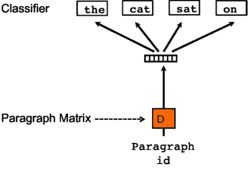

# 任何事物的分布式表示

> 原文：<https://towardsdatascience.com/distributed-representation-of-anything-14e290daf975?source=collection_archive---------11----------------------->

Photo by [Riho Kroll](https://unsplash.com/@rihok?utm_source=medium&utm_medium=referral) on [Unsplash](https://unsplash.com?utm_source=medium&utm_medium=referral)

在这篇综述中，我们探索了我们在互联网上发现的任何东西的各种分布式表示——单词、段落、人物、照片。如下所示，这些表示可用于各种目的。我们试图选择看似不同的主题，而不是提供分布式表示的所有应用的全面回顾。

输入:模型目的
单词向量:情感分析
段落向量:聚类段落
人物向量(维基文章):比较
照片和单词向量:照片检索

激动吗？我是！让我们跳进来。

**单词的分布式表示**

这就是故事开始的地方:用定量的方式来表示一些定性的概念(例如单词)的想法。如果我们在字典中查找一个单词，我们会根据其他定性单词获得它的定义，这对人类有帮助，但对计算机没有真正的帮助(除非我们做额外的后处理，例如将定义单词的单词向量输入到另一个神经网络中)。在之前的[文章](https://joshuakyh.wordpress.com/2017/11/30/introduction-to-word-embeddings/)中，我们介绍了单词向量的概念——定性单词的数字表示。

总之，当前的 NLP 实践经常将单词替换成固定长度的数字向量，使得相似含义的单词具有相似的数字向量。值得重新强调的训练概念是，在训练一个词的数值向量(姑且称之为中心词)时，优化中心词的向量来预测周围的上下文词。正如我们将在下面看到的，这种训练概念被扩展到新的应用中。

**段落的分布式表示**

word2vec 的一个有趣的扩展是段落的分布式表示，就像固定长度的向量可以表示一个单词一样，一个单独的固定长度的向量可以表示整个段落。

简单地对整个段落的单词向量求和是一种合理的方法:*“当单词向量被训练来预测句子中的周围单词时，这些向量表示单词出现的上下文的分布。这些值与输出层计算的概率成对数关系，因此两个词向量的和与两个上下文分布的乘积相关。[1]"* 由于字向量的求和是可交换的——求和的顺序无关紧要——这种方法不保留字的顺序。下面，我们回顾两种训练段落向量的方法。

[2]提出了两种训练段落向量的方法，这两种方法的相似之处在于，这两种表示都被学习来从段落中预测单词。

第一种方法是 PV-DM(段落向量:分布式内存)。这从上下文窗口中采样一个固定长度(比如说 3)。这三个单词中的每一个都由一个 7 维向量表示。段落向量也由 7 维向量表示。4 (3+1)个向量被连接(成为 28 维向量)或平均(成为 7 维向量)以用作预测下一个单词的输入。在小的上下文窗口中单词向量的连接考虑了单词顺序。

PV-DM illustration. Source: [2]

第二种方法是 PV-DBOW(段落向量:分布式单词包)。这从段落中随机抽取 4 个单词，并且只使用段落向量作为输入。

差异:

*   PV-DM 从 4 个输入中预测 1 个字；PV-DBOW 从 1 个输入中预测 4 个单词。
*   PV-DM 从目标单词的周围单词中抽取单词；从段落中画出单词。
*   PV-DBOW 存储的数据较少，仅存储 softmax 权重，而 PV-DM 中同时存储 softmax 权重和字向量。

PV-DBOW illustration. Source: [2]

现在我们有了段落向量，我们可以使用这些高维向量来执行聚类。段落嵌入，无论是使用上述两种方法还是简单求和来训练，都能够使文本文章(例如医学笔记[3])被聚类。

**分布式人物再现:滨崎步 vs Lady Gaga**

[4]研究使用维基百科文章训练段落向量:一个段落向量代表一篇维基文章。通过将单词向量与段落向量联合训练，作者表明找到“Lady Gaga”的日语对等词可以通过向量运算来实现:

paragraph vector(" Lady Gaga ")-word vector("美国")+WordVector("日本")
≈ ParagraphVector("滨崎步")

单词向量和段落向量的混合使用是强大的:它可以用一个单词解释两篇文章的区别，也可以用一篇文章解释两个单词的区别。例如，我们可以找到近似“唐纳德·特朗普”和“巴拉克·奥巴马”的段落向量之间的差异的单词向量。

令人兴奋，不是吗？还有，Stitch Fix 已经表明我们可以对图片进行这些操作。

**图像检索的分布式表示**

作者已经发布了一个很棒的帖子，所以请[访问](http://multithreaded.stitchfix.com/blog/2015/03/11/word-is-worth-a-thousand-vectors/)了解更多关于这个迷人作品的细节。总之，如果有人喜欢服装的孕妇版本，我们可以将孕妇添加到当前服装中，并检索类似风格的孕妇版本。

Source: [Stitch Fix](http://multithreaded.stitchfix.com/blog/2015/03/11/word-is-worth-a-thousand-vectors/)

**结论**

这篇文章回顾了主题周围单词的概念是如何定义主题的，在表示单词、段落、人物甚至图片时是有用的。可以对这些向量执行数学运算，以获得洞察力和/或检索信息。

我错过了其他有趣的应用吗？请在下面的评论中让我知道！

**参考文献**

1.  Mikolov T、Sutskever I、Chen K、Corrado GS、Dean J、miko lov T、Sutskever I、Chen K、Corrado、G. S .、Dean J。伯格·CJC、博图·L、韦林·M、格拉马尼·Z、温伯格·KQ，编辑。神经信息处理系统进展。柯伦联合公司；2013;3111–3119.PMID: 903 人
2.  句子和文件的分布式表示。2014;PMID: 9377276
3.  从医学笔记中学习有效的嵌入[互联网]。2017.
4.  用段落向量嵌入文档。2015;

**发表于**2017 年 12 月 7 日

*原载于 2017 年 12 月 7 日*[*joshuakyh.wordpress.com*](https://joshuakyh.wordpress.com/2017/12/07/distributed-representation-of-anything/)*。*