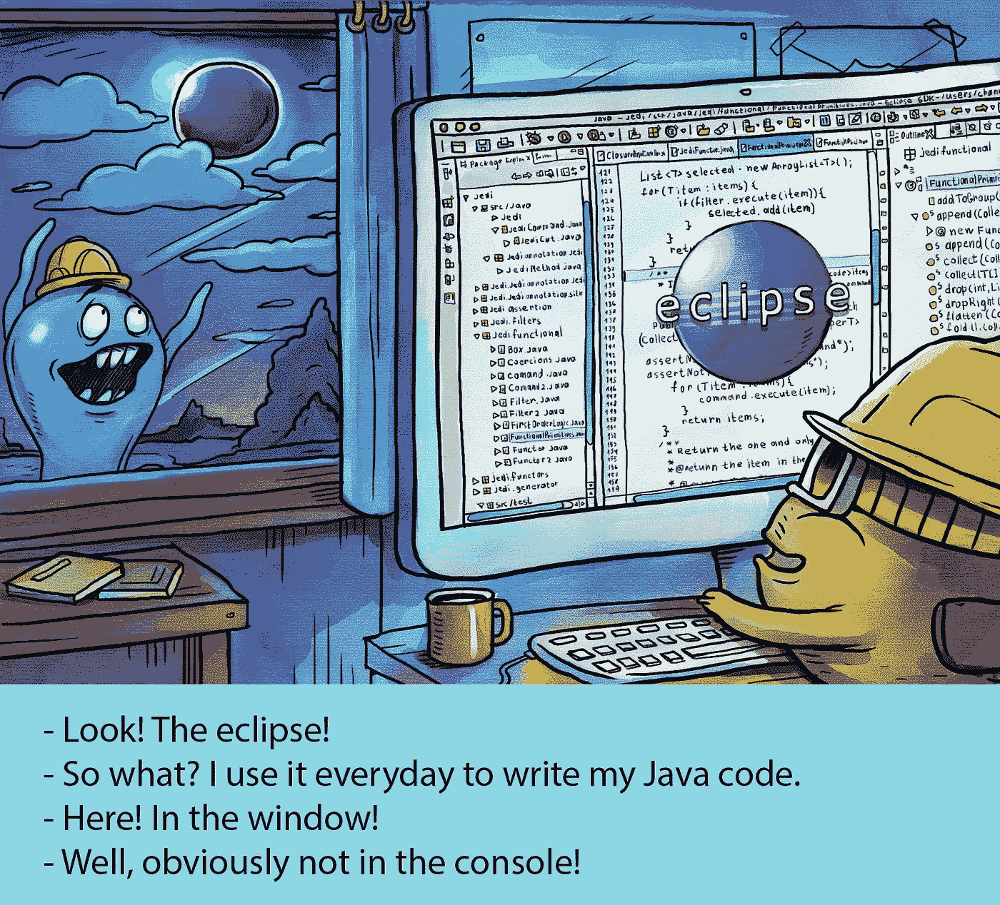

# 分布语义学——从字里行间解读

> 原文：<https://towardsdatascience.com/distributional-semantics-reading-between-the-lines-8be7a3bbded9?source=collection_archive---------4----------------------->

人类的语言在不断进化，但是这些变化在发生的时候经常被忽视。然而，如果你拿一篇几十年或几个世纪前的文章或文学作品，你肯定会注意到所用语言的变化。如果语言是这样进化的，你怎么理解一个词的定义？

模式匹配和从句子中的周围词中破译一个词的意思是理解石刻的常用方法。具有分布式相似性模型的深度学习使得机器在自然语言处理(NLP)领域做同样的事情变得可行。

J.R.Firth 的名言很好地总结了这一概念，“你应该通过它所交往的人来了解一个词！”

“透明”、“打击”和“监督”是几个词的例子，根据它们的使用方式，可能意味着完全不同的事情。一般来说，语言中有丰富的自动反义词(也可以表示相反事物的单词)和多义词(也可以表示相似事物的单词)。没有人确切知道为什么我们出于不同的目的使用同一个单词，但是我们都同意这使语言变得有趣。

通过使用正确的词语，一个人可以更好地表达，并让他人感兴趣地倾听。几个世纪以来，单词能力在世界范围内已经被很好地理解，因此，仅仅拥有一个简单的词义词典并不能帮助 NLP 中的机器。

courtesy [@data_monsters](http://twitter.com/data_monsters)

孩子们很早就开始学习语言，而不是等到学校教语法。即使是成年人。寻求词汇发展，往往被规定要在一个句子中使用他们所学的单词，并记住这种用法，而不仅仅是记忆单词及其含义。twitter、短信和 Whatsapp 的日益流行正在将人类交流浓缩成短句、首字母缩略词和表情符号。因此，用法设置、谈话时间和其他视觉线索在理解单词的意思时都起着重要的作用。

在一头扎进所有的数学之前，斯坦福 NLP 与深度学习讲座[视频](https://www.youtube.com/watch?v=OQQ-W_63UgQ&list=PL3FW7Lu3i5Jsnh1rnUwq_TcylNr7EkRe6)很好地介绍了这个话题。“向量”这个词似乎很好地捕捉了深度学习的句法和语义关系，在它的帮助下，很快，你应该能够使用 NLP 或 TLP(技术或 twitter 语言处理)预测答案😊)

西雅图-HQ1+HQ2 =？