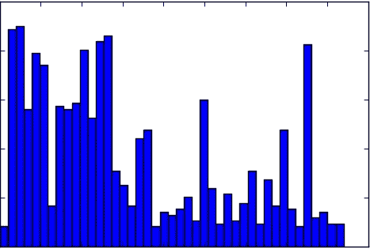
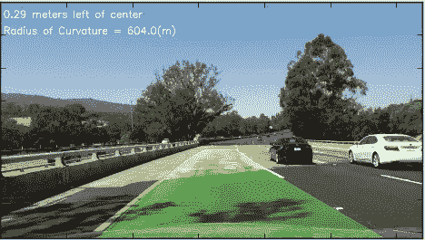

# 潜入无人驾驶汽车的世界

> 原文：<https://towardsdatascience.com/diving-into-the-world-of-self-driving-cars-5355474ae630?source=collection_archive---------4----------------------->

一年前，我辞去了四大会计师事务所之一的工作，搬到了湾区，开始向我真正想进入的行业转移:技术。在我工作的最后几个月，我列出了所有我想涉足的潜在技术领域，排在首位的是自动驾驶汽车。当然，当时只有会计背景，这似乎是一个遥远的目标。

搬到旧金山湾区后，我仍然坚持做会计工作，但我特意选择了一家更注重工作与生活平衡的公司，因为我知道学习编程每周会占用大量时间。但是从哪里开始呢？起初，我还不知道自动驾驶汽车肯定会是我此后不久的目标，实际上我通过 Code Academy 开始了一些基本的网页设计(想想 HTML 和 CSS)。然后，我拿起了一本关于 Ruby 的书，这本书让我更热衷于编写真正的程序。

# 寻找 Udacity

正是在 2016 年年中的这个时候，我开始阅读越来越多关于自动驾驶汽车的文章，同时继续相信这对我来说是多年以后的事情。我看到 Python 编程语言在该领域非常受欢迎，并且很快阅读到 [Udacity](https://www.udacity.com/) 有一个很棒的学习 Python 的编程课程(“计算机科学入门”给那些感兴趣的人——如果你想学习 Python 基础，我强烈推荐它；您将创建一个像谷歌一样的基本搜索引擎！).当我接近这门课程的尾声时，Udacity 宣布了我能想到的最令人兴奋的事情之一:无人驾驶汽车纳米学位项目。

对于那些从未听说过 Udacity 纳米学位项目的人来说，他们会教你特定领域工作所需的技能，以及有助于增强你的投资组合的项目——例如，许多招聘人员会将个人的 Github 知识库视为其能力的证据。这些纳米学位项目包括数据分析、机器学习、iOS 和 Android 开发等领域。该计划还包括各种职业研讨会，以帮助改善你的简历，面试技巧等。

# 机器学习

尽管我很兴奋有一个纳米学位项目完全专注于让某人做好成为自动驾驶工程师的准备，但我肯定还没有准备好。幸运的是，Udacity 对一些对该项目很重要的课程和纳米学位相当开放，该项目在 2016 年 10 月宣布后几个月就有了第一批学生。其中之一是机器学习纳米学位。虽然当我第一次开始的时候，我可能有点不知所措，但那个项目确实帮助了我最终获得了 SDC 纳米学位的第一个学期，因为它主要专注于各种机器学习技术。

如果你对这个领域感兴趣，机器学习纳米学位有一些很棒的项目。我使用监督学习来预测这样的事情，比如某个人是否会在泰坦尼克号上幸存下来，或者在学校需要 T2 的额外帮助，无监督学习来将不同的客户群分成不同的组，强化学习来教会智能出租车安全有效地到达目的地。有大量的资源可以更好地解释这些技术，而我在这里没有足够的空间。MLND 以一个顶点项目结束，专注于对深度学习等领域的深入研究——我仍在与 SDCND 合作完成我的项目，但如果你想预览，请参见[我的提案](https://github.com/mvirgo/MLND-Capstone-Proposal)或我的[正在进行的顶点知识库](https://github.com/mvirgo/MLND-Capstone)。我正在采用基于深度学习的方法来检测道路车道。

# 自动驾驶汽车纳米度

与机器学习纳米学位不同，Udacity 决定限制自动驾驶汽车纳米学位的入学人数。2016 年 10 月的第一批学生将只接受大约 500 名学生(我认为这实际上比最初的人数有所增加)。成千上万的人申请了，包括我，尽管我仍然只是通过 MLND 的几个项目。我被录取了(！)—但不是到十月。从 12 月开始，我将加入第三批。这实际上非常完美，因为我只完成了 MLND 的最后一个预顶点项目，就在 12 月份的队列即将开始的时候。我非常兴奋，同时也担心我会被弄得不知所措。我不仅真正接触到了一些高级材料，而且我的会计旺季即将到来(在会计行业，一月到四月并不是很有趣)。

Project 1

所以，我一头扎了进去，希望能赶在 Udacity 为我的团队安排的时间之前。在[第一个项目](https://github.com/mvirgo/Finding-Lane-Lines)中，我们学习了如何使用各种计算机视觉技术，包括 canny 边缘检测、掩蔽和 Hough 变换，以便检测道路上的车道线。虽然我的项目在直线道路上看起来很棒，但我使用的方法太简单了，无法在曲线上工作，这是我很快就会学会纠正的。

Project 2’s unbalanced traffic sign data

下一个项目，[分类交通标志](https://github.com/mvirgo/Traffic-Sign-Classifier)，是我第一次真正接触到建立深度学习模型。在这里，我学会了如何使用 TensorFlow 创建一个深度神经网络，经过训练后能够对路标进行高度准确的分类。这个项目的一个有趣的挑战是，给我们的数据非常不平衡，这意味着某些标志有数千幅训练图像，而其他标志只有几百幅。这给神经网络带来了一个问题——鉴于它们试图将损失最小化，不平衡的训练集可能意味着神经网络通过简单地总是弄错某些符号来学习将损失最小化。因此，如果您不检查您的数据，您可以看到您的模型实现了 90%的验证准确性(从表面上看相当稳健)，同时它仍然可能得到一些信号，即每个信号只占训练图像的百分之几，100%错误。使用来自原始训练数据的增强图像，但只针对那些低于每个交通标志平均图像数量的图像，我创建了补充的交通标志图像来帮助平衡影响，并最终获得了一个在它从未见过的图像上更加准确的模型。

Smooth sailing in Project 3

第一学期的第三个项目增加了酷的因素，特别是因为 Udacity 专门为它设计了一个模拟器。这个项目使用 Keras 深度学习框架(建立在 TensorFlow 之上)，以[行为克隆](https://github.com/mvirgo/Behavioral-Cloning)的概念为中心。通过行为克隆，再次使用深度学习，你可以向深度神经网络教授某种行为。在这种情况下，这意味着神经网络从模拟汽车的摄像头获得图像(类似于上图)，并带有标签(即神经网络最大限度地减少损失，因此将预测汽车转向角度的图像)。虽然 Udacity 最终发布了一些他们自己的训练数据，但我选择了收集自己的数据，这产生了一些有趣的问题。在赛道上，当你直线行驶时，大部分时间转向角是零度。根据我在上面提到的项目 2，你可能已经猜到了，这会产生不平衡数据的问题。因此，我必须小心地收集足够的数据，转向角不为零，否则汽车可能总是直线行驶。另一个问题是，数据不能只从车道中心收集——否则，当汽车不可避免地发现自己稍微偏向一侧时，它可能会默认回到最有可能的结果——直行。再次，我必须确保我有足够的恢复数据，包括从奇怪的地方几乎偏离路边的非常尖锐的转弯角度。也许整个第一学期最有收获的经历是看着我的模拟汽车，根据我训练过的神经网络驾驶，独自在整条赛道上行驶。

幸运的是，我已经在第一学期的第一个月左右完成了前三个项目——我已经实现了在旺季到来之前提前完成的目标！我在学期的最后两个月完成了最后两个项目。

Project 4 — Advanced Lane Detection

还记得项目一中曲线的问题吗？项目四，[高级车道线](https://github.com/mvirgo/Advanced-Lane-Lines)，展示了更深入的技术。再次使用计算机视觉，这次学会了如何使用不同的梯度和颜色阈值来创建[二进制激活图像](https://github.com/mvirgo/Advanced-Lane-Lines/blob/master/Images/pipeline_color_and_binary.PNG)，其中只有道路视频图像的特定区域会被激活。然后使用技术使图像不失真(所有相机都会自然产生一定量的失真)，然后对其进行透视变换(想象一下道路的[鸟瞰图](https://github.com/mvirgo/Advanced-Lane-Lines/blob/master/Images/birds_eye.PNG)，然后我的模型会计算一个多项式函数来拟合这条线。给定这些多项式函数，检测到的车道以及某些信息，如道路曲率和车辆相对于车道中心的位置，可以放回到原始图像上，如上所示。看到我的最终项目视频与车道检测[这里](https://github.com/mvirgo/Advanced-Lane-Lines/blob/master/reg_vid.mp4)。

Car detection heatmaps for Project 5

第一学期的期末项目集中在[车辆检测](https://github.com/mvirgo/Vehicle-Detection)。我从机器学习 Nanodegree 项目中学到的知识在这里派上了用场，因为我们使用了[支持向量机](http://docs.opencv.org/2.4/doc/tutorials/ml/introduction_to_svm/introduction_to_svm.html)的算法来帮助确定汽车出现在图像的哪个位置。我之前已经用过 SVM 很多次了！当然，还有一些重要的概念需要学习。定向梯度直方图(简称为 HOGs)通过显示有汽车的图像与无汽车的图像之间的梯度差异(即，图像中像素值的变化，以进行某种程度的简化)来帮助训练 SVM。接下来，训练过的 SVM 在给定的道路图像上运行——但是他们不是 [100%准确](https://github.com/mvirgo/Vehicle-Detection/blob/master/images/all_bounds.PNG)。因此，我需要消除误报，同时还要考虑到汽车可能出现的距离所导致的潜在失误。上面的热图显示了解决方案的一部分——通过移除检测次数少于一定数量的检测点，生成了上面的热图，然后用[边界框](https://github.com/mvirgo/Vehicle-Detection/blob/master/images/finished.PNG)标记，以显示检测到的真实车辆。看我的成品[这里](https://github.com/mvirgo/Vehicle-Detection/blob/master/project_videos/project_vid_output.mp4)。

# 下一步是什么？

因此，我完成了自动驾驶汽车纳米学位项目的第一学期，学习了一年前我做梦都想不到的技能。如果有人真的对这个领域感兴趣，我强烈鼓励他们申请(群体规模一直在持续增加)。这确实要花很多时间——考虑到我的日常工作，我仍然很惊讶我能在学期正式结束前完成它。大多数人可能每周需要 20 个小时来做这件事。这当然比大学教育便宜，尽管每学期仍要花费你 800 美元(一共有三个学期)。

但是我该何去何从呢？我的第一个目标是在这个领域找到一份工作。在这个快速扩张的领域有很多工作机会，既有老牌汽车制造商，也有大型科技公司，还有在湾区如此普遍的初创公司。当然，其中大多数仍然需要在机器人或深度学习等各个领域的多年经验。因此，虽然我仍然缺乏许多公司想要的经验，但我会继续努力，希望做出一个能让别人刮目相看的模型。[这里是我在基于深度学习的车道检测模型上的预览](https://www.youtube.com/watch?v=Vq0vlKdyXnI)，它可以跳过我在上面学到的大多数基于计算机视觉的技术；我希望这是个开始。幸运的是，在硅谷，许多人更关注你能做什么，而不仅仅是你做了多少年。对 Udacity 来说，他们为我提供了一位导师和大量的职业内容，以及与一些优秀的招聘合作伙伴一起参加活动的机会，这也给了我很大的希望，我将能够直接在自动驾驶汽车上工作。

不过现在，我进入了 SDCND 的第二阶段。学期 1 是计算机视觉和深度学习，学期 2 是关于传感器融合(使用雷达和激光雷达数据来跟踪你周围的物体)、定位和控制。鉴于我在这些领域都缺乏经验，我预计这将是一个艰难的任期，但我也很高兴能在这条路上向前迈进一步。在一天结束时，虽然我的第一个目标是找到一份工作，但真正的最终目标是真正看到一辆自动驾驶汽车在路上行驶，完全可供所有想骑的人使用。这才是真正的下一步。