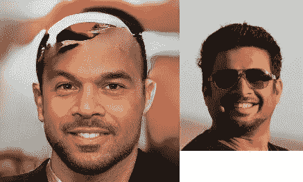
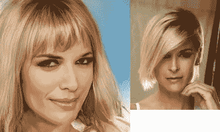
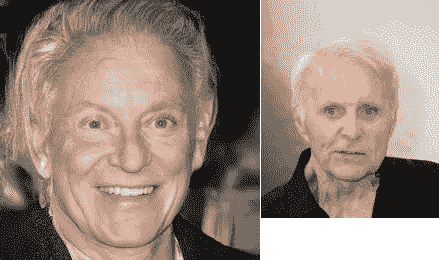

# GANs 真的模拟了真实的数据分布吗，或者他们只是在巧妙地愚弄我们？

> 原文：<https://towardsdatascience.com/do-gans-really-model-the-true-data-distribution-or-are-they-just-cleverly-fooling-us-d08df69f25eb?source=collection_archive---------2----------------------->

自 2014 年引入以来，生成对抗网络(GANs)已经成为密度估计任务的流行选择。方法很简单:GAN 框架由两个网络组成，一个用于生成新样本，另一个用于区分真实样本(来自真实数据分布)和生成的样本。使用敌对一词是因为他们有相互竞争的目标，所以一方试图“智胜”另一方。这些网络被联合训练，使得来自一个网络的梯度反馈改善了另一个网络，直到(希望)生成器能够生成好的鉴别器不能辨别是否是真实图像的图像。

GANs 背后的理论是有希望的。事实上，如果在训练过程的每个步骤中，每个网络都被训练完成，则 GAN 目标可以被示为等效于最小化真实数据密度和模型数据密度之间的 Jensen-Shannon 散度。然而，在实践中，这些分析的假设并不成立。事实上，成功地训练 GANs 是一项众所周知的艰巨任务，在过去的两年中已经取得了许多进展。无论如何，在实践中，GANs 在多大程度上能够忠实地模拟真实的数据分布仍然是一个未决的问题。

最近的一项工作显示了非常有希望的结果，这就是 NVIDIA 著名的[“GANs 渐进增长”，](http://research.nvidia.com/sites/default/files/publications/karras2017gan-paper.pdf)，其中鉴别器和生成器都在渐进增长，直到生成 1024x1024 的高质量图像。“伪名人”生成的面孔似乎暗示了对上述问题的肯定回答。是这样吗？

**我们如何知道 gan 是否成功？**

评估 GANs 性能的主要挑战是，没有对分布拟合程度的内在评估，这使得研究人员(在很大程度上)承担了对结果进行定性评估的任务。

仅仅查看生成的输出并惊叹人脸看起来有多逼真是不够的。众所周知，GANs 易受模式崩溃的影响，在这种情况下，目标分布没有完全建模，生成器往往会产生非常相似的图像(指真实分布的“模式”)。当训练集由成千上万的图像组成时，我们如何确定 generator 不仅仅是在训练图像之间进行平滑插值(或者在最坏的情况下，仅仅是记忆数据集)？

模式崩溃没有发生的一个很好的指示是产生的输出中的**多样性**。对多样性的简单检查如下:

> 选择两个产生真实图像的随机噪声向量，并通过从位于连接两个向量的线上的种子生成图像来生成“插值”图像。如果这些图像中有许多是合理的，那么我们就有充分的证据证明生成的分布能够产生各种各样的图像。

来自尼维迪亚的人们非常友好地提供了整整一个小时这样的插值供你欣赏:

然而，这仍然没有解决**原创性**的问题:如果 GAN 设法真实地模拟了数据分布，那么它生成类似于训练图像的图像的可能性很小，甚至不存在。虽然 youtube 视频显示了许多高质量生成的人脸，但 GAN 会不会只是在它收到的训练图像之间做了聪明且视觉上有吸引力的插值？它真的创造了新的名人，还是仅仅在现有名人之间创造了巧妙的融合？

> 关键是证明样本多样性(例如，显示生成的分布的支持是大的)是不够的。需要确定生成的输出**与训练示例**有显著差异。

为此，NVIDIA 论文的作者使用了最简单的方法，即显示训练集中生成的人脸的最近邻，其中使用的度量是像素空间中的 L1 距离(图像的中心裁剪)。

top: generated outputs, bottom: nearest neighbor in training set, as calculated using L1 distance in the pixel space of the center crop

我猜这里的假设是，因为人脸是归一化的(对齐的和正面的)，所以在像素空间中测量距离是真实相似性的良好代理，但结果有时很差，如最右边的一对所示。

> 这感觉像是少了什么。一些生成的图像看起来有点眼熟，我就是想不出真实的名字。如果在训练集中真的有这些名人的图像，而比较 L1 像素强度没有发现，那会怎么样？

为了获得一些灵感，我想出了自己的测试:我向我的(不了解人工智能的)家庭成员展示生成的输出，并问他们是否认识这些图像中的任何一个。这些回答非常有趣。我得到的答案包括碧昂斯(左二)、“头发怪异的克里斯·洛克”(左四)和“女版迈克尔·道格拉斯”(最右边)，这其实是一个相当不错的猜测。

left: generated image from GAN; right: Michael Douglas

除了笑，这让我想到那里可能有什么东西。*我只需要一个更有条理的方法*。

**人脸识别救场！**

如果我们用语义损失函数代替朴素的 L1 损失，在数据集中寻找最相似的人，会怎么样？这其实很简单。事实证明，在人脸识别任务中训练的网络最后一层的特征对于计算两个人之间的语义相似度是有用的(事实上，这就是脸书如何知道在你上传的图像中标记谁)。在这种情况下，我很懒，使用了 [dlib](http://dlib.net/) ，这是一个用于面部检测和面部标志检测的长期工具。他们最近增加了预训练的人脸识别模型，让你只用几行代码就能计算出人的“语义特征”。这实际上对于大量涉及人物图像的下游任务非常有用，所以这是一个很好的工具。

我使用这种方法在 celebA 的非 HQ 版本(我唯一可以访问的版本)中搜索语义相似的图像，这是用于训练 NVIDIA 的 GAN 的数据集。下面是我找到的一些“最近邻”对。在下面的所有例子中，左边是高质量生成的图像，右边是来自 celebA 的“语义”邻居。肯定比 L1 的邻居好得多，一些相似之处也很明显。(请注意，这些不是“精选的”，我只为从他们的文章中提取的大约 10 个生成的人脸做了这件事)。

**总结**

*   对 GANs 的评估迫使我们求助于“适合度”的定性测量。
*   当在大数据集上训练 GAN 时，视觉上引人注目的多样化输出本身并不能证明 GAN 训练成功恢复了真实的数据分布。需要更严格的证据来证明 GANs 不仅仅是训练集的“智能记忆”。
*   如果可能的话，选择语义相似性，而不是简单地使用原始数据的欧几里德距离(特别是当你试图提出一个有意义的观点时)
*   具体到人脸，你可以非常容易地获得“现成的”高质量语义特征。对于这个项目，我使用了 dlib 的预训练人脸识别网络。再简单不过了！