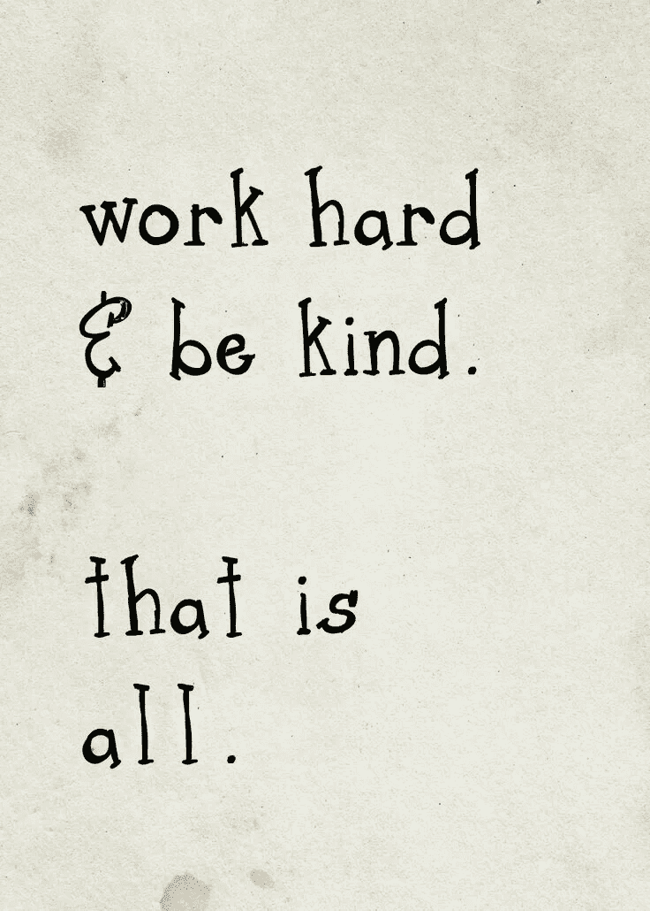

# 我们停下来想一想为什么吗？

> 原文：<https://towardsdatascience.com/do-we-pause-and-think-why-748e67ec7e51?source=collection_archive---------13----------------------->

当我们奔向…

Fig 1: Pause….(Source: [Reflections](http://reflectionscoaching.co.uk/belief-systems/keep-cool-or-lose-the-game/attachment/keep-calm-pause-breathe-think))

*本文分为两部分。第一部分是数据科学/机器学习/人工智能社区。* *第二部分是为工作的父母或即将为人父母的人。*

**我们为什么要在人工智能和相关领域做我们今天正在做的事情？我们有时间停下来思考吗？**

我不会在这里回答“为什么”。我想做的是向读者提出一些问题，以便他们找到自己的答案。我们开始吧:

我们停下来试着想象一下 20 年后的世界会是什么样子吗？在某种意义上，当我们学习和应用时间序列时，我们是否会想到，我们的大脑在直观地关联所有经验和预测未来方面要好得多？我们把技术和现实生活联系起来了吗？

某些思维过程不断在我们的大脑中发生，但我们大多数时候并没有意识到它们。有时候梦能让你更好地了解他们。有一天，一件事可能会自然而然地让我们意识到什么对我们来说才是重要的。可能是读一本书，或者去一个不同的地方，或者在极端的情况下——一个人自己的家庭或朋友圈里的悲剧/健康问题可以引发更高层次的思考。

如果我们想成为数据科学家，开发更高的价值观是极其重要的。我不需要举任何例子；因为我不是一个新闻狂——我认为可以有把握地假设读者知道的比我多得多。我们都知道数据可以用来做好事和坏事。

> 我们想成为什么样的数据科学家？我们在忙着运行笔记本的时候会停下来思考吗？

在第一份工作中，我们可能没有选择去寻找我们的意义，但是我们能坚持多久呢？我们什么时候才能实现这种转变，去做我们关心的事情？我们是要忘记我们从哪里开始，我们是如何得到支持的，还是要把它全部向前传递？看这个例子:[直接给](https://www.givedirectly.org/)。GiveDirectly 是一家在东非运营的非营利组织，通过手机向极端贫困的家庭无条件转移现金来帮助他们。give 直接向肯尼亚、乌干达和卢旺达的人们转移资金。听起来有点奇怪，对吧？人们可能不指望它能起作用，但它能起作用，不会被滥用。它正在得到数据科学/机器学习的帮助。这些都没有给予太多的宣传，但如果我们的心是为了做好事，我们肯定会听到。Datakind 对社会有益。所有这些都可以通过谷歌搜索“社会公益数据”找到

当我们忙于努力在工作中保持竞争力或渴望成为数据科学家(在大多数情况下还有另一份全职工作)时，我们给予配偶/孩子足够的关注了吗？

我们在育儿方面遵循同样的科学方法吗？我们中的一些人是由充满爱的一代人抚养长大的，但他们不知道养育孩子的技巧，也没有机会得到温柔的养育。我们是要把我们的一些人格扭曲遗传给我们的孩子，还是要从现有的数据中进行自我教育？

我们是要在婴儿/蹒跚学步的最初几天读几本育儿书，然后开心地忘记更新自己，还是要在他们成长的过程中不断学习，以迎合他们不断变化的情感需求？

这可能听起来像是题外话，到了段落的结尾，就不是了:

我在 LinkedIn 上看到一些让我害怕的讨论。人们对那些停下来照看婴儿的人有一种不言而喻的偏见。辞职或休息时间超过 6 周不好吗？这是否意味着这个人不是职业导向型的？或者它能告诉我们一个人的自信、分清主次的能力、将团队(在这里是家庭)置于自我之上的意愿吗？养育了两个孩子，让我写下:婴儿一点也不好玩，尤其是在晚上。他们是强硬的老板。老板通常是理性的，婴儿是感性的。他们“现在”就想要结果。他们不能说话，即使他们认为他们在说话。

休息不是为了享受孩子而不是事业。有时可能是因为缺乏支持系统。有时，这可能是父母有意识的决定，给宝宝一个难忘/安全的人生起步。这并不意味着职业不那么重要。这意味着事业同样重要，但不是当时的优先考虑。当该休息回来时，婴儿会平静地进入日托所。因此，休息一下比试图一次处理太多事情要好得多。对于不愿意休息的家长，我有一个问题。你有没有停下来想一想，这里(家)和那里(工作)你会失去什么？我也有一个类似的问题，想问那些对休息的父母有偏见的老板。你有没有停下来想一想因为不支持新父母而可能造成的损失？或者更好的是，从长远来看，支持这个高度进化的人会有什么潜在的好处？

有一个概念叫做用心育儿【谷歌一下，挑一本书】。几年前我读过一本这方面的书。它有关于为什么来自某些文化的人比其他人更友好的案例研究。他们都指出这样一个事实，即在婴儿时期，他们有机会与母亲在一起更长时间，他们的父亲在他们的成长过程中也扮演了积极的角色。

> 我们对情绪智能的未来和对人工智能的未来一样有意识吗？如果在使用人工智能的人当中没有同样强大的人工智能，人工智能能有什么用？

希望我们大多数人都知道，出生到 6 岁是孩子一生中最重要的时期。他们得到了终生难忘的印象。团队工作能力和心里承载的情商和善良程度密切相关，不是吗？

Simple, yet powerful quote right? (source: [Quotes Valley](http://www.quotesvalley.com/quotes/work/page/8/))

我希望作为聪明的专业人士，我们也能把我们的智慧应用到个人和社会的方方面面。在这篇文章中，我可能会重复，但那只是因为我对建设一个高品质的社会有强烈的感觉。如果我们开始在家里建造它，这是可能的。

如果你喜欢我的想法，请回应或鼓掌鼓励！:)谢谢。

如果您想了解我的想法、数据科学内容，请在 [Twitter](http://www.twitter.com/aparsha2303) 上关注我