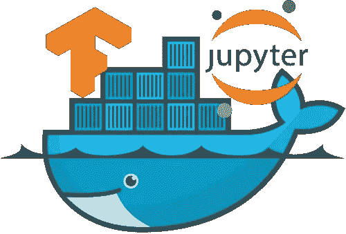

# 数据科学码头工人

> 原文：<https://towardsdatascience.com/docker-for-data-science-4901f35d7cf9?source=collection_archive---------1----------------------->



Docker for Data Science

Docker 是一个为软件工程师简化安装过程的工具。来自统计背景的我过去很少关心如何安装软件，偶尔会花几天时间来解决系统配置问题。万能的上帝派来的码头工人。

把 Docker 想象成一个轻型虚拟机(我为使用这个术语向 Docker 大师们道歉)。通常有人会编写一个*Dockerfile*来构建一个*Docker Image*，其中包含了项目所需的大部分工具和库。您可以以此为基础，添加项目所需的任何其他依赖项。它的基本理念是，如果它能在我的机器上工作，它也能在你的机器上工作。

# 对数据科学家有什么好处？

1.  时间:不安装软件包所节省的时间本身就使得这个框架物有所值。
2.  **可重复研究**:我认为 Docker 类似于在报告中设置随机数种子。在您的机器上使用的相同的依赖项和库版本也在其他人的机器上使用。这确保了您正在生成的分析能够在任何其他的分析机器上运行。
3.  分发:你不仅分发你的代码，而且还分发代码运行的环境。

# 它是如何工作的？

Docker 采用了(可重用)层的概念。所以你在`Dockerfile`里面写的任何一行都被认为是一个层。例如，您通常会这样开始:

```
FROM ubuntu
RUN apt-get install python3
```

这个 docker 文件将在`Ubuntu`层的顶部安装`python3`(作为一层)。

你本质上要做的是为每个项目写下所有的`apt-get install`、`pip install`等等。命令放到 docker 文件中，而不是在本地执行。

我推荐阅读关于[https://docs.docker.com/get-started/](https://docs.docker.com/get-started/)的教程来开始使用 Docker。**学习曲线最小**(最多 2 天工作)，收获巨大。

# Dockerhub

最后，Dockerhub 值得一提。就个人而言，Dockerhub 是 Docker 真正强大的原因。这就是 github 对于 git 的意义，一个共享 Docker 图片的开放平台。你总是可以使用`docker build …`在本地构建一个 Docker 映像，但是最好将这个映像`push`到 Dockerhub，这样下一个人就可以简单地`pull`用于个人使用。

我的机器学习和数据科学的 Docker 图像可以在这里找到[，还有它的](https://hub.docker.com/r/sachinruk/ml_class/)[源文件](https://github.com/sachinruk/Dockerfiles/blob/master/ML_class/Dockerfile)。

## 总结想法

就我个人而言，我已经开始在我的 github repo 的大部分(如果不是全部的话)中包含 Dockerfile。尤其是考虑到这意味着我将永远不必处理安装问题。

Docker 是软件工程师(现在是数据科学家/分析师)应该拥有的工具之一(几乎和 git 一样受到重视和尊重)。长期以来，统计学家和数据科学家忽略了数据分析的软件方面。考虑到使用 Docker 已经变得如此简单和直观，没有理由不把它作为软件开发管道的一部分。

## **编辑 1**

如果你想看比上面提供的快速提示更有实质内容的教程，请看这个视频(跳到 4:30 左右):

## Edit 2(关于 python 的 virtualenvs、R 的 packrat 等的快速注释。):

就我个人而言，我没有使用过任何其他的容器化工具，但是应该注意的是，Docker 独立于 python 和 R，并且超越了特定编程语言的容器化应用程序。

看这里是我关于机器学习和深度学习的[课程](https://www.udemy.com/course/machine-learning-and-data-science-2021/?referralCode=E79228C7436D74315787)(使用代码 DEEPSCHOOL-MARCH to 90% off)。