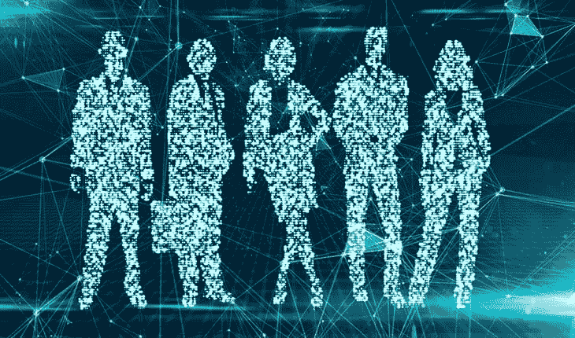

# GDPR 威胁到数据科学的未来了吗？

> 原文：<https://towardsdatascience.com/does-gdpr-threaten-the-future-of-data-science-ecf5b99a07a5?source=collection_archive---------4----------------------->

Rick Jo/Dot Magazine

# 如果大多数组织都知道 GDPR 的新欧洲立法，那么很少有人考虑过这个框架将如何改变数据科学的实践[【I】](#_edn1)

《一般数据保护条例》将规定商业使用个人数据的内容和方式。该立法将于 2018 年 5 月 25 日生效，适用于所有处理欧洲公民数据的公共和私人组织，无论其运营基础如何。违规罚款可达€2000 万英镑或该组织年营业额的 4%，以金额较大者为准。[【ii】](#_edn1)让我们来探讨一下为什么 GDPR 应该得到您的充分关注，这项立法是关于什么的，它将如何影响数据科学的实践，以及您可以做些什么来将这种“威胁”转化为机遇。

*数据不再是业务流程的简单副产品，而是现代经济的燃料。*如果说传统上收集数据是为了反映我们组织和市场的真实情况，那么今天，人们越来越多地利用数据来放大个人如何购买和消费产品和服务的微小细节。因此，组织使用信息技术创建平台来揭示、捕捉和分析消费者体验。由此产生的数据的价值与其说取决于它描述消费者、商品和服务之间关系的精确程度，不如说取决于它在构建预测和影响人类行为的场景中的用途。[【iii】](#_edn1)

这种对数据的不断追求深刻地影响了个人的隐私和保密性——个人做的、说的、甚至认为的任何事情都很难免受公众的审查。*欧洲的《通用数据保护条例》在试图监管私人和敏感数据的商业使用时明确认识到了这些危险*。私人数据定义为可用于识别欧洲消费者个人身份的任何信息，以及可用于识别个人身份的任何数据(个人可识别信息)。敏感数据包括对个人健康、宗教、种族背景、政治或性取向的描述，这些信息可能会被用来区分个人。最后，一个特殊的预览保护一般 16 岁以下的儿童-没有明确的父母同意，他们的个人资料不能被收集。

GDPR 推出欧洲公民数字权利法案。数据主体(公民)现在将有权知道正在收集哪些与他们有关的个人数据，收集的地点和目的。公民将有权要求组织删除他们的个人数据，和/或停止处理或进一步传播他们的数据。最后，公民可以恢复以“*常用和机器可读格式*提供给组织的个人数据，并可以将这些数据转移给第三方。

公司、小企业、国家政府和地方政府将被要求制定流程和内部记录保存要求，以确保符合这些新法规。这些组织，无论是数据收集者还是数据处理者，都需要在设计中实施隐私概念，这一概念基于数据保护应内置于其信息系统核心的原则。组织将被要求只收集对业务绝对必要的数据(数据最小化)，并将对个人数据的访问仅限于那些需要处理数据的人。最后，所有公司都必须在 72 小时内通知客户任何可能危及“个人权利和自由”的违规通知。

*在接下来的五个月里，为欧洲公民服务的企业需要制定一个行动计划，以满足 GDPR 合规性的最低要求*。首先要指定一名项目负责人或数据保护官来监督数据保护战略和实施。他或她的项目团队需要识别和分析当前正在捕获、存储和处理的个人数据。他们需要了解不同的组织利益相关者如何在组织内部或通过第三方分包商处理数据。他们需要提出满足立法要求所需的措施和手段。最后，他们需要制定和实施必要的任务和流程，以确保合规性。

乍一看，GDPR 提出的数据隐私愿景似乎与数据科学家获取新数据源和开发新使用场景的基本职责截然相反。*具体而言，该立法将在三个方面影响数据科学的实践:*通过对数据处理和消费者档案进行限制，通过在组织使用自动决策来评估信贷申请、招聘和保险决策时赋予“解释权”，以及通过让组织对自动决策中的偏见和歧视负责。[【iv】](#_edn3)

尽管如此，从长远来看，数据科学的实践将从这些限制中受益。组织需要鼓励基于可靠数据匿名化的数据科学流程。数据科学家需要采取措施，防止来自代理变量、多重共线性和其他原因的间接偏差，以限制歧视性结果。最后，数据科学家在记录从源到目标的所有处理步骤中的数据流时，需要关注数据血统。[【第五季】](#_edn4)

*有兴趣掌握设计和实施有效的 GRPR 合规框架的方法吗？* [注册](http://baieurope.com/joingrdp)参加我们新的一日大师班，成为数据保护官。商业分析实践是商业分析学院的核心和灵魂。在我们位于巴约纳的[暑期学校](http://baisummer.com/)以及我们在欧洲的[大师班](http://baimasterclass.com/)中，我们对数字经济、数据驱动决策、机器学习和视觉通信的关注将使分析为您和您的组织服务。

Lee Schlenker 是 Pau 商学院的教授，也是 http://baieurope.com 商业分析研究所的负责人。他的 LinkedIn 资料可以在[www.linkedin.com/in/leeschlenker.](http://www.linkedin.com/in/leeschlenker.)查看，你可以在[https://twitter.com/DSign4Analytics](https://twitter.com/DSign4Analytics)的 Twitter 上关注我们

*一份法文抄写本* [*ici*](https://medium.com/@LeeSchlenker/le-grpd-menace-t-il-lavenir-de-data-science-9251f7e25297) 。

______________

IDC 在 2017 年 5 月对 700 家欧洲公司进行的一项研究发现，25%的受访者不知道 GDPR，超过一半(52%)的人不确定其对组织的影响。在了解新法规的人中，20%的人还没有开始为新的要求做准备，只有 21%的人准备好了应对变化。[http://bit.ly/2EfOGZa](http://bit.ly/2EfOGZa)

[【ii】](#_ednref1)【CNIL(2016)】，[欧洲难民保护协议:职业改革](https://www.cnil.fr/fr/reglement-europeen-sur-la-protection-des-donnees-ce-qui-change-pour-les-professionnels)

[【三】](#_ednref2)施伦克尔，L. (2017)。关于数据，我们真正需要了解的是什么？，走向数据科学

[【iv】](#_ednref3)[丁斯莫尔，T. (2017)。GDPR 如何影响数据科学](https://www.kdnuggets.com/2017/07/gdpr-affects-data-science.html)。

[【v】](#_ednref4)数据科学创新(2015)[数据科学和欧盟隐私法规——一场风暴即将来临](https://dsianalytics.com/data-science-and-pending-eu-privacy-regulation-a-storm-on-the-horizon)