# 用更少的数据做更多的事:在房地产估价上获得接近最先进的结果

> 原文：<https://towardsdatascience.com/doing-more-with-less-data-achieving-near-state-of-the-art-results-on-real-estate-valuations-c2843e40097e?source=collection_archive---------5----------------------->

Photo by [Maximillian Conacher](https://unsplash.com/@maxconacher?utm_source=medium&utm_medium=referral) on [Unsplash](https://unsplash.com?utm_source=medium&utm_medium=referral)

整个美国房地产市场的价值总计数十万亿美元，是美国公民最大的有形资产之一。2016 年，没有自有住房的人通常会租赁空间，并支付超过 4700 亿美元的租金。

抵押贷款或房租通常是家庭每月最大的支出。出于这个原因和其他原因，理解决定房价波动的力量和属性是很重要的。租房者或购买者可以通过了解其他人为类似房产支付的价格来节省资金，出租者和出售者可以通过以公平的市场价格快速转让房产来节省资金。租赁者/购买者不会支付过高的价格，原始所有者可以通过快速租赁/出售来节省资金。

在这篇文章中，我将探讨除了一个单元的内在属性(例如，卧室、浴室、平方英尺等)之外的一些影响房价的环境属性。).通过使用各州和各市提供的大量地理空间数据，我可以提高用于预测房价的机器学习模型的准确性。测试案例是旧金山，它有一个强大的地理空间数据仓库。

***文章提纲*** :

*   目标数据集
*   地理空间要素
*   机器学习模型
*   模型评估
*   结论

**目标数据集**

我选择了两个数据集进行测试:一个是租金价格，另一个是房产价值。Airbnb 内部([http://insideairbnb.com/](http://insideairbnb.com/))提供了一个全面搜集的当前房源数据集，旧金山估价办公室提供了一份房产估价记录。经过一些清理，这些数据集将作为地理空间数据作为价格预测器的测试对象。

下面的地图显示了估价人房产的样本(上图)和所有 Airbnb 房源的位置(下图)。

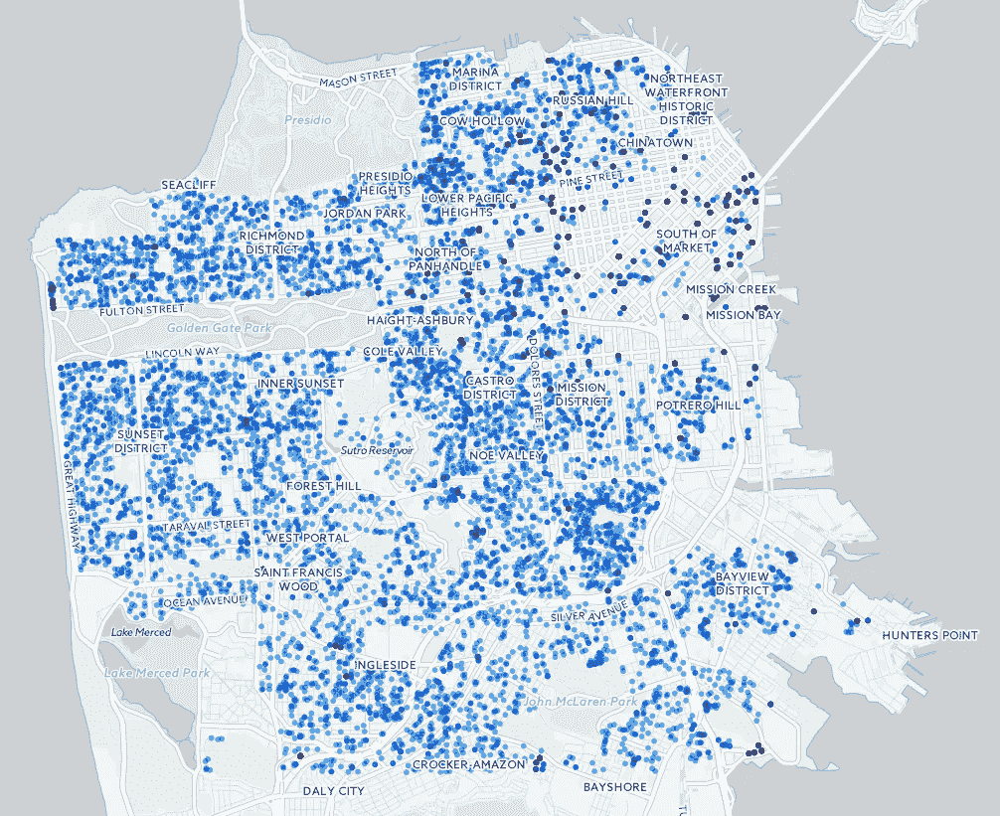

A small sample (N=10,000) of SF Assessor dataset property locations. Darker areas are where locations overlap.

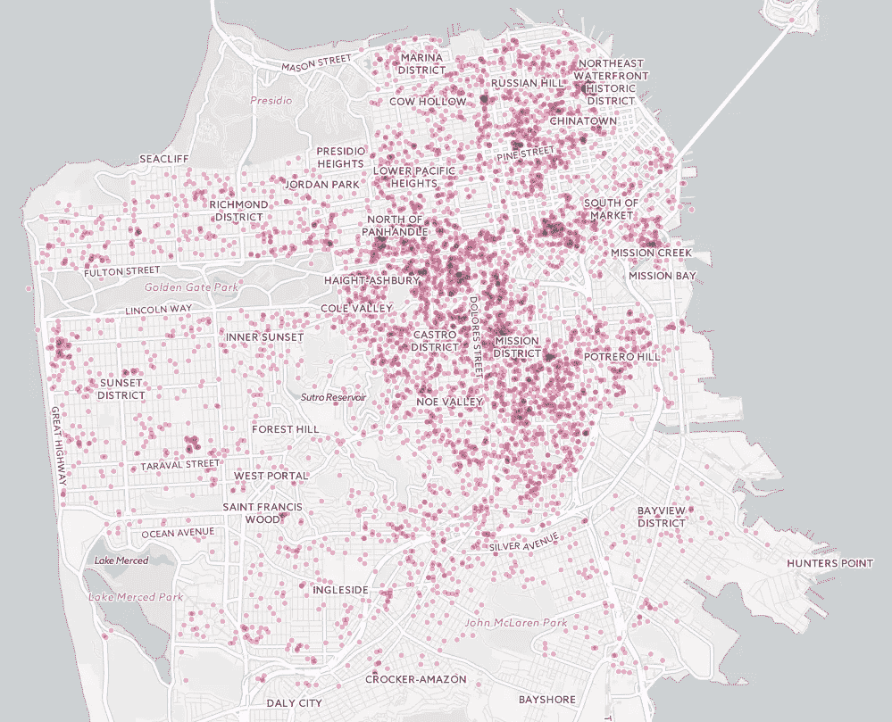

All 5900 Airbnb locations in SF as of July 2016\. Darker areas are where locations overlap.

这两个数据集的位置分布存在明显差异。估价人的房产分布更加均匀，集中在市中心的单个地点(可能是高层住宅)。Airbnb 数据集更加分散，但集中在半岛东半部的几个地区。Airbnb 的数据不共享市中心高楼的单元集中程度，这暴露了 Airbnb 的位置是匿名的。

The Assessor properties are much more evenly distributed across the city, especially in the west.

Downtown, the Assessor properties accurately show that most of the properties are in tall residential towers. The Airbnb data are anonymized and therefore don’t accurately show the locations of listings.

匿名化使一个单位在给定区域内的实际位置随机化。简而言之，Airbnb 提供了一个单元所在的大区域——给定的房产坐标位于该区域的中心。下面是一个 Airbnb 房源的地图，显示了房源的大概位置。

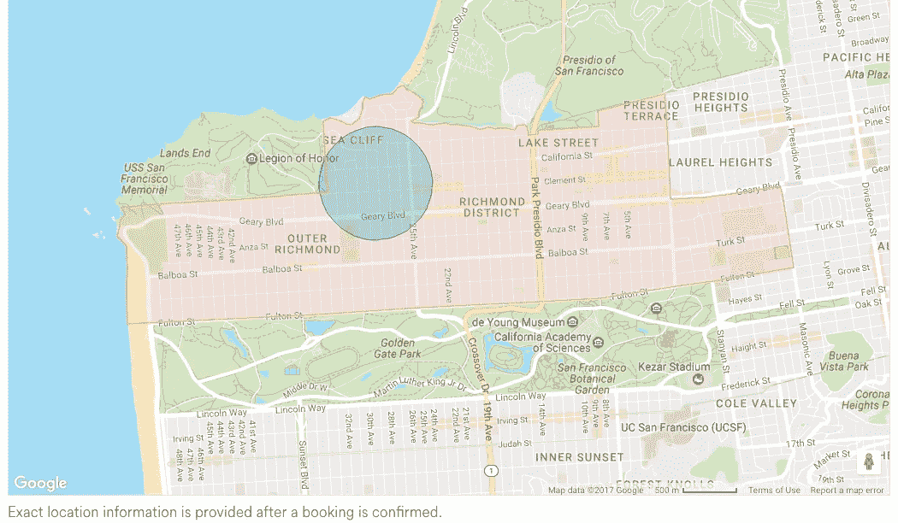

This is an example of the location given on the Airbnb website for a property in SF. The location coordinates given in the dataset are somewhere within the shaded ellipse — there’s a lot of uncertainty.

因为我的目标是将地理空间数据精确地绑定到每个单元，Airbnb 的匿名化做法可能会影响模型。幸运的是，评估数据集包括每个属性的精确坐标，在关联地理空间数据时会有更少的模糊性。

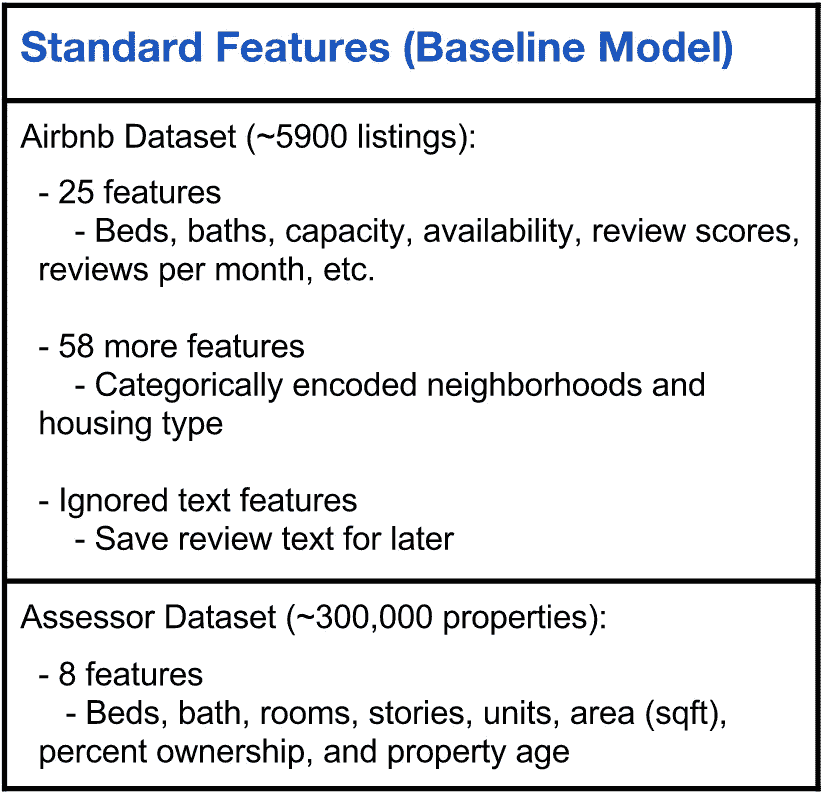

Table of initial dataset features, before adding geospatial features.

基线数据集包括 Airbnb 数据集的约 5900 个房源和 SF Assessor 数据集的约 300，000 个房产。虽然 Airbnb 数据集中的样本较少，但它的特征(或预测值)比评估者数据多得多。Assessor 数据集大了两个数量级，但只包含 8 个特征，而 Airbnb 有 83 个特征。

运行基线模型后，我将添加地理空间要素-环境变量，如犯罪、噪音水平、与公园的距离等。—这两个数据集。通过这样做，我增加了机器学习模型可以用来更准确地预测价格的信息量和多样性。

**地理空间数据**

用于改进价格模型的数据来自各种来源，其中大部分可从三藩市(【https://datasf.org/】T2)公开获得。我确定要使用的最重要的数据集是犯罪事件和 311 请求的数据集，两者都是地理定位的。尽管犯罪数据集包括无数的事件，我还是应用了九个类别。311 数据代表了广泛的类别:修复基础设施的请求、涂鸦、公民对各种违法行为的报告，以及许多其他内容。

以下是与故意破坏(上图)和盗窃(下图)相关的犯罪事件示例。

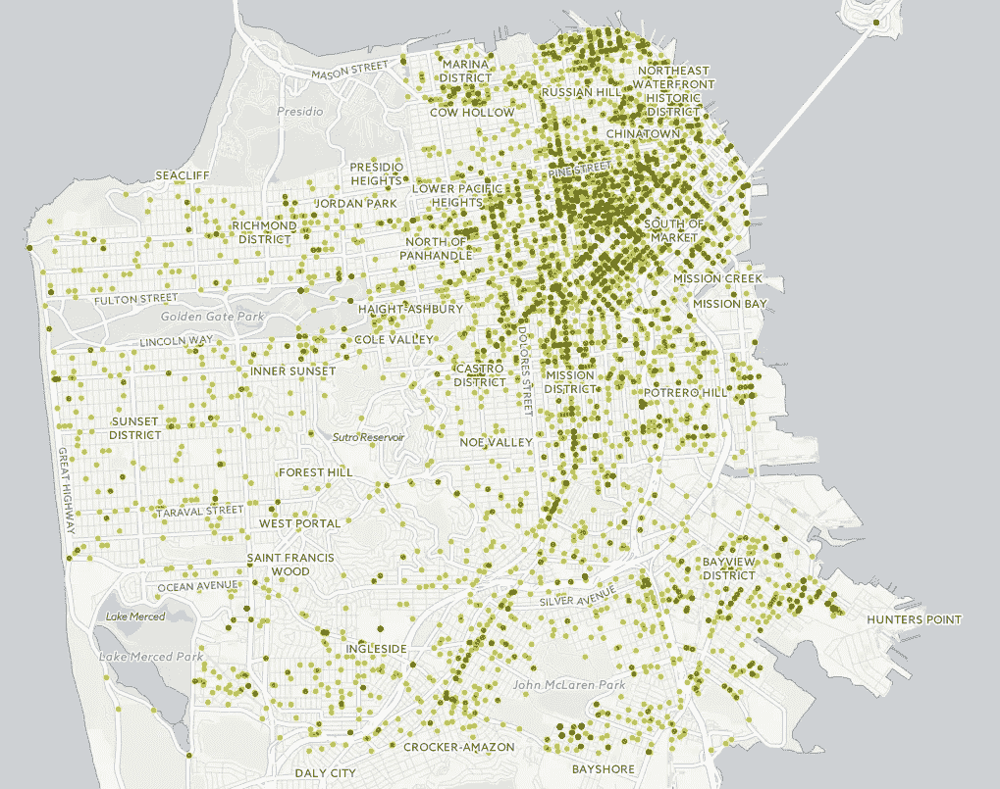

A sample of the vandalism incidents. Dark areas are where incidents overlap.

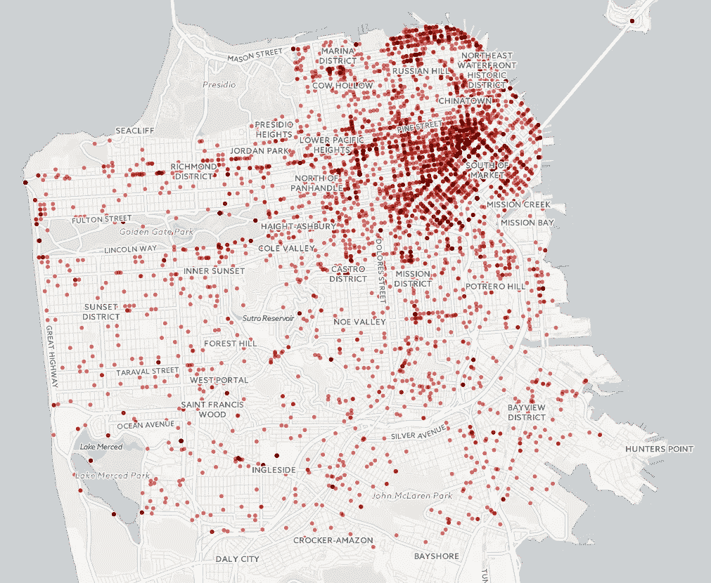

A sample of the larceny/theft incidents. Dark areas are where incidents overlap.

下面是 311 个涂鸦请求(上图)和人行道及路缘修复请求(下图)的示例。

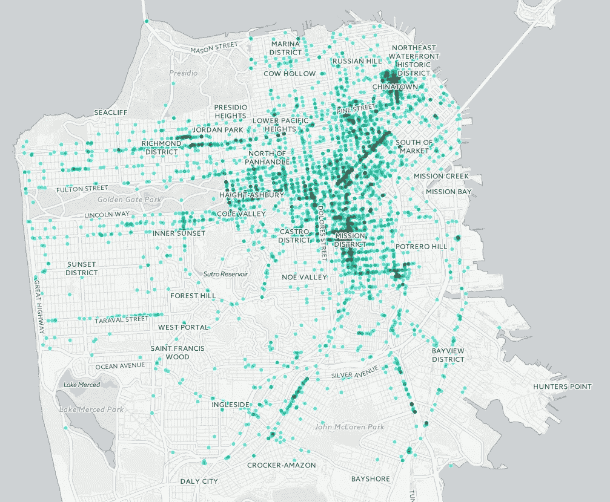

A sample of requests to remove graffiti.

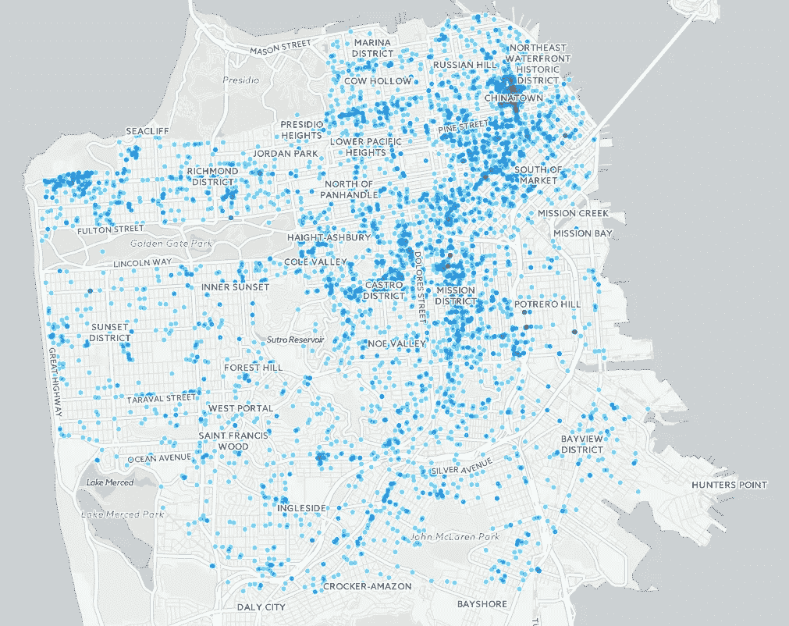

A sample of requests to repair sidewalks and curbs.

在某些街区和道路上，这些事件的发生率有明显的差异。以下是涂鸦移除和路缘/人行道修复请求的地理空间分布不同的区域示例。诸如此类的变化可能有助于预测整个旧金山的价格差异。

The larceny/theft (left) and graffiti (right) incidents have different concentrations and hotspots in western SF.

Larceny/theft (left) and graffiti (right) incidents are also distributed quite differently in central SF.

添加到数据集中的另外两个要素是旧金山县每个人口普查轨迹中报告的家庭收入中值(上图)和贫困率(下图)。这些将有望帮助区分社区之间的价格差异。

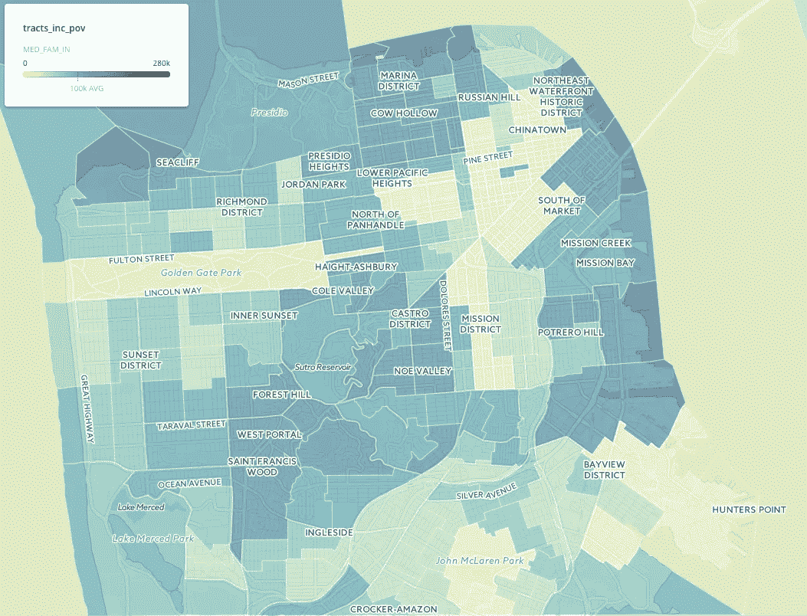

Census tracts colored by median family income. From light to dark, the income ranges from $0 (parks) to $280,000.

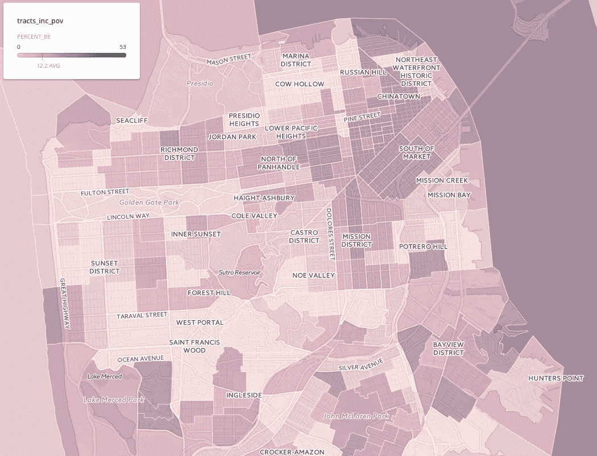

Census tracts are colored by percent of the population below the poverty line. From light to dark, the percentages range from 0% (parks) to 53%.

用于对这些地理空间数据(犯罪和 311 事件)进行矢量化的方法包括计算在一个物业位置的给定半径内的事件/发生次数(点)。在该要素类别中，越靠近犯罪事件集中点的属性的数量越多。

下面显示了这种计数技术的可视化，红点代表一个假设的属性或列表位置。

As an example, a region is magnified to show a specific location (red dot on right) relates to graffiti incidents.

The number of graffiti incidents are counted within the given query radius from a location. The method is repeated for every location and every specified crime incident or 311 request category.

上面的虚线圆圈表示给定位置的查询半径。对于每个位置，该算法计算犯罪和 311 个类别中的事件数量。然后，它将这些值作为新要素分配给每个位置。

这是使用 scikit-learn 的 KDTree(在邻居模块中)完成的，它的`query_radius`方法非常适合这个问题。下面是一个函数，用于在给定类别列表和包含每个类别坐标的数据帧的情况下，自动向熊猫数据帧添加要素。

我使用类似的方法来加入额外的特征，这些特征表明靠近公园和高噪声水平。与之前的数据不同，这些数据集由边界(或 shapefiles 中的多边形)表示。为了应用`query_radius`，我将这些线性边界转换成一系列规则间隔的点。当位置离公园和噪声边界最近时，这种方法会产生较高的计数值。这种方法的直观示例如下所示。

Another example of how perimeter boundaries are counted to approximate proximity to parks (this example) and different levels of noise.

An animation that depicts how the regularly spaced points are counted when they are within the query radius of a given property location.

这种方法也用于合并从旧金山公共卫生部获得的噪声级数据。原始噪声数据被存储为形状文件多边形，用于逐渐升高的噪声级别。然后，我将这些多边形转换成一系列规则间隔的点，并对每个地产位置进行计数。这些噪声级特征的较高值表明物业靠近繁忙区域或道路。

下面是两个噪波级别多边形的示例。左边的图像显示了最高噪波级别的多边形。右边是低噪声区域，分布更广——高噪声水平集中在繁忙的道路和高速公路沿线。

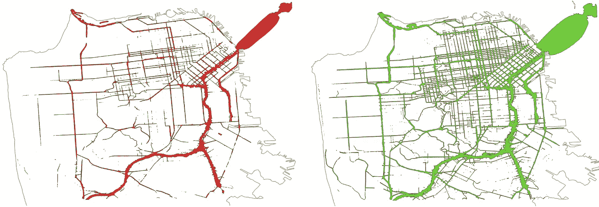

Two screenshots of GIS shapefiles for the 76 and 70 Ldn noise levels — they are just two examples of the 5 different noise levels used. The higher noise level, 76 Ldn (left), is concentrated around the busiest roads. The lower noise level, 70 Ldn (right), is much more widespread, but still absent from quite blocks in the city. The noise level is given in Ldn, which is an average from daytime and night noise estimated by a model that uses traffic data (SF Dept. of Public Health, map provided by the SF Dept. of Planning).

*数据集和新增功能的总结*:

对于 Airbnb 和 Assessor 数据集，我生成了 24 个新的地理空间衍生特征。通过添加/更改类别或调整查询半径，可以进一步调整所有地理空间数据，以优化模型准确性。

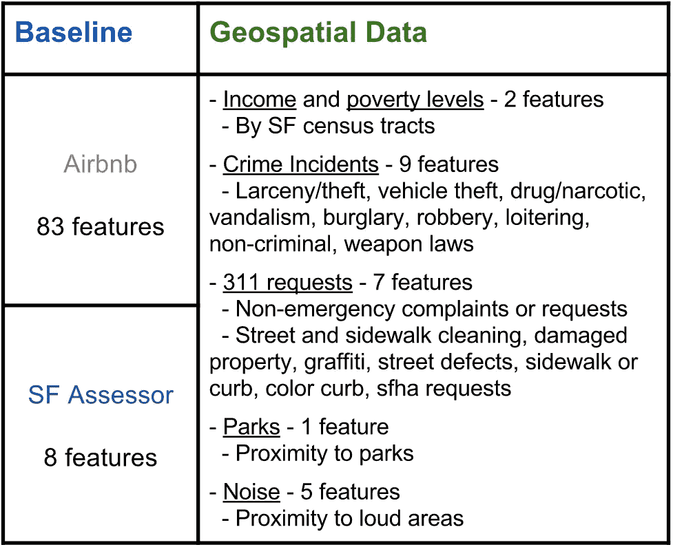

A table depiction of the features that will be added to the Airbnb and Assessor datasets.

**机器学习模型**

在吸收了所有数据之后，我测试地理空间特征是否改进了基线数据集的模型预测，基线数据集仅包括房产的内在属性(例如，卧室、浴室、平方英尺等)。).

用于评估模型准确性的指标是 Zillow 采用的指标，Zillow 还发布了租赁和销售的专有“Zestimates”。下面是最近 Zillow 模型估算租金价格的表格。Zillow 也有市区房产销售的模型结果，我们将用它来评估评估者数据模型。

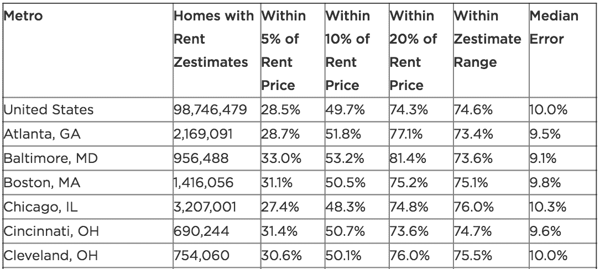

A table from Zillow showing an example of the statistics they use to evaluate their models. San Francisco rents were estimated in this model but are not shown here. We mainly compare our models with the Median Error metric on the far right.

我使用的主要指标是*中值误差百分比*，或 *ME%* (上图右侧第一列)——半数模型预测的误差等于或小于 *ME%* 。

我还使用*中位数绝对误差*来判断模型在美元价值上的准确性。*绝对误差中值*有助于确定在试图建立公平的市场价格时，模型预测与人类估计相比有多大用处。

为了找到并改进预测租金和房地产价值的最佳机器学习模型，我使用不同的方法进行了一些初步测试:

*   线性回归(使用套索和岭正则化)
*   随机森林
*   极度随机化的树
*   梯度树提升(包括 XGBoost)

使用基线/初步测试中表现最好的模型，我通过网格搜索进行交叉验证，以找到表现最好的模型参数。

**车型评测**

*Airbnb 数据集*

平均而言，XGBoost 为 Airbnb 数据集生成了最准确的预测。在某些情况下，多个模型预测的集合平均会产生更好的结果。无论如何，地理空间特征的添加对提高预测的准确性没有什么帮助。下图显示了使用两种不同误差指标的模型的结果。这些图从左向右显示，显示了添加地理空间数据时模型的预测误差。虚线表示在评估模型之前对目标变量(价格/价值)进行对数转换时的模型误差。这对改进错误有最大的影响。

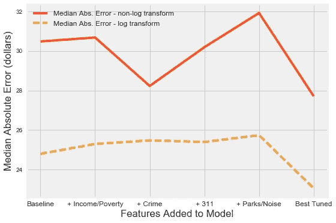

The plots showing the response of two different error metrics with the cumulative addition of geospatial features (x-axis). The two different curves show the results when target values are not log transformed (solid) and when they are log transformed (dashed).

添加地理空间要素时，模型的精度几乎没有任何提高。这个结果令人沮丧，但我知道 Airbnb 数据集很难与地理空间数据配对，因为它的坐标是匿名的。

因为清单评论中有大量的文本数据，所以我添加了来自给定清单的所有评论的 tf-idf 特性。此外，我计算了所有评论的情感分数，并将它们作为特征添加到列表中。这些特性的增加都无助于提高模型的准确性。这很可能是因为绝大多数评论都是正面的、多余的。下面是正面、负面和中性评论的百分比，以供比较。

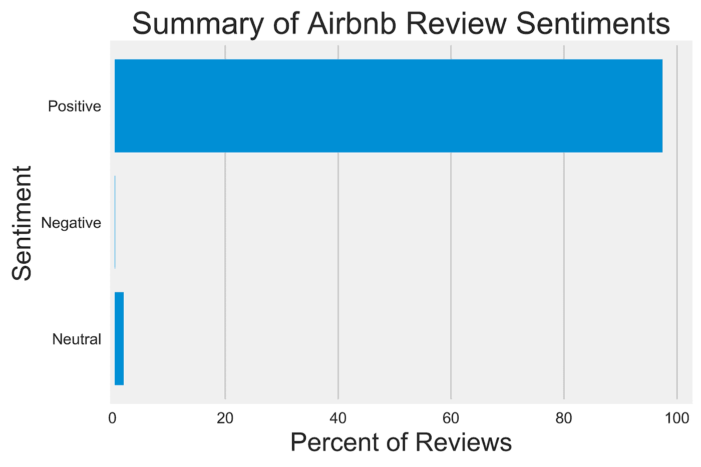

A plot that summarizes the percentage of reviews that are more positive than negative (or more neutral than positive or negative). The review for Airbnb are all overwhelmingly positive.

*评估员数据集*

随机森林模型在几乎所有情况下都优于所有其他模型。使用 EC2 实例通过多重网格搜索计算出最佳参数，大大减少了处理时间。

随着地理空间特征的增加，所得到的模型得到了极大的改进，直接证实了环境属性对于做出更准确的预测是极其有益的。下面的误差曲线(就像上面显示的 Airbnb 数据集)显示，各种各样的地理空间数据显著提高了模型预测的准确性。此外，对数转换的目标变量，属性值，提高了模型的准确性；当目标值进行对数变换时，它们的分布不那么偏斜，并且可以更准确地预测。

The plots showing the response of two different error metrics with the cumulative addition of geospatial features (x-axis). The two different curves show the results when target values are not log transformed (solid) and when they are log transformed (dashed).

为了检查进一步改进这些预测的其他方法，我计算了评估者数据的学习曲线(如下)。该图显示了随机森林模型误差如何随着更大的训练数据集而改善。因为交叉验证得分曲线持续下降，我相信随着数据集的增大，模型误差会进一步降低。

Learning curve for the Assessor dataset illustrating that a larger dataset would lead to an increased accuracy of predictions (i.e., lower median absolute errors) because the cross-validation curve continues to trend lower.

**结论**

现在，我可以将我的模型结果与 Zillow 估计值进行比较。应该注意的是，租赁和销售 Zillow 模型都使用实际租赁和销售价值的大得多的数据集。Airbnb 数据集在技术上不是租赁价格——所有房源都是在不同的时间和频率租赁的，因此它们实际上不是公平的市场价格。类似地，评估财产价值是土地和改良的近似值，用于税收评估——实际销售价格可能相差甚远。这就是说，Zillow 有一个显著的优势，因为他们有更大和更准确的数据集。

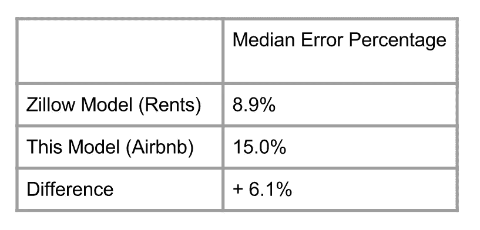

Rental price prediction result, comparison to Zillow result for San Francisco.

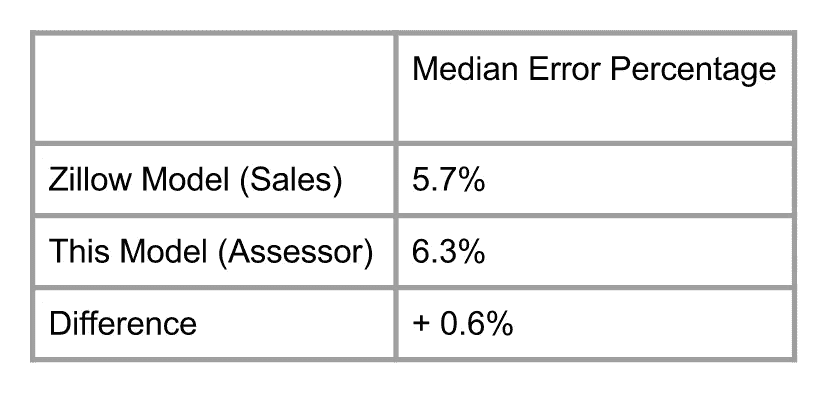

Property value prediction result, comparison to Zillow result for San Francisco.

Zillow 租赁价格预测远好于我使用 Airbnb 价格的模型得出的结果。鉴于 Zillow 和 Airbnb 数据集之间的许多差异，这并不奇怪。虽然本文中没有显示，但 Airbnb 数据集的学习曲线表明，这种低准确性不会随着更大的数据集而得到改善。我们模型的绝对误差中值约为 21 美元——这意味着一半的预测与实际价格相差在 21 美元以内。

评估数据集和模型表现得更好，在 Zillow 房屋销售估计误差的一个百分点之内。由此得出的中位数绝对误差约为 37，000 美元。这一结果有力地表明了地理空间数据可以增加数据集的预测能力。由于样本比 Zillow 数据集少约 77%，我的模型误差几乎与 Zillow 的误差持平(在 0.6%以内)。

也有明确的方法可以进一步改进这个模型。这种分析没有考虑时间因素，如果将大规模市场趋势和逐年价格波动因素纳入数据集，可能会提高准确性。此外，犯罪和 311 数据集有许多类别是我的模型中没有的。每个类别都可以测试预测能力，并作为附加功能添加进去。

最后，我还想将谷歌街景图像纳入模型，用它们来预测残差。但这超出了本初步研究的范围。以后希望分享一下自己的进步。

你可以在我的 github 知识库([https://github.com/tmkilian/GA_capstone-Housing_prices](https://github.com/tmkilian/GA_capstone-Housing_prices))中找到本研究中使用的一些原始数据和 jupyter 笔记本。感谢阅读！