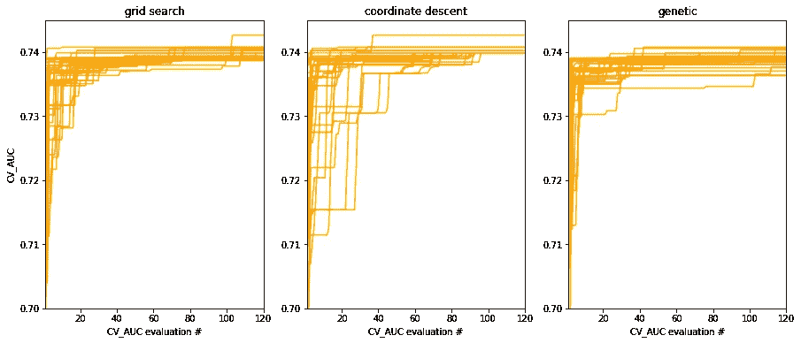
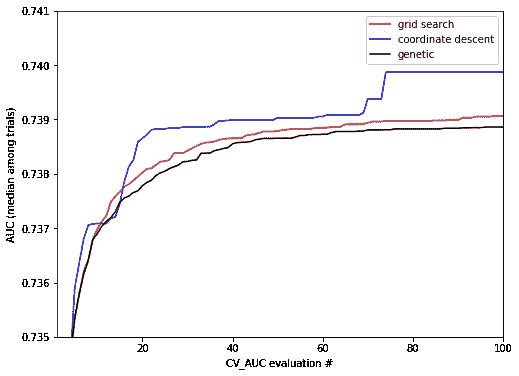

# 以智能方式进行 XGBoost 超参数调优—第 1 部分，共 2 部分

> 原文：<https://towardsdatascience.com/doing-xgboost-hyper-parameter-tuning-the-smart-way-part-1-of-2-f6d255a45dde?source=collection_archive---------1----------------------->


Picture taken from Pixabay

在这篇文章和下一篇文章中，我们将着眼于机器学习(ML)中最棘手和最关键的问题之一:超参数调整。在回顾了什么是超参数，或简称为超参数，以及它们与普通的可学习参数有何不同之后，我们介绍了三种旨在搜索最优超参数组合的通用离散优化算法:网格搜索、坐标下降和遗传算法。我们报告了一个实验的结果，在这个实验中，我们使用这些方法中的每一个方法，在一个取自 Kaggle 的 ML 问题的例子上，得到了好的超参数。虽然在我们的实验中，我们关注于优化 XGBoost 超参数，但是我们将展示的几乎所有内容都适用于任何其他高级 ML 算法。

## **什么是超参数？**

最强大的 ML 算法以通过自动调整数千(甚至数百万)所谓的“可学习”参数来提取数据中的模式和规律而闻名。例如，在基于树的模型(决策树、随机森林、XGBoost)中，可学习的参数是每个节点的决策变量的选择，以及用于决定在生成预测时是采用左分支还是右分支的数字阈值。在神经网络中，可学习的参数是在每个连接上使用的权重，用于放大或否定从上一层到下一层的激活。

## **超参数调谐及其目标**

然而，可学习的参数只是故事的一部分。事实上，它们是容易的部分。一个算法越灵活和强大，它就有越多的设计决策和可调整的**超参数**。这些参数由 algo“手动”指定，并在整个训练过程中固定不变。此外，算法通常不包括任何逻辑来为我们优化它们。在基于树的模型中，超参数包括诸如树的最大深度、要生长的树的数量、构建每棵树时要考虑的变量的数量、一片叶子上的最小样本数量、用于构建树的观察分数等。对于神经网络，该列表包括隐藏层的数量、每层的大小(和形状)、激活函数的选择、退出率和 L1/L2 正则化常数。

从计算的角度来看，监督 ML 归结为最小化某个损失函数(例如，MSE 或分类误差)，该损失函数取决于数据训练输入数据( **X** t， **Y** t)，我们用 **a** 表示的可学习参数，以及超参数。这里的关键观察是，这种最小化是通过让*仅*可学习参数变化，同时保持数据和超参数不变来实现的。为了选择最优的超参数集，通常的方法是进行交叉验证。给定一个超参数向量 ***h* ，**，通过使用最好的一组可学习参数 **a*** ，针对 ***h*** 的值，对一组保留的验证数据评估损失函数，从而评估其质量。象征性地，我们做到了


**介绍超参数网格**

关于超参数，需要注意的一件重要事情是，它们通常采用离散值，明显的例外是像辍学率或正则化常数这样的东西。因此，出于实际原因并为了避免进行混合连续-离散优化所涉及的复杂性，大多数超参数调整方法都是通过离散化所讨论的所有超参数的范围来开始的。例如，对于下面的 XGBoost 实验，我们将微调五个超参数。我们将考虑的每个值的可能范围如下:

```
{"learning_rate"    : [0.05, 0.10, 0.15, 0.20, 0.25, 0.30 ] ,
 "max_depth"        : [ 3, 4, 5, 6, 8, 10, 12, 15],
 "min_child_weight" : [ 1, 3, 5, 7 ],
 "gamma"            : [ 0.0, 0.1, 0.2 , 0.3, 0.4 ],
 "colsample_bytree" : [ 0.3, 0.4, 0.5 , 0.7 ] }
```

为了解释这些在 XGBost 上下文中的含义，我们建议读者参考这篇[帖子](https://www.analyticsvidhya.com/blog/2016/03/complete-guide-parameter-tuning-xgboost-with-codes-python/)。


A section of the hyper-param grid, showing only the first two variables (coordinate directions).

请注意，尽管已将(连续)learning_rate 超参数的范围限制为仅 6 个值，将 max_depth 的范围限制为 8 个值，依此类推，仍有 6 x 8 x 4 x 5 x 4 = 3840 种超参数的可能组合。所有可能超参数的这个离散子空间被称为**超参数网格**。在下文中，我们将使用向量符号**h**=【h0，h1，…，hp】来表示任何这样的组合，即网格中的任何点。

# 三种超参数优化方法。

## 穷举网格搜索

穷举网格搜索(GS)只不过是一种强力方法，它以某种顺序扫描超参数组合 **h** 的整个网格，计算每个组合的交叉验证损失，并以这种方式找到最优的 **h*** 。一般来说，不鼓励使用字典顺序，即强加于超参数向量的字典顺序，应该考虑不同的顺序。原因是，使用词典排序，搜索很有可能在相当长的时间内集中在搜索空间中相当不感兴趣的部分。一个有趣的选择是以完全随机的方式扫描整个网格，也就是说，根据整个网格的随机排列。使用这种类型的搜索，很可能在早期遇到超参数空间的接近最优的区域。我们在下面的例子中展示了一些证据。

## 坐标下降

[**坐标下降**](https://en.wikipedia.org/wiki/Coordinate_descent) ( **CD** )是最简单的优化算法之一。这是一个迭代算法，类似于梯度下降，但更简单！基本思想是，在每次迭代中，我们的搜索向量 h 只有一个坐标方向被改变。为了选择哪一个，我们检查每个坐标方向转弯，并通过改变该坐标并保持所有其他不变来最小化目标函数。然后，我们选择产生最大改进的方向。当没有一个方向产生任何改进时，算法停止。要了解所有细节，我们建议读者参考维基百科文章。

这种简单方法的主要优点是，它很容易适应完全离散的情况，对于这种情况，梯度下降法给出的任意方向不容易使用。我们在这里提供了一个实现[。](https://github.com/YuxiGlobal/data-analytics/tree/master/hpar_opt_experiments/coordescent.py)

## **遗传算法**


Picture from Pixabay

遗传算法(GAs)是一整类具有相当普遍适用性的优化算法，并且特别适用于高维离散搜索空间。遗传算法试图通过模拟一个(n 优化)问题的可行解的群体来模仿自然，因为它们经过几代进化并且强制实行适者生存。从上一代生成新一代有两种基本机制。一种是杂交育种，两个个体(可行解)结合产生两个后代。另一个是突变。在给定突变概率的情况下，任何个体都可以将他们的任何参数更改为另一个有效值。适者生存是通过让更适合的个体以比不太适合的个体更高的概率杂交来实现的。个体的适应度当然是损失函数的负值。关于全部细节，我们让读者参考维基百科或 [AIMA](http://aima.cs.berkeley.edu/) ，第二部分第四章。我们自己的实现在[这里](https://github.com/YuxiGlobal/data-analytics/blob/master/hpar_opt_experiments/genetic.py)可用。

## 一项实验

为了感受上面提到的每一种超参数优化方法，我们使用来自目前正在 Kaggle 上举行的[家庭信用违约风险二元分类竞赛](https://www.kaggle.com/c/home-credit-default-risk/data)的实际数据进行了一次实验。我们只考虑了 application_(train|test)数据集，并执行了一个相当简单的数据准备步骤(参见函数 prepare_data [这里的](https://github.com/YuxiGlobal/data-analytics/blob/master/hpar_opt_experiments/experiments.py))。此外，为了保持训练和验证时间短，并允许在合理的时间内充分探索超参数空间，我们对训练集进行子采样，仅保留 4%的记录(大约。12,000).为了验证，我们使用了单独的 3.2%的记录(大约。10,000).即使有这么少量的数据，对于给定的一组超参数，单轮训练和验证也需要大约 3 秒，考虑到我们打算扫描整个超参数网格，这是不可忽略的。由于刚才提到的原因，我们得到的交叉验证 AUC 值与排行榜顶部的值没有竞争力，后者肯定是利用了竞争对手提供的所有数据集中的所有可用记录。

如前所述，我们选择了 [XGBoost](https://xgboost.readthedocs.io/en/latest/python/python_api.html) 作为我们的机器学习架构。由于 XGBoost 获得了出色的准确性，以及它的计算性能，对于像这样的纯“表格”问题，它可能是 Kagglers 和许多其他 ML 实践者中最受欢迎的选择。

现在，对于上述三种超参数调整方法中的每一种，我们都进行了 10，000 次独立试验。每次试验首先将随机种子重置为新值，然后将 hyper-param 向量初始化为网格中的随机值，然后按照正在测试的优化算法继续生成 hyper-param 向量序列。当测试 GS 时，试验只是根据整个网格的随机排列遍历超参数向量。使用 CD，生成的超参数向量都是在 CD 算法的中间评估中尝试过的向量。当 CD 陷入局部最优时，它会随机一致地重新开始一个新的初始向量。在遗传算法中，超参数向量是包含在每一代人的“DNA”中的向量。

顺便说一下，我们能够进行这么多的试验，尽管每次 CV 损失评估的成本很高，这要归功于一种叫做记忆化的技术(【https://en.wikipedia.org/wiki/Memoization】T2)。本质上，一旦第一次评估了超参数向量的 CV-loss，我们就将它保存在三种方法共享的查找表中，并且再也不必重新评估它。

在运行每个试验时，我们记录所有试验的超参数向量及其相应的交叉验证损失。下图显示了典型试验的行为，对于三种方法中的每一种，y 轴显示了 CV 损失的负值，在这种情况下，这就是我们最大化的 CV_AUC 指标。X 轴记录“时间”，即直到某一点的 CV-AUC 评估总数。


One trial for each of the three methods. All CV_AUC evaluations are plotted in blue and the running best CV_AUC is plotted in orange.

橙色“包络”线记录了“运行最佳”，这是在某一点之前所有函数评估中看到的最佳 AUC 值。在某种意义上，这一行是我们所关心的，因为每个方法总是返回所有被评估的超参数向量中最好的一个，而不仅仅是最后一个。请注意这三种方法在这一层的不同之处。GS 成功地逐渐最大化 AUC 完全是偶然的。坐标下降和遗传算法在寻找逐渐变好的值时所做的刻意“努力”从它们的图中也很明显。

然而，一项随机试验并不能说明全部情况。让我们来看看这三种方法中每一种方法的 30 个独立试验的“包络线”。



best-running AUC for 30 trials of each method

有趣…网格搜索和遗传算法的包络线很快就聚集到顶部，不像 CD 算法…这意味着，几乎所有 GS 和遗传算法的试验都很有可能比 CD 算法更快地给出接近最优的解。另一方面，总体最佳解决方案是通过一个 CD 试验在函数评估#40 附近实现的，我们没有看到其他方法的相同结果。此外，在函数评估#100 左右后，坐标下降法优于其他两种方法，因为所有 30 次试验都接近最优，并且显示出小得多的方差！

我们来看最后一个情节。如果我们在所有 10000 次试验中取 10%的最佳 AUC 会怎么样？这个数字很有趣，因为它让我们了解到大多数试验的最佳运行是如何随着评估次数的变化而变化的。换句话说，它给出了我们对每种方法所能预期的最坏情况的 90%的置信界限。这是:



啊哈！这是上述内容的更令人信服的证据，因为它告诉我们，在至少 90%的概率下，通过 CV-AUC 评估#90，坐标下降的随机试验将会看到 AUC 约为 0.740 或更好的超参数向量，而 GS 的相应值仅为约 0.738。这似乎是一个微小的差别，但就 ML 度量而言，这是非常重要的。也许比这更能说明问题的是，在达到稳定点之前，上图中 CD 曲线的斜率明显高于 GS 曲线。

另一方面，GA 似乎自始至终都被 GS 所主宰。这也许不应该让我们感到惊讶。一方面，遗传算法依赖于几个可调参数(在我们的公式中是超超参数),如世代大小、突变率、构建 DNA 序列的实例变量排序以及将 AUC 与杂交概率联系起来的函数。在我们的实验中，我们只尝试了几个设置。如果有不同的设置，GA 很可能会击败 gs。另一方面，众所周知(例如，参见第 148 页末尾的 [AIMA](http://aima.cs.berkeley.edu/) )，当存在连续的基因块(在我们的例子中是超参数)时，遗传算法工作得最好，对于这些基因块，存在平均工作得更好的特定值组合。不清楚我们选择的 XGBoost 超参数的排序是否是任意的。

## **结论**

在这篇文章中，我们阐明了在监督 ML 环境中参数和超参数之间的区别，并通过实验表明，就计算时间和电力而言，优化超参数可能是一件棘手和昂贵的事情。然而，我们看到，在发现超参数向量的速度和质量方面，有一些方法，如坐标下降，超过了普通的网格搜索。

请继续关注本系列的第二篇文章，在这篇文章中，我们将尝试另外三种优化方法:贝叶斯优化、[hyperpt](http://hyperopt.github.io/hyperopt/)和自动调优。

[](https://www.lahaus.mx/) [## CDMX 的墨西哥住宅和公寓

### 在 CDMX 的各个省和我们的家。他把自己的一份工作交给了我…

www.lahaus.mx](https://www.lahaus.mx/)