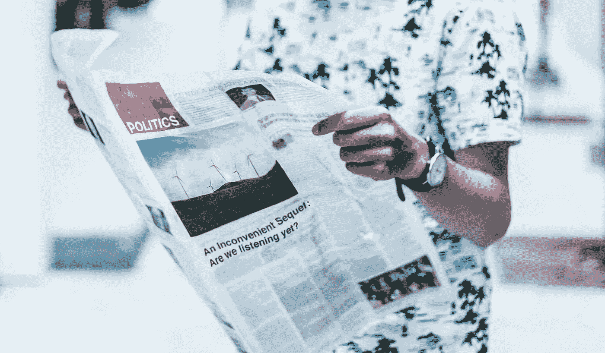
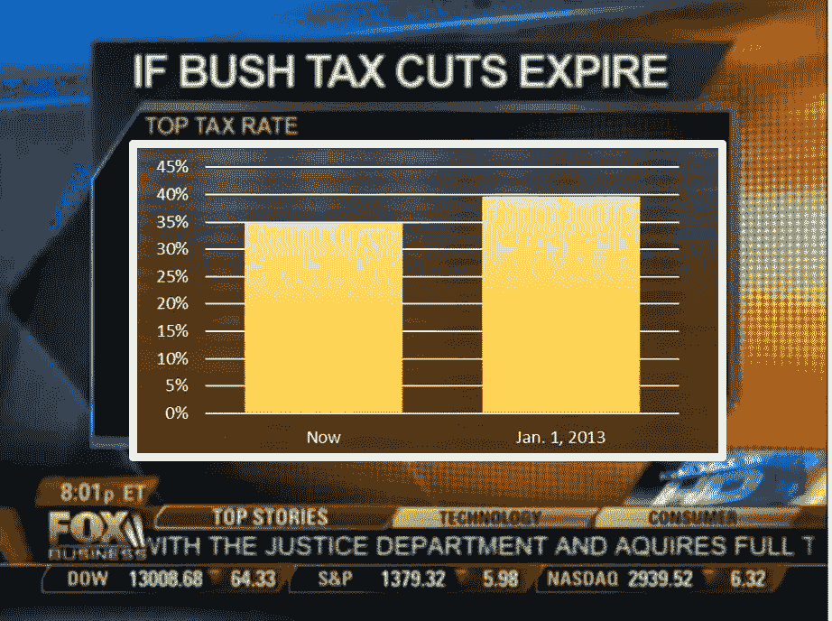

# 不要被虚假的数据所迷惑

> 原文：<https://towardsdatascience.com/dont-be-fooled-by-fake-stats-9f5f7d827d2b?source=collection_archive---------1----------------------->

> 作为新闻和信息的精明消费者，你应该警惕假新闻和包裹在统计数字中的谎言。

当你阅读或观看新闻时，你怎么知道你没有被欺骗或“被推动”?有了图表和图形，它可能看起来很科学，但真的是这样吗？

当你阅读新闻时，你相信作家和编辑，他们相信所呈现的是真实的。但事实并非总是如此。数据被操纵，图表被篡改来影响你的观点。有时是故意的，有时是无意的。不管动机如何，你最终都会成为假新闻的受害者。

***不要做受害者。***

> 还记得街区的珍妮曾经告诉她的粉丝们的话吗:“不要被我得到的石头所迷惑，我仍然是，我仍然是街区的珍妮！”所以，是的，不要被他们得到的数据所迷惑，他们仍然是躺在排行榜上的天才！

作为新闻和信息的精明消费者，你应该警惕假新闻和包裹在统计数字中的谎言。如果你遵循我下面的建议，你应该能够区分事实和虚构。

# **加载的问题和有偏见的调查**

调查统计是影响公众意见的一种简单而有效的方法。你可以从调查中得到任何你想要的答案。你所需要的是向一个非随机的方便样本提出精心设计的问题。

这里有一个例子。假设你想把煤作为一种可行的能源。你是怎么做到的？你雇佣了一家市场调查公司，该公司设计了一项调查，并在大多数人从事煤炭相关业务的城镇实施。你向受访者提出以下问题:

> "你认为‘清洁’煤会减少美国对中东石油的依赖吗？"

这项调查的结果产生了一个故事，内容如下:

> “85%的美国消费者认为清洁煤可以减少美国对外国石油的依赖。高油价让美国中产阶级付出了代价。或许是时候重新审视一下煤炭了。等等，等等，等等……”

如果你正在阅读一篇关于某项调查的新闻，请注意陷阱，并问自己以下问题:

*   谁委托进行这项调查的？调查的发起者是否对调查结果有既得利益？在前面的煤炭示例中，您想知道煤炭行业是否赞助了该调查，或者该调查是否由环境倡导组织赞助。
*   谁回答了调查？受访者是普通的美国人还是依靠煤炭相关产业为生的人？
*   被调查者在可比较的选择中有真正的选择权吗？例如，将清洁煤与中东的石油进行比较公平吗？把煤和风能或太阳能相比怎么样？这公平吗？

你可能会认为我对煤炭行业过于挑剔。不是真的。这只是一个例子。事实上，你可以反过来想一想，如果一个可再生能源组织的意图是在光线不好的情况下展示煤炭，它可能会向调查对象提出一些有分量的问题。这里有一个例子。“你认为政府应该支持生产更多的风能和太阳能，以减少美国对‘脏’煤和中东石油的依赖吗？”

An inconvenient sequel: Are we listening yet?

但不全是脏煤或者热风？借助大数据和分析，市场研究人员对你的了解比你想知道的还要多。你认为某一类餐馆的顾客更有可能以某种方式投票吗？如果你的答案是否定的，请再想一想。

通过使用大量的数据，政治民意测验专家确定，共和党和民主党选民不仅在政治上有不同的品味，而且他们的味蕾也不同，因为他们在不同的场所吃牛排。对一些人来说是全熟，对另一些人来说是半熟！

# **不要被我得到的图表所迷惑**

用图形和图表更容易理解。我们很容易成为假科学的牺牲品[。当你看到一个图表时，不要只是相信它。首先寻找错误、遗漏和故意操纵的线索。记住那些试图欺骗你的人会试图操纵图表和夸大其词。](http://journals.sagepub.com/doi/abs/10.1177/0963662514549688)

这里有一个来自[福克斯新闻频道电视台](https://www.mediamatters.org/research/2012/10/01/a-history-of-dishonest-fox-charts/190225)的例子，你可能知道它不是民主党的忠实粉丝。2012 年 7 月，福克斯新闻频道公布了一张图表，突出显示了美国最高收入人群的税率变化。该网络倾向于降低税收，并认为如果对富人征税更少，他们就会花更多的钱来促进经济增长。

福克斯新闻频道想把计划中的税率变化描绘成一个巨大的增长。下面的图表显示，一旦布什总统对富人的减税政策到期，税率将会“大幅”增加。如果你比较两个柱的高度，你会注意到减税后的柱比另一个柱高很多倍。

但是如果你看这两个税率的话，还是挺像的。减税后 35%的税率与 39.6%的税率没有太大区别。但是图表夸大了差异，使用任意最小值作为纵轴。轴从 34%开始，而不是从 0%开始。

如果福克斯新闻频道选择 0 作为纵轴的最小值，你认为图表会有所不同吗？让我们自己尝试一下，因为我们已经有了绘制条形图所需的两个数据点。我只需要把上面图像中福克斯新闻频道的图表换成我的。

下面的图表显示了与福克斯新闻频道相同的信息，但是两种视觉效果截然不同。当柱状图使用 0 作为纵轴的最小值时，我们不再看到税率的大幅上升。

这张图表展示了一幅真实的画面，尽管可能很无聊，但确实是真实的。

# **伪科学同样致命**

并非只有新闻媒体忙于夸大事实。科学家和研究人员也是夸张行业的一部分。例如，一个研究小组在 2016 年声称，他们可以使用[高级分析技术通过面部识别罪犯](http://callingbullshit.org/case_studies/case_study_criminal_machine_learning.html)。诡异！是的。但前提是这是真的。

让我先解释一下他们做了什么。他们将罪犯的照片(由警方提供)与普通人的照片进行了对比。他们声称他们的程序能够以 90%的准确率区分罪犯和非罪犯。

实际上，他们成功建造的是一个微笑探测器，而不是犯罪探测器。他们的程序测量一个人的鼻子和嘴唇边缘形成的角度。微笑的脸会比皱眉的脸报告更大的角度。因此，他们能够区分微笑和皱眉的脸。

> 你可能会问，微笑和犯罪有什么关系。没什么。

记住，在这项研究中，警察提供了罪犯的照片。现在，我不是面部照片的专家，但我知道被拘留者在被警察拍照时不太可能微笑。你不必相信我。你所要做的就是记住著名的[英国演员休·格兰特](https://www.theguardian.com/film/from-the-archive-blog/2015/jun/26/hugh-grant-arrest-prostitute-divine-brown-20-1995)在警察逮捕他和一名妓女在公共场所做出猥亵行为后是如何照顾他的。

肯定不是他的最佳时刻。

在警方公布的面部照片中，他没有笑。然而，将这张照片与电影海报中格兰特满脸笑容的照片相比，你会注意到不同之处。他的鼻尖和嘴唇边缘形成的三角形在他笑的时候比警察拍的照片有更大的角度。

On the left is the police mugshot and on the right is Hugh smiling!

基本上，研究人员能够比较从 LinkedIn 等网站上获取的笑脸和皱眉脸。研究人员可能夸大了他们的发现，从微笑和皱眉到发现罪犯。我不得不说，这是一个很大的延伸。

# 结论

在一个充斥着大数据和假新闻的世界里，你可能会被骗，以免提高警惕。不要轻易被数据和图表欺骗。做一个事实和新闻的精明消费者。

聪明的答案需要聪明的问题。询问关于谁收集了数据，谁支付了费用，谁分析了数据，以及谁写了这个故事。有了这些聪明的问题，你就不会被愚弄。