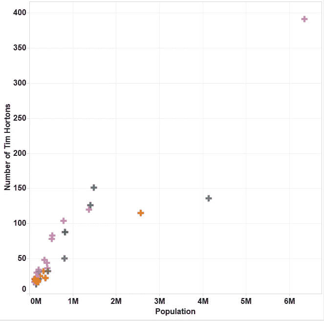
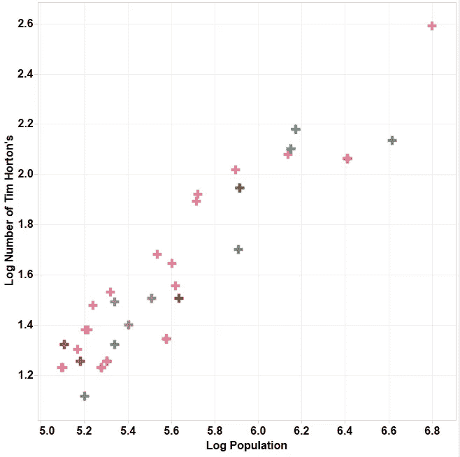
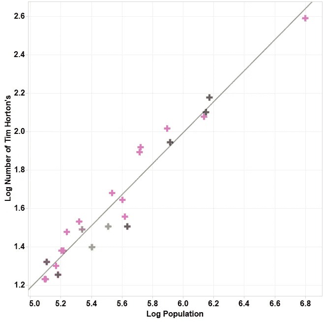
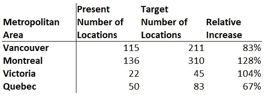

# 甜甜圈和咖啡符合城市经济

> 原文：<https://towardsdatascience.com/donuts-coffee-meet-the-city-economy-12a540faf83b?source=collection_archive---------10----------------------->

## 加拿大快餐服务中的数学标度

如果你了解加拿大，你就会知道它与蒂姆·霍顿的连锁快餐店有一种特殊的关系:连锁快餐店，以便宜的咖啡、快捷的早餐和罪恶的油炸圈饼而闻名。然而，这种关系不仅仅是饮食热量的稳定供应。例证:一则新闻报道说，在阿尔伯塔省的红鹿市，一名男子挥拳猛击一只美洲狮，攻击他的哈士奇犬。只有当我们得知这一事件发生在蒂姆·霍顿酒吧时，它才被宣布为*峰加拿大*。

简单地说，这个品牌的快餐店在加拿大文化中有着特殊的地位。

在接下来的内容中，我使用了蒂姆·霍顿的商店位置数据，以便了解城市消费经济学中的*规模*。这是一个相当简单的数据集，但它打开了一个城市经济抽象质量的视野，实际上可以作为商业增长代理的基础。

## 商店和城市及省份的数量

在撰写本文时，整个加拿大共有 4，258 个 Tim Horton 的位置。加拿大有近 3700 万人，因此每家商店大约有 8700 名居民。

下图显示了截至 2017 年与人口普查大都市地区人口相关的商店数量。

Number of stores in census metropolitan areas; color by province, including pink=Ontario, grey=Quebec, orange=British Columbia, blue=Alberta, green=Manitoba, yellow=Saskatchewan, brown=Nova Scotia, red=New Brunswick.

散点图没有透露太多信息，除了加拿大有一个非常大的都市地区，大多伦多地区，第二和第三名分别是蒙特利尔和温哥华。

人们普遍发现，大都市的规模遵循幂律关系，而不是线性关系。这是一种数学方法，通过一个公共因子的重复相乘，而不是一个公共项的重复相加，来说明种群大小之间的关系。例如，温哥华(第三大城市)的人口相对于蒙特利尔(第二大城市)的人口是 62%，而蒙特利尔相对于多伦多(第一大城市)的人口是 65%。换句话说，*乘*因子几乎是相同的。

这说明了加拿大大城市中心*集合*的统计关系。一般的观察被标为*齐夫定律*。这里[这里](https://arxiv.org/pdf/cond-mat/0412004.pdf)、这里[、这里](https://io9.gizmodo.com/the-mysterious-law-that-governs-the-size-of-your-city-1479244159)和[这里](https://www.nature.com/articles/srep00812)已经详细讨论过，不再赘述。

相反，乘法关系的洞察力可用于用对数将早期的图形转换成更具信息性的东西。x 轴和 y 轴上的数据此后通过以 10 为底的对数进行转换。

## 市场质量不同的省份

现在我们可以开始辨别有用的关系。

Log number of stores in census metropolitan areas; color by province, including pink=Ontario, grey=Quebec, orange=British Columbia, blue=Alberta, green=Manitoba, yellow=Saskatchewan, brown=Nova Scotia, red=New Brunswick.

该图显示，人口越多，蒂姆·霍顿的位置就越多。这并不奇怪，但是有一个转折，如下一节所述。

在此之前，会出现一个数据分段。图表中的灰色和橙色标记都明显低于我们可以想象的其他标记的线性趋势线。两种不同类型的标记分别表示法语省份*魁北克*和最西边的省份*不列颠哥伦比亚*。在不列颠哥伦比亚[众所周知星巴克占有更大的市场份额](https://www.bcbusiness.ca/why-vancouver-is-the-only-market-tim-hortons-hasnt-cracked)，而魁北克在很多方面有意无意地不同于加拿大其他以英语为母语的地区。

至少与蒂姆·霍顿的市场相比，这两个市场有着质的不同。目前，这些数据被分割，忽略了这些市场，但我会回到他们身上。

## 观察:尺寸折扣

剩下的非常符合线性关系(r 的平方为 0.94)。

Log number of stores in census metropolitan areas, Quebec and British Columbia removed; color by province, including pink=Ontario, blue=Alberta, green=Manitoba, yellow=Saskatchewan, brown=Nova Scotia, red=New Brunswick.

而是一扭:*斜率为 0.81* 。精确的等式是:

斜率的值说明了一些重要的事情。

这是一个对数标度，所以我们应该用乘法来思考。例如:*将大都市地区的人口增加一倍*，换句话说，将 N_population 乘以 2，这在图中相当于沿 x 轴的任意位置向右*移动了大约 0.30，因此，y 轴上的值增加了大约 81%，*而不是*直接增加一倍会达到的 100%。有一个固定的*大小折扣*。*

值得注意的是，这种折扣适用于所有大都市地区。换句话说:Tim Horton's 所在的消费和供应市场的一些潜在质量在 Thunder Bay 和 Kitchener-Waterloo 之间发生变化，就像 Kitchener-Waterloo 和多伦多之间的市场质量变化一样多，因此位置的数量是可预测的折扣。

## 故意的还是突发的，特例还是一般？

那么，我是不是逆向设计了蒂姆霍顿(Tim Horton)总部高管们盲目遵循的等式，即人口越多的城市中心，人均办公地点就越少？不太可能。但我也拒绝相信高级管理层只是在扔飞镖来解决决策。在某个时候，已经进行了商议，并对某件事情作出了有意决定。

图中的结构更像是来自于多个个人深思熟虑的经济决策的累积，从意图的聚合形式中，观察到的结构看起来好像在城市中感觉到了一种无形的选择力量。随着城市地区在经济发展和维持不断增长和变化的人口的压力下有机增长，产品和服务供应网络的某些质量在任何增长中的加拿大城市的大量但通常是共同的限制下激增。

受当前技术、心理欲望、规章制度、政治和文化遗产以及量子力学的限制，各种各样的人类活动聚集在一起，创造了任何一个单独的深思熟虑都没有想到的东西。

好吧，至少在蒂姆·霍顿的廉价膳食卡路里供应方面。然而，在过去的十年里，类似的比例关系已经在其他类型的城市供给中进行了研究。欧洲大都市地区的加油站数量和汽车经销商数量也按照与蒂姆·霍顿的位置相同的指数进行了规模折扣。相反，一些产品和服务被发现在城市人口中以*加速*的方式扩展，申请专利的数量就是其中之一。文献中还有其他例子，在这篇文章之后，我们又有了一个例子:Tim Horton 的位置数。

重复一句老话:城市人口的整体大于其各个部分的总和，*但*随着更多部分加入其中，整体越来越不同。

像这样的组织力量出现的机制是什么？这是一个因果预测调查的问题。非常有趣，但这是另一个重要的话题。

## 不列颠哥伦比亚省和魁北克省以及市场增长的代理人呢？

不列颠哥伦比亚省和魁北克省被排除在之前的考虑之外，因为他们的蒂姆·霍顿的经济是独特的。是时候把这些省份带回来问一问了:如果蒂姆·霍顿的公司成功地获得了与加拿大其他地方相同的市场份额，那么该公司的正确数量是多少？

首先，计算观察值和拟合线之间的差值，然后将对数转换为位置数。下表显示了不列颠哥伦比亚省和魁北克省的四个大都市地区需要观察多少家商店，才能得出已获得可比市场份额的结论。

如果忽略与人口的比例关系，将会得到当前状态和目标状态之间的不正确差异。

蒂姆·霍顿保持市场份额的能力也可以用一个代理指标来衡量。举例来说:在 2011 年至 2016 年的五年间，大多伦多地区的人口增长了约 6%。由于规模折扣，*假设*恒定的市场份额和固定的商业模式，蒂姆·霍顿的分店数量应该增长了约 4.8%。如果当时的实际增长偏离了这个数字，我们可以对市场的变化做出有根据的猜测。新的立法、新的竞争或贸易关系的改变的影响的大小可以通过适当的人口规模贴现从未来的数据中辨别出来。

因为它在加拿大结构中的特殊地位，Tim Horton 餐馆地理位置的相对简单的数据，与幂律知识相结合，打开了加拿大城市经济普遍质量的视野。一个有意义的假设，一点数据科学，有趣的见解就能赢得。

> 掌声就是货币。如果你觉得这值得一读，请按下按钮。

## 脚注

蒂姆·霍顿的外景拍摄于[这里](https://locations.timhortons.com/ca.html)。加拿大人口普查数据取自[这里](https://open.canada.ca/data/en/dataset/6bbe2840-38ec-446c-875a-a4ae30cfc006)。用 Tableau 完成的可视化。关于缩放关系[的推荐通俗读物在这里](https://www.goodreads.com/book/show/31670196-scale)。对于阴谋读者的免责声明，我与 Tim Horton's 及其竞争对手或供应商没有任何关系，我只是偶尔在那里吃早餐。