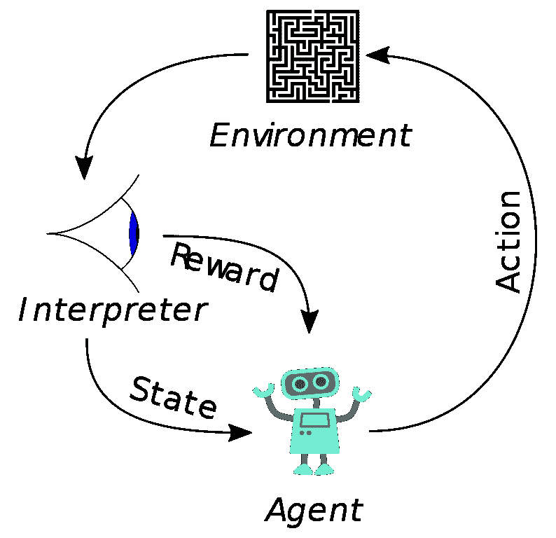
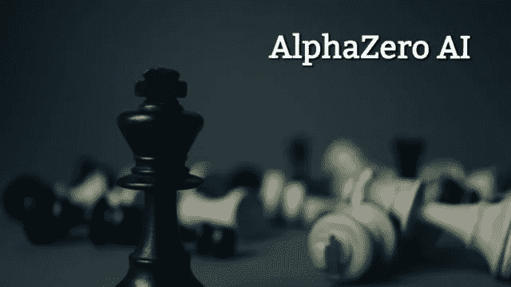

# 多巴胺:改善强化学习和…机器的快感？

> 原文：<https://towardsdatascience.com/dopamine-improved-reinforcement-learning-and-pleasure-for-machines-9278ef84d78b?source=collection_archive---------6----------------------->

好消息:2018 年 8 月 27 日，谷歌通过他们的[人工智能博客](https://ai.googleblog.com/2018/08/introducing-new-framework-for-flexible.html)宣布，他们发布了一个新的框架，名为多巴胺，用于“灵活和可重复的强化学习研究”。

还没从喜悦中跳出来吗？别担心，我们会经历这意味着什么，这意味着什么，希望我们都会有这样的反应。

# 强化学习

在我们进一步深入之前，这里有一个快速回顾，让每个人都达到相同的理解水平。机器学习(Machine Learning)是人工智能的一个分支，从数据中学习机器，主要可以分为三个部分，前两个部分是:

*   监督学习，向机器提供输入数据和预期输出。因此，机器在每次输出时都会收到反馈，并可以使用该反馈来相应地重新调整(学习)。
*   无监督学习，机器仅被提供输入数据，并自行找出任何隐藏的模式。

现在，第三个是炒作最多的地方。听说过某个 AI 打败了世界上最好的围棋手的新闻吗？或者，最近，一队 DOTA 2 玩家输给了五个训练来玩同一游戏的人工智能机器人？对于所有这些耸人听闻的说法，要感谢强化学习(也许还有媒体)。

在强化学习中，机器，更具体地说，称为代理，查看其环境的状态(这称为观察)并选择做一个动作。如果行动是好的，它会得到奖励。否则，它会受到处罚。代理被设计成能找到产生最多回报的方式。以一个游戏为例，当它赢的时候代理人收到最多的奖励。简单来说，这就是强化学习的工作原理。

A graphical representation of Reinforcement Learning (sourced from: [https://en.wikipedia.org/wiki/Reinforcement_learning#/media/File:Reinforcement_learning_diagram.svg](https://en.wikipedia.org/wiki/Reinforcement_learning#/media/File:Reinforcement_learning_diagram.svg))

# 多巴胺

让我们回到刚刚发生的事情:谷歌发布了一个名为 Dopamine 的开源框架，用于“强化学习算法的快速原型化”，在框架的 Github 知识库中提到了这一点。顺便说一句,“多巴胺”这个名字非常合适。原因？做好准备，快速一瞥神经科学！

从神经科学的角度来看，多巴胺是大脑中的化学信使，其目的是调节器官的奖赏和愉悦中心。当你完成清单上的一项任务时，或者当你因为查看社交媒体时收到的几条通知而感到高兴时，这就是给你这种小小的感觉良好的因素(是的，它们实际上是为了让你通过多巴胺分泌感觉良好，因为代表社交反馈的通知让你兴奋，从而导致某种成瘾。如果你想要更详细的解释，这里有一篇文章。

我把最好的例子作为最后一个:多巴胺是让任何有性繁殖器官在高潮时感觉良好的物质。从种群水平来看，一个物种的目标是不断地将基因传递给下一代，从而确保其生存。当一个有机体交配时，它完成了它的一个基本任务，它的大脑以强烈的快感奖励它，作为继续传递基因的激励。令人着迷的是，我们的身体是如何想出办法让我们做到这一点的:这是做一个好男孩并传递你的基因的一个巨大奖励，现在感受一些快乐吧！

是啊，有趣的东西，但这与人工智能和机器学习有什么关系？嗯，还记得我们的大脑如何释放奖励让我们感觉良好，以鼓励我们去做事情吗？嗯，既然人工智能是要创造更接近人类的算法，那么强化学习就是利用大脑的这种奖励机制作为灵感，鼓励机器通过……嗯……感觉良好来学习。好吧，你不会让机器到处呻吟(我绝对不希望它们在任何时候呻吟！想象一下，你笨拙地坐在办公室里，甚至更糟，坐在图书馆里，而你的笔记本电脑却觉得学习太难了！).对于一台机器来说，“感觉良好”意味着积累奖励积分。

回到正题，谷歌的多巴胺现在是一个开源框架，它有以下理念，正如该框架的 [Github 库](https://github.com/google/dopamine)中所述:

轻松实验:让新用户能够轻松运行基准实验。

灵活的开发:让新用户很容易尝试研究想法。

紧凑而可靠:为一些久经考验的算法提供实现。

可再现性:促进结果的再现性。

# 这将如何发展

记住谷歌开源这个框架的目标，可以预期更多的开发者和爱好者会尝试强化学习。再加上云计算和边缘计算等选项(见[我的帖子](/what-intel-acquiring-and-integrating-vertex-ai-with-movidius-means-for-deep-learning-16c0055dc99c)关于边缘计算的最新进展)，训练和评估这些机器学习模型变得更加容易。因此，强化学习领域将会比现在发展得更快。

引用[路易·科佩](https://medium.com/u/15a111b77998?source=post_page-----9278ef84d78b--------------------------------)在[他的文章](https://medium.com/point-nine-news/what-does-alphago-vs-8dadec65aaf)中的话:

> 机器的行为与人类有所不同**，虽然进行了违反直觉的优化，但最终会得到更“优化”的结果**。随着越来越多的智能系统集成到我们的日常环境中，我们可能会在未来看到越来越多的这种情况。理解我们对这些决定的判断是如何演变的将会很有趣。

这意味着，通过强化学习，机器可以通过概率数学来学习我们人类因生存本能而不敢做的事情。下面举个例子:想象一下一辆车即将发生事故的场景。如果在那一刻，加速实际上会大大降低汽车碰撞的概率呢？普通人会有勇气猛踩油门而不是刹车吗？除非受到肾上腺素的巨大刺激，否则可能不会，因为我们人类认为越慢越安全。但是机器不会感到害怕，一辆经过优化以将事故数量降至最低的自动驾驶汽车肯定会跑得更快，并拯救所有乘客。

当 AlphaZero 算法教会自己下棋时，这种奇怪(但最终是聪明)的决定被证明是非常有用的，这甚至促使著名作家兼哲学家 Yuval Noah Harari 发表评论:

> 由于 AlphaZero 没有从任何人身上学到任何东西，它的许多制胜之道和策略在人眼看来似乎都非常规。他们可以说是创造性的，如果不是彻头彻尾的天才。

Sourced from: [https://fossbytes.com/googles-alphazero-ai-chess-program/](https://fossbytes.com/googles-alphazero-ai-chess-program/)