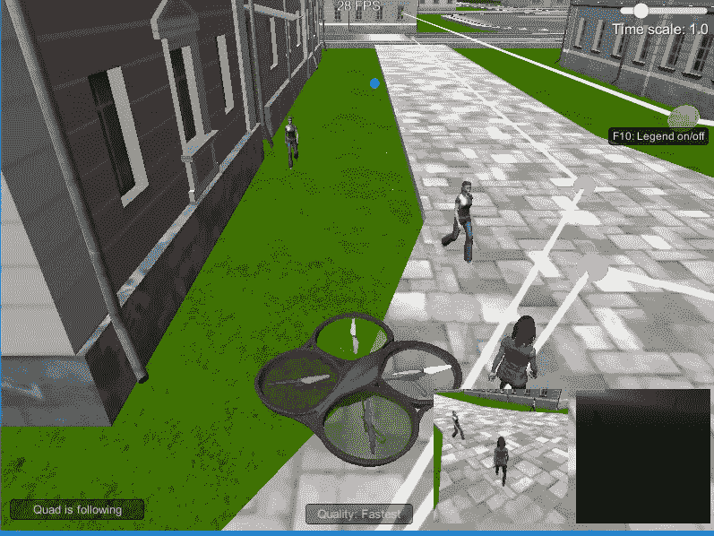
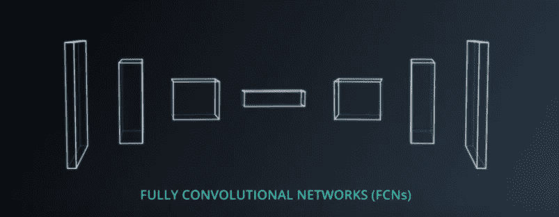
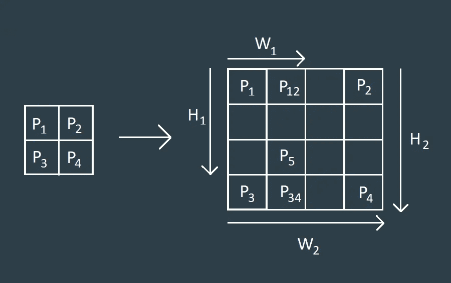
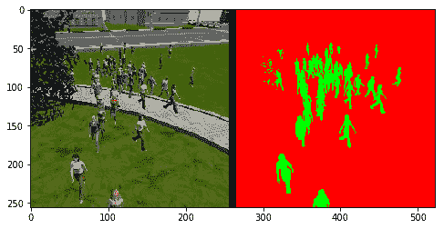

# 深度学习在机器人学中的应用

> 原文：<https://towardsdatascience.com/drone-follow-me-ed0d15e62498?source=collection_archive---------4----------------------->

W 帽子是**跟我来**在**机器人**？

“跟我来”是机器人学中的一个领域，用于在模拟中识别和跟踪目标。

像这样所谓的“跟我来”应用是许多机器人领域的关键，您在这里应用的相同技术可以扩展到自动驾驶汽车的高级巡航控制或工业中的人机合作等场景。

在这个项目中，一个深度神经网络被训练来识别和跟踪模拟中的一个目标，即一个被称为“英雄”的人，他将与其他人混合在一起。在下图中，有一个跟随“英雄”的无人机的表示。

Drone follow (mid of the image) follow a target on bottom right corner

你听说过卷积网络吗？

记住神经网络的概念，将卷积网络应用于图像识别有两个主要优点:

*   参数共享:在图像的一部分有用的特征检测器(例如垂直边缘检测器)可能在图像的另一部分也有用。
*   稀疏连接:在每一层中，每个输出值只依赖于少量的输入，这使得它具有平移不变性。

通常，卷积网络架构的结构如下:

*   [卷积层](http://cs231n.github.io/convolutional-networks/#architectures)
*   [汇集层](http://cs231n.github.io/convolutional-networks/#architectures)(通常是最大汇集)
*   [全连接层](http://cs231n.github.io/convolutional-networks/#architectures)
*   [Softmax](https://www.coursera.org/learn/deep-neural-network/lecture/HRy7y/softmax-regression)

作为每层的激活函数，RELU 应用逐元素的非线性。

即使卷积网络是用于对象分类的现有技术，对于对象检测，必须应用架构调整来提供逐像素的网络学习。这种架构被称为*全卷积网络*。

W 什么是全卷积网络？

*全卷积网络(FCN)* 是一种允许在整个网络中保留空间信息的网络架构，这对于图像中的对象检测来说非常简洁。此外， *FCN* 可以接收任意维度的输入。

Fully convolution network architecture

关于架构， *FCN* 的架构如下:

*   编码器(上图中的前 3 个元素)
*   1x1 卷积层(上图中的第四项)
*   解码器(上图中最后 3 次)
*   跳过连接

编码器对应于上一节中描述的传统卷积网络。编码器允许学习最重要的特征，以便稍后进行上采样并获得图像中的对象分割。

一个全新的概念是 1x1 卷积层。简单来说，就是保存空间信息的卷积层。此外，1x1 通过在来自编码器的输入层上应用 1x1 滑动窗口来执行逐元素乘法和求和。最后，1x1 卷积通过降低编码器架构的深度来降低计算成本。类似地，1x1 卷积图层的工作方式类似于全连接图层，因为它线性组合深度图层并输入 RELU，尽管与全连接图层相反，它会保留空间信息。

[1x1 convolution](https://www.coursera.org/learn/convolutional-neural-networks/lecture/ZTb8x/networks-in-networks-and-1x1-convolutions)

最后，解码器由双线性上采样层、卷积层+批量归一化和与编码器层的跳跃连接组成，以改善丢失的空间特征分辨率。

让我们来分解这三个重要的概念:

*   双线性上采样
*   批量标准化
*   跳过连接

双线性上采样是一种重采样技术，它利用位于给定像素对角线上的四个最近的已知像素的加权平均值来估计新的像素强度值。加权平均值通常取决于距离。

让我们考虑这样一个场景，其中有 4 个已知的像素值，所以本质上是一个 2x2 的灰度图像。需要将此图像上采样为 4x4 图像。下图更好地展示了这一过程。

Bilinear Upsampling for 2x2 input image

让我们记住，双线性上采样方法不像架构中的转置卷积那样是一个可学习的层，并且容易丢失一些更好的细节，但它有助于提高性能。

例如，转置卷积是一种具有可学习参数而不是插值的方法。转置卷积有些类似，因为它产生的空间分辨率与假设的反卷积图层相同。然而，对这些值执行的实际数学运算是不同的。转置卷积层执行常规卷积，但恢复其空间变换。

[Tranpose convolution from 2x2 to 4x4](http://cs231n.stanford.edu/slides/2017/cs231n_2017_lecture11.pdf)

关于转置卷积数学的更多细节，请点击[这里](https://arxiv.org/ftp/arxiv/papers/1609/1609.07009.pdf)。

第二个重要的概念是[批量标准化](https://www.coursera.org/learn/deep-neural-network/lecture/81oTm/why-does-batch-norm-work)，它基本上是指网络内每小批训练数据的正常数据。这个过程允许网络快速学习。此外，它限制了网络内部激活函数的大的变化，即在隐藏层中有一个更平滑和坚实的学习。

第三个重要概念是[跳过连接](https://www.coursera.org/learn/convolutional-neural-networks/lecture/HAhz9/resnets)，它基本上从编码器的初始层获得更高的分辨率，并与解码器层结合，以获得卷积层期间损失的更多空间分辨率。这种方法对解码器很重要，因为上采样不能恢复所有的空间信息。

Skip connection

最后，[跳过连接](https://arxiv.org/pdf/1608.04117.pdf)对于训练越来越深的网络也很有用，比如 ResNet 架构。

在建立并训练了一个 *FCN* 之后，一个问题自然产生了:我们如何知道我们的对象检测模型是否表现良好？这时*insection Over Union(IoU)*度量就派上用场了。在下一节中，我们将讨论这一概念，以及为什么是对象检测性能的良好指标。

欠条是怎么回事？

IoU 测量地面真实图像与我们的 *FCN* 模型产生的分割图像重叠的程度。本质上，它测量了从地面和分割图像 *FCN* 网络的像素联合中分割的像素数量。因此，度量的数学公式是:

[IoU](https://www.pyimagesearch.com/2016/11/07/intersection-over-union-iou-for-object-detection/)

现在你在想，你的模型怎么办？有哪些障碍？最终结果是什么？下一节再说吧。

这个伟大的工程怎么样？

该项目分为三个主要阶段:

*   生成并预处理来自模拟器的图像
*   设计模型架构
*   对模型进行训练和评分

预处理步骤将来自 sim 的深度掩模转换成适于训练神经网络的二进制掩模。

Pre-processed image on the right

最终的模型架构可视化是:

FCN architecture (final model)

首先，使用编码器和解码器来应用图像中对象的分割是基于逐个像素的学习，而不是像在空间信息不太相关的图像分类中使用的图像不变性滤波器。用于导出模型架构的总体策略始于深度为 32 的初始卷积层的基础，其具有 3×3 滤波器、深度为 8 的 1×1 卷积以及深度与编码器相同的解码器。这样做的原因是基于图像输入尺寸 256X256X3。从这一点上，几个卷积层增加了深度(基于 2 的幂)。这种方法是基于斯坦福大学使用的 SegNet 架构来分割图像中的对象。值得一提的是，1x1 层深度增加与数据生成相关，以减少过拟合和模型性能改善。数据生成对于减少训练和验证数据集的误差(交叉熵)以及克服局部最小值和允许网络继续学习是重要的。

正如你所记得的，最终得分是由一个叫做 IoU 的指标来定义的，是 0.49。通常，将分割确认为预测对象的标准是> 0.5。虽然，对于作为 Udacity 项目的这个项目，标准被降低到 0.4。

Original image on the left; Binary mask in the middle; Prediction from model on the right

github:[https://github.com/BrunoEduardoCSantos/Follow-Me](https://github.com/BrunoEduardoCSantos/Follow-Me)