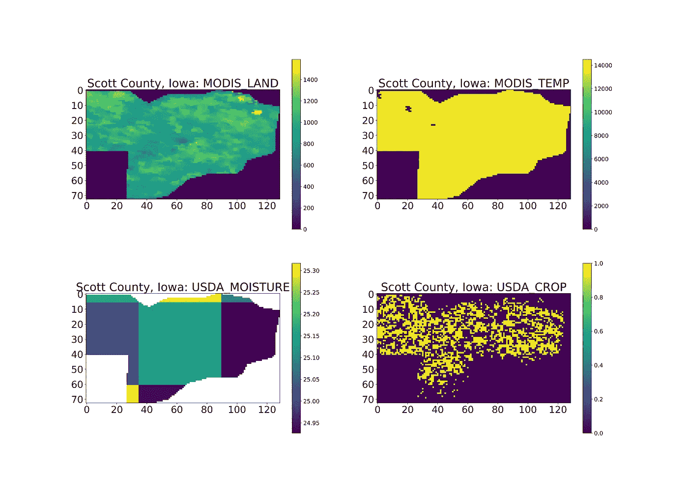
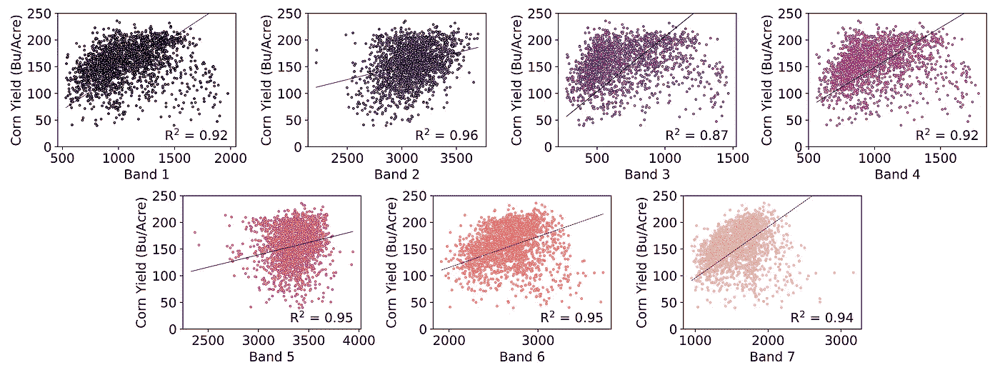
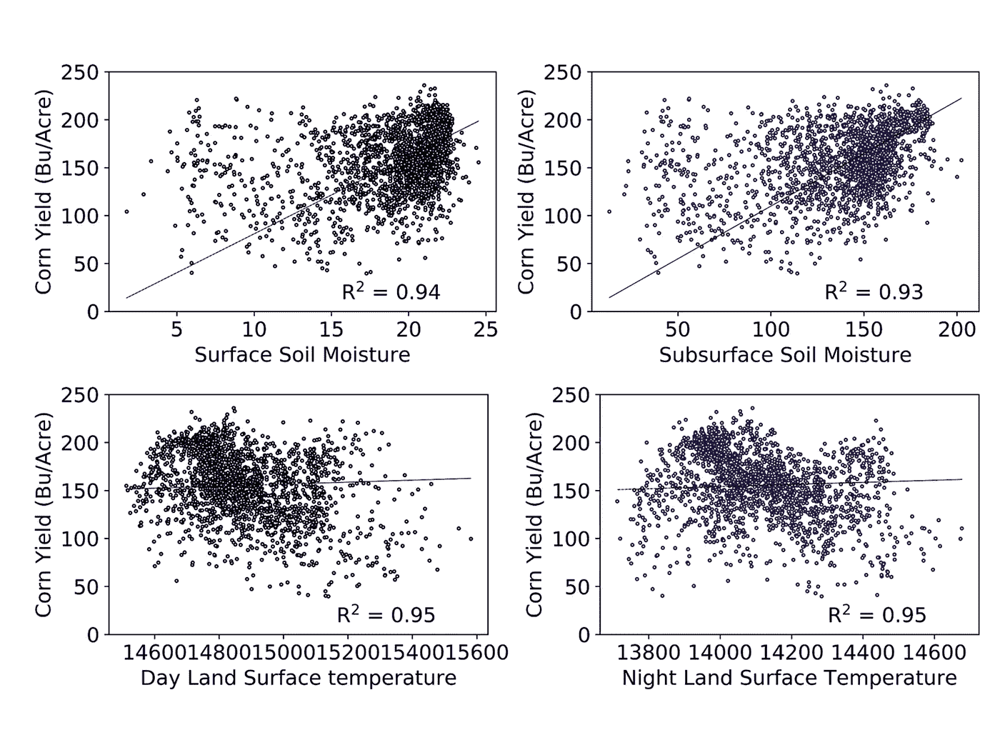
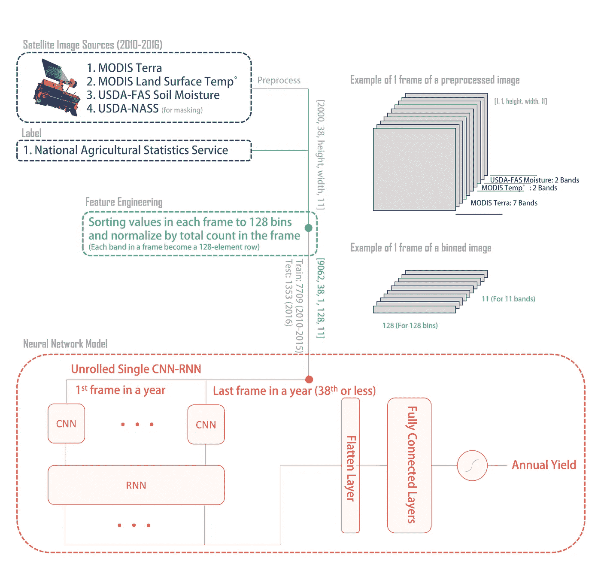
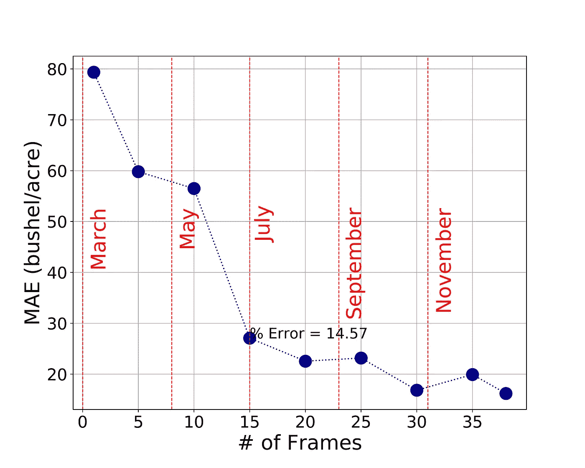

# 利用卫星图像预测早期玉米产量

> 原文：<https://towardsdatascience.com/early-corn-yields-prediction-using-satellite-images-dcf49b24efab?source=collection_archive---------10----------------------->

在一个以农产品分销为主要业务的家庭中长大，决定我们何时销售产品以及销售多少产品总是一个挑战，因为这些最终取决于在季节结束时收获多少产品。如果有一种方法可以预测在赛季结束时将会得到多少，我们将会更容易做出决定。这个项目的意义不仅仅是我的家族企业。当然，大企业可以使用这个模型来优化他们的价格和库存，政府可以为粮食短缺做准备，甚至农民如果知道地区产量，也可以被告知适当的销售价格。

先前的研究表明，卫星图像可以用来预测每种作物的种植面积[1]。这就留下了知道那些种植区的产量的问题。为此，这个项目旨在利用几幅卫星图像的数据来预测一种作物的产量。在这项研究中，我们选择玉米作为样本作物。玉米通常在 10 月份收获，因此，我最终的目标是只用 10 月份之前的数据来预测玉米产量。

在这个中页，我将概述该项目的简要总结，更多详细分析请访问[这里，](https://tpjoe.gitlab.io/)和该项目中使用的代码，请到我的 Github [页面](https://github.com/tpjoe/SpringBoard/tree/master/Project%20II)。

**数据来源**:

我查询了从 3 月到 12 月的谷歌地球引擎数据集中 4 颗卫星的图片(总共 146 GB)在县一级。这些卫星包括，

1.  MODIS 地表反射率
2.  MODIS 地表温度
3.  USDA-FAS 表层和次表层水分
4.  美国农业部-NASS(用于掩蔽)

每年为一个县收集 38 幅图像(3 月至 12 月)，每幅图像共有 11 个波段(前三颗卫星的波段总数)。该年和县的相应产量从美国农业部 QuickStats 的县级数据中收集。

我收集了 2010 年至 2016 年的数据。我将使用 2010-2015 年的数据进行训练，我们将使用 2016 年的数据进行测试。如果我们将来自每一年和县的数据视为一个视频(38 帧)，则总共有 7，709 个用于训练集的视频和 1，353 个用于测试集的视频。

**探索性数据分析**

同样，详细的分析可以在我的[网页](https://tpjoe.gitlab.io/)上找到，这里我只放重要的数字和简要的分析。让我们首先看看图 1 中的图像是什么样的。



**Fig. 1.** Example of the image from the first band from each satellite (Scott County, Iowa, 2010).

现在让我们看看来自每个卫星的每个通道的值是否与图 2 和图 3 中该县的年产量相关。原来是有的！



**Fig. 2\.** The correlation between yearly-averaged values in each band of MODIS Terra Land Reflectance and corn yields.



**Fig. 3.** The correlation between yearly-averaged values in each band of MODIS Land Surface Temperature and USDA-FAS Land Moisture and corn yields.

**建模结果**

即使对图像进行了预处理，但要将所有 9，062 幅图像(每幅图像有 11 个波段，平均大小约为 100 × 100 像素)放在一起，训练过程将会极其缓慢。因此，在放入模型之前，我们对图像进行了进一步的处理。具体来说，我们将每个通道中的值装入 128 个箱*，即* 1 行。例如，在 MODIS Terra Land 反射率波段 1 中，我们会将该波段中的图像值分为 128 个像元，从 0 到 4000 等分这些值，然后使用该图像波段中非零像素的总数对计数进行归一化。这将大约 100 × 100 的整个图像缩小到只有 128 个元素。这背后的逻辑是基于每个农场的产量与其周围环境无关。因此，每个县的平均产量只应与该县农场的产量分布相关。图 4 总结了从数据收集到输入模型的过程，并显示了数据的维度。这种技术来源于以前的研究[2]。



**Fig. 4\.** Summary of the workflow from data collection, preprocessing, binning, and model concept.

数据经过充分预处理后，将被输入到模型中。我们可以将这些数据视为视频或音频文件，其中每年我们最多生成 38 帧(高度和宽度分别为 1 和 128)。因此，在本研究中，我们选择了 5 个可用于视频分类问题的模型，并针对回归问题对它们进行了修改。这些包括

1.  自建卷积神经网络(CNN)后接递归神经网络(RNN)。这里，长短期记忆(LSTM)被用于 RNN，因为它通常被用于避免香草 RNN 中的梯度消失/爆炸问题。
2.  与 1 相同。但是我们用可分离的 CNN 代替。
3.  兴健等人定义的 CNN-LSTM[3]
4.  三维(3D) CNN
5.  美国有线电视新闻网-RNN 其次是 3D 有线电视新闻网。

图 4 示出了单层 CNN-RNN 的概念，其中在 RNN 编码空间数据之前，将 CNN 应用于所有输入。RNN 然后把每一帧(时间输入)作为一个输入。来自 RNN 的序列输出然后被馈送到 CNN-RNN 的另一层(*即*堆叠层)或全连接层(具有适当的丢弃和正则化)，最后被馈送到激活层以产生该县在某一年的预测玉米产量。

例如，Keras 中模型 1 的代码如下所示:

```
def CNN_LSTM(self):frames_input = Input(shape=self.input_shape)
    vision_model = Sequential()
    vision_model.add(Conv2D(64, (1, 2), 
                     activation='relu',
                     padding='same', 
                     input_shape=self.image_dim))
    vision_model.add(BatchNormalization())
    vision_model.add(MaxPooling2D((1, 2)))
    vision_model.add(Flatten())
    vision_model.add(BatchNormalization())
    encoded_frame_sequence = TimeDistributed(vision_model) \
                                            (frames_input)
    encoded_video = LSTM(256, 
                         activation='tanh', 
                         return_sequences=True) \
                         (encoded_frame_sequence)
    fc1 = Dense(64, activation='relu',
                kernel_regularizer=regularizers.l2(0.05)) \
               (encoded_video)
    out = Flatten()(fc1)
    out = Dropout(0.5)(out)
    output = Dense(1, activation='relu')(out)
    CNN_LSTM = Model(inputs=frames_input, outputs=output)
    return CNN_LSTM
```

每种类型的模型的目标是有 4，500，000 到 5，200，000 个训练参数，并通过改变退出和隐藏层数进行粗略研究。每个模型的结果如表 1 所示。请注意，平均值的百分比误差是测试集的平均产量的百分比误差。

**Table 1.** Summary of model performance in term of mean absolute error and percent error from the mean of the test set (yields from year 2016).

下一步，我们想确定我们在哪个县做得最好，在哪个县做得不好。这将有助于识别模型中的弱点，并使我们能够做出更好的决定，看看我们是否可以信任预测。图 8 显示了美国各地 2016 年的地面真实玉米产量，图 5 和图 6 显示了地面真实预测值的百分比误差。

**Fig. 5\.** The ground truth corn yields across U.S. in 2016 (test set).

**Fig. 6\.** The percent error of the predicted value from the ground truth.

到目前为止，我们已经在每个县使用 38 帧视频进行年产量预测。在这最后一节中，我们想要调查我们可以多早预测产量，*即*减少每年的帧数。图 7 显示了 2016 年使用不同帧数预测玉米产量的平均误差。请注意，第 0 帧开始于 3 月，第 38 帧在年底。结果表明，随着帧数的增加，正如人们所预期的那样，误差越低。值得注意的是，我们可以看到，通过仅使用 20 帧(大约 8 月的第二周)，我们已经可以实现低至 14.57%的百分比误差(相比之下，如果我们使用全年的图像，则为 10.46%)。这是玉米通常在 10 月收获前的 2 个月，尽管在温暖的州这甚至可能在今年晚些时候。因此，该模型将允许用户能够在季节早期预测县一级的玉米产量。



**Fig. 7\.** The mean absolute error (MAE) of the model using different number of frames input per year with using just 20 frames per year (August) is sufficient to predict with only 15% error from the mean value of yields in year 2016.

总之，我们展示了不同卫星图像(包括反射率、土地温度和土地湿度)与美国玉米产量之间的相关性。我们利用这些相关性构建了一个模型，该模型可以捕捉这些数据的空间和时间信息，以预测一年的玉米产量。测试集(2016 年玉米产量)上表现最好的模型是 ConvLSTM，与平均产量的百分比误差仅为 10.46%。为了实现早期预测，我们降低了每年所需的帧数(从最大的 38 帧)。结果表明，即使仅使用 20 帧，我们仍然可以获得良好的模型性能(百分比误差 14.57%)。一年中的第 20 帧对应于 8 月份，这是大部分玉米收获前的 2 个月。这将对农业分销和相关产业的商业模式产生重大影响。

**参考文献**

1.  多时卫星图像的作物分类。
2.  萨比尼、马克、吉利·鲁萨克和布拉德·罗斯。"理解基于卫星图像的作物产量预测."(2017).
3.  卷积 LSTM 网络:降水临近预报的机器学习方法*神经信息处理系统的进展*。2015.