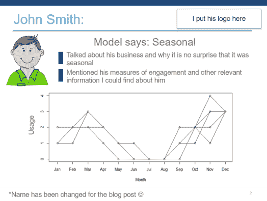
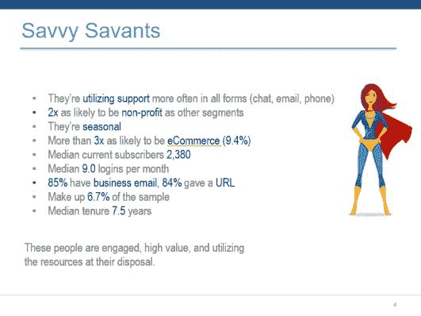

# 有效的数据科学演示

> 原文：<https://towardsdatascience.com/effective-data-science-presentations-caab621abc66?source=collection_archive---------20----------------------->

如果你是数据科学领域的新手，我想提供一些提示，告诉你如何从你在学术界的演示过渡到为行业创建有效的演示。

不幸的是，如果你的背景是数学、统计学或计算机科学，可能没人会让你准备好在工业界做一个令人敬畏的演讲。事实是，这需要练习。在学术界，我们共享 t-stats 和 p-values 的表格，并大量讨论数学公式。这基本上与你向非技术观众演示时想做的相反。

如果你的听众都是 STEM 博士，那就开始吧，但在很多情况下，我们需要调整我们思考展示技术材料的方式。

我可以没完没了地谈论这个话题，但这里我们将涉及:

1.  谈论模型输出而不谈论模型
2.  使用实际客户或输入描绘画面
3.  花时间讲述这个故事

**谈论模型输出而不谈论模型**

某些型号确实很适合这种情况。逻辑回归，决策树，它们只是尖叫着被赋予生命。

您不希望将模型输出复制/粘贴到演示文稿中。您也不希望将输出格式化成一个漂亮的表格并粘贴到您的演示文稿中。你想讲述这个故事，而记录几率肯定不会为你的利益相关者讲述这个故事。

逻辑回归模型的第一步是对对数概率取指数，这样你至少可以用概率来处理。因为这个输出是乘法的，你可以说:

“在其他一切保持不变的情况下，我们预计[变量]每增加一个单位，平均会增加 x%。”

因此，我们不讨论模型的技术方面，而是讨论不同的驱动因素如何影响输出。然而，我们可以更进一步。

**用真实客户来画图**

我*喜欢*用现实生活中的用例来展示模型是如何工作的。上面我们看到了一些类似于我在谈论我的季节性模型时所展示的东西。当然，我为这篇文章改了他的名字，但在演示文稿中，我会谈论这个人的业务，为什么是季节性的，展示明显的季节性模式，并让他们知道模型将这个人归类为季节性的。我不是在谈论傅立叶变换，我是在描述真实的人是如何被分类的，以及我们可能想如何向他们营销。像这样深入挖掘也有助于我更好地理解正在发生的事情。我们都知道，当我们深入挖掘时，我们会看到一些疯狂的行为模式。

提取特定的客户/用例也适用于其他类型的模型。你建立了一个保留模型？选择一对翻盘概率高的情侣，和一对翻盘概率低的情侣，聊聊那些人。

“这里的玛丽长期以来一直是我们的客户，但她最近参与度较低，没有做过 *x、y* 或 *z* (模特司机)，所以她取消订阅的概率很高，尽管任期较长的客户通常不太可能离开。”

**花时间讲故事**

如前所述，将这些东西放在一起需要一些额外的工作。另一个很好的例子是聚类分析。您可以为每个属性创建一张幻灯片，但是人们需要仔细阅读多张幻灯片才能弄清楚世卫组织分类 1 与分类 2 的真正区别，等等。您希望为您的消费者汇总所有这些信息。我不会为我的细分市场想出俗气的名字，它只是来自于领域:)。

这里值得注意的是，如果我不按集群汇总所有这些信息，我也无法从较高的层次上谈论谁实际上进入了这些不同的集群。对我来说，这将是一个很大的失误，因为最终，您的利益相关者希望了解这些集群的整体情况。

我提出的每一项分析都花时间思考，对于数据所能讲述的故事，合适的流程应该是什么。我可能需要额外的信息，如按地理划分的市场渗透率，(或任何东西，可能性是无限的)。我的模型中可能没有按地理位置划分的小企业数量，但用谷歌搜索一下，我就能找到。做一些额外的工作来计算市场渗透率，然后创建一个地图，并使用这些信息来进一步支持我的故事。或者，也许我知道市场渗透率并不支持我的故事，我需要做更多的分析，以了解正在发生的事情的真正核心。我们是侦探。我们不仅仅是在处理模型中的数据。我们试图探索任何可能提供有趣见解并有助于讲述故事的东西。此外，如果你正在做额外的工作，发现你的故事是无效的，你只是救了自己一些心痛。当你先陈述，然后意识到你的结论是错误的时候，情况会更糟。womp womp。

**结束语**

在开始构建模型之前，您要确保输出是可操作的，对吗？在演示结束时，你当然希望谈论如何使用你的模型并增加价值的后续步骤，无论是提出如何以你认为他们会响应的新方式与客户沟通的想法，减少保留，增加获得等。但是要说清楚。花点时间想出一些具体的例子来说明人们如何使用这些输出。

我还想提一下，学习创建优秀可视化的最佳实践将会给你极大的帮助。Kate Strachnyi 的两篇文章涉及了这个话题。你可以在这里找到那些文章[，在这里](/tips-for-data-visualization-c00d505db7cf)找到[。](/an-ode-to-color-in-data-visualizations-3192399f43d0)

如果您创建了一个幻灯片，却找不到“那又怎样？”是幻灯片的一部分，它可能属于附录。当你在创作职业生涯的第一批幻灯片时，如果没有包含一张你花了很多时间的幻灯片，你可能会崩溃，但如果它没有增加一些有趣的东西，不幸的是，那张幻灯片属于附录。

我希望你在这篇文章中至少找到了一个技巧，可以应用到你的下一次演讲中。如果我能帮助一个人做一场精彩的演讲，那就值得了。

*原载于 2018 年 9 月 10 日*[*datamovesme.com*](https://datamovesme.com/2018/09/10/effective-data-science-presentations/)*。*