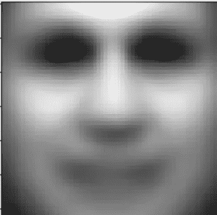
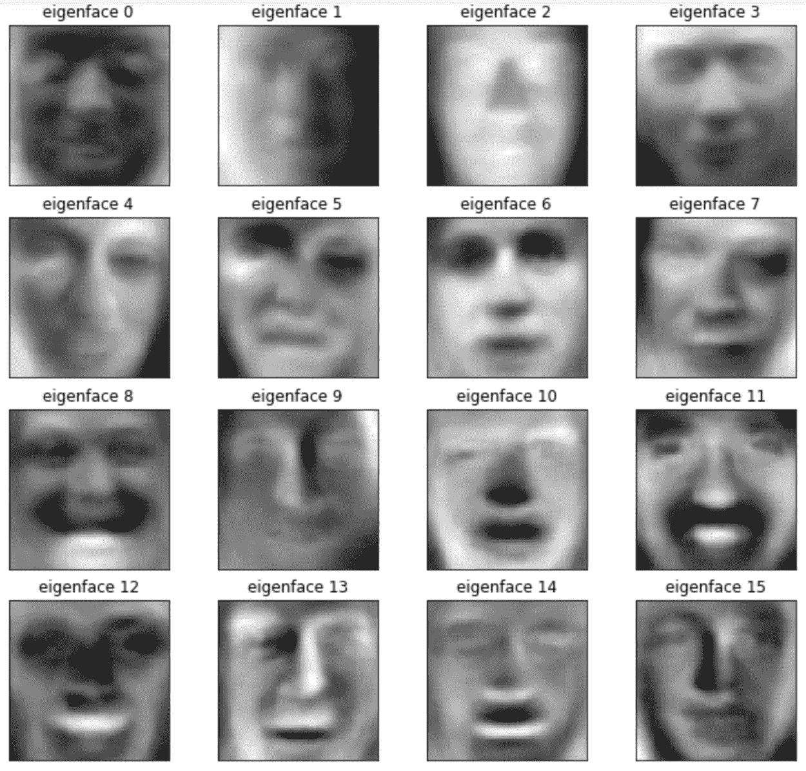
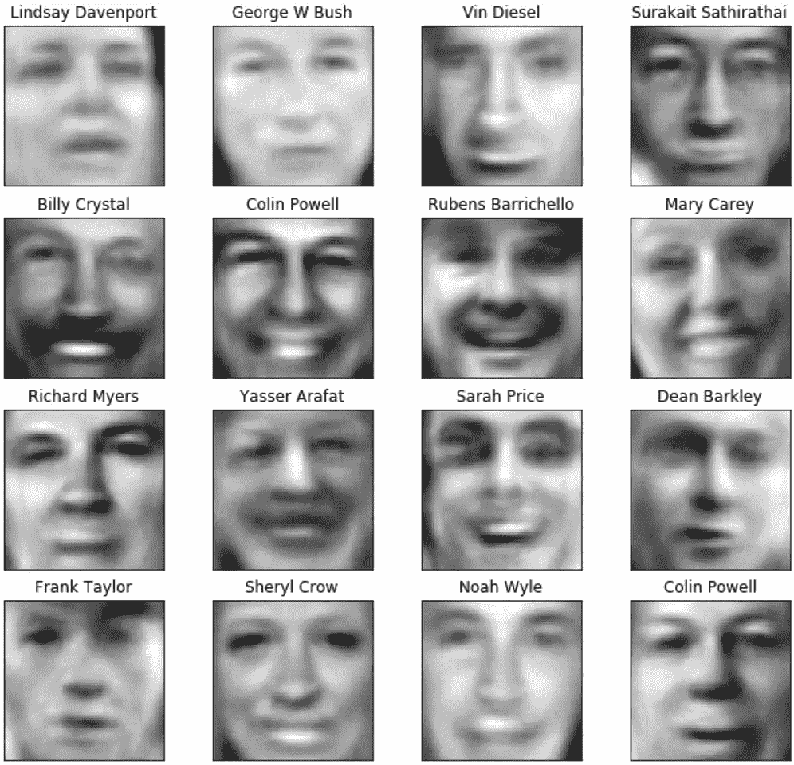
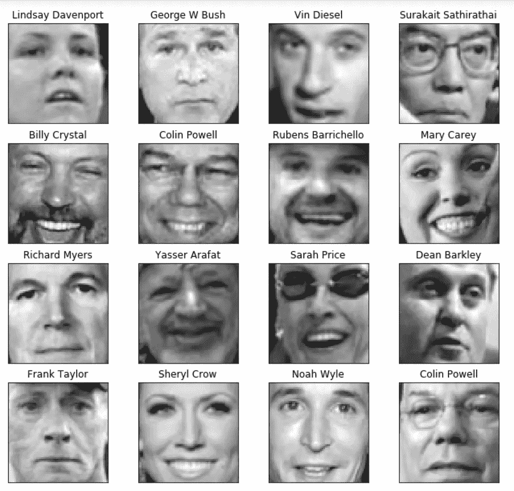
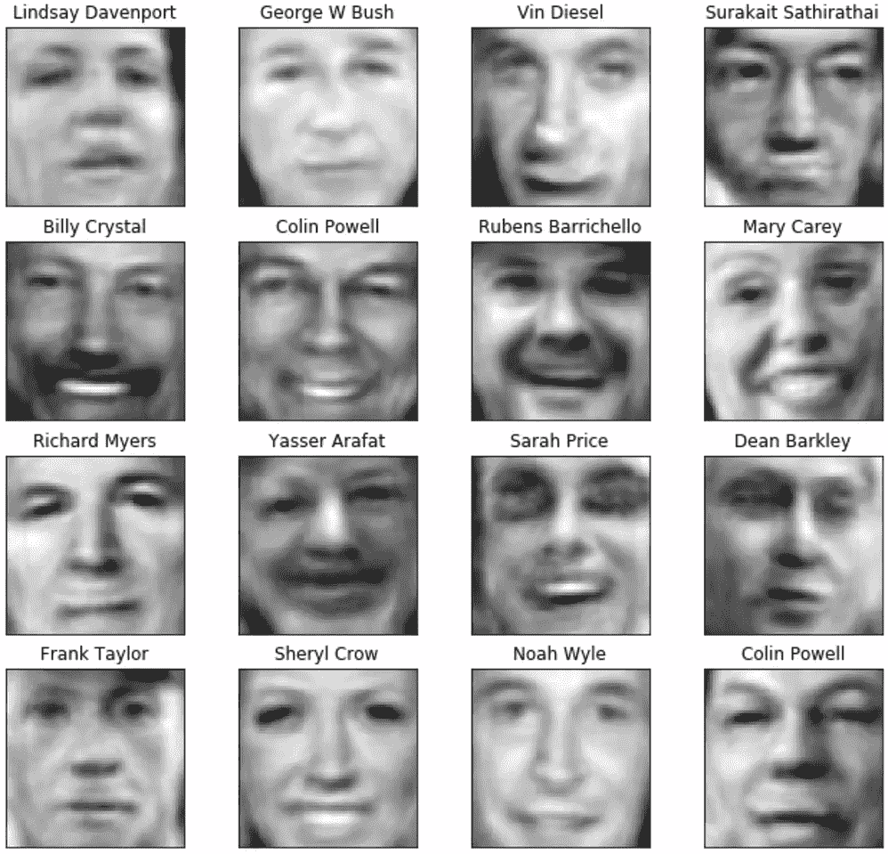
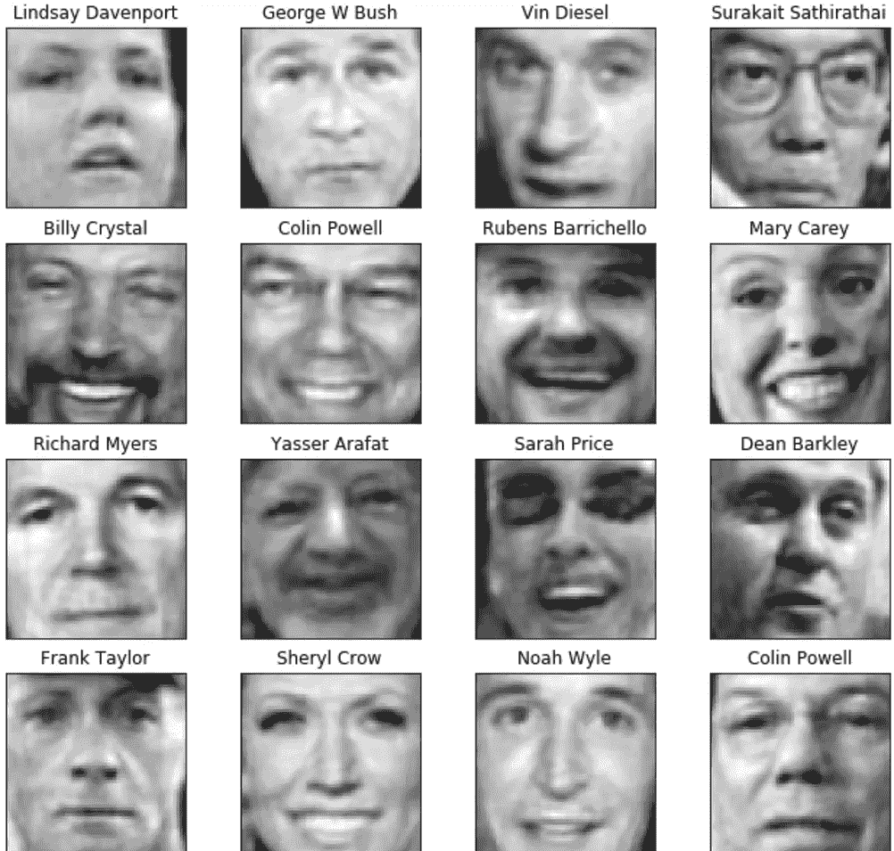
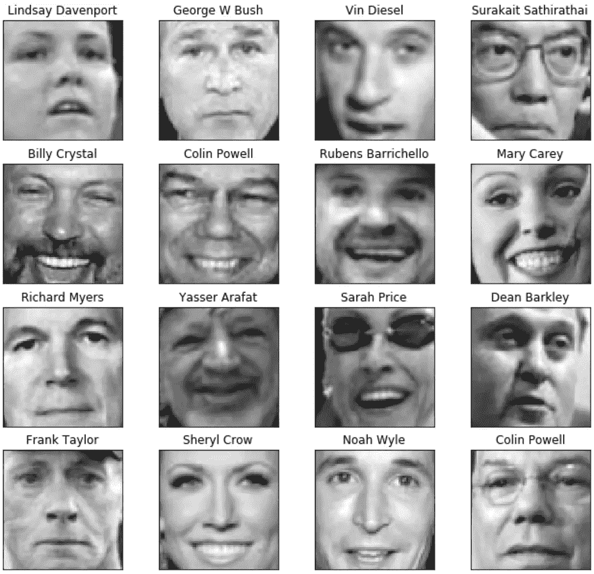

# Eigenfaces:从鬼魂中找回人类

> 原文：<https://towardsdatascience.com/eigenfaces-recovering-humans-from-ghosts-17606c328184?source=collection_archive---------3----------------------->

Figure #1: Casper the Friendly Ghost (source: [https://vignette.wikia.nocookie.net/christmasspecials/images/e/e8/Casper.jpg/revision/latest?cb=20121014033319](https://vignette.wikia.nocookie.net/christmasspecials/images/e/e8/Casper.jpg/revision/latest?cb=20121014033319))

用更少的拥有更多…简单！这种机器学习方法将帮助你只用一些线性代数基础知识就能在更小的空间里存储更多的信息。到那时，我们将从一些鬼影形状的混乱中恢复人脸。

你一定听说过，独立矢量以抽象的方式创造空间。现在，想象一下真实情况。所有的空间都是由向量构成的，这些空间里的东西也是如此。其中一些向量对某些事物的贡献比其他的更大。除了他们之外，其他人可能可以忽略不计，也许我们不需要知道这些，因为我们基本上不在乎，也不想带着他们的问题。这正是我在这篇文章中向你展示的特征脸。

Figure #2: not this space but also this space (source: [https://img.purch.com/w/660/aHR0cDovL3d3dy5saXZlc2NpZW5jZS5jb20vaW1hZ2VzL2kvMDAwLzA5Ny85NTcvb3JpZ2luYWwvc3BhY2UuanBn](https://img.purch.com/w/660/aHR0cDovL3d3dy5saXZlc2NpZW5jZS5jb20vaW1hZ2VzL2kvMDAwLzA5Ny85NTcvb3JpZ2luYWwvc3BhY2UuanBn))

我们的主题是 PCA。它是一种广泛应用于各种学科的算法。在人脸上使用它使它更容易被人类理解，所以它是最受欢迎的应用之一。本征脸是一种用于人脸识别和检测的方法，通过确定人脸图像集合中人脸的方差，并使用这些方差以机器学习的方式对人脸进行编码和解码，而不需要完整的信息，从而降低了计算和空间复杂度。尽管它在 1991 年由 Turk 和 Pentland 首次使用，并且与今天的技术相比有局限性，但它的基本原理仍然对新的实践非常有益。

Figure #3: LFW (source: [http://vis-www.cs.umass.edu/lfw/Six_Face_Panels_sm.jpg](http://vis-www.cs.umass.edu/lfw/Six_Face_Panels_sm.jpg))

在开始实现之前，我想向您简单介绍一下提到的基本概念。此外，你可以找到完整的脚本和数据集(一小部分[LFW _ 裁剪](http://conradsanderson.id.au/lfwcrop/))我用[在这里](https://github.com/n0acar/eigenfaces)。

## 特征向量和特征值

我们都知道特征向量和特征值是如何工作的。也许不完全是，但是我们听说过，好像，很多次了。这里给我这种不断遗忘的少数人一个解释。

> 让我们有一个正方形**一个**矩阵。几乎所有的矢量在乘以 **A** 时都会改变方向，就像我们预期的那样。然而，某些向量 **x** 与 **Ax** 方向完全相同。你猜怎么着？这些是我们的特征向量。特殊的……即使方向相同， **Ax** 和 **x** 仍然可能是大小不同的两个矢量。这里有一个熟悉的等式。 **Ax** =λ **x** 。使这两者相等的是λ，我们的幅度均衡器标量，特征值。这将告诉我们，我们的特征向量在相乘后是如何变化的

从上面，你可以知道为什么它们在实践中有用。为了更深入的理解和欣赏，请阅读麻省理工学院的特征值和特征向量章节。

## 主成分分析

PCA 的主要目标是降维。它在可视化、特征提取、数据压缩等方面有许多应用。其背后的思想是将原始数据线性投影到较低维度的子空间上，提供投影数据的主分量(特征向量)最大方差和/或投影的最小失真误差。最终，两者导致相同的结果，即最佳重建公式。作为旁注，这个子空间叫做主子空间。

关于方差最大化和失真误差最小化的计算，可以去 [ANU 关于 PCA 的讲义](https://machlearn.gitlab.io/isml2018/lectures/11a_Principal_Component_Analysis.pdf)。此外，youtube 上另一个名为[主成分分析-佐治亚理工学院-机器学习](https://www.youtube.com/watch?v=kw9R0nD69OU)的视频帮助我更好地理解了这些概念。

## 履行

好吧！每个人都准备实施。首先，我们将导入所需的库。我想你们都知道它们是干什么用的。我将把重点放在算法的解释部分。如果您对代码有任何其他问题，请在下面回复。

然后，我们需要一个函数来以一种好看的方式可视化我们数据集中的图像。在这里。

让我们把它放到我们的数据集上 [lfwcrop_grey.zip](http://conradsanderson.id.au/lfwcrop/lfwcrop_grey.zip) 。这里，由于计算的复杂性，我只取了前 1000 张脸，但这真的没关系。如果你想满座，那就去吧。我还将图像转换成 numpy 数组(形状为 1000，64，64)进行处理。

Figure #4: Left: The people that I thought it would be nice to viualise / Right: 16 Random Famous People that I don’t actually care from the dataset of 1000

右边的表是我将实际使用的表。我基本上可视化了 1000 个数据集中的前 16 个图像。左边的是一个数据集，当我不知道自己在做什么的时候，我从原来的数据集上收集的。然而，我注意到最好有更多的数据来更清楚地解释这些概念。

继续，下一步是定义 PCA。它的参数是图像的向量 X 和主成分的数量 n_pc。提醒一下，主成分定义了一个正交基，它可以提取原始数据中的最大方差。在我们的例子中，它的形状是(1000，4096)，因为我们需要将图像转换成 PCA 的向量。然后，我们找到平均值，并将其从数据中减去，使其以原点为中心。之后，我们需要对中心数据进行奇异值分解，以找到那些被称为特征脸的主分量。

S matrix has the singular values along the diagonal while U and V are singular vectors

(SVD 很难得到，而且比那复杂得多。为了得到一个有用的例子，去麻省理工学院开放式课程视频。)

Figure #5: mean face

顺便说一下，这是数据集中所有 1000 张人脸的平均脸。我们试图找到使个人与其他人不同的特征。我希望减去每个人的平均脸和最大化方差现在更有意义。看那个。小心！有点吓人，不是吗？

接下来的步骤是操纵我们的图像成为向量，调用 PCA 函数并操纵我们的特征脸再次成为图像。

Figure #6: Bunch of ghost shaped images. Look at them in the eyes.

名为 n_components 的第一个参数决定了我们想要创建多少个特征面。这些是我们的主要组成部分，我们将从中恢复我们的数据，即人脸。除非小于 16，否则改变它不会改变这个表。然而，我可以保证只有 50 张图片是我们可以信任的，而不是一开始的 1000 张。(本征脸.形状= (50，64，64))

对于重建，我们将使用这些特征脸。正如你可能会说的，每张脸都是这些特征脸的加权组合。为了找到权重，我们应该点乘我们的中心数据和特征脸。然后，我们应该对特征脸进行加权，得到中心脸，然后再把它加到平均脸上。毕竟，我们已经准备好将恢复的人脸与原始人脸进行对比。

Figure #7: n_components=50

哇！不好看！但是，别忘了我们是从 1000 x 64 x 64 到 50 x 64 x 64 的。这样，我们保留的数据比以前少了 20 倍。尽管如此，我不会愚弄任何人。这些还不够好。很明显，我们仍然有一些重要的主要成分。让我们看看我们能做什么。我将尝试使用前 100 个组件。

Figure #8: n_components=100

越来越好，但仍然不够好。250…

Figure #9: n_components=250

这个对我来说完全令人满意。仅用我们所拥有的四分之一，我们就恢复了完全可辨别的面孔。这完全没有意义，但你可以使用 1000 个特征脸组件，并获得准确的原始结果。为了向你们展示这一点，我将运行一些计算和空间复杂度。

还在跑…坚持住…来了。

结果出来了。相当甜蜜！！！

Figure #10: n_components=1000

这篇文章实际上向你展示了用很少的数据就能获得足够好的信息，这是我们对机器学习最重要的期望之一。我希望你能看到这个应用之外的东西，并开始思考新的创新。我陈述了我在上面使用的参考文献。

再次希望你喜欢我的帖子。不要犹豫提出你的问题或给出任何类型的反馈。

干杯，

Nev

给我更多的内容和支持关注！

在 [Twitter](https://twitter.com/nevacar_) 和 [LinkedIn](https://www.linkedin.com/in/nevzat-acar/) 上与我联系……