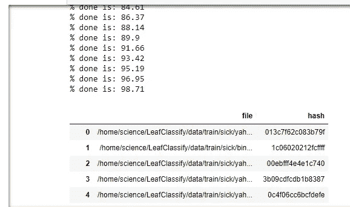
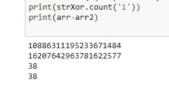
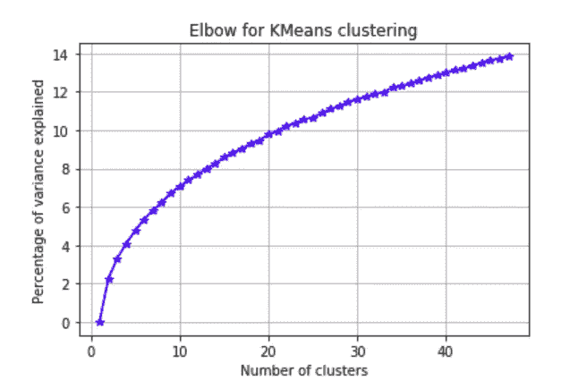
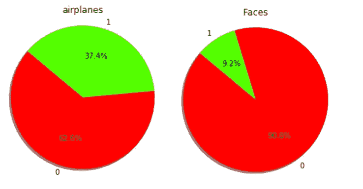
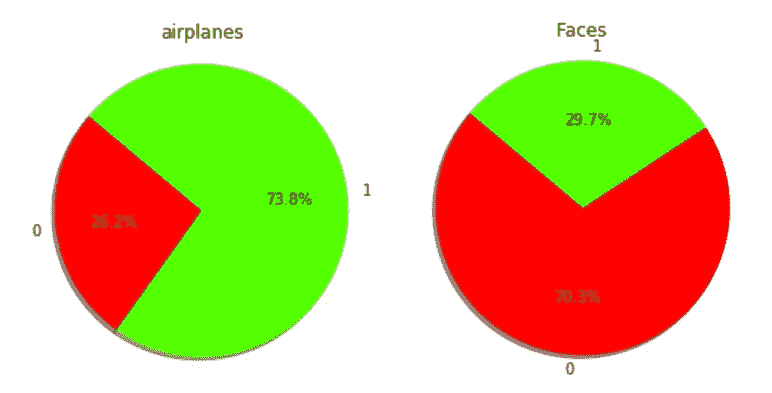

# 人工智能中的肘聚类

> 原文：<https://towardsdatascience.com/elbow-clustering-for-artificial-intelligence-be9c641d9cf8?source=collection_archive---------1----------------------->

聚类是将一堆未分类的东西(你的数据集)根据相似性分成几堆(即聚类)的过程。这是一个无人监督的过程(不需要训练的例子)。也许最常见的方法是使用 k-means(T1)，我将介绍一种不同的方法，使用高斯混合模型(GMM)和一些其他的东西(T3)。

我们今天的例子是在一个数据集中分离两种类型的图片，在你的数据集中，你实际上没有一个标签或者一个分类器。正如我们将要看到的，只要看看结果，你就能明白它的工作原理。首先，我想说明这种方法并不总是有效，因此需要一些微调。

在你的人工智能项目的每个主要步骤中，你需要记住的第一件事是 ***用你的眼睛*** 看你的数据。我再怎么强调都不为过，如果你看不到 k 均值[在做什么，它可能会愚蠢地出错](https://codeahoy.com/2017/02/19/cluster-analysis-using-k-means-explained/)。

从我在关于[图像数据集集合](/image-datasets-for-artificial-intelligence-bbb12615edd7)的文章中停止的地方继续，让我们使用 k-means 和 GMM 通过[感知哈希](https://en.wikipedia.org/wiki/Perceptual_hashing)来进行图像聚类。如果您只是想找到哪些图片与其他图片相似，在 imagehash 代码中有一个[示例可以做到这一点](https://github.com/JohannesBuchner/imagehash/blob/master/find_similar_images.py)。我们在这里尝试做的更多一些:我们想要将数据分成类别(即使我们不知道类别是什么)。[在 GitHub 上有一个这种类型的库的例子](https://github.com/zubairr/image-clustering-phash)，它只被许可用于学术用途。

不管我们选择什么样的库，我们都会立即遇到一个问题:我们最终想要多少个集群？这不是[聚类库](http://scikit-learn.org/stable/modules/generated/sklearn.cluster.KMeans.html)给你的。你需要决定，决定集群的数量应该基于一些逻辑。我们应该使用……[**肘法！**](https://en.wikipedia.org/wiki/Elbow_method_(clustering))

肘法对于一个简单的想法来说是一个奇怪的名字。不断添加集群，直到你看到收益递减，然后停止。对于 k-means，这意味着从 2 个均值开始，然后是 3 个均值，以此类推，直到 k。GMM 也是同样的想法。当我们在解释方差与聚类数的关系图中看到一个拐点时，我们后退并选择看到拐点的聚类数。在下图中，您可以看到前两个点是手臂，4 处的点是肘部，前臂是 5 到 8 处的点。

Graph of explained variance vs cluster count, where the red circle shows the elbow. ([from wikipedia](https://en.wikipedia.org/wiki/Elbow_method_(clustering)))

我知道:我们计算机人现在应该停止给东西命名。[图灵机](https://en.wikipedia.org/wiki/Turing_machine)，[循环赛](https://en.wikipedia.org/wiki/Round-robin_scheduling)， [k-maps](https://en.wikipedia.org/wiki/Karnaugh_map) ，就是不停。

参见“ [Python Machine Learning](https://books.google.ca/books?id=_plGDwAAQBAJ&printsec=frontcover#v=onepage&q&f=false) ”第 148 页上的图，了解数据集的一些组件如何比其他组件包含更多差异(PCA)。在早期停止期间，当决定何时停止训练时，肘方法同样有效，但是在这种情况下，数据通常更嘈杂。基本上，当看起来不值得努力时，我们就停下来。

为什么这个肘法的东西不太为人所知？嗯，我想这有点主观，所以那些想知道确切数字的人会感到奇怪。此外，当我们对事物进行聚类时，我们往往会想到一些聚类，这通常是出于愚蠢的原因，但这是事实。例如，我更喜欢有一些我小小的大脑理解的集群(例如，一个小数字)，而不是数学告诉我真正需要的数字。此外，我也遇到过集群数量受到硬件限制等外部因素限制的情况。可能有 299，945 种交易模式类型，但如果我在 GPU 上的时间有限空间有限的神经网络只能在有用的时间内分析 2，048 种模式类型，那么我想我们会有 2，048 个聚类。在[研究文献中有许多使用肘法](https://pdfs.semanticscholar.org/5771/aa21b2e151f3d93ba0a5f12d023a0bfcf28b.pdf)的例子。在我们的例子中，我们会看到肘法并不是唯一的游戏。

让我们继续做我们来这里要做的事情:使用感知哈希用肘方法聚类图片！让我们对来自[标准图像数据集](http://www.vision.caltech.edu/Image_Datasets/Caltech101/)的图像进行排序，看看我们最终得到了哪些子类型。这里的目标是对图像 ***进行排序，而不使用*** 使用基础事实标签来进行排序(即聚类)。我们要用 k-means 做的事情是无人监督的。它只是看着图片，把图片整理成一堆堆。使用带有标签的数据集的原因只是为了帮助在排序过程对数据集所做的事情之后进行可视化。实际上，你会用眼睛看每一组中的图片，并对它的作用有一个直观的感觉。

在我们今天的例子中，我们将使用 Caltech101 数据集的“Faces”和“airplanes”子文件夹。我们把这些图片像一副扑克牌一样混在一起，然后把它们堆成一大堆。现在想象这是一些图像抓取作业的输出。

对于上一篇文章中的叶数据集，我们最终得到的是 4102 行× 2 列，它确切地告诉我们每个图像的散列是什么。大约 20%的原始 5000+图像不会生成散列，通常是因为文件在抓取过程中不知何故被损坏。让我们更好地理解刚刚发生了什么…

Screenshot of the dataframe printing out after the hashing is completed.

我们需要解开这个鬼鬼祟祟的东西，我们称之为哈希。我们可以通过减去两个不同图像的哈希来计算图像之间的差异，但此时会出现一些奇怪的情况。尽管我们能够对这个散列值使用减法运算符，但它实际上并不做减法。通过简单地增加散列而不是减少来证明这一点，它将不会如此优雅地编译失败。那么，我们在输出端得到的这个哈希是什么呢？嗯，它是每张图片的布尔值字段。很明显，hash 字符串中的字符是十六进制的，所以打印一个元素可以揭示隐藏在这个漂亮字符串下面的 hash 的真实性质:它是一串二进制数。

The binary result of the hash is hiding inside the hex string….

那么，当我们“比较”散列时，减法运算到底在做什么呢？它执行 XOR 运算，并计算不相同的位数。换句话说，图像之间的“差异”被量化为两个图像的散列中的差异数量的计数。我们可以使用这个方便的小脚本来证明这一点…

运行该脚本时，我们会看到以下输出:

Counting the bits that didn’t match gives the same result as “subtracting” hashes.

所以，这是相当卑鄙的，但现在我们知道，散列之间的距离不是一个[可排序的](https://en.wiktionary.org/wiki/orderable)属性。它根据我们使用哪两张图像作为输入而变化。我们真正想说的是，我们计算海明距离。在 scipy land，这个指标在[距离指标列表](https://docs.scipy.org/doc/scipy/reference/generated/scipy.spatial.distance.cdist.html)中排名第 8。

现在，进行聚类！我们的散列字符串中有 4 位十六进制字符，每个散列中有 16 个字符。这给了我们 64 个维度来比较图像。我们需要更新我们的 pandas 数据帧，以包括 64 个列(每个哈希特性一个)。

我们最终得到了我们想要的 64 个新列。

使用来自[这篇文章](https://datascience.stackexchange.com/questions/6508/k-means-incoherent-behaviour-choosing-k-with-elbow-method-bic-variance-explain)的代码，我们可以获得完整图像数据集的一些漂亮的图表，包括解释方差的百分比。

This figure is for hashed generated by pHash. It shows the increase in explained variance as we add clusters.

我们在上图中看到，在大约 8 或 9 个集群时，我们开始失去动力。此外，由于模型无法解释大多数方差，因此它不是一个非常有用的预测器。

This figure is for hashed generated by the average hash. It shows the increase in explained variance as we add clusters.

类似于感知哈希图，我们在上图中看到，在大约 8 或 9 个集群时，我们开始失去动力。与上图中的感知哈希相比，这种方法可以解释更多的差异(顶行是 40%，而不是 14%)。在这个图中，我们还看到了一个更好的弯头。它仍然不是一个超级有用的预测工具，但比以前好了。

现在我们有了一些答案，这意味着什么呢？每一堆都聚集了哪些图像？嗯，只有在一些受限的情况下，集群才能很好地工作。让我们看看在文章开始时混合在一起的两种图像(飞机和面孔)，看看聚类是否能够将这两种图像类型分开。让我们比较一下 GMM 解混和 k-means，看看对于这个问题哪个是更好的无监督“解混器”。

首先，这是 K-means 的代码:

结果看起来像这样:

Cluster 0 is red, and cluster 1 is green. In the chart above, we can see that counting up all of the images containing faces, 90.8% ended up in cluster 0\. Similarly 62.6% of the images with faces in them ended up in cluster 0\. This is not a nice outcome.

有 800 张飞机照片和 435 张人脸照片。

正如我们在上面的饼图中所看到的，在两个集群中，飞机和人脸没有很好的分离。我们可以选择两个集群，因为我们知道有两个东西可以分成两堆。这两个类的内容最终大部分集中在 0 类中。在 GMM，我们看到了一个不同的故事。

让我们先看看 GMM 的代码，然后看看结果。

现在是几个运行示例的结果:

所以这些结果要好得多。GMM 把这些文件分成一个文件夹，里面大部分是人脸，另一个文件夹里大部分是飞机。

我们可以通过运行几次 GMM 来挑选结果，以查看何时分割看起来不错(通过对结果图像数据集的视觉检查)。我们还可以标记数据的一些子集，使用上面的代码，我们只需查看饼状图就可以了解拆分是如何进行的。这种方法比成熟的图像分类器需要更少的数据。还有 50 种其他的方法可以做到这一点，但是把这个算作第 51 种方法。

**克隆它！！**

我已经为你提供了代码，希望这能帮助你更好地处理你收集的图片。在很多课程中，这变得非常混乱，但是我有一个建议。经常发生的情况是，在很多类中，垃圾图像和重复图像聚集在一起，帮助你删除垃圾图像。然后，您可以重新集群，看看会发生什么。K-means 有时会起作用，在这种情况下，GMM 稍微好一点。世事难料。基本上，尝试很多东西，你会马上知道它什么时候起作用。

因此，总之，感知哈希可以用来将图像压缩到一组二进制维度，k-means、GMM 或其他无监督的方法可以根据这些维度将图像分类。

如果你喜欢这篇关于用 k-means 和 elbow 方法对图像进行聚类的文章，看看我过去读过的一些文章，比如“[如何给一个人工智能项目定价](https://medium.com/towards-data-science/how-to-price-an-ai-project-f7270cb630a4)”和“[如何雇佣一个人工智能顾问](https://medium.com/towards-data-science/why-hire-an-ai-consultant-50e155e17b39)”除了与商业相关的文章，我还准备了一些关于寻求采用深度机器学习的公司所面临的其他问题的文章，如“[没有云和 API 的机器学习](https://medium.com/@lemaysolutions/locked-in-a-box-machine-learning-without-cloud-or-apis-76cc54e391c8)

编码快乐！

-丹尼尔
[丹尼尔@lemay.ai](mailto:daniel@lemay.ai) ←打个招呼。
[LEMAY . AI](https://lemay.ai)
1(855)LEMAY-AI

您可能喜欢的其他文章:

*   [人工智能和不良数据](/artificial-intelligence-and-bad-data-fbf2564c541a)
*   [人工智能:超参数](/artificial-intelligence-hyperparameters-48fa29daa516)
*   [人工智能:让你的用户给你的数据贴上标签](https://medium.com/towards-data-science/artificial-intelligence-get-your-users-to-label-your-data-b5fa7c0c9e00)