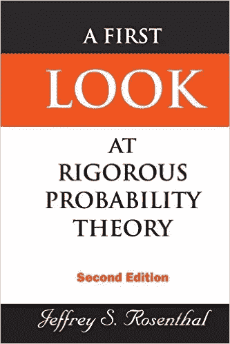
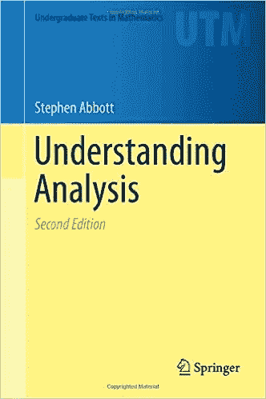
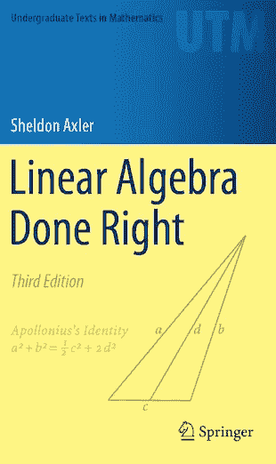
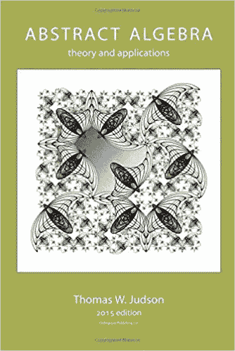

# 开始探索学习更多的数学知识

> 原文：<https://towardsdatascience.com/embarking-on-a-quest-to-learn-more-maths-3c592d19b36?source=collection_archive---------2----------------------->

我是一名工作中的“数据科学家”，我把它放在引号中，因为这个术语的意思几乎是人们希望它表达的任何意思。我所知道的是，我处理大量数据，我建立模型，有时制作漂亮的图表(有时很难看)。哦，我经常使用 SQL。我还患有冒名顶替综合征，这可能是因为我对学习(和了解)数学上难以理解的新事物有着巨大的兴趣，我总是把它内化为一个存在主义问题:

> 为什么除了我每个人都在做如此前沿的 ML 研究？

不要误解我，我有很好的应用数学和统计学知识。很明显，因为如果没有创建回归模型和执行基本统计计算的能力，就很难成为“数据科学家”。但当我阅读一篇关于新的机器学习算法的论文时，我通常会直接跳到结果，并检查是否有“完成它的包”，因为我通常无法掌握方法部分给出的足够多的实质性细节，更不用说自己想出类似的东西了。我大概是低估了我的理解，但最终结果是一样的。我经常觉得自己错过了在谋生的道路上做得更好的机会。

我的问题的根源，正如我所诊断的，是我没有足够好的“纯粹”的数学背景。我看过《概率论》和《统计学》的书，但没有看过《概率论》和《统计学》，我现在理解这两本书差别很大。人们可以应用前者的方法，而不理解后者。但是要深入挖掘并能够设计出新的方法，在某种程度上需要理论知识。现在，我没有时间去获得第二个数学博士学位，但我的希望是，我可以通过勤奋的自学来填补我的数学教育中的一些漏洞。

在确定了核心问题后，我决定需要为自己建立一个课程来保持这个旅程的专注。为了做到这一点，我基本上是从我想去的地方往回走。翻阅“概率论”和“统计学理论”书籍时，我意识到的第一件事是，在某个时候，我会想要解决[测量理论](https://en.wikipedia.org/wiki/Measure_(mathematics))，这似乎是这些学科的核心组成部分:

> 在[数学分析](https://en.wikipedia.org/wiki/Mathematical_analysis)中，[集合](https://en.wikipedia.org/wiki/Set_(mathematics))上的**度量**是一种系统化的方法，用来给该集合的每个合适的[子集](https://en.wikipedia.org/wiki/Subset)分配一个数字，直观地解释为它的大小。从这个意义上说，度量是长度、面积和体积概念的概括。一个特别重要的例子是[欧几里得空间](https://en.wikipedia.org/wiki/Euclidean_space)上的[勒贝格测度](https://en.wikipedia.org/wiki/Lebesgue_measure)，它将[欧几里得几何](https://en.wikipedia.org/wiki/Euclidean_geometry)的常规[长度](https://en.wikipedia.org/wiki/Length)、[面积](https://en.wikipedia.org/wiki/Area)和[体积](https://en.wikipedia.org/wiki/Volume)分配给 *n* - [维](https://en.wikipedia.org/wiki/Dimension_(mathematics_and_physics))欧几里得空间 **R** *n* 的合适子集。例如，[实数](https://en.wikipedia.org/wiki/Real_line)中[区间](https://en.wikipedia.org/wiki/Interval_(mathematics))【0，1】的勒贝格测度就是它在这个词的日常意义上的长度——具体来说，就是 1。

所以，是的，很明显，在不知道什么是“数学分析”的情况下，我无法处理测量理论。相信我，我已经试着阅读测度论，但它就是不理解。所以我需要学习一些[实分析](https://en.wikipedia.org/wiki/Real_analysis)，根据我的(元)研究，这似乎是大多数本科数学学位的一个非常基本的核心要求:

> **实分析**(传统上，实变量函数的**理论**)是[数学分析](https://en.wikipedia.org/wiki/Mathematical_analysis)的一个分支，处理实变量的[实数](https://en.wikipedia.org/wiki/Real_number)和实值函数。具体来说，是关于实[函数](https://en.wikipedia.org/wiki/Function_(mathematics))和[序列](https://en.wikipedia.org/wiki/Sequence)的[解析](https://en.wikipedia.org/wiki/Mathematical_analysis)性质，包括实数的[收敛](https://en.wikipedia.org/wiki/Limit_of_a_sequence)和[极限](https://en.wikipedia.org/wiki/Limit_of_a_function)[序列](https://en.wikipedia.org/wiki/Sequence)、实数的[微积分](https://en.wikipedia.org/wiki/Calculus)、以及实值函数的[连续性](https://en.wikipedia.org/wiki/Continuous_function)、[光滑性](https://en.wikipedia.org/wiki/Smooth_function)等相关性质。

显然，真正的分析就像我在类固醇上学的微积分。太棒了。对于数据科学家来说，还有其他一些潜在的有趣和有用的分析领域，尤其是向量空间和函数分析，这两个领域本质上是线性代数的理论基础。所以我决心从理论上从头开始学习线性代数(这在 ML 算法中是普遍存在的)。

作为一名“数据科学家”，我也写很多程序。再一次，因为我对事物非常好奇，我是一个喜欢学习编程语言和范例的普通人，只是为了好玩。好的一面是，我从这项练习中获得的知识往往会在我的日常工作中产生影响，并帮助我成为一名更好的程序员(至少，我喜欢告诉自己确实如此)。很长一段时间以来，我一直感兴趣的编程领域之一是[函数式编程](https://en.wikipedia.org/wiki/Functional_programming)，并且在过去的一年左右的时间里尝试过(不是第一次！)拿起 [Haskell](https://www.haskell.org/) ，一种近乎僧侣般的纯函数式编程语言。我提到 Haskell 的原因是，如果没有术语[范畴理论](https://en.wikipedia.org/wiki/Category_theory)的出现，你很难尝试学习这门语言:

> **范畴理论**[【1】](https://en.wikipedia.org/wiki/Category_theory#cite_note-1)将[数学结构](https://en.wikipedia.org/wiki/Mathematical_structure)及其概念形式化为*对象*和*箭头*(也称为[态射](https://en.wikipedia.org/wiki/Morphism))的集合。一个[类别](https://en.wikipedia.org/wiki/Category_(mathematics))有两个基本属性:能够[组合](https://en.wikipedia.org/wiki/Function_composition)箭头[关联](https://en.wikipedia.org/wiki/Associativity)和每个对象存在一个[标识](https://en.wikipedia.org/wiki/Identity_function)箭头。范畴理论的语言已经被用于形式化其他高级抽象的概念，例如集合、[环](https://en.wikipedia.org/wiki/Ring_theory)和[组](https://en.wikipedia.org/wiki/Group_theory)。

如果你认为这听起来很数学，那是因为它就是数学！我试着读了一些关于范畴理论的书，看了一些 YouTube 的讲座，但没有走得很远。这真的很抽象。但是最近我有了一个顿悟，那就是，正如我可能应该在进入度量理论之前处理实分析一样，为什么不在进入范畴理论之前学习抽象代数呢？

> 在[代数](https://en.wikipedia.org/wiki/Algebra)中，它是[数学](https://en.wikipedia.org/wiki/Mathematics)、**抽象代数**(偶尔也叫**近世代数**)是对[代数结构](https://en.wikipedia.org/wiki/Algebraic_structure)的研究。代数结构包括[群](https://en.wikipedia.org/wiki/Group_(mathematics))，[环](https://en.wikipedia.org/wiki/Ring_(mathematics))，[域](https://en.wikipedia.org/wiki/Field_(mathematics))，[模](https://en.wikipedia.org/wiki/Module_(mathematics))，[向量空间](https://en.wikipedia.org/wiki/Vector_space)，[格](https://en.wikipedia.org/wiki/Lattice_(order))，以及[代数](https://en.wikipedia.org/wiki/Algebra_over_a_field)。抽象代数这个术语是在 20 世纪早期创造的，目的是将这一研究领域与代数的其他部分区分开来。
> 
> 代数结构及其相关的[同态](https://en.wikipedia.org/wiki/Homomorphism)，形成[数学范畴](https://en.wikipedia.org/wiki/Category_(mathematics))。[范畴理论](https://en.wikipedia.org/wiki/Category_theory)是一种形式主义，允许以统一的方式来表达各种结构的相似属性和构造。

嘿，看，“群”，“环”，呀，呀。看来我的方向是对的。

所以我挑选了几本书开始我的旅程(大多基于亚马逊、Quora 和 StackExchange 上的好评)，我的计划是不时地发布我的进展更新(甚至可能是我处理的一些具有挑战性的证明！)，让我坚持下去。欢迎在评论中发表书籍建议。感谢阅读！