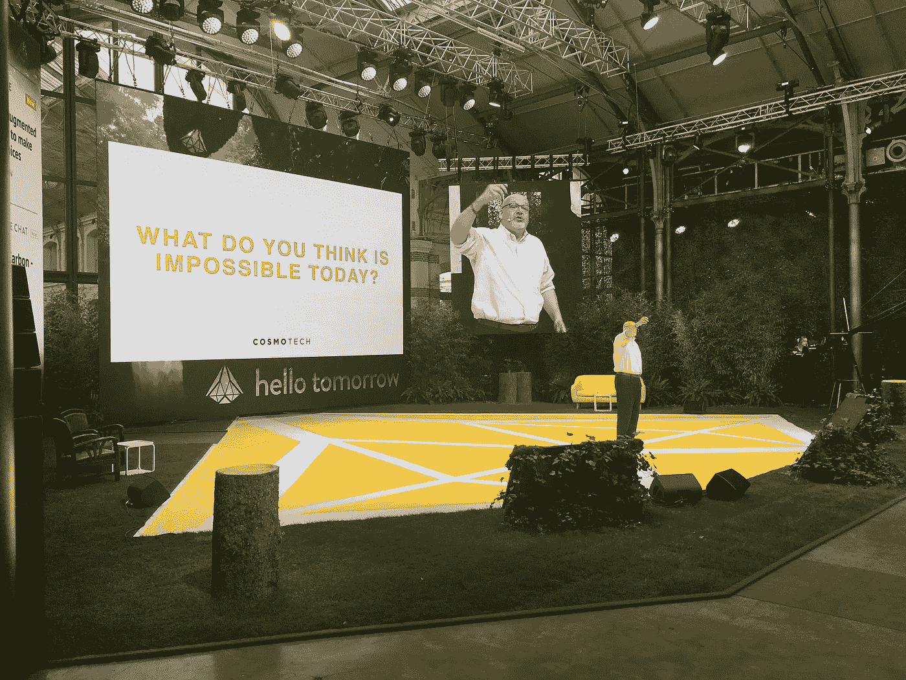

# 用 Cosmo Tech 拥抱复杂性

> 原文：<https://towardsdatascience.com/embracing-complexity-with-cosmo-tech-3a1f8d5bfeb4?source=collection_archive---------19----------------------->

我们被复杂的系统所包围，为了理解、管理和预测它们，我们必须拥抱复杂性并做出更准确的决策。许多人使用人工智能和大数据来简化复杂性。然而，Michel Morvan 在巴黎 [Hello Tomorrow](https://hello-tomorrow.org/summit) 主舞台上的主题演讲中提出，为什么我们需要拥抱复杂性，以及我们如何做到这一点。

我采访了 Michel Morvan， [Cosmo Tech](https://cosmotech.com/) 的联合创始人兼执行主席，这是一家软件供应商，为复杂系统建模，以便进行预测模拟。他解释了如何使用增强智能——用人工智能增强人类的智能——使我们能够处理令人难以置信的复杂系统，这可以解决许多人工智能和大数据无法单独解决的问题。

米歇尔声称，虽然建模和模拟领域已经存在了 40 年，但 Cosmo Tech 是唯一一家能够模拟极端复杂性(如生命系统和不同的时间和空间尺度)的公司。他们的方法可以应用于几乎任何系统，例如流行病和所需的关键基础设施、智能能源规划、恐怖活动和多式联运系统。通常决策是基于系统某些方面的不同证据。元分析仅限于一个单一的现象，即使决策者正在考虑实施这一具体方面，它将如何与系统的其他部分相关的知识仍然是一种猜测。Cosmo Tech 的方法提供了所有相关组件及其交互方式的全球图景，这使得高管、政治家和决策者能够做出更准确的决策。

人工智能允许的可能性广为人知，但米歇尔鼓励我们考虑限制，以及如何克服它们。对于大数据，重点是可以在数据中发现什么，而不是理论测试和构建。这种[理论上的](http://theconversation.com/big-data-has-not-revolutionised-medicine-we-need-big-theory-alongside-it-55356)方法，结合相关性分析(甚至包括复杂的算法，如神经网络)，易于检测出[虚假关系](https://www.researchgate.net/publication/297656557_The_Deluge_of_Spurious_Correlations_in_Big_Data)。因果关系不能从相关性分析中推断出来(很少有例外)。预测只能基于以前发生的事情，这意味着我们不能预测不寻常或罕见的事件。这些问题通过建模专家知识/理论和使用模拟的结合而减弱(但可能没有完全解决),因为这允许你改变参数并看到最有可能的结果。

在使用算法优化专家知识之前，需要对其进行建模和组合。系统可以如此之大和复杂，没有人能有一个完整的视图，即使是专家也只知道它的一部分。Cosmo Tech 首先创建单独的子模型，然后将这些子模型组合成整个复杂系统的完整模型。Cosmo Tech 的系统建模专家与客户公司的专家合作，并借鉴学术成果。模型化的知识利用了许多研究领域、理论、它们的推理和经验证据。例如，Cosmo Tech 的早期客户之一是法国电网公司 [RTE](http://www.rte-france.com/en/accueil) ，它需要对电网本身、资产管理(如变压器、铁路线)、财务资源、人力资源以及财务投资和风险进行建模。

Cosmo Tech 流程的下一步是添加这些子模型之间的链接和交互。例如，他们添加了网格覆盖对客户满意度和收入的影响，以及这些子模型和相互关系如何随着时间的推移而发挥作用。这创造了一个巨大、复杂、多领域的模型。他们运行模拟操作所需的参数，以深入了解潜在的结果。Cosmo Tech 的软件 Studio 允许客户轻松地更改参数并直观地看到影响，如风险图、成本和风险成本。

模拟可用于创建“假设”情景，以进行预测。RTE 每年有 8 亿英镑的投资问题，所以 Cosmo Tech 用 Studio 来理解:如果 RTE 减少他们的投资，会发生什么？Studio 允许他们看到，例如，他们将无法更换导体，他们将不得不限制电网的覆盖范围，他们的碳排放量将增加，或者 10 年后将会停电。尽管预测只和模型一样准确，只和数据一样有代表性，但是这些可能的未来允许做出更明智的决策。

没有计算机的帮助，一个专家无法想象如此复杂和动态的模型，但是计算机需要理论和推理的输入。因此，人+机器是最佳组合，这就是为什么我们需要增强智能。此外，Cosmo Tech 的过程需要打破学术研究的筒仓。该公司是里昂商学院的一个学术分支，在里昂商学院，他们有一个由 200 名复杂系统专家组成的团队，他们来自生物学、物理学、数学、社会学和地理学。

客户工作室是 Cosmo Tech 的主打产品。他们与客户合作，在一个新的领域创造一个新的软件，然后与客户一起，把它卖给同一领域的其他公司。米歇尔说，他们正在努力向公司、大学和非政府组织提供软件许可证，这将允许他们自己模拟自己的复杂系统，创建自己的模拟和预测。尽管这还只是一个想法，但它将帮助米歇尔实现他最初的目标——促进基于证据的政策。预测和防止下一次经济危机是米歇尔的梦想，但如果决策是基于复杂系统如何运行的证据，他会很高兴。

米歇尔强调，我们需要改变我们使用数据和算法来洞察我们周围世界的方式。我们需要拥抱复杂性，而不是使用算法来简化。Michel 认为，对专家知识进行建模和算法优化是我们了解系统剪切复杂性的最佳方法，这是改进我们决策的核心要素。