# 当没有数据时，历史学家如何处理古代帝国的数据

> 原文：<https://towardsdatascience.com/empires-and-eda-4cbefc91a96a?source=collection_archive---------8----------------------->

# Seshat 轴向年龄数据集的探索性数据分析


[Photo by Simon Matzinger from Pexels](https://www.pexels.com/photo/brown-camel-931881/)

```
"90% of the data ever created was created in the last two years."
```

这个[Petter Bae brandtzg](https://www.sciencedaily.com/releases/2013/05/130522085217.htm)的引用，虽然令人恐惧，却暴露了一个更可怕的观察:*我们在过去 280 万年的人类历史中记录的数据比我们在 2016-2018 年记录的数据少 10 倍。*鉴于自计算机时代开始以来数据的估计指数增长率，从历史开始到柏林墙倒塌，我们拥有的 10^15 *数据比我们过去 30 年所拥有的还要少。如果我们看看 17 世纪中叶现代统计学发明之前，我们能分析的数据量是微乎其微的。如果我们看看 1086 年的《末日审判书》,它会变得非常令人沮丧。*


[Photo by karatara from Pexels](https://www.pexels.com/photo/male-statue-decor-931317/)

幸运的是，没有任何东西限制现代历史学家和学者创造关于过去的新数据。从数字化的照片和文本、关于考古挖掘的文档，甚至是关于历史时期的学术共识的众包聚合，历史学家(以及像我这样的爱好者)可以创建和探索数据集，使用尖端的分析工具得出关于过去的新理解，并帮助回答以下问题:

*   与其他社会相比，地中海和亚洲的不同社会随着时间的推移发展了什么样的社会政治规范？
*   在相同的时间和地点，最有可能和最不可能遵守的规范是什么？
*   有哪些相关规范的独特轨迹是某些社会群体而不是其他群体进化的轨迹？

# 数据

对于这个分析，我使用的是相对较小的[轴向年龄](http://seshatdatabank.info/datasets/)数据集，由 [Seshat](http://seshatdatabank.info/seshat-about-us/seshat-who-we-are/) 提供，“一个由进化科学家、历史学家、人类学家、考古学家、经济学家和其他社会科学家组成的大型国际多学科团队。”公开提供的数据集跟踪各种社会政治规范及其在非洲-欧亚大陆关键地区的发展。在 10 个 NGAs(自然地理区域)内，每个日期(在公元前 5300 年和公元 1800 年之间以 100 年为增量变化的时间跨度)的每个社会政治规范的具体得分由一组专家商定，并编入数据集。

但首先，作为使用他们数据集的回报，他们要求我包含的信息块:

```
 *This research employed data from the Seshat Databank (seshatdatabank.info) under Creative Commons Attribution Non-Commercial (CC By-NC SA) licensing.*[Turchin P. et al. 2015\. “Seshat: The Global History Databank.” Cliodynamics 6(1): 77–107](https://doi.org/10.21237/C7clio6127917)[Mullins, D., Hoyer, D. et al. 2018\. “A Systematic Assessment of ‘Axial Age’ Proposals Using Global Comparative Historical Evidence.” American Sociological Review 83(3): 596–626](https://doi.org/10.1177/0003122418772567)
```

不幸的是，数据集中每一个 NGA 所涵盖的时间段各不相同，早至公元前 5300 年，晚至公元 200 年。它们也不会同时全部结束:

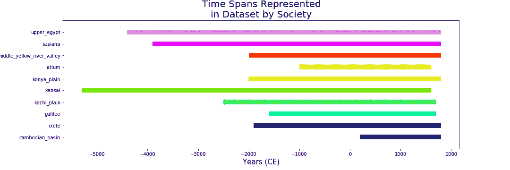

此外，随着时间的推移，社会似乎会积累文化特征，而不是让属性均匀地出现和消失，这也可能使我们的分析变得复杂，因为数量上的原因，我不会在这里讨论。

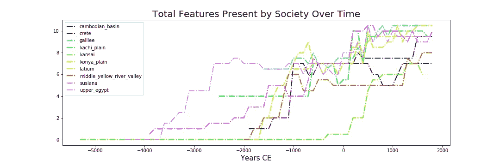

尽管如此，数据中的变化足以回答我们上面的三个问题。所以事不宜迟…


Source: [pixabay.com](https://pixabay.com/en/tori-torii-shrine-b-w-1976609/)

# 问题 1:与其他社会相比，地中海和亚洲的不同社会随着时间的推移发展了什么样的社会政治规范？

除了柬埔寨和卡奇平原，道德惩罚和相信无所不知的超自然生物的平均分数在古典世界是一个很强的特征，但在南亚和东亚社会不是。


道德规范，在较小程度上，促进亲社会，相信统治者不是神，正式的法律法规，法律的普遍适用性，对行政部门的约束，以及全职官僚是除关西以外所有 NGA 的共同特征，这可能是因为 NGA 的数据集中有大量的空值(本质上是空单元)(我仍然不确定为什么他们包括关西 5000 年的零和空单元)。

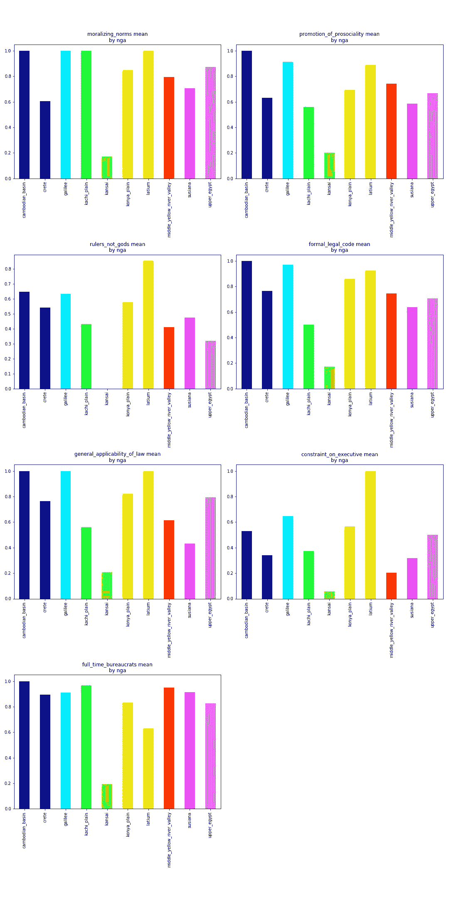

加利利、卡奇平原、科尼亚平原、苏西亚纳、上埃及，以及在较小程度上的克里特岛，所有这些地区在现代时期都处于伊斯兰统治之下，在将统治者和平民等同于精英方面得分明显较高。

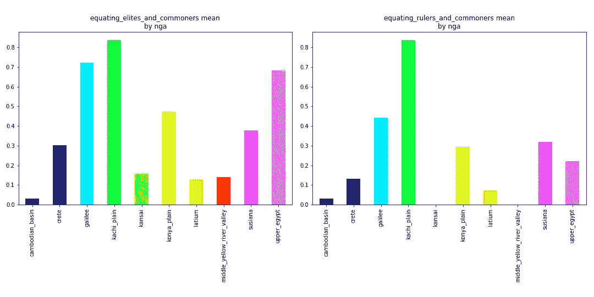

对行政和弹劾的限制似乎是显而易见的罗马特征，Latium 遥遥领先，其次是前罗马统治的克里特岛，加利利，上埃及和科尼亚平原，尽管黄河流域的弹劾事件略多于上埃及。就全职官僚而言，这是颠倒的。出于前面提到的原因，除了关西以外，每个 NGA 都有比拉丁姆更多的全职官僚。

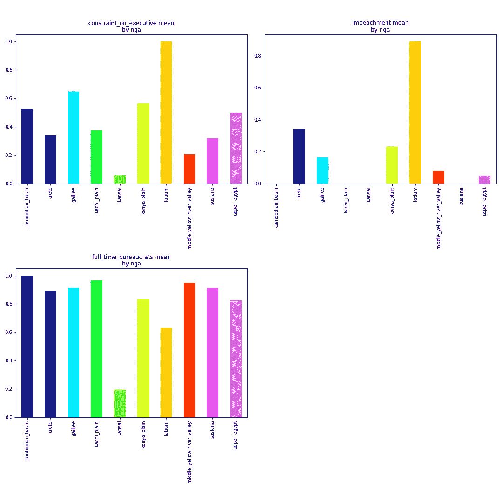

[Photo by Ken Shirakawa from Pexels](https://www.pexels.com/photo/tree-root-with-deity-figurine-756552/)

为了克服空值导致的问题，如关西的情况，我还绘制了每个 NGA 相关要素的相对剖面图:

随着时间的推移，柬埔寨盆地的特点是促进群体超越自我，以及一个正式的、普遍适用的法律结构，在这个结构中，一个先进的官僚机构在运作。不平等似乎一直很严重，对权力结构的制约有限。

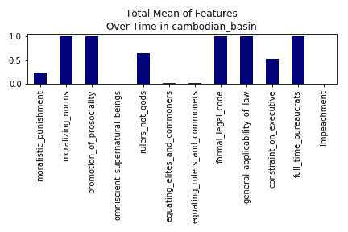

克里特岛同样有着全面和正式的法律，尽管个人利益比柬埔寨更受推崇。尽管在某些情况下统治者可以被罢免，但统治者和平民的价值观存在巨大差异。有时也有一些对全知的上帝的信仰。


加利利，再次，有一个高度结构化的法律框架，普遍适用和官僚化，但更强调集体善和道德惩罚。平等得到了更高的促进，高管受到了更多的约束，统治者不太可能被视为神，因为对无所不知的超自然存在的信仰非常普遍。尽管如此，一旦掌权，统治者很少能通过制度手段被罢免。


在卡奇平原上，社会相对不太可能因为道德原因而不是法律原因惩罚你，尽管坚持社会道德规范的压力非常大。尽管法律有一点可替代性，但在社会眼中，统治者、精英和平民有着显著平等的内在价值。

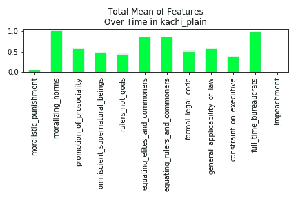

在关西，融入社会的社会压力很大，再加上正式且普遍适用的法律法规和强大的官僚机构，这可能意味着人们普遍知道社会对他们的期望。虽然精英和平民相对平等，但统治者是上帝。

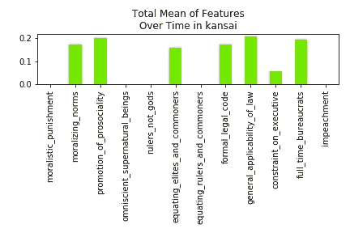

科尼亚平原的轮廓很像加利利，有一些法治，强调集体利益，适度的平等，一个受约束的行政部门，以及对统治者不是神的信仰和对全知的超自然存在的信仰。然而，道德惩罚不像在加利利那么普遍。

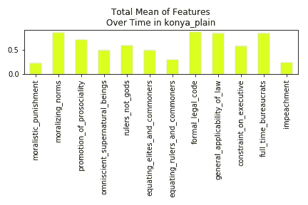

拉丁姆是法治的缩影，正式的法典比道德惩罚更受青睐，对行政部门的约束，甚至是弹劾的强大传统。统治者不是神，人们普遍相信一个无所不知的超自然存在。然而，不平等现象猖獗，社会普遍认为平民不如精英或统治者有价值。


像柬埔寨和关西一样，黄河中游地区是亲社会规范、强有力的法律框架和官僚机构的混合体。然而，统治者通常不被认为是神圣的，有时会受到制度上的约束。黄河流域的社会分层也可能比关西更高，因为精英不太等同于平民。


尽管 Susiana 有强大的亲社会和道德规范，正式的法律法规，以及一大批官僚，但法律似乎不太普遍适用。高管受到适度约束，社会分层相对较低。

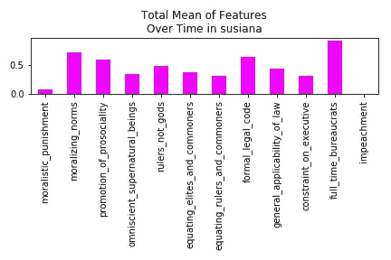

在埃及，道德规范非常重要，尽管存在一个正式的一般法律框架。有一个强大的官僚机构，精英和平民之间的平等程度相对较高。尽管统治者有时被认为是神圣的，但他们可能受到高度的制度约束。


咻！既然我们已经解决了最长、最复杂的问题，让我们继续…


Source: [pixabay.com](https://pixabay.com/en/jerash-jordan-ruins-ancient-2364518/)

# 问题 2:在相同的时间和地点，最有可能和最不可能遵守这些规范中的哪一个？

为了回答这个问题，我做了一个相关特征的关联矩阵。正如可以从数据集中预期的那样，要素往往会随着时间的推移而累积，相关性会偏向正相关。

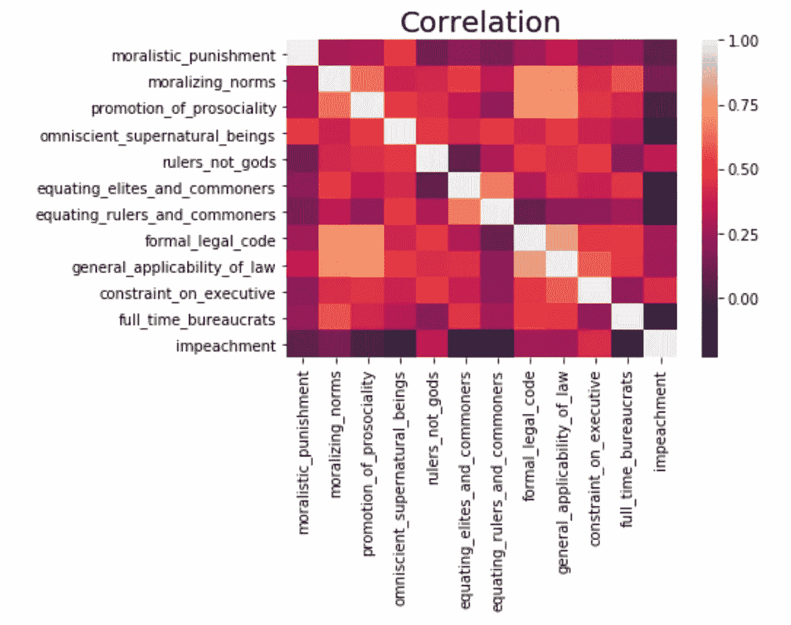

正式的法律规范、亲社会的促进和法律的普遍适用性最有可能一起被观察到，并具有很强的正相关关系。在某种程度上，普遍适用的正式法律法规是对亲社会的一种促进，也是对“遵守规则”的一种激励，所以这是有意义的。弹劾是最不可能与精英和平民等同以及统治者和平民等同共现的特征，两者都有轻微的负面关系。弹劾还与全职官僚的存在负相关，尽管这种负相关要弱得多。看起来，强大的官僚机构和相对的社会平等可能已经消除了对一位高管的一些约束，这位高管远非全能，需要合法性和他人的合作才能统治。最不相关的特征是弹劾和无所不知的超自然存在，亲社会的促进和道德惩罚，这意味着后三者与前者的存在与否没有任何有意义的联系。

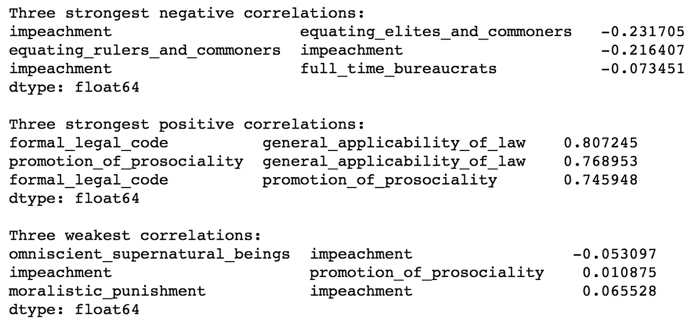

这让我们想到:


[Photo by Zhang Kaiyv from Pexels](https://www.pexels.com/photo/architecture-asian-building-castle-189833/)

# 问题 3:一些社会群体而不是其他群体沿着哪些不同的相关规范轨迹发展？

基于我为 Udacity 的[机器学习工程师 Nanodegree](https://www.udacity.com/course/machine-learning-engineer-nanodegree--nd009t) 做的一个早期项目，用代码对数据运行所谓的“主成分分析”，我能够得出三个独立的文化概况，数据中的社会在不同程度上符合或不符合，或者用技术术语来说，将维度折叠成三个维度，这三个维度最好地利用了数据中的差异。第一个维度解释了数据随时间变化的 48%的差异，这是一种抛弃，实际上只是表明 nga 倾向于随着时间积累越来越多的特征。然而，更有趣的是接下来的两个维度，分别反映了数据集 14%和 10%的方差。二维社会的特点是轻度缺乏对全知存在的信仰，并强烈认为统治者不是神，可以受到制度约束。尽管有一个强有力的法律框架，但社会分层很高，官僚机构很弱。这个维度对于许多古典主义者来说可能听起来很熟悉，是一种古典的古希腊政治哲学。相比之下，维度 3 的社会以强烈的道德规范和亲社会为特征。对全知上帝的信仰很低，但对神圣统治者的信仰很高，统治者比普通人更受尊重，相对不受约束，无可指责。有一个非常强大的官僚机构和高度复杂的法律框架。作为一种儒家政治哲学，这个维度对亚洲人来说也非常熟悉。这两种哲学被指定为独立的“维度”意味着它们并不相互排斥，因此不同的社会可以表现出一个、两个或两个维度都没有的混合特征(即一个社会可以同时受到*希腊和*儒家政治思想的影响。或者只有一个。或者都不是！).


[Photo by Diego Cano from Pexels](https://www.pexels.com/photo/panoramic-photo-of-bridge-714201/)

# 评估和部署

尽管这些数据在主观性、简洁性、不同的时间线以及所有那些该死的缺失值方面有些问题，但 Seshat 的轴向年龄数据集确实证明了我们创造关于过去的*新*数据的能力，以便得出关于过去的*新*见解，这些见解可以导致关于过去的*新*理论，包括来自问题 2 的见解，即**法律和亲社会倾向于一起出现**， 虽然**官僚主义和社会平等倾向于与弹劾**或问题 3 的见解**分开出现，但经典的希腊和儒家社会政治模式可能被认为是地中海和亚洲社会发展的独立维度，有时是同时和融合的。** 数据集集合的协作性质赋予了更大的客观合法性，并且可以而且应该被复制，以围绕我们缺乏大量定量数据的其他历史主题创建更大的数据集。

至于这种分析，从关于历史的数据中收集的发现，以前不存在的数据，可以在以前探索不足的方向上指导未来的研究。我欢迎读者验证或挑战本文中的见解，并将数据科学的适用性扩展到前信息时代！

[链接到 GitHub 资源库，查看该项目的代码](https://github.com/briantfriederich/Global_History)