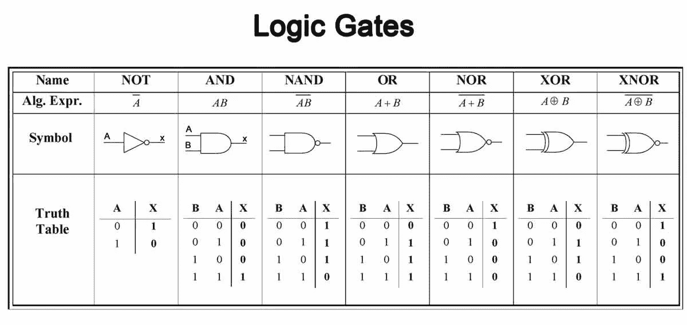
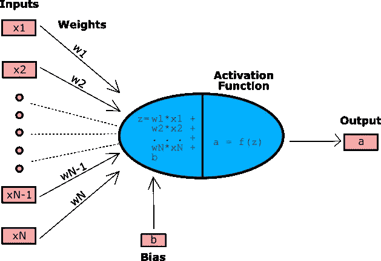
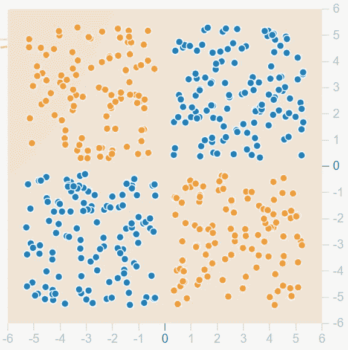
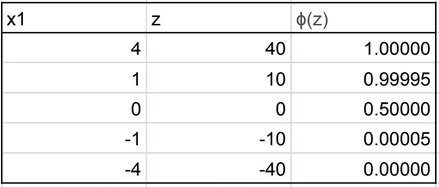
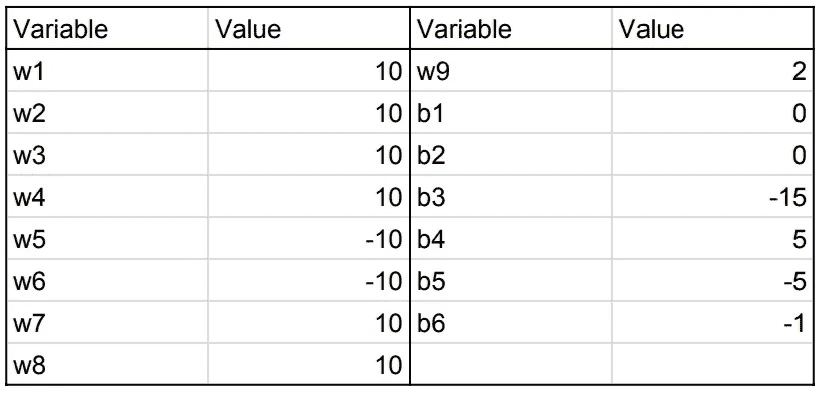
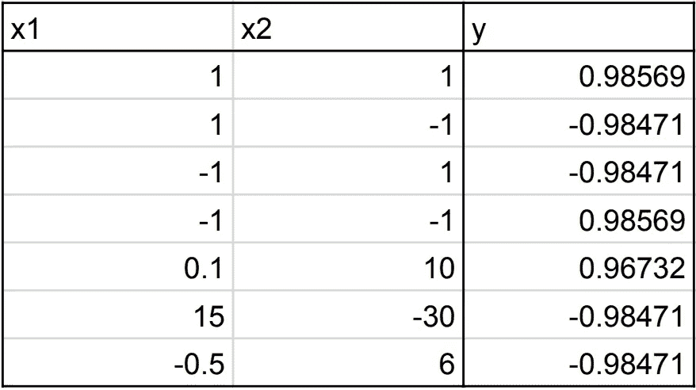
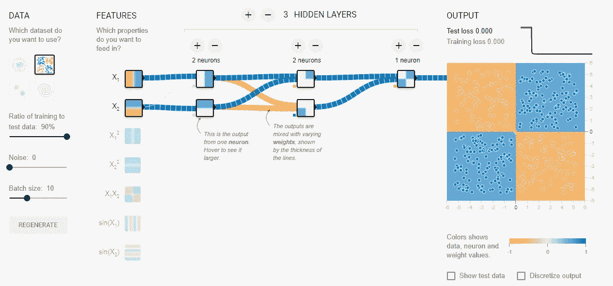

# 用神经网络模拟逻辑门

> 原文：<https://towardsdatascience.com/emulating-logical-gates-with-a-neural-network-75c229ec4cc9?source=collection_archive---------1----------------------->

在本教程中，我想告诉你如何训练一个神经网络来执行逻辑门网络的功能。我将深入研究网络中每个神经元的用途，并展示没有一个是被浪费的。我们将通过使用 Tensorflow Playground 中的一个问题示例来解决这个问题，这样您就可以自己实现和试验这个想法。

逻辑门是任何现代计算机的基础。你用来阅读这篇文章的设备肯定在使用它们。关于这些门的一个伟大的事情是它们容易解释。许多这样的门是用简单的英语命名的，比如 AND，NOT and OR 门。其他人写得不太熟悉，但仍然很简单。下表总结了这些逻辑门，以便我们以后可以参考它们。



Image borrowed from [https://medium.com/autonomous-agents/how-to-teach-logic-to-your-neuralnetworks-116215c71a49](https://medium.com/autonomous-agents/how-to-teach-logic-to-your-neuralnetworks-116215c71a49)

另一方面，神经网络被认为是任何现代(或其他)大脑的基础，并经常被认为是无法穿透的黑匣子。通常不清楚单个神经元在做什么，然而单个逻辑门在做什么却是显而易见的。然而，神经网络的内部工作不必如此神秘，在某些情况下，神经网络结构可以简单到足以完全掌握和设计。

在本教程中，我将使用一个神经网络来模拟逻辑门网络的行为。我们将确切地观察网络中每个神经元在做什么，以及它们如何融入整体。通过这个例子，我希望你能更好地了解神经网络内部的情况。

NB。如果你想直接进入 Tensorflow 游乐场实验，那么向下滚动到本文的“轮到你了”部分。

动机——一个经过训练的神经网络什么时候可以像一个逻辑门系统一样工作？

假设你有一个只有分类变量的数据集。可能是医疗记录，其中每个患者都有一个性别类别(男性、女性)、年龄段(0–5、5–10、10–15…45–50…)、白细胞计数(高、中、低)等。你的任务可能是利用这些信息来预测今年哪些病人有感染流感的危险，因此应该注射流感疫苗。像往常一样，对于分类变量，我们将使用 [one-hot-encoding](https://hackernoon.com/what-is-one-hot-encoding-why-and-when-do-you-have-to-use-it-e3c6186d008f) ，因此每个患者的记录是一个由 1 和 0 组成的向量。

现在我们可以想象为这些数据手工编码一个逻辑网络。我们会用我们的商业规则来定义我们认为谁有流感风险，谁没有。我们可能会得出如下结论，预测值为 1 表示患者有风险，预测值为 0 表示他们没有风险。

*   如果*年龄为 25–30***和** *白细胞计数低* **那么**预测 1
*   如果*年龄为 0–5***那么** 预测 1
*   如果*年龄为 65–70***且** *性别为男性* **则**预测 1
*   …
*   否则预测 0

在 Python 中，我们的逻辑网络可能看起来像这样，编码了所有可能使你面临流感风险的情况

```
at_risk = ( age_is_25_30 & white_blood_cell_is_low ) or ( age_is_0_5 ) or ( age_is_65_70 & sex_is_male ) or ...
```

如果我们有大量的领域专业知识，或者如果我们对医疗记录进行了大量的描述性分析，我们可以对这个逻辑网络进行编程。然而，试图避免对这个网络进行硬编码，这将使用大量的专家领域知识资源、开发人员时间，并且可能引入许多偏见，这就是我们作为建模人员首先构建模型的原因。

我们不想对这个逻辑网络进行硬编码，但是如果有人或其他人能够以系统的方式为我们做这件事，那就太好了。

(进入神经网络，舞台右侧)

**那么神经网络是如何变成逻辑网络的呢？**

在这一节中，我将假设你至少对神经网络的概念有些熟悉。我将抛出词语*偏差、重量*和*激活功能*，我不会花时间解释我在这个简单图表之外的意思。



为了使神经网络成为逻辑网络，我们需要证明单个神经元可以充当单个逻辑门。为了表明神经网络可以执行任何逻辑运算，只要表明神经元可以充当与非门(它确实可以)就足够了。然而，为了让事情变得更美好和更容易理解，让我们深入研究并展示神经元如何充当我们将需要的一组门中的任何一个——即 and 和 OR 门以及 x > 0 的比较门。

让我们用一个简单的具体例子来说明这一点。为了做到这一点，我想把你链接到 [Tensorflow Playground](https://playground.tensorflow.org/#activation=sigmoid&regularization=L2&batchSize=10&dataset=xor&regDataset=reg-plane&learningRate=0.03&regularizationRate=0&noise=0&networkShape=2,2,1&seed=0.00814&showTestData=false&discretize=false&percTrainData=90&x=true&y=true&xTimesY=false&xSquared=false&ySquared=false&cosX=false&sinX=false&cosY=false&sinY=false&collectStats=false&problem=classification&initZero=false&hideText=false) 上的一个特定数据集。下面是从该分布中生成的一组数据的图像。橙色数据点的值为-1，蓝色数据点的值为+1。我将 x 轴坐标称为变量 x1，y 轴坐标称为变量 x2。



Example from Tensorflow playground

在上图中，您可以看到，当 x1 和 x2 都为正时，或者当 x2 和 x1 都为负时，目标变量为正。如果我们用一个逻辑网络来编码，我们可能会选择逻辑

*   如果(x1>0) **和** (x2 > 0) **那么**预测+1
*   如果(x1 <0) **和** (x2 < 0) **那么**预测+1
*   否则预测-1

在 Python 中，我们可以把这个逻辑写成

```
expression = lambda x1,x2 : \\
    (( (x1>0) & (x2>0) ) or ( !(x1>0) & !(x2>0) ))*2 -1
```

如果你熟悉逻辑门，你可能会注意到，这个表达式的内部是一个 XNOR 门。

```
XNOR = lambda A,B : ( A & B) or ( !A & !B )
```

我想给大家展示的是，我们可以为这个逻辑表达式建立一个高效的神经网络。

当然，在这个例子中，最明显的是使用交叉特征 x1*x2，并使用它进行预测。然而，我想展示的是，一个好的解决方案在不使用 x1*x2 的情况下也是可能的，并深入研究当这一特征没有被创建时出现的网络的结构和解释。还要注意，我们要创建的逻辑神经网络可以扩展到使用 3 个或更多变量。你可以想象需要一个 3 输入 XNOR 门的变量，我们不能通过两个变量对之间的特征交叉来创建它。我们也不想做 3 个变量的所有交叉，即 x1*x2*x3，因为这可能会使我们的功能数量激增。

因此，让我们一项一项地通过逻辑表达式，这将为这个样本数据集做出正确的预测，并计算出我们的神经元将需要什么样的权重。记住我们想要用神经网络模拟的表达式是

```
(( (x1>0) & (x2>0) ) or ( !(x1>0) & !(x2>0) ))*2 -1
```

**激活功能**

我想快速说明我们将用于神经元的激活函数，Sigmoid 函数。我们这样选择的原因是因为 Sigmoid 函数的输出接近逻辑门的输出。对于 z 的所有值，逻辑门输出 1 或 0，Sigmoid 函数输出~1 或~0，其中 z 不接近 0。即。|z| >>0。这意味着 Sigmoid 函数将是一个很好的选择，可以帮助我们的神经元模拟我们需要的 AND 和 OR 门。


**比较 x1 > 0**

这是我们函数最里面的部分。我们可以使用单个神经元和 Sigmoid 激活函数很容易地计算这个表达式。在这种情况下，只有一个变量输入到神经元，x1，如果 x1 为正，我们希望神经元输出接近 1 的值，如果 x1 为负，则输出接近 0 的值。尽管这对于这个问题并不重要，但我们假设如果 x1 正好为零，那么我们希望输出为 0.5。

我们有 z = w1*x1 + b1 的激活函数的输入。查看上面的 Sigmoid 函数的图形，并考虑上面的标准，我们可以推断出我们想要 b=0，w1 应该是一个大的正数。事实上，随着 w1 趋向无穷大，该神经元的输出越来越接近逻辑比较 x1>0 的输出。然而，让我们取一个更适中的值，比如 w1=10。

在下表中，我们示出了不同 x1 值和 w1=10 时该比较神经元的输出(右手列)。您可以看到它的行为非常类似于 x1>0。



Neural comparison truth table

注意，可以应用相同的逻辑来计算比较 x2>0，并设置 w2=10 和 b2=0。

**与门**

现在，我们可以做更多的比较，目标逻辑表达式的下一个最内部的函数是 AND 运算符。在这种情况下，sigmoid 函数的输入将为 z=w3*a1 + w4*a2 + b3。这里 w3 和 w4 是权重，a1 和 a2 是第一层神经元的激活。如果 x1>0，变量 a1 非常接近 1，如果 x1 <0; the value of a2 is similar.

To emulate the AND operator we would like to set the weights and bias such that the output of the Sigmoid is very close to one if a1 and a2 are ~1 and zero otherwise. A good solution is to set b3=-3/2 * w3 and w4=w3\. You can do some calculations yourself, and see how this choice in weights will fulfill our criteria (there are also some examples below). As w3 goes to infinity and w4 and b3 go to their corresponding limits, this neuron becomes more and more like a perfect AND gate. However we will choose a more moderate value of w3 = 10 and let b3 and w4 follow.

In the table below we show the output of this AND neuron (right hand column) for different values of a1 and a2 and for w1=10\. You can see that it behaves very similar to an AND gate.


Neural AND gate truth table

**或门**，变量 a1 非常接近 0

我们逻辑表达式的下一个最内部部分是“或”门。对于或门，当一个或多个输入为~1 时，我们希望输出接近 1，否则输出为零。Sigmoid 函数的输入为 z=w7*a3 + w8*a4 + b5。这里 a3 表示 x1 和 x2 是否都是阳性，a4 表示 x1 和 x2 是否都是阴性。

通过与 Sigmoid 函数进行比较，并考虑上述标准，我们推断我们可以通过设置 b5=-1/2 * w7 和 w8=w7 来解决这个问题。当 w1 趋向于无穷大，b5 和 w8 趋向于它们相应的极限时，这再次接近完美的 OR 门。然而。让我们选择一个适中的值 w7=10，让 b5 和 w8 跟随。


Neural OR gate truth table

**最终件-乘加**

对于我们表达式的最外层部分，要么需要将神经网络的输出乘以 2，然后减去 1，要么需要一个具有线性激活函数、权重 w=2 和偏差 b=-1 的最终神经元。

**把所有的放在一起**

我们现在已经拥有了创建上述逻辑表达式的神经网络仿真器所需的所有部分。因此，将所有内容放在一起，网络的完整架构如下所示


Neural architecture for expression

其中权重和偏差的值是这样的



你可能会注意到*非 a1 和非 a2* 神经元的权重与 *a1 和 a2* 神经元的权重不同。这是由于“非”门，我不想陷入其中，因为再看到这个门就没意思了。然而，尝试自己解决这个问题可能会很有趣。

使用这个完整的网络，我们可以测试输入值来预测输出值。



看起来不错！它有我们想要的逻辑表达式的输出，或者至少非常接近。

**培训和学习**

现在我们已经证明这种神经网络是可能的，现在剩下的问题是，训练是可能的。如果我们在正确定义了层、神经元数量和激活函数之后，简单地输入从上图中提取的数据，我们能指望网络会以这种方式进行训练吗？

不，不总是，甚至不经常。像许多神经网络一样，这个问题是一个优化问题。在训练这个网络时，即使有一个近乎完美的解决方案，它也常常会陷入局部最小值。这就是你的优化算法可以发挥很大作用的地方，这是 Tensorflow Playground 不允许你改变的，可能是未来帖子的主题。

**轮到你了**

现在我建议你去 [Tensorflow Playground](https://playground.tensorflow.org/#activation=sigmoid&regularization=L2&batchSize=10&dataset=xor&regDataset=reg-plane&learningRate=0.03&regularizationRate=0&noise=0&networkShape=2,2,1&seed=0.00814&showTestData=false&discretize=false&percTrainData=90&x=true&y=true&xTimesY=false&xSquared=false&ySquared=false&cosX=false&sinX=false&cosY=false&sinY=false&collectStats=false&problem=classification&initZero=false&hideText=false) 尝试自己构建这个网络，使用架构(如上图和下图所示)和上表中的权重。挑战在于仅使用 x1 和 x2 作为特征来实现，并且手动建立神经网络。请注意，由于 Tensorflow 游乐场的特性，您应该只添加前三层。发生缩放的输出层是模糊的，但是如果您构建前三层，然后在很短的时间内训练网络，您应该会得到如下结果。

在操场上，你可以通过点击连接神经元的线来编辑权重。你可以通过点击每个神经元左下角的小方块来编辑偏差值。你应该能做到亏损 0.000。记得将激活功能设置为 Sigmoid。



想法:

*   在你通过手动输入权重建立了这个网络之后，为什么不试着从头开始训练这个网络的权重，而不是手动构建它。经过多次尝试后，我成功地做到了这一点，但我相信它对播种非常敏感，经常会陷入局部最小值。如果你找到了一个可靠的方法来训练这个网络使用这些功能和这个网络结构，请在评论中联系我们。
*   试着用这个数量的神经元和层数来构建这个网络。在这篇文章中，我已经展示了只用这么多的神经元来做这件事是可能的。如果你引入更多的节点，那么你肯定会有一些冗余的神经元。虽然，有了更多的神经元/层，我在更持续地训练一个好模型方面有了更好的运气。
*   我已经向您展示了两个逻辑门所需的权重和偏差以及比较，您能找到表中其他逻辑门的权重和偏差吗？特别是与非门(非与)，这是一个通用门，即。如果一个神经元可以实现这个门(或一个近似值)，那么这就证明了神经网络能够完成任何计算任务。

**下次**

我希望你喜欢阅读这篇文章，就像我喜欢发现它一样。

我想通过制作一个 Jupyter 笔记本来进一步扩展这个演示，从而在 Keras 中实现一些类似的东西。然后你可以自己玩训练神经网络逻辑门仿真器。

**参考文献**

如果我不提及这些以前已经触及神经网络和逻辑门主题的文章，那将是不恰当的。

[](/neural-representation-of-logic-gates-df044ec922bc) [## 逻辑门的神经表示

### 逻辑门即“与”、“或”、“非”是过去十年中每一项技术突破的组成部分…

towardsdatascience.com](/neural-representation-of-logic-gates-df044ec922bc) [](https://medium.com/autonomous-agents/how-to-teach-logic-to-your-neuralnetworks-116215c71a49) [## 如何向你的#NeuralNetworks 教授逻辑？

### 逻辑门是电子学的基本构件。它们几乎构成了复杂的架构…

medium.com](https://medium.com/autonomous-agents/how-to-teach-logic-to-your-neuralnetworks-116215c71a49)