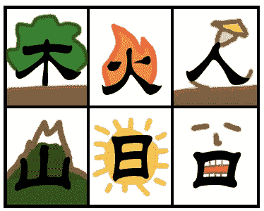

# 英语到粤语的翻译:一小时内快速破解

> 原文：<https://towardsdatascience.com/english-to-cantonese-translation-a-quick-hack-in-under-an-hour-fe8bdae398f5?source=collection_archive---------5----------------------->

我想每个在小学学过第二语言的同龄人都记得用谷歌翻译做作业。几乎每个人都有一个关于谷歌翻译出错的有趣故事。我的故事版本涉及到七年级法语的服装单元。我们的家庭作业是写一篇关于我们喜欢穿什么衣服的短文。当时，我真的很喜欢背心。我交了作业，写了这样一段话，“我叫杰米·波特·德·查尔兹·豪特。”谢谢，谷歌翻译。那没有意义。应该是“J'aime porter des debradeurs”实际上应该翻译成“我喜欢穿高[军]坦克。”我的法语老师没有被骗。

幸运的是，谷歌翻译这些年来已经有了很大的改进。现在，如果你输入“我喜欢穿背心”，它不再犯和我七年级时一样的错误。对于学习语言的人来说，谷歌翻译实际上是一个非常有用的工具。截至目前，谷歌翻译支持超过 100 种语言。而 Google Translate 支持 [*拼音*](https://en.wikipedia.org/wiki/Pinyin) (普通话罗马化)，我发现它缺少了一个贴近我内心的东西:粤语罗马化，或者说[Jyutping](https://en.wikipedia.org/wiki/Jyutping)。

Google Translate does do a great job of differentiating between traditional and simplified Chinese characters (for those who are not familiar, traditional characters are used for Cantonese and Mandarin in Taiwan, while simplified characters are used for Mandarin in China). Type “horse” in English, and you’ll be given “馬” if you choose traditional characters, and “马” if you choose simplified. However, for both traditional and simplified characters, the romanization given with the character is “Mǎ”, and this is Pinyin. What we really should have is “馬, maa5” for Cantonese, and “马, mǎ” for Mandarin. Google translate incorrectly uses Pinyin for Cantonese. What we really want here is Jyutping.


Obligatory Great Wall of China pic!

# **谷歌翻译不支持粤语**

繁体和简体汉字都使用拼音，这表明谷歌所说的“中文”是指“普通话”所以实际上，根本不支持粤语。我们不仅想添加 Jyutping，还想添加粤语作为支持的语言。遗憾的是，我在谷歌没有可以帮助我的直拨电话，所以我想出了一个变通的办法。

最棒的是:通过利用两个网站，我们不需要任何自己的数据，也不需要使用任何机器学习。这个黑客非常快，解决了我们的问题。不需要神经网络！

# **百度和 Chineseconverter 来救场了！**

Baidu, which is pretty much China’s Google, has a great Baidu translate tool that we can take advantage of. Not only does it support English to Mandarin Chinese translations, but it supports English to Cantonese! Enter “horse” and you’ll get “馬”, but with no Jyutping to help a student actually pronounce it. We need another site to do this: Chineseconverter.com. This site allows us to enter traditional characters, and output Jyutping. Finally, what we want! Now let’s write some code to do this for us.

# **硒来救场了！**

使用 Python 和 Selenium 包，我们可以自动将英文文本输入到百度翻译，将输出作为输入复制到 Chineseconverter.com，最后将结果作为我们的最终输出。

我们从初始化 webdriver 开始:

接下来，我们刮！这一部分涉及到进入两个网页的源代码和检索必要的元素。我发现，如果我把我的英文文本输入百度翻译后，没有让程序“休眠”3 秒，那么 Selenium 就找不到输出。除此之外，一切正常。

# **样品使用**

让我们看看程序是如何运行的。这是从终端发出的。

```
Enter your input: I love eating noodles
Traditional characters: 我钟意食面
Cantonese Jyutping: ngo5 zung1 ji3 sik6 min6
```

If we had used Google Translate and traditional Chinese characters, we would’ve gotten “我喜歡吃麵條”, which is not Cantonese, since it gives us “吃, chī”. What we want is “食, sik6,” which is the Cantonese way of saying “to eat.” So this is great, it works!

# **运行时间的最终注释**

因为我们只是自动化了从网页中输入和提取文本的过程，所以运行起来要花很长时间(大约 5 秒)。这种滞后给了一个粤语学生时间去思考他们的翻译应该是什么，但这肯定是太长了，以至于不能宣布它是谷歌翻译缺乏粤语的解决方案！



An interesting note- a lot of Chinese characters are actually pictograms!

# **结束语还有，为什么不用造字，而用造字呢？**

使用 Python 和 Selenium，很快就找到了一种将英语翻译成粤语的方法。我不需要训练任何神经网络，甚至不需要获得任何训练数据——我只是使用了现有的数据。不过，你可能会问自己，为什么要这么做？为什么一个正在学习说广东话的人不能同时学习阅读呢？嗯，学习广东话和任何中文的问题是，如果你同时专注于学习读、写和说，你会不知所措。在我看来，学习这类语言的最好方法是先把注意力放在说上，阅读随后就会到来。如果你的目标是与人交流(当面！)，你不需要会读会写。即使是在说中文的地区，年轻人也倾向于选择语音信息而不是短信，这更加证明了我的观点，你不需要一开始就能读或写。当然，这很好，但你必须做出选择。这是一种交换。

*最初发表在我的博客 serena.mcdonnell.ca 上*