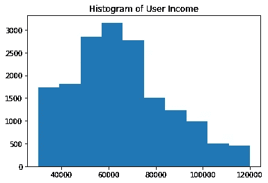
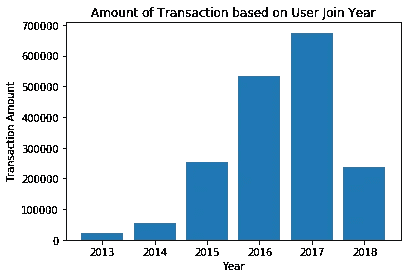
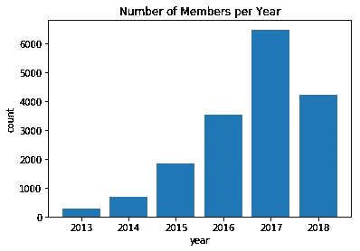
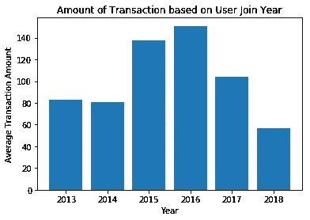

# 通过建立推荐引擎提升星巴克的顾客体验——第三部分

> 原文：<https://towardsdatascience.com/enhancing-starbucks-customer-experience-by-building-recommendation-engines-part-3-45100f085daf?source=collection_archive---------26----------------------->

Photo by [Omar Lopez](https://unsplash.com/@omarlopez1?utm_source=medium&utm_medium=referral) on [Unsplash](https://unsplash.com?utm_source=medium&utm_medium=referral)

本系列的第三部分关注项目的数据可视化。如果你还没有看过这个项目的介绍部分，我强烈建议你跟着这个 [**链接**](https://medium.com/@agustinus.thehub/enhancing-starbucks-customer-experience-by-building-recommendation-engines-part-1-108ddd1d729) 读一读，让你对我在做的事情有一个更清晰的认识。

*点击这里* *这个链接* [*可以看到我用来清理数据的代码。*](https://github.com/nugroho1234/starbucks-project)

# 数据可视化

在获得用户人口统计和购买行为数据框架后，我决定探索这些数据并创建可视化效果，以更清晰地了解星巴克应用程序用户的人口统计概况和购买行为。我创建了一个额外的列是“加入年”。这一栏是某个顾客成为星巴克 App 会员的那一年的数据。

Fig 1\. Histogram of User Age

星巴克应用程序的大多数用户年龄在 40-80 岁之间。这个结果与[分子](http://snapshot.numerator.com/brand/starbucks)网站的发现有些一致。然而，主要的区别是分子发现星巴克的大多数用户年龄在 25-34 岁之间。其余的水桶也差不多。

Fig 2\. Histogram of User Income

大部分用户的收入在 50000–78000 之间。这是有道理的，因为根据维基百科的数据，美国很多人来自收入在 35000 到 75000 之间的中下阶层。这也告诉我们，星巴克的应用用户以中低阶层为主。这有点有趣，因为星巴克的商品价格并不便宜。与中下阶层相比，上层阶级的用户并不多。也许，这是因为星巴克应用程序中的大多数用户实际上是为了促销优惠。这就是为什么创建推广推荐引擎是星巴克的一个好策略。自从用户成为星巴克应用程序的成员后，看到每个用户的交易金额的分布对我来说也很有趣。

Fig 3\. Histogram of User Transaction Amount

大多数用户的交易金额在 0-200 美元之间。这实际上有点令人担忧，因为从 2013 年开始就有用户成为星巴克应用程序的会员。这些用户可能选择不打开该应用程序，或者他们已经删除了该应用程序，或者他们可能对优惠不感兴趣。因此，看看更早加入的用户是否花费更多将是有趣的。

Fig 4\. Bar Chart of Amount of Transaction based on User Join Year

从图 4 可以看出，2013 年加入的用户交易量最少，其次是 2014 年加入的用户。为了进一步调查，我创建了一个条形图，显示每年加入星巴克应用程序的会员数量。

Fig 5\. Bar Chart of Number of Members per Year

在 2013 年和 2014 年，成员人数似乎仍然很低。这可以解释为什么交易量也很低。然而，他们也有更多的时间来积累交易。似乎这些用户停止了会员资格，或者他们对促销根本不感兴趣。这也是星巴克创建推荐引擎进行推广的一个很好的理由。现在，看看这些用户的平均支出也会很有趣。

Fig 6\. Bar Chart of the Average Amount of Transaction Based on User Join Year

尽管所有在 2013 年加入的用户在星巴克购物花费最少，但每个用户的花费都比 2018 年加入的用户多得多。根据平均交易，2016 年加入的每个用户每次购买花费最多。这告诉我们那些较早加入的人的消费能力。虽然他们不在平均消费最高的前三名之列，但他们确实花了相当多的钱购买星巴克的产品。这也是创建推广推荐引擎的原因之一。接下来，我查看了用户的性别分布。

Fig 7\. Bar Chart of Users’ Gender Distribution

星巴克的顾客大部分是男性，其次是女性顾客和其他。之后，看看哪种性别会受到晋升机会的影响会很有趣。

Fig 8\. Bar Chart of Number of Transaction from Offer Viewed by Gender

令人惊讶的是，填写“其他”的人在看到报价后会做更多的交易。女性用户受他们所看的报价的影响最小。接下来，我将按性别查看完成的聘用百分比。然而，必须指出的是，差别并不大。

Fig 9\. Bar Chart of Percentage of Offer Completed by Gender

同样，性别为“其他”的人完成了最多的提议。男性客户，虽然他们做更多的交易，但他们并不真正试图完成报价。看看哪个性别花钱最多会很有趣。

Fig 10\. Bar Chart of the Amount of Transaction by Gender

不出所料，女性用户花费更多。因此，尽管他们的交易次数最少，但他们往往比男性用户花费更多的钱来完成更多的报价。似乎女性和其他人都比男性更喜欢升职。

Fig 11\. Histogram of User Transaction from Offer Viewed

大多数用户在查看报价后有 0-7 次交易。这意味着，当他们看到一个报价时，他们之后会进行交易，甚至可能不止一次交易。这表明，大多数星巴克应用程序用户喜欢促销优惠，如果他们得到优惠，他们会采取行动。

# 结论

数据探索/可视化的结果非常有趣。此外，他们都表示，建立一个推荐系统的推广产品。

我发现有趣的几件事是:
1。尽管星巴克的商品并不便宜，但大多数应用程序用户来自中下阶层。
2。早些年加入的用户可能已经终止了他们的会员资格。
3。2016 年加入的用户平均交易金额最高
4。2017 年加入的用户交易量最大，尽管他们个人并不真的花很多钱。
5。女性用户倾向于花更多的钱来获得奖励。
6。大多数应用程序用户都是男性，但他们不会真的尝试去完成一个报价。

# 续第 4 部分

这一部分旨在让读者了解人口统计概况，并通过数据可视化展示星巴克应用用户的购买行为。下一部分将重点关注星巴克应用用户的细分以及基于聚类的推荐引擎和基于用户的推荐引擎的创建。有兴趣的话请关注这个 [**链接**](https://medium.com/@agustinus.thehub/enhancing-starbucks-customer-experience-by-building-recommendation-engines-part-4-f67b9a45fc19) 。

*如果您有建议或批评，请不吝赐教。我仍然是，并将永远是这个领域的学生。如果你有任何问题或想知道我对你的项目的看法，请随时联系我。*