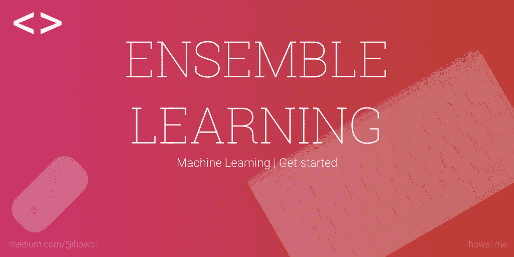

# 机器学习中的集成学习|入门

> 原文：<https://towardsdatascience.com/ensemble-learning-in-machine-learning-getting-started-4ed85eb38e00?source=collection_archive---------2----------------------->

使用各种不同的模型比只使用一种模型要可靠得多。在单个集合上一起工作的几个模型的集合称为集合。这种方法被称为集成学习。

# 投票

您可以使用不同的算法训练您的模型，然后集成它们以预测最终输出。比方说，你使用随机森林分类器，SVM 分类器，线性回归等。；模型相互竞争，并通过使用来自`sklearn.ensemble`的`VotingClassifier`类投票选出最佳性能。

*硬投票*是从集合中选择一个模型，通过简单多数投票进行最终预测，以确保准确性。

*软投票*只能在所有分类器都能计算出结果的概率时进行。软投票通过平均各个算法计算出的概率来达到最佳结果。

代码:

`VotingClassifier`的准确率一般高于个体分类器。确保包含不同的分类器，这样容易出现类似错误的模型不会聚集错误。

# 装袋和粘贴

您可以在数据集的各种随机子集上使用单个模型，而不是在单个数据集上运行各种模型。替换随机抽样称为*装袋*，简称*自举汇总*。如果很难在脑海中想象，就想象一下忽略数据集中的几个随机条目，用其余的条目建模。在*粘贴*的情况下，同样的过程适用，唯一的区别是粘贴不允许为相同的预测器多次采样训练实例。

代码:

`bootstrap=True`参数指定装袋的用途。对于粘贴，将参数更改为`bootstrap=False`。

如果分类器可以计算其预测的概率，则 BaggingClassifier 会自动执行软投票。这可以通过检查你的分类器是否有一个`predict_proba()`方法来验证。

装袋通常比粘贴效果好得多。

# 袋外评估

当对训练集执行 Bagging 时，只有 63%的实例包括在模型中，这意味着有 37%的实例分类器以前没有见过。这些可以像交叉验证一样用于评估。

要使用这个功能，只需在前面示例中的`BaggingClassifier`类中添加一个`oob_score = True`参数。

密码

到目前为止，只对实例进行了采样。对于包含大量要素的数据集，还有其他方法。

# 随机补丁和随机子空间

*随机补丁*对训练实例和特征进行采样。

在`BaggingClassifier()`中设置某些参数可以为我们实现这一点:

随机子空间保留除样本特征之外的所有实例。

这是通过以下方式实现的:

# 随机森林

决策树的集合是一个随机森林。Random Forests 在内部执行装袋。随机森林创建几棵树，有时是几千棵树，并为给定数据集计算最佳可能模型。随机森林算法不是在分割节点时考虑所有特征，而是从所有特征的子集中选择最佳特征。这用较高的偏差换取了较低的方差，从而产生了更好的模型。

代码:

参数:`n_estimators`是森林中树木的极限数量。`max_leaf_nodes`用于设置端节点的最大数量，这样算法就不会深入单个特征并过度拟合模型(阅读关于决策树的详细解释)。`n_jobs`指定您的计算机要使用的内核数量；`-1`值意味着所有最大可能的核心。

使用网格搜索可以通过改变参数值来改进模型。

# adaboost 算法

虽然 AdaBoost 技术的函数数学相当令人生畏，但其原理相当简单。首先，您选择一个基础分类器，它对给定的集合进行预测。记下错误分类的实例。错误分类实例的权重增加。用更新的权重在训练集上训练第二分类器。

简单来说，运行分类器并进行预测。运行另一个分类器来拟合以前错误分类的实例并进行预测。重复进行，直到所有/大部分训练实例都适合为止。

AdaBoost 使用的不是决策树，而是一个*决策树桩*，它是一个带有`max_depth = 1`的决策树，即一个决策节点和两个叶节点的树。AdaBoost 中的`n_estimators`参数设置决策树桩的数量。

密码

Scikit-learn 使用 Adaboost 的多类版本 SAMME ( *使用多类指数损失函数*的阶段式加法建模)。如果预测器可以计算概率(有`predict_proba()`方法)，Scikit Learn 使用 SAMME。R ( *R 代表实数*)依赖于概率，不容易过度拟合。

在过度拟合的情况下，尝试调整你的基本估计量。

# 梯度推进

与 AdaBoost 类似，梯度提升也适用于添加到集成中的连续预测模型。梯度提升不是像 AdaBoost 那样更新训练实例的权重，而是使新模型适合残差。

简而言之，使模型适合给定的训练集。计算残差，该残差成为新的训练实例。一个新的模型在这些上面被训练等等。选择所有模型的总和来进行预测。

密码

学习率参数缩小了每棵树的贡献。在`learning_rate`和`n_estimator` s 之间有一个折衷。降低 learning_rate 的值会增加集合中的树的数量。这叫做*收缩*。将估计数增加到一个较大的值可能会使模型过拟合。见*早停*。必须仔细监控这种权衡。

# XGBoost

XGBoost 是一种最新、最受欢迎且功能强大的梯度增强方法。XGBoost 没有在叶节点上做出艰难的是或否的决定，而是为做出的每个决定分配正值和负值。所有的树都是弱学习者，并且提供比随机猜测稍好的决策。但是总的来说，XGBoost 的表现非常好。

密码

XGBoost 可以处理树和线性模型。我建议阅读 XGBoost 文档，了解更多的参数调优选项。

XGBoost 最近获得了很大的人气，并被用在了最获胜的 Kaggle 竞赛模型中。这是您数据科学工具箱中的强大工具。

下次见。建议编辑和改进。保持(机器)学习。

> 本文的灵感来自 Aurélien Géron 的书《使用 Scikit-Learn 和 TensorFlow 进行机器学习:构建智能系统的概念、工具和技术》。我已经尽力把事情简单化了。希望有帮助。在这里得到这本书:[http://shop.oreilly.com/product/0636920052289.do](http://shop.oreilly.com/product/0636920052289.do)