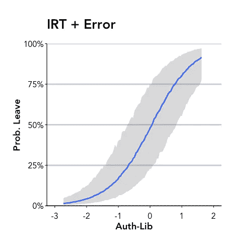

# 选民价值观的错误和不确定性

> 原文：<https://towardsdatascience.com/error-and-uncertainty-in-voters-values-f053b0bd931d?source=collection_archive---------15----------------------->

在过去的几个月里， [Paula Surridge](https://twitter.com/p_surridge) 写了两篇非常棒的[博客](https://medium.com/@psurridge/values-and-voting-in-the-eu-referendum-21d3827fc8f3) [帖子](https://medium.com/@psurridge/values-and-voting-part-ii-b2b4ed1bd8cd)探讨选民的价值观、他们在欧盟公投中的投票以及他们更普遍的投票模式之间的关系。Nick Barlow 有一篇关于中间派和自由民主党的类似文章，也很有趣。如果你还没有读过，它们非常值得你花时间去读。

我想谈谈 Paula 的一些观点，但更详细地谈谈我们如何衡量选民的价值观和态度。特别是，我想比较一下求和反应和[项目反应理论(IRT)](https://en.wikipedia.org/wiki/Item_response_theory) 方法。关于 IRT 是如何运作的，我就不多赘述了。如果你感兴趣，这本书提供了很好的介绍。

这两种方法都源于同一个问题:衡量态度真的很难。正如尼克所说，让受访者在左右、授权或其他尺度上自我认同充满了问题。更重要的是，它假设了一些人可能不具备的政治成熟度，并忽略了受访者更有可能选择中间或极端的价值观。

为了解决这个问题，调查设计者提出了一些问题，他们认为这些问题代表了他们要测量的东西。让我们以保拉讨论的威权-自由主义光谱为例。为了衡量这一点，BES 询问受访者对五种说法的认同程度，范围从*“1。强烈不同意"*对 *"5。非常同意”。*这些是:

1.  今天的年轻人对传统的英国价值观不够尊重
2.  对于某些罪行，死刑是最合适的判决
3.  学校应该教孩子服从权威
4.  对电影和杂志的审查是维护道德标准的必要手段
5.  违法的人应该被判更严厉的刑罚

最常见的是，我们通过简单地将这些回答相加来得出总量表。虽然这很容易，并且经常提供足够好的结果，但是它有两个主要问题。首先，它只在回答者回答了所有问题的情况下有效。如果这样做需要政治上的老练，我们就冒着排除不太懂政治的受访者的风险。这反过来会使我们的结果产生偏差。第二，求和将有序分类变量视为度量变量，并假设所有项目提供相同数量的信息，以将受访者置于感兴趣的范围内。这种假设有时可能是正确的，但在问题的难度不同或回答模式有偏差的情况下就不太可能了。

IRT 采取了不同的方法。它使用了相当于豪华的逻辑回归来定位潜在规模的每个受访者。因此，IRT 没有很多与求和相关的问题。例如，它可以估计位置，即使回答者没有回答所有的问题。它还允许不同的项目在定位回答者时提供不同数量的信息。但在我看来，IRT 最好的一点是它是基于模型的。因此，它给出的估计是*概率*。这意味着我们不仅可以计算出*我们认为某人坐在秤上的位置*，还可以计算出*我们对自己的计算有多确定。*

# **一些实证结果**

为了比较求和法和 IRT 法，我运行了三个逻辑回归来预测基于选民年龄、性别和授权位置的脱欧投票。模型 1 使用总和值，模型 2 使用分级反应模型(一种 IRT)的分数，模型 3 使用这些分数加上它们的测量误差。这些模型还不够强大，不足以出现在美国政治科学杂志上，但对我们的目的来说已经足够好了。

在这些模型中包括测量误差通常是困难的，如果不是不可能的话。幸运的是，`R`拥有优秀的`brms`包，让这一切成为可能(也很容易！).`brms`也有一个非常棒的功能，可以产生边际效应图，我已经在下面列出来了。为了便于比较，我对 auth-lib 总排名进行了 z 标准化。

Marginal effects of auth-lib scale placement on probability of voting Leave using Left — summed responses, Centre — factor scores from a graded response model, 3 — the same factor scores, plus measurement error.

从第一个和第二个图中可以看出，使用求和值和 IRT 分数的模型之间几乎没有区别。第一个模型中授权库位置的 1 个标准差变化导致离开投票的 1 个对数优势变化，相比之下，第二个模型中的 1.07 个对数优势变化。让我们暂时回到现实世界，这意味着这两个模型预测，auth-lib 值为 1 的人投票离开的可能性分别是得分为 0 的人的 2.7 倍和 2.9 倍。

然而，在模型中包含误差会导致不同的结果。不仅曲线更陡，而且我们的估计还包含更多的不确定性(如灰色置信带所示)。如你所料，更陡的曲线意味着更大的系数。在这种情况下，模型预测 auth-lib 位置中 1 个标准偏差的变化导致 1.51 个对数几率的变化。因此，我们应该预计 auth-lib 值为 1 的人投票脱离的可能性是 auth-lib 值为 0 的人的 4.5 倍。与之前模型的估计相比，这是一个很大的差异，并且表明 auth-lib 的放置比我们想象的更重要。

不仅影响更大，而且第三个模型的 R 值也更高，这表明它占了投票假期差异的更大部分。模型 3 解释了脱欧投票中约 25%的差异，而模型 1 和 2 分别为 21%和 20%。

# **“求和”完毕**

我在这里的观点不是鼓吹测量。我确实认为它非常重要，但是，正如我前面所说的，总和值通常足够好，我不嫉妒任何人使用它们。然而，我确实希望这篇短文能激励研究人员对测量可能对他们获得的估计值的可靠性产生的影响保持谨慎。

这一点对于精确度尤为重要。例如，如果您的模型是一个政策决策的基础，您可能会考虑选择更接近模型 3 的模型，该模型利用了所有可用的信息。这可能很耗时，也更有技术含量，但可能会导致更可靠的估计。如果你有这样的倾向，这可能也值得考虑进行更多的一般性研究。你永远不知道，如果这种分析是可靠的话，这种影响可能比你最初想象的更重要！