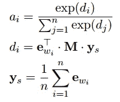
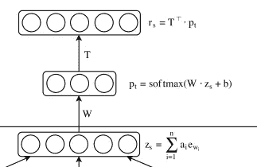
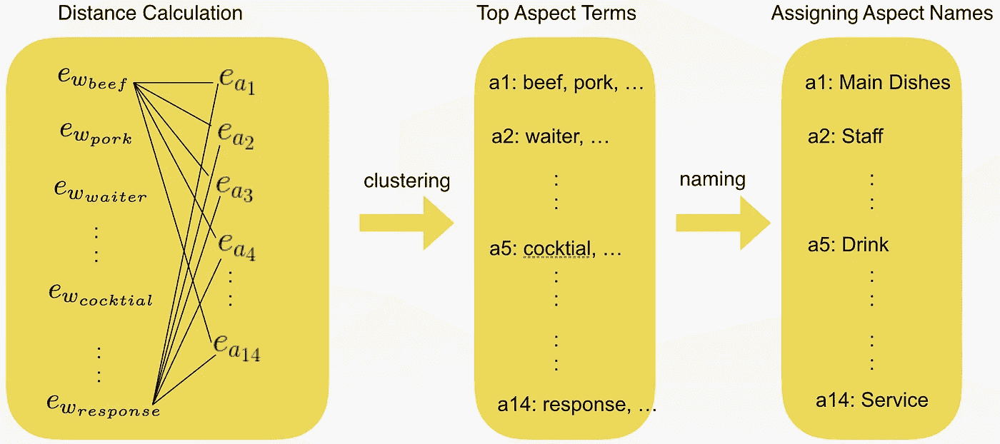
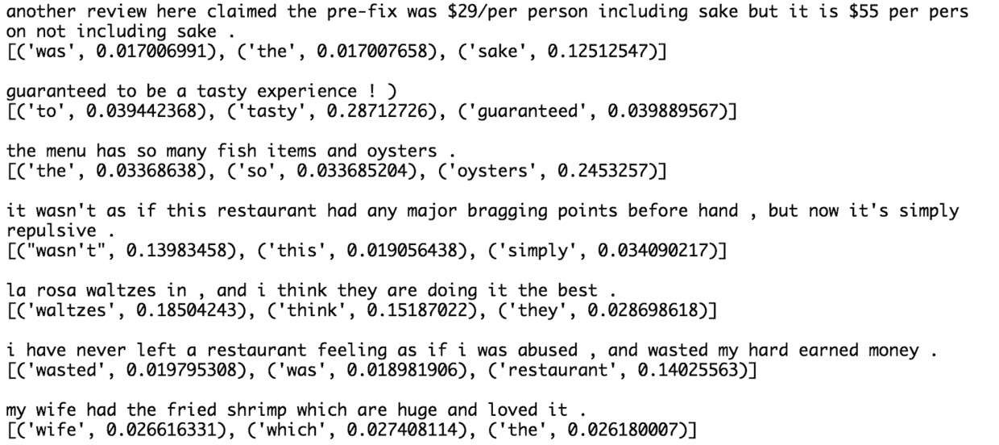
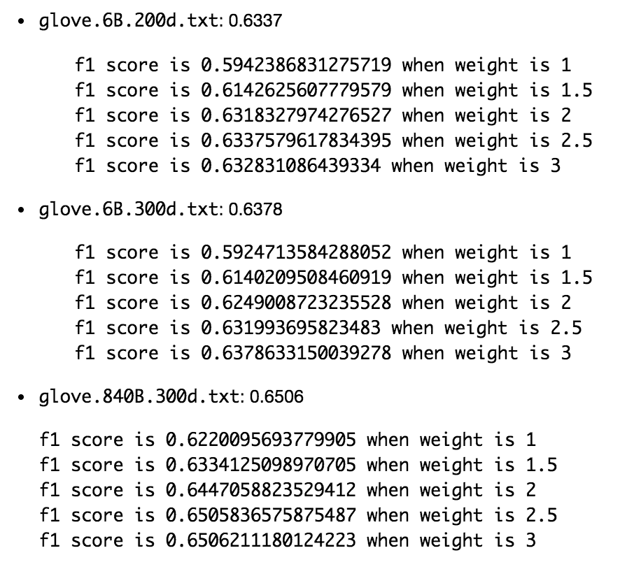

# 面向体貌特征抽取的无监督注意模型评估

> 原文：<https://towardsdatascience.com/evaluation-of-unsupervised-attention-model-for-aspect-term-extraction-da887728fba8?source=collection_archive---------26----------------------->

# 1 背景

最近我在研究方面术语抽取问题。以无监督的方式提取体貌特征是一个非常具有挑战性的课题，大多数无监督的方法都是基于规则的。但是这些方法并没有达到良好的性能。你可以在 [BiLSTM-CRF 中找到 1.1~1.3 的详细任务描述，用于方面术语提取](https://medium.com/@zhuixiyou/bilstm-crf-for-aspect-term-extraction-87630406573a)。

在 Google 发表了“注意力是你所需要的一切”一文之后，注意力模型显示了它的无限潜力。所以我想知道如果使用注意力模型以一种无监督的方式提取体项会怎么样。然后我发现了这篇论文，[一个用于方面提取的无监督神经注意模型](https://www.comp.nus.edu.sg/~leews/publications/acl17.pdf)。本文满足三个要求，无监督的方式，注意模型和方面提取。

在这篇文章中，我将展示我对这个无监督注意模型的实验过程。

# 2 无监督注意模型

这个注意力模型使用自动编码器架构，该架构分为两个部分。编码器部分是从嵌入层到编码器层(`p_t`)，解码器是从编码器层到解码器层(`r_s`)。在编码器部分，注意力层会给每个句子中的每个单词分配注意力分数。然后通过使用注意力得分计算加权句子嵌入(`Z_s`)平均句子嵌入。加权句子嵌入将编码为`p_t`。最后，`p_t`将被解码为`r_s`。我们可以认为`r_s`是`Z_s`的重构。

首先，我们看到基于注意力的编码器部分，它包括注意力层。

`e_wi`是每个单词在一个句子中的嵌入向量。`y_s`是一个句子中所有单词的平均值。`d_i`表示每个单词在句子中的权重如何，这是一个原始的注意力得分。最后用一个 softmax 层来标准化句子中的关注值，而`a_i`就是一句话中每个词的关注分数。

*   `Z_s`:注意力加权句子嵌入。

`Z_s`是自动编码器的输入层，`p_t`是编码器层，`r_s`是解码层。

句子的重构:编码表示的降维-> Softmax 以确定方面的权重->方面嵌入的线性组合，其中权重来自计算的 Softmax。

# 2.2 损失函数

铰链损失，以最大化样本的编码表示和重构表示之间的内积，并最小化负样本的内积。

鼓励方面嵌入唯一性的正则化术语。任何两个不同方面嵌入的点积应该为零。

这是最终的目标函数。

# 2.3 培训后我们得到了什么

经过训练，我们可以得到一些有用的信息。

*   `a_i`:每个词的注意力得分。我们可以用注意力得分来找出哪个词是体项。在下面的例子中，单词“beef”在句子中的值最大，所以体术语是“beef”。在找到方面项之后，我们将在后面为 clustring 使用它的嵌入。
*   `Z_s`:注意力增强句子嵌入。每个句子可以表示为一个嵌入向量。这可以用于其他自然语言处理任务，如类别分类和情感分类。
*   `T`:方面嵌入(`k x d`维度矩阵，其中`k`为训练前经验设定的推断方面类别数，`d`为嵌入维度)。体貌嵌入用于近似词汇表中的体貌词。

*   每个方面类别的排名靠前的方面术语。

# 2.4 评估指标

即使论文中有几个评价指标，但大多数都需要人来识别结果。例如，在提取了方面术语单词之后，有人会识别这个单词是否属于特定的方面类别。在这个过程之后，我们可以计算 f1 的分数。

人类的认识可能包括错误。为了做一个公正的评价，我们用我们的方式来评价模型。

# 3 模型性能分析

我们首先看到每个方面类别中的顶部单词，以便对性能有一个直接的印象。

我们选择 SemEval2016 task 5 餐厅数据集(2000 个样本)作为测试数据集。我们首先在训练数据上使用 word2vec 来获得单词嵌入。然后在训练数据上训练注意力模型。最后，我们得到每个类别中的前 100 个单词。您可以检查这个 [aspect.log](https://github.com/BrambleXu/Unsupervised-Attention-Aspect-Extraction/blob/master/code/output_dir/restaurant_small/aspect.log) 文件中的顶级方面术语。

这里我们拿第一个方面范畴来分析。我们可以认为这个方面类别与“职员”相关，因为顶部的词包含“女主人”、“服务员”、“服务员”等等。结果看起来很好。但如果我们仔细观察，会发现一些奇怪的东西。首先，顶部的单词包含一些像“电话”、“请求”、“问题”、“杂耍”这样的单词。意思是这个体范畴包含了很多不相关的词。第二，还有一些像“道歉”、“知情”、“无礼”之类的词。通常，体术语是名词，但这一类别包含许多动词和形容词。这意味着模型不能区分词性。如果我们看看其他方面类别，我们会发现同样的问题。

从另一方面来说，这可能只能说明聚类过程没有很好地工作。我们要直接看每句话中提取了哪些词。下面是分析笔记本:[attention-word-analysis . ipynb](https://github.com/BrambleXu/Unsupervised-Attention-Aspect-Extraction/blob/master/notebook/attention-word-analysis.ipynb)。我们举一些例子来看表演。

我列出了每个句子中得分最高的前 3 个单词，但结果看起来并不好。在每个句子中，动词往往具有较高的注意力得分。

有几种方法可以提高性能:

*   将嵌入层设置为“可训练的”
*   用 Word2Vec 嵌入替换手套嵌入
*   尝试不同的方面类别号

尝试了这些方法后，我们之前提到的两个问题还是没有解决。因此，我们可以认为，这个模型可能不会很好地执行提取方面的术语任务。但是在其他任务中会有帮助吗？接下来，我们将评估该模型在其他 NLP 任务上的表现。

# 3.2 特征类别检测

SemEval2016 任务 5 有三个槽位。槽 1 是方面类别检测任务。共有 12 个类别。`SERVICE#GENERA, AMBIENCE#GENERAL, DRINKS#PRICES, DRINKS#QUALITY, DRINKS#STYLE_OPTIONS, FOOD#PRICES, FOOD#QUALITY, FOOD#STYLE_OPTIONS, LOCATION#GENERAL, RESTAURANT#GENERAL, RESTAURANT#MISCELLANEOUS, RESTAURANT#PRICES, SERVICE#GENERAL`。我们需要给每个句子分类。

# 人工注意

槽 1 的基准 f1 分数是 0.59928。但我们不知道即使注意力模型工作得很好，注意力模型是否能改善槽 1 任务。因此，首先我们必须证明，如果方面术语具有“正确的”注意力分数，则槽 1 性能应该大于 0.59928。

我们用下面的等式计算嵌入的每个句子。`w`表示体项词嵌入的权重。我们使用 GloVe 来获得 word 嵌入文件。

在这个[slot 1-GloVe-attention . ipynb](https://github.com/BrambleXu/Unsupervised-Attention-Aspect-Extraction/blob/master/notebook/slot1-v1-v2-glove-attention.ipynb)笔记本中，我们使用了两个手套文件:

*   手套 6B.200d
*   手套 6B.300d
*   手套. 840B.300d

而我们设置权重为 1，1.5，2，2.5，3，找出哪个权重最好。

结果如下。基准 f1 分数为 0.5993。在我们尝试了不同的权重后，最好的结果是 0.6506。因此，我们可以确认，如果注意模型给予体项高的注意分数，体范畴检测的性能将会提高。

嵌入具有更好的性能，但加载时间比其他两种文件长得多。而`glove.6B.200d`的 f1-score 与`glove.6B.300d`非常接近，所以我们选择`glove.6B.200d`进行后面的实验。

# 真正的关注

在我们证明增强句子嵌入有效后，我们将在现实中测试注意力模型。

这个片段是模型架构的代码。`Z_s`是每个句子中嵌入单词的平均总和。如果特征词有正确的注意分数，最终的 f1 分数应该大于基线。

结果看起来不太好。考试成绩只有 0.2057。即使我们对训练数据进行测试，f1 值也只有 0.4177，这与基线值相差甚远。

但是结果并不乐观。考试成绩只有 0.2057。即使我们对训练数据进行测试，f1 值也只有 0.4177，这与基线值相差甚远。

只使用句子嵌入可能不是一个好主意，所以我们一起使用 GloVe 和`Zs`。

我们用三种方式(连接、乘、加)将手套词向量和注意句向量结合起来，然后在训练数据和测试数据上进行测试。训练数据上的 f1 值远大于测试数据上的 f1 值，因此我们认为该模型过度拟合。

对于测试数据的结果测试，最好的结果是 0.52，但仍然低于基线。并且该得分的最大贡献来自手套词向量。所以注意力增强句子嵌入仍然没有达到很好的效果。此时，有必要进一步测试该模型的性能。至少我们已经知道这个模型不是方面提取的好选择。

# 3.3 结果分析

为什么这个模型在其他数据集上如此有效？

一个原因是论文的评估过程是高度定制化的。在方面识别步骤中，作者将 9 个类别(方面)分成 3 个类别(黄金方面),以评估无监督注意模型的性能。这种分组过程可能会削弱评估的质量。

其次是损失函数。损失是通过重构句子向量(`r_s`)和加权句子向量(`Z_s`)来计算的，这意味着该模型是为了学习对于重构句子什么是重要的。我们不能保证体项是重构句子最重要的特征，动词和形容词也很重要。这就是为什么体术语有这么多动词和形容词的原因。

第三是 autoencoder 架构，我们认为这是最关键的原因。作者选择这种自动编码器来表达无监督的方法，因此不再需要设计损失函数。损失函数不能直接捕获教师信号。使用 autoencoder 来提取方面项是一个很好的尝试，但是并没有达到我们预期的效果。

# 4 试错法

这一节，我就说说实验中的试错过程。

在本地实现模型后，第一件事就是如何检查模型的性能。但是我不能得到和报纸上显示的一样的 f1 分数。原因是 k-means 初始化特征簇的方式。在评估代码中，群集名称是手动分配的。如果我们训练模型，方面顺序可能会变得不同。因此，如果我们想要评估结果，我们必须自己查看方面集群结果，并为每个方面分配方面类别标签。

根据该论文，大多数度量标准需要人工识别结果。但是这个过程会引入人为误差。而且在训练过程中，我们甚至看不到评估分数，因为评估是在训练之后。为了得到一个令人信服的分数来证明这个模型确实有很好的效果，我们决定使用一些客观的指标。换句话说，我们可以测试这个模型的可移植性。

更具体地说，我们可以使用模型在训练后学到的东西来测试其他任务。这就像单词嵌入技术。如果我们使用嵌入模型来学习一个好的单词表示，这将提高其他 NLP 任务的性能，如情感分析、命名实体识别等。在我们的例子中，如果无监督模型很好地提取了方面术语单词，那么该模型所学习的也应该促进其他 NLP 任务。如果其他 NLP 任务得到提升，也可以证明无监督注意模型工作良好。这就是我们选择 SemEval 2016 Task 5 Slot 1 进行性能测试的原因。如果这不起作用，就没有必要做其他实验。

正如结果显示的那样，结果看起来并不好。所以我们的实验在测试结束后就停止了。

# 5 一些建议

我在这个模型上花了很多时间和精力，但它真的让我心碎: (

幸运的是，我从这一课中学到了很多。我希望我的经历可以帮助那些遇到同样情况的人。

首先，当你在现实世界中遇到问题时，不要沉迷于新方法。我之所以实现这个模型，是因为它包含了注意力模型、无监督和特征提取等关键词。但是这种方法没有其他可行的方法。可能说明这条路并没有太大的潜力和研究价值。

第二，向工业界寻求建议。在实验过程中，我做了大量的研究，并从一家顶级 IT 公司的高级开发人员那里找到了一些有用的建议。一位开发人员告诉我，如果数据域有限，使用字典收集相关单词是简单但有用的方法。例如，我的数据集是基于餐馆评论的，我们可以只计算单词数，并选择常见单词作为方面术语。有时候，基于规则的方法并不是一个坏的选择。

第三，仔细思考哪种方法适合你的问题。这里的方法是指监督方法、半监督方法和非监督方法。首先，我想使用无监督的方法来提取方面术语。但这是错误的。我应该做的第一件事是做一些研究，看看哪种方法最适合这个问题。如果监督方法运行良好，您应该尽可能多地收集带注释的数据。这个过程可能会很乏味，但这将立即改善您的模型。至于无监督的方法，基于规则的方法在行业中非常常见。

总的来说，最重要的是做更多的研究，阅读一些调查/评论论文，然后再深入研究一个具体的问题。

> ***查看我的其他帖子*** [***中***](https://medium.com/@bramblexu) ***同*** [***一个分类查看***](https://bramblexu.com/posts/eb7bd472/) ***！
> GitHub:***[***bramble Xu***](https://github.com/BrambleXu) ***LinkedIn:***[***徐亮***](https://www.linkedin.com/in/xu-liang-99356891/) ***博客:***[***bramble Xu***](https://bramblexu.com)