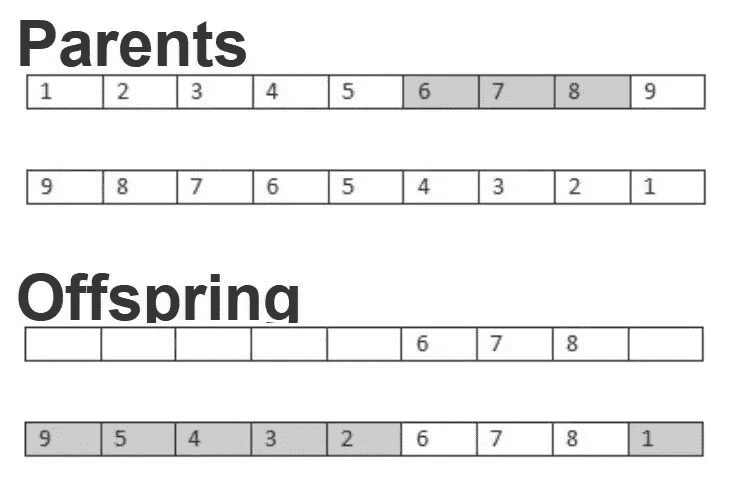
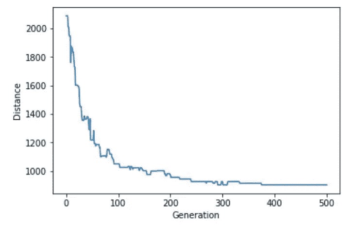

# 推销员的进化:Python 的完整遗传算法教程

> 原文：<https://towardsdatascience.com/evolution-of-a-salesman-a-complete-genetic-algorithm-tutorial-for-python-6fe5d2b3ca35?source=collection_archive---------0----------------------->

从自然选择中汲取灵感，遗传算法(GA)是一种解决搜索和优化问题的迷人方法。虽然已经有很多关于遗传算法的文章(见这里的和这里的)，但很少有人展示用 Python 一步一步实现更复杂问题的遗传算法。这就是本教程的由来！继续学习，到最后，您将完全理解如何从头开始部署 GA。


Photo by chuttersnap on Unsplash

# 介绍

## 问题是

在本教程中，我们将使用遗传算法来寻找旅行推销员问题(TSP)的解决方案。TSP 描述如下:

> 给定一个城市列表和每对城市之间的距离，访问每个城市并返回起始城市的最短可能路线是什么


Illustration of a potential solution to the TSP (By Xypron [Public domain], from Wikimedia Commons)

有鉴于此，有两条重要的规则要记住:

1.  每个城市只需要被访问一次
2.  我们必须回到出发城市，所以我们的总距离需要相应地计算

## 方法

让我们从几个定义开始，在 TSP 的上下文中重新表述:

*   **基因:**一座城市(用(x，y)坐标表示)
*   **个体(又名“染色体”):**满足上述条件的单一途径
*   **群体:**可能路线的集合(即个体的集合)
*   **父级:**两个路由组合在一起创建一个新路由
*   **交配池:**用于创建我们下一个种群(从而创建下一代路线)的亲代集合
*   **Fitness:** 一个告诉我们每条路线有多好的函数(在我们的例子中，距离有多短)
*   **变异:**通过随机交换路线上的两个城市，在我们的人口中引入变异的一种方式
*   精英主义:将最优秀的个体带入下一代的一种方式

我们的 GA 将按以下步骤进行:


[Photo by Raw Pixel/Unsplash](https://unsplash.com/?utm_source=medium&utm_medium=referral)

1.创造人口

2.确定适合度

3.选择交配池

4.类型

5.使突变

6.*重复*

现在，让我们来看看实际情况。

# 构建我们的遗传算法

虽然我们 GA 的每个部分都是从头开始构建的，但我们将使用一些标准包来简化工作:

```
import numpy as np, random, operator, pandas as pd, matplotlib.pyplot as plt
```

## 创建两个类:城市和健身

我们首先创建一个`City`类，它将允许我们创建和处理我们的城市。这些只是我们的(x，y)坐标。在 City 类中，我们在第 6 行添加了一个`distance`计算(利用毕达哥拉斯定理),并在第 12 行使用`__repr__`以更简洁的方式输出城市坐标。

我们还将创建一个`Fitness`类。在我们的例子中，我们将适应度视为路径距离的倒数。我们希望最小化路线距离，因此较大的适应值更好。基于规则#2，我们需要在相同的地方开始和结束，所以这个额外的计算在距离计算的第 13 行中被考虑。

## 创造人口

我们现在可以制造我们的初始种群(又名第一代)。为此，我们需要创建一个函数来生成满足我们条件的路线(*注意:我们将在教程*的最后实际运行 GA 时创建我们的城市列表)。为了创建个人，我们随机选择访问每个城市的顺序:

这产生了一个个体，但我们需要一个完整的群体，所以让我们在下一个函数中这样做。这就像循环执行`createRoute`函数一样简单，直到我们为我们的人口找到尽可能多的路线。

*注意:我们只需使用这些函数来创建初始群体。后代将通过育种和突变产生。*

## 确定适合度

接下来，进化的乐趣开始了。为了模拟我们的“适者生存”，我们可以利用`Fitness`对种群中的每个个体进行排名。我们的输出将是一个有序的列表，其中包含路线 id 和每个相关的健身分数。

## 选择交配池

对于如何选择将用于创建下一代的父代，有几个选项。最常见的方法是**健身比例选择**(又名“轮盘选择”)或**锦标赛选择**:

*   **适应度比例选择**(下面实现的版本):每个个体相对于群体的适应度用于分配选择的概率。把这想象成被选中的适应度加权概率。
*   **锦标赛选择**:从群体中随机选择一定数量的个体，选择群体中适应性最高的个体作为第一个父母。如此反复选择第二个亲本。

另一个需要考虑的设计特点是使用精英主义。在精英主义下，群体中表现最好的个体将自动延续到下一代，确保最成功的个体得以延续。

为了清楚起见，我们将分两步创建交配池。首先，我们将使用来自`rankRoutes`的输出来确定在我们的`selection`函数中选择哪些路线。在第 3–5 行，我们通过计算每个人的相对健康体重来设置轮盘赌。在第 9 行，我们比较随机抽取的数字和这些重量来选择我们的交配池。我们还想保留我们的最佳路线，所以我们在第 7 行引入了精英主义。最终，`selection`函数返回一个路由 id 列表，我们可以用它在`matingPool`函数中创建交配池。

现在我们已经从`selection`函数中获得了将组成我们的交配池的路由的 id，我们可以创建交配池了。我们只是从我们的人口中挑选出一些人。

## 类型

随着交配池的建立，我们可以在一个叫做**杂交**(又名“繁殖”)的过程中创造下一代。如果我们的个体是由 0 和 1 组成的字符串，而我们的两个规则不适用(例如，假设我们正在决定是否将一支股票纳入投资组合)，我们可以简单地选择一个交叉点，然后将这两个字符串拼接在一起，产生一个后代。

然而，TSP 是独一无二的，因为我们需要一次包含所有的位置。为了遵守这个规则，我们可以使用一个叫做**有序交叉**的特殊繁殖函数。在有序交叉中，我们随机选择第一个父字符串的一个子集(见下面的`breed`函数中的第 12 行),然后用来自第二个父字符串的基因按照它们出现的顺序填充路径的剩余部分，而不复制来自第一个父字符串的所选子集中的任何基因(见下面的`breed`函数中的第 15 行)。



Illustration of ordered crossover (credit: [Lee Jacobson](http://www.theprojectspot.com/tutorial-post/applying-a-genetic-algorithm-to-the-travelling-salesman-problem/5))

接下来，我们将对此进行归纳，以创建我们的后代种群。在第 5 行中，我们使用精英主义来保留当前群体中的最佳路线。然后，在第 8 行，我们使用`breed`函数来填充下一代的剩余部分。

## 使突变

变异在遗传算法中起着重要的作用，因为它通过引入允许我们探索解空间的其他部分的新路径来帮助避免局部收敛。类似于交叉，TSP 在涉及到变异时有一个特殊的考虑。同样，如果我们有一条 0 和 1 的染色体，突变就意味着基因从 0 变为 1 的概率很低，反之亦然(继续前面的例子，包含在后代投资组合中的股票现在被排除在外)。

但是，既然需要遵守我们的规则，就不能掉城。相反，我们将使用**交换突变**。这意味着，在指定的低概率下，两个城市将在我们的路线上交换位置。我们将在我们的`mutate`函数中为一个人这样做:

接下来，我们可以扩展`mutate`函数来运行新的人口。

## 重复

我们快到了。让我们将这些片段组合在一起，创建一个产生新一代的函数。首先，我们使用`rankRoutes`对当前代中的路线进行排序。然后，我们通过运行`selection`函数来确定我们的潜在父母，这允许我们使用`matingPool`函数来创建交配池。最后，我们使用`breedPopulation`函数创建新的一代，然后使用`mutatePopulation`函数应用变异。

## 运动中的进化

我们终于拥有了创建 GA 的所有要素！我们所要做的就是创建初始种群，然后我们可以根据需要进行多次循环。当然，我们还希望看到最佳路线以及我们改进了多少，因此我们在第 3 行获取初始距离(记住，距离是适应度的倒数)，在第 8 行获取最终距离，在第 9 行获取最佳路线。

# 运行遗传算法

一切就绪后，解决 TSP 就像两步一样简单:

首先，我们需要一个旅行城市的列表。对于这个演示，我们将创建一个 25 个随机城市的列表(看起来城市数量很少，但是蛮力将不得不测试 300 多条 sextillion 路线！):

然后，运行遗传算法就是一行简单的代码。这是艺术与科学相遇的地方；你应该看看哪些假设最适合你。在这个例子中，我们每一代有 100 个个体，保留 20 个精英个体，对给定的基因使用 1%的突变率，并运行 500 代:

## 额外功能:绘制改进图

知道我们的开始和结束距离以及建议的路线是很好的，但如果我们没有看到我们的距离是如何随着时间的推移而改善的，那将是我们的失职。通过对我们的`geneticAlgorithm`函数的简单调整，我们可以将每一代的最短距离存储在一个`progress`列表中，然后绘制结果。

以与之前相同的方式运行 GA，但现在使用新创建的`geneticAlgorithmPlot`函数:



Sample output from the geneticAlgorithmPlot function

# 结论

我希望这是学习如何构建自己的 GA 的一种有趣的实践方式。自己试试，看看你能找到多短的路线。或者更进一步，尝试在另一个问题集上实现 GA；看看如何改变`breed`和`mutate`函数来处理其他类型的染色体。我们只是触及了表面！

## 结束注释

你可以在这里找到一个合并的笔记本[。](https://github.com/ezstoltz/genetic-algorithm/blob/master/genetic_algorithm_TSP.ipynb)

**参考文献:**

*   [http://www . the projectspot . com/tutorial-post/applying-a-genetic-algorithm-to-traveling-salesman-problem/5](http://www.theprojectspot.com/tutorial-post/applying-a-genetic-algorithm-to-the-travelling-salesman-problem/5)
*   [https://gist.github.com/turbofart/3428880](https://gist.github.com/turbofart/3428880)
*   [https://gist . github . com/nicolle Louis/d4f 88 D5 BD 566298d 4279 BCB 69934 f 51d](https://gist.github.com/NicolleLouis/d4f88d5bd566298d4279bcb69934f51d)
*   [https://en.wikipedia.org/wiki/Travelling_salesman_problem](https://en.wikipedia.org/wiki/Travelling_salesman_problem)