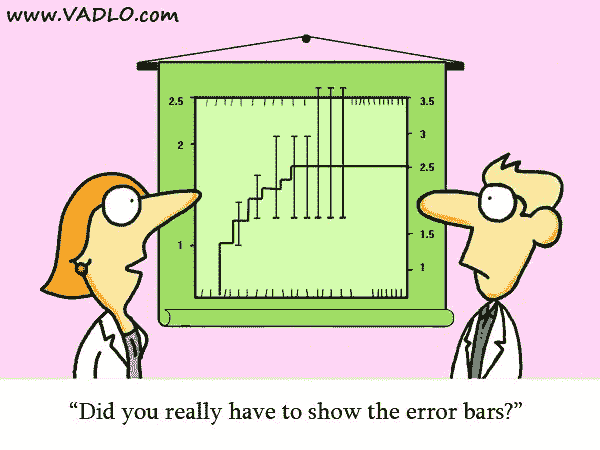
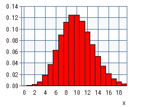

# 如何将数据科学应用于真实的业务问题

> 原文：<https://towardsdatascience.com/examples-of-applied-data-science-in-healthcare-and-e-commerce-e3b4a77ed306?source=collection_archive---------1----------------------->

专注于电子商务和医疗保健

**抬头，如果您想跳过简介直接进入示例，请滚动至第一个标题*

数据科学和统计学不是魔法。他们不会神奇地解决公司的所有问题。然而，它们是有用的工具，可以帮助公司做出更准确的决策，并自动化团队需要做出的重复性工作和选择。

当提到自然语言处理、图像识别和聊天机器人时，机器学习和数据科学被引用了很多。

然而，你也可以应用数据科学技术来帮助你的[经理做出决策、预测未来收入、细分市场、制作更好的内容和更有效地诊断病人。](https://www.theseattledataguy.com/top-30-tips-data-science-team-succeeds/)

下面，我们将讨论一些统计和应用数据科学算法的案例，它们可以帮助您的企业和团队产生更准确的结果。

这不需要复杂的 hadoop 集群和云分析。不是说这些不神奇。只是，让我们先从基础开始！

在我们跳进技术和炒作的兔子洞之前！



我们将举例说明电子商务和医疗操作。

我们的团队主要专注于实践和应用数据科学。因此，我们深入到我们过去的经验中，向你展示一些很棒但很容易应用的方法，你可以在今天利用统计数据开始做出更好的决策。

下面的方法通常只是一个更大系统的一小部分。我们相信获取这些小的部分和细节是开始构建准确有效的系统所必需的。

这些[统计方法中的一些](http://www.acheronanalytics.com/acheron-blog/brilliant-explanation-of-a-decision-tree-algorithms)甚至不需要大量的编程或专业技术知识。然而，如果正确实施，这些基本技术可以在更大的系统中以更大的规模应用。

我们这样做是因为我们知道实现一个算法需要很大的努力。

团队必须适当地计划他们将如何集成数据库、业务逻辑、算法和新策略，以确保项目成功。

这需要大量的资源和时间。

# 欺诈检测和贝叶斯定理

无论您是一家处理医疗、财产或车辆索赔的保险公司。保险欺诈是一个大问题。

他们是怎么解决的？保险提供商必须要么建立一个算法，要么让审计员人工检查，看看索赔是否是欺诈性的。

信不信由你，仍有为数众多的保险公司手动完成这项工作(在这种情况下，我们正在考虑从数据库中获取一个数据，并手动在 excel 中过滤)。

保险提供商将在审计方面投入大量精力。至少出于这两个原因:

*   把钱拿回来
*   试图阻止未来的保险欺诈索赔

这里的问题是，这会占用宝贵的资源时间，如果他们错误地识别索赔，可能会在工资和其他资源方面花费更多的钱，而不是从欺诈性索赔中收回的钱。

在本例中，一家名为 Itena 的保险提供商创建了一种算法来帮助提高他们团队处理索赔的速度。

那么 Itena 如何知道他们开发的算法是否值得呢？

好吧，如果你有一个数学定理来分析你的算法呢！

哇哦。那太“元”了。

就当这是一次信心检查，以后可以帮助他们计算是否值得在算法上投资

在这种情况下，他们将使用贝叶斯定理


Original Post [https://xkcd.com/1236/](https://xkcd.com/1236/)

贝叶斯最擅长的是提供统计数据来证明他们所得到的信息有多准确。

他们能有多信任自己的算法？因为它们很可能同时具有假阳性和假阴性。他们的算法到底有多准确？

假设 Itena 的数据科学团队知道收到的索赔中有 2%是欺诈性的。

他们计算出，如果他们能够正确识别所有欺诈性索赔，他们可以节省 100 万美元！

哇哦。他们刚刚让你所有的主管都签字同意了！我的意思是，这是 100 万美元！即使公司净赚 1 亿美元。这是一次伟大的拯救

厉害！

因此，Itena 数据科学团队开发了一种算法来检测欺诈性索赔。

它并不完美，但它是一个很好的开始！

但是，它到底有多准确呢？当然，他们知道 85%被预测为欺诈的欺诈性声明实际上是欺诈性的？


作为优秀的数据科学家和普通科学家。他们也知道你必须检查错误。比如误报。

对他们来说，去找管理人员说这个测试有 85%的准确性是不正确的！在正常索赔栏中查找。

他们也有 4%的假阳性率。这是怎么回事？

这时他们引入了我们的老朋友贝叶斯定理。

贝叶斯定理对于测试他们应该信任测试的程度非常有用。

像医学测试一样，算法也可能出现假阳性。

就像一些医学检查可能会返回癌症的假阳性一样。无论你是否应该获得贷款，以及当你访问 Amazon.com 时是否应该获得折扣，算法都可能对欺诈性索赔返回误报。

我们知道数据科学团队可能会为公司节省 100 万美元。然而，他们也将花费 Itena 的资金和资源小时。因此，他们需要确保回报大于成本！

**那么这个算法有多精确呢？**

他们可能会惊讶地发现这实际上是多么不准确！

这是一个粗略的数学公式:

**P(欺诈索赔)= 2%**

**P(明确标记为欺诈|真实欺诈索赔)= 85%**

**P(非欺诈)= 98%**

**P(标记欺诈索赔|真实非欺诈)= 4%**

**P(欺诈索赔)*P(明确标记为欺诈|真实欺诈索赔)/**

**(P(欺诈索赔)*P(明确标记为欺诈|真实欺诈索赔)+ P(标记为欺诈索赔|真实非欺诈)+P(非欺诈))**

[**在这种情况下，只有大约 30%被预测为**欺诈的预测索赔实际上是根据贝叶斯定理。](https://betterexplained.com/articles/an-intuitive-and-short-explanation-of-bayes-theorem/)

为什么？

这是因为只有 2%的索赔是欺诈性的。也就是说尽管算法有 85%的准确率。对于 2%的数据，它只有 85%的准确率。

它还错误地将 98%的数据中的 4%分类。

他们的假阴性数据比真阳性数据多得多。

当你真正坐下来思考这个问题的时候，这很有趣。

现在的问题是，他们能证明节省的合理性吗？公司调查所有的索赔要花多少钱？这个真的要看索赔额度了。

如果他们处理的是医疗索赔中的 7 美元加价，可能就没那么多了。

另一方面，如果是 1 万美元的车祸理赔，公司还是会想扑上去的！

幸运的是，我们有可以快速运行这些算法的计算机，并且有望建立一个令人惊讶的过程，快速允许索赔得到裁定。

如果计算机不在那里，我们确实想把它放在正确的位置上。

如果取而代之的是，你有同样的准确性，并且让一个人来执行这项任务。假设他们花费了价值 200 美元的资源来对一项索赔进行分析！

如果索赔价值 500 美元，是否值得花费时间？

# 用户购买你的产品的可能性有多大

预计 2017 年电子商务的交易额将超过 2 万亿美元。虽然很多人直接通过亚马逊或阿里巴巴，但也有很多其他网站试图让顾客购买他们的产品。

这涉及大量的跨平台营销、内容营销和广告。

公司如何知道他们的广告或他们推广的网站实际上是否有效？他们得到的印象和参与真的变成了真金白银吗？

你如何开始回答这些问题？

假设你的[公司在线销售厨房设备](http://excookfoodplatter.blogspot.com/2016/12/my-favorite-chef-power-tools.html)。

你支付几个网站交叉推广你的产品和电子商务网站。你知道你从每个网站获得的平均购买率，因为你一直在努力跟踪 cookies 并保持一个干净的数据库。

你想知道你应该在未来的活动中投入多少资金。根据目前的数据，你知道每小时有 10 个人购买来自“站点 A”的产品。你相信只要你有超过 80%的机会保持至少每小时 6 的速度。你可以证明市场成本的合理性。

我们该如何解决这个问题？


嗯，我们可以使用[泊松分布来帮助我们。](https://www.theseattledataguy.com/statistics-data-scientist-review/)

如果你已经知道平均每小时有 10 个人从你的网站上购买产品，你可以计算出每小时有 n 个人出现的概率。

您可以将这些信息提升到更精细的层次。这将允许你利用季节性技术和泊松分布的组合来预测未来的收入和更有效地分配资金。

那将需要更详细的解释和大量的数据。现在，我们将关注第一个问题。

我们将利用[泊松累积概率函数](http://www.itl.nist.gov/div898/handbook/eda/section3/eda366j.htm)。本质上，你只是把泊松分布方程中每个大于 6 的概率相加。


如果你运行它的λ为 10，你会得到如下图。



使用[泊松累积概率函数](http://www.itl.nist.gov/div898/handbook/eda/section3/eda366j.htm)你会得到大约 94%

这样你的公司就可以继续支付网站 A 的营销费用了！

然而！

如果只有每小时 7 英镑的话。那么你只有 70%的机会在一小时内卖出至少 6 件商品！所以这个项目不得不被砍掉。

你可以很容易地设置这个阈值，并开始创建一个拍卖类型的系统，其中你的预算是自动分配的基础上，未来的回报和购买概率的比例！

那听起来像一个有趣的项目！

不要误解我们。归根结底，数据科学可用于创建与客户互动的系统。

然而，它也可以用来帮助提高准确决策的速度。以及开发具有故障保险的决策系统，限制由分析师和管理层做出的简单和复杂决策的数量。

# 应用线性回归

假设你在一家医院工作，你注意到在过去的几年里，某项手术的费用逐月上涨。

你想知道手术的月份和费用之间是否有线性关系。

你分析的第一步是弄清楚是否有一个模型可以用来预测手术费用的上涨。

还有第二步，我们不会再讨论，那就是找出原因！

数据科学不仅仅提供创建模型的工具。

*它还提供了让人们找出原因的工具！所以当你完成这个模型后，你会想知道为什么。*

*也许你会认为这是因为工资、设备成本和步骤复杂性的增加，等等。与每次手术和每月的价格相比，这需要更复杂的数据。*

如果您的散点图似乎遵循如下所示的线性模式。可以开始用线性回归或者[甚至多元线性回归的概念来看问题。这取决于它看起来适合什么(或者更好的是，你的自动化系统检测哪个型号！)](https://www.ncbi.nlm.nih.gov/pmc/articles/PMC3049417/)

这是一种最简单的预测形式，因为你只是试图创建一条趋势线。

你可以通过从起点到终点画一条线来估算。然而，这可能不是"[](https://onlinecourses.science.psu.edu/stat504/node/60)**"**

****

**尽管您可以使用 excel、python、R 或任何其他语言来找到线性回归模型。我们想给你看一段视频，教你如何手工制作。**

**这涉及到很多总结，但不要让这吓到你。最后，大多数人不动手做的原因不是因为数学很难**

**相反，数学非常简单。然而，很多事情都可能出错。尤其是简单的计算。**

**仅仅因为你完成了模型，并不意味着你完成了！您的数据集通常并不完全符合直线。所以测试你的模型的有效性是很重要的。**

# **如何确定趋势线或线性回归模型的最佳拟合？**

**有几种方法。下面我们将讨论 R 平方误差。**

**什么是 R 平方？也称为决定系数。**

**大多数模型都有一种或几种方法来计算模型的精度。**

**我们有 [ROC 曲线、AUC、均方误差、方差等等。](https://www.medcalc.org/manual/roc-curves.php)**

**在这种情况下，R 平方误差等于:**

****

**回归误差平方和是您正在检查的当前点与模型线上对应点之间的差值。**

**让你的趋势线上的点等于ŷ**

**((mx1+b)-ŷ )2+…((mxn+b)-ŷ )2**

**总变量是模型上的点和实际数据的平均值 y 之间的差。**

**(y1-y ) 2+ (yn-y )2**

**因此，在这种情况下，我们可以在 excel、R 或 python 中运行线性回归，并获得非常符合直线的模型。**

**在这种情况下，根据数据，R 平方误差为 0.93。这实际上只是说明了解释差异的数量。**

**重要的是要记住模型的用途！不是每条符合的线都是正确的！**

**尤其是当你开始开发更复杂的模型的时候！**

**这就是为什么数据科学家不仅仅是创造模型。他们也在寻找为什么！**

**这是近 20 年来最大的变化之一！我们有能力给出背景。在统计仅限于数字之前。**

**他们只能说出发生了什么和可能会发生什么。**

**关于需要改变什么的信息非常少！现在，数据科学家可以给出原因了！因此，当我们知道原因后，我们就有能力给出战略建议。**

**例如，在这种情况下，你可以向你的医疗主任展示这个简单的趋势，然后分析为什么！**

**当我们出去帮助团队的时候。我们的部分重点是帮助他们带着他们的分析去见他们的主管，以获得他们的批准。**

**这是数据驱动的开始。这需要好奇心和一点点创业精神。**

**有了上图的发现，如果你能发现你可以平均减少 5.37 美元的手术费用，医院每年做 100，000 例手术。**

**您可以证明您每年为公司节省了 537，000 美元。希望你能加薪！**

**记住“所有的模型都是错的，但有些是有用的”仍然很重要。**

# **逻辑回归，二元评估**

**与线性回归不同，逻辑回归有一个二进制输出。通常是通过或失败，1 或 0。线性回归的输出是连续的，因为逻辑通常用是或否来定义。**

**这就是为什么它被大量用于商业任务，如决定你是否应该给某人贷款，我可以预测一个病人是否患有某种疾病，以及许多其他每天困扰我们的是或否类型的问题。**

**使用逻辑回归允许利用多个变量。因此，即使你有一个复杂的商业决策，需要考虑几个不同的变量，逻辑回归也是一个很好的解决方案。**

**我们可以回头看看欺诈索赔的例子。确定索赔是否欺诈的算法可以是逻辑回归模型？你可能对索赔是否欺诈有一定的了解。您可能有位置、患者信息、医院统计数据等。**

**假设你想知道一个医生是否真的在做心脏直视手术，而不仅仅是假装开账单(这有点牵强，但还是顺其自然吧)。**

**你可能知道，相同的心内直视手术索赔也应该包括特定设备的使用，如核磁共振成像或实验室工作。如果没有出现这种情况，很有可能是欺诈。**

**你也可以设计一些功能。您可以根据通过的索赔和审计，找到特定医生的心脏手术是虚假的可能性，您可以计算医生每天完成的手术数量，或者您的团队有主题专家或上下文数据支持的任何其他信息在虚假索赔中发挥作用。**

**这个模型很难手工计算。幸运的是！这就是为什么 R 和 Python 是令人惊叹的语言。下面是 R 代码实现(glm 代表通用线性模型库)。这基本上是一行实现**

**注意:这有点误导。虽然它看起来像一行实现。在使用之前的公式之前，可能需要进行大量的数据清理和标准化工作！**

```
*model <- glm(formula = FraudulentClaim ~ ., family = binomial(link = "logit"), 
    data = train)*
```

**来解释一下这个实现。公式变量的输出设置在左侧。那么波浪符号表示“欺诈性索赔”依赖于句点。在 R 中，句点表示训练集中除因变量之外的所有变量。**

**如果你的团队只认为这是另一组变量，那么他们可以使用下面的例子，而不是周期。**

```
*model <- glm(formula = FraudulentClaim ~ income + age + X, family = binomial(link = "logit"), 
    data = train)*
```

**数学模型看起来像这样:**

****

**图片来自[http://www . saedsayad . com/logistic _ regression . htm[/caption]](http://www.saedsayad.com/logistic_regression.htm[/caption])**

**这些“b”变量中的每一个都代表另一个可能的变量。可能是性别、年龄、收入(通常都是[标准化](https://en.wikipedia.org/wiki/Normalization_(statistics)))。)**

**这一统计学原理也可用于其他医院任务，如再入院、诊断和欺诈索赔**

# **应用数据科学**

**这些是一些基本的案例研究，我们展示了如何在决策过程中实施一些定理和算法。**

**它们是一个很好的开始，可以用在更大的项目中，以帮助改善您的数据科学和公司的数据驱动文化！**

**随之而来的是一些我们想注意的事情**

**算法和数据科学使用的一些利弊**

## **赞成的意见**

**关注数据驱动的决策，而不是政治和直觉**

**自动做出可能会造成财务和精神负担的决策**

**提高一致性、准确性，并迫使团队制定决策流程**

**减少花费在任务上的时间**

## **骗局**

**如果算法不正确，团队可能会过度信任它**

****下一篇数据科学文章****

**我们的下一篇文章我们希望将重点放在一些更技术性和基于编程的实现和应用上！如果您有任何具体的案例需要我们探讨，请告诉我们！！**

**您可能喜欢的其他数据科学资源:**

**[个性化与情境强盗](https://web.archive.org/web/20161226121822/http://engineering.richrelevance.com/personalization-contextual-bandits/)**

**[作为数据科学家如何在公司政治中生存](https://www.theseattledataguy.com/top-30-tips-data-science-team-succeeds/)**

**[什么是决策树](http://www.acheronanalytics.com/acheron-blog/brilliant-explanation-of-a-decision-tree-algorithms)**