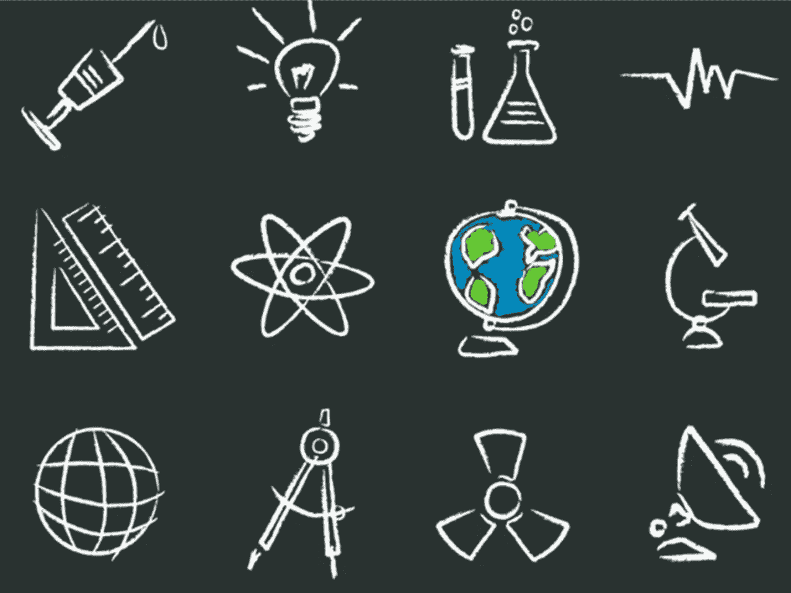

# 体验数据科学中的“科学”

> 原文：<https://towardsdatascience.com/experiencing-the-science-in-data-science-b37862b3fbfb?source=collection_archive---------6----------------------->

我从事软件行业已经很长时间了。我扮演过各种角色，但大多数时候我是一名开发人员，或者更正式地说，我是一名“软件工程师”。

今天，我是一名数据科学家。虽然我的工作并没有完全不同，我仍然坐在电脑前写代码，但工作性质不同了。在我开始数据科学之旅后不久，我开始经历沮丧的时刻。这并不是说我不喜欢我的工作，只是偶尔我会因为我当时从事的项目而感到沮丧。大多数时候，那些时刻是我认为我知道我在做什么，而意识到我不知道的结果。今天我已经意识到，这些时刻只是工程和科学之间的差异。

工程有很多定义，在维基百科中总结为:

**工程**是应用[数学](https://en.wikipedia.org/wiki/Mathematics)，以及[科学](https://en.wikipedia.org/wiki/Science)、[经济](https://en.wikipedia.org/wiki/Economics)、社会、实用[知识](https://en.wikipedia.org/wiki/Knowledge)为了[发明](https://en.wikipedia.org/wiki/Invention)、[创新](https://en.wikipedia.org/wiki/Innovate)、[设计](https://en.wikipedia.org/wiki/Design)、建造[维护](https://en.wikipedia.org/wiki/Maintenance,_repair,_and_operations)、[研究](https://en.wikipedia.org/wiki/Engineering_research)，改进[结构](https://en.wikipedia.org/wiki/Structural_engineering)、[机器](https://en.wikipedia.org/wiki/Machine)

或者在我的简短版本中:

**工程**是为了解决问题而应用的技术”

是的，也许这个定义太宽泛了，但我想说的是，在工程中，在大多数情况下，我们有一个明确定义的问题需要使用明确定义的资源和约束来解决。像“让我们建造一座支持许多汽车的桥梁”、“让我们铺设一条支持许多人的电线”或“让我们建造一个允许许多用户共享照片的应用程序”这样的问题。

许多人会同意软件开发就像工程一样。我们有一个问题，我们需要解决它。有时，这些是非常困难和重要的问题，在这种情况下，开发人员(或工程师)必须利用他最好的知识、经验和创造力。这就是开发的乐趣所在。你努力工作，你发明东西，最后你解决了问题。开发(工程)很有趣，我喜欢它！

这个过程的一个非常好的特性是能够知道你确实解决了问题，并且能够判断(在大多数情况下)一种方法可能有效而另一种方法无效。这正是工程和科学之间的主要区别(在我看来也是游戏规则的改变者)。

维基百科对科学的定义是:

“以可测试的[解释](https://en.wikipedia.org/wiki/Explanation)和关于[宇宙](https://en.wikipedia.org/wiki/Universe)的[预测](https://en.wikipedia.org/wiki/Predictions)的形式建立和组织[知识](https://en.wikipedia.org/wiki/Knowledge)的系统企业。”

或者在我的删节版中:

“一种描述现实的方式”

也许这是一个太深奥的定义，但最终科学是一个创造世界/宇宙如何运作的想法(模型)的过程。科学的一个重要属性是它必须是“可测试的”或“可测量的”一旦你有了一个假设，你必须能够测试，测量和重现你的结果，以证明这个理论/想法/模型描述的空间足够好。

在数据科学中，我们正是这样做的。我们有一些问题(如在工程中),我们试图创建一个模型，以尽可能最好的方式描述这个问题(世界),这样我们就可以对我们的问题做出预测/结论。我们用这个模型进行实验，测量我们的结果，确保我们可以重现我们的结果，并最终创建一个产品(或报告)。实验的一个不好的地方是它们可能会失败。此外，与工程不同，我们不能 100%确定我们解决了问题，也很难知道什么方法行得通，什么行不通(这就是实验的目的)。

数据科学家的工作很大一部分是运行实验，实验可能会失败。你可能对你的问题有一个很好的想法，直觉告诉你这个想法一定会大大提高你的模型的性能，你努力开发这个想法，你测试了几天，最后你发现你的想法..嗯，没用。它不起作用是因为你错过了一些东西，因为这个世界并不像你想象的那样工作，因为你没有足够的或不好的(嘈杂的)数据或其他原因。这令人沮丧，或者至少对初级数据科学家(或任何科学家)来说是令人沮丧的，尤其是对软件开发人员(或工程师)来说。

过了一段时间，我开始意识到这是这份工作的乐趣所在。你可能会失败，但当你成功时，那是一种很棒的感觉。数据科学很有趣，我喜欢它！

有一件事比实验失败更令人沮丧。当你实验失败的时候，你知道你在哪里，你知道你尝试过(和没有尝试过)什么，你知道它没有成功(或曾经成功)。经过几次实验后，你会知道什么可能有效，什么可能无效。为了实现这一点，你必须能够知道什么有效，什么无效，这意味着你**必须**能够衡量你的结果(并且相信你的衡量！).如果你没有一个合适的测量或者你不能重现你的结果，你就完全被蒙在鼓里，这真的很令人沮丧。

如果我有一个给初级数据科学家的建议，那就是你必须为你的问题/实验创建一个值得信赖的测量，无论是通过获得高质量的数据，自己标记还是任何其他方法，你都必须这样做。