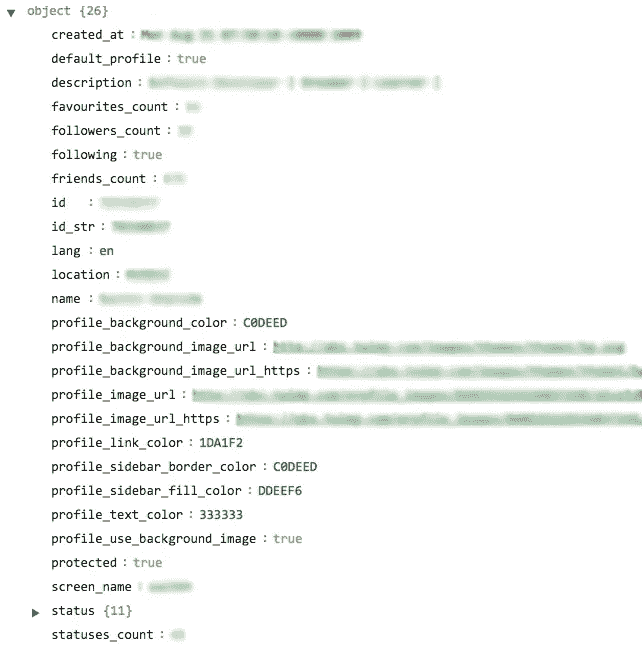
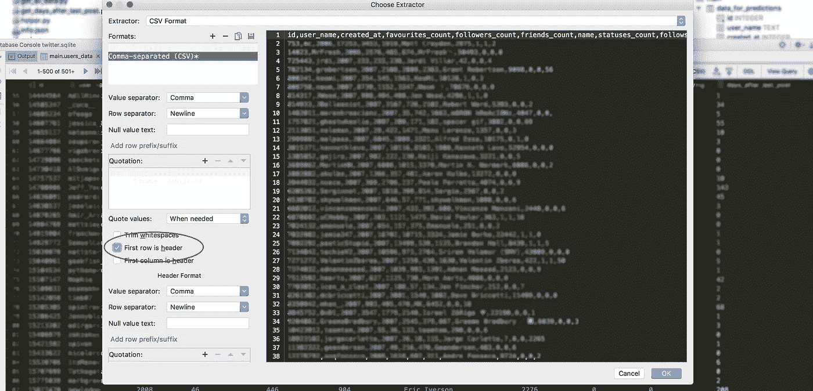
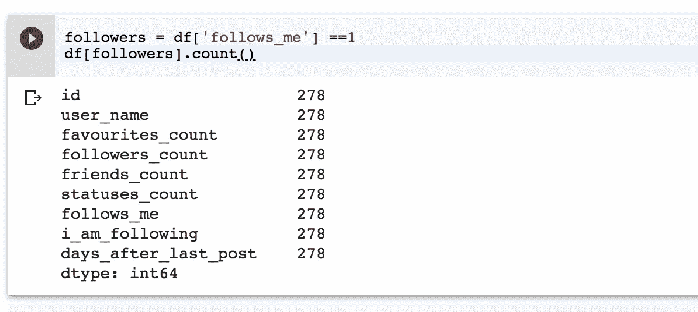
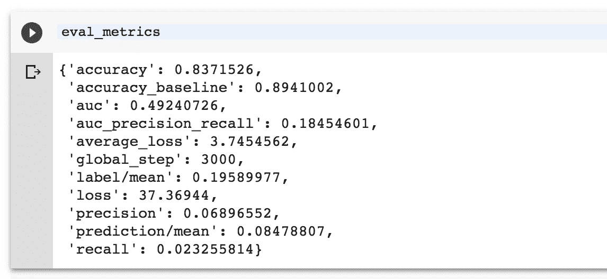

# 使用 Tensorflow 试验 twitter 数据

> 原文：<https://towardsdatascience.com/experimenting-with-twitter-data-using-tensorflow-ea88a8078fd?source=collection_archive---------7----------------------->


Credits — author : Diogo Palhais; illustrator : Tatuna Gverdtsiteli

机器学习和人工智能最吸引人的地方在于，通过使用它们，它让我们有可能开始重新思考一切——你可以从完全不同的角度看待一切，我认为，有时这种“重新思考”的事实是新发明的关键。

几天前我有过这样的时刻，这真的很有趣，我决定写下这个实验。

我大约在 7 年前创建了我的 twitter 账户，但我并没有经常使用它，几个月后，我将它与我的一个网站连接起来，并在上面安装了“自动转发”机器人。在这之后，很多事情都变了，我没有时间建立我的网站，我删除了这个机器人，因为我并不真正喜欢社交网络——我的 twitter 账户已经暂停了几年。

几个月前，我决定开始使用 Twitter。我想和其他人分享我的出版物，我的公开回购(或者不仅仅是我的)——所以这就是我决定重新加入 Twitter 的原因，但是当然，根据我的账户过去的活动，我有兴趣完全不同的追随者。所以，老实说，这对我的动力影响很大。

我决定寻找这样的用户——我也会对他们感兴趣。

起初，当你在 Twitter 上开始活动时，你没有太多的帖子(当然我删除了:D 的旧帖子)和关注者——你关注的人不会关注你的可能性很大，你需要长时间添加真正有趣的帖子，以尽可能最好地展示自己。

我们已经提到了“添加关注者”，所以在我开始写这个故事的主要部分之前，我想分享一下 Twitter 的规则和限制，因为在 Twitter 上对不道德行为的处罚是非常严重的。

以下是一些重要的链接:

[](https://help.twitter.com/en/rules-and-policies/twitter-following-rules) [## 以下限制常见问题

### 要了解更多关于以下内容，请阅读以下常见问题。我们不限制您可以拥有的关注者数量…

help.twitter.com](https://help.twitter.com/en/rules-and-policies/twitter-following-rules) [](https://help.twitter.com/en/rules-and-policies/twitter-automation) [## 自动化规则

### 此页面主要面向开发人员。对于 Twitter 用户:你最终要对所采取的行动负责…

help.twitter.com](https://help.twitter.com/en/rules-and-policies/twitter-automation) 

S o，我们的目标是根据 Twitter 的用户数据(我们稍后会生成)建立分类模型，预测用户未来的行为——当我们向他/她发出追随请求时，这个用户是否会追随我们。所以，简而言之——这应该有助于我们找到未来会追随我们的人。

起初，我需要 Python 包，因为直接与 Twitter api 通信不是一个好主意，而且需要更多的时间，所以正如我们所知，Python 是“包含电池”的，我很容易就找到了一个很好的包，它具有我在这个项目中需要的所有功能，更重要的是，它还有很好的文档。

以下是链接:

 [## 欢迎阅读 python-twitter 的文档！- python-twitter 3.4.2 文档

### 编辑描述

python-twitter.readthedocs.io](https://python-twitter.readthedocs.io/en/latest/index.html) 

要使用这个包，首先我们需要使用 pip 安装它。

```
$ pip install python-twitter
```

在这之后，我们需要来自 Twitter 的 api 凭证，您可以很容易地从这里获得:

 [## Twitter 开发者平台

### Twitter 是世界上企业和个人联系的最佳场所。自从早期的 Twitter 人…

developer.twitter.com](https://developer.twitter.com/) 

如果看起来有点混乱，您可以通过截图查看详细说明:

 [## 入门- python-twitter 3.4.2 文档

### 如果那个页面上的信息有任何问题，Twitter 会投诉，你可以修复。(确保…

python-twitter.readthedocs.io](https://python-twitter.readthedocs.io/en/latest/getting_started.html) 

好了，现在我们可以成功地连接 Twitter api 了:

现在是开始数据挖掘的时候了。我们需要收集足够的数据来训练我们的模型，这里有两个选项来获得它:*第一个*，这更难，我这样做是因为我没有任何选择——我们应该尝试关注有趣的人，并保存他们是否关注我们，以及*第二个*选项——对于那些已经有足够多朋友和追随者的人来说——你可以使用这些数据来训练你的模型。

在我的情况下，第二个选择行不通，我不得不选择更难的一个。因此，对于第一个场景，我需要在 Twitter 上找到受欢迎的人，他们大多发布关于编程/机器学习的帖子，因为他们的粉丝对我来说也非常好，所以我开始收集关于这类用户的数据。

首先，我选择“一个 Twitter 摇滚明星”用户，他总是发布关于编程或 ml 的帖子，然后获得他/她的追随者列表:

在那之后，我试着得到关于他们每一个人的详细信息。我正在使用的软件包会为每个用户返回这样的数据:



这里是非常有趣的信息，我可以用它来训练我的模型，但是我不想关注他们中的每一个人，我只想关注那些和我有相同兴趣并且有一些活动的人(见第 28 行)。

尽管事实上，Twitter api 和我们的软件包都让我们有可能非常容易地关注用户:

尽管如此，你必须小心，这样你的行为才不会看起来像垃圾邮件或者违反 Twitter 规则。

所以，如你所见，我用简单的“如果条件”来过滤那些不活跃或者没有足够多朋友的人。因为我想保存最大限度过滤的数据。

我决定在关系数据库中保存关于用户的信息，我使用 Sqlite 作为数据库，因为它对我们来说绝对足够了，我不想浪费时间在这种事情上。此外，在应用程序端，我只使用 [sqlite3](https://docs.python.org/2/library/sqlite3.html) 包来连接数据库，没有任何`orm`，我希望它尽可能简单。

对于第二个场景，我们使用几乎相同的代码，但不是从其他用户的关注者那里获取数据，而是获取关于我们的关注者和关注者的数据，并将所有这些信息保存在我们的表中。

首先，我们获得关于我们的追随者和追随者的信息:

最后，我们将所有内容保存到表中，就像前面的例子一样。

所以，我已经有了我需要的信息。


我想开始训练我的模型，为此，我需要为它选择特征。我们已经看到了 Twitter api 的结果。我决定只用其中的几个来训练我的模型:`created_at`、`favourites_count`、`friends_count`、`friends_count`、`statuses_count.`

虽然，我对培训过程并不满意，但我认为很容易猜到原因:仅根据这些数据很难猜测一个用户是否仍然活跃地使用 Twitter 帐户，也许他/她有很多帖子，但都是 1 年前发布的，所以我决定从功能列表中删除列`created_at`和`statuses_count`，代之以添加关于最后发布日期的信息。

您可以通过以下方式获取相关信息:

我决定将这个字符串转换成整数格式，并保存这个用户上一次发 tweet 之后已经过了多少天。我为它写了一个小函数:

我已经可以在主循环中使用这个函数了:

为您的模型收集数据并不是一件容易的工作，它需要最少几天，有时超过几周，所以在那些日子里，用户发生了很多变化，他们的数据已经保存在我们的数据库中，所以我编写了代码，使我的数据总是最新的(例如:朋友列表、关注者列表等)，我可以在开始创建我的模型之前运行这些代码。

最后，我的数据是这样的:


我不知道你使用哪个 ide 或编辑器，我几乎总是选择 Intellij 产品，在这种情况下我使用 Pycharm。我也使用相同的 ide 来连接 sqlitedb，它让我们可以很容易地将数据转换成 csv 格式。



I check that I want header as a first row.

# 训练、评估、预测

现在是最有趣的部分。最后一步，我们可以使用 [Google Colab](https://colab.research.google.com/) ，我认为这是最有用的 Google 产品之一。

首先，我正在导入必要的包。

接下来，我们需要上传我们的 csv 文件，当你使用 Colab 时，这真的很容易，你只需要 2 行代码，然后是验证码。

上传文件后，我们可以用 Panda 打开它，看看它是什么样子。


也许你已经知道，在 Twitter 上存在私人账户，这意味着，在他们允许之前，你不能看到用户的帖子。因此，在这种情况下，你看不到用户的最后一篇文章。在我看来，特性`days_after_last_post`真的很重要，我决定不使用用户进行训练，他们不会给出关于这些数据的信息。我们可以像这样在 sql 中添加这个过滤器:

```
select ud.* from users_data ud where ud.days_after_last_post is not null;
```

或者你可以在这里过滤，在 Colab。

我们还可以使用 panda 查看我们有多少关注者:



现在，我们可以为我们的特征和标签创建变量:

当我们已经有了我们的特性和目标时，为了方便起见，我们将使用 Scikit-learn 来拆分数据。Scikit-learn 有一个`train_test_split`函数，用于将熊猫的数据帧分割成一个训练和测试集。

我们给目标和特征作为参数给`train_test_split`函数，它返回随机打乱的数据。我们有 30%的数据用于测试集，70%的数据用于训练集。

现在，我将为每个特性调用函数`numeric_column`，因为幸运的是我所有的特性都是数值型的。接下来，我将为特性列创建列表，

现在我们可以为特性列创建列表。

## 输入功能、测试和评估

我们需要输入函数，它必须返回一个元组，包含两个元素:特征和标签列表，我们将此输入函数用于我们的模型，因为当我们训练它时，我们必须将特征和标签传递给模型。

但是，当然，我们并不一定要手写它，它已经有了一个名为‘pandas _ input _ fn’的函数，我们将使用它:

现在是实例化模型的时候了

我们准备训练我们的模型:

我们训练了它，现在，我们能够评估我们的模型。为了评估，我们将`eval_fn`作为参数传递给`evaluat`函数:



你可以在屏幕上看到，在我的例子中，准确率是 80%+，我认为，对于这种数据来说，这是正常的——我只有大约 1400 个用户的信息，只有 4 个功能。人们的决定有时并不依赖于这些特征，所以我们的准确性现在令我满意。现在我可以用这个模型对真实数据进行预测。

## 预言；预测；预告


最后，我们可以获得这些用户的列表，这些用户将根据我们的模型的预测回复我们的好友请求。

当然，您可以更好地训练您的模型以获得更高的准确性，您可以使用不同的功能或更改任何您想要的功能，因为这个实验只是为了好玩，为了花更多时间使用 Tensorflow 和其他库。

*感谢您花时间阅读这个故事:*