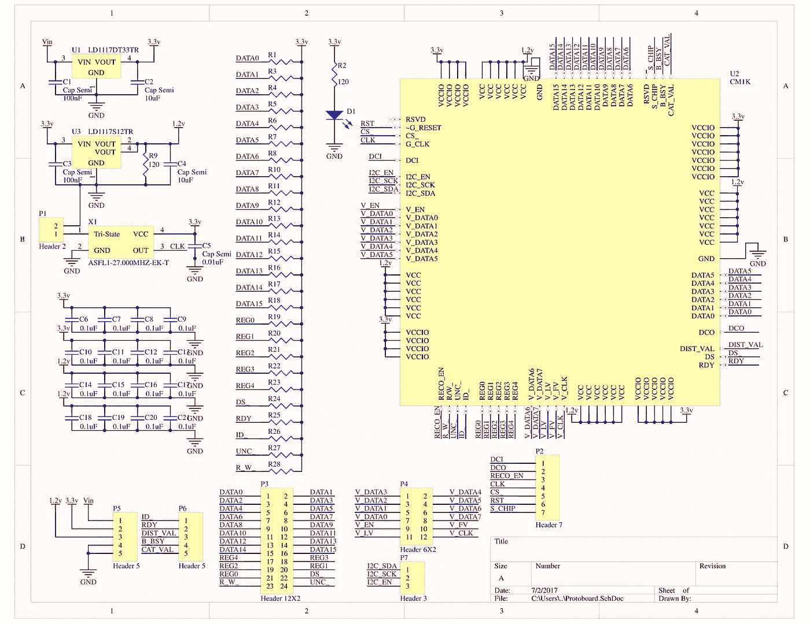
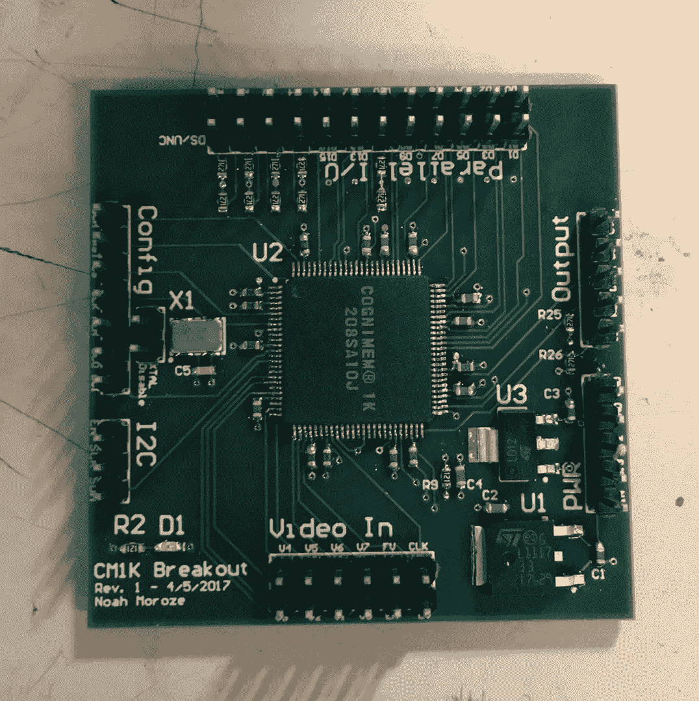
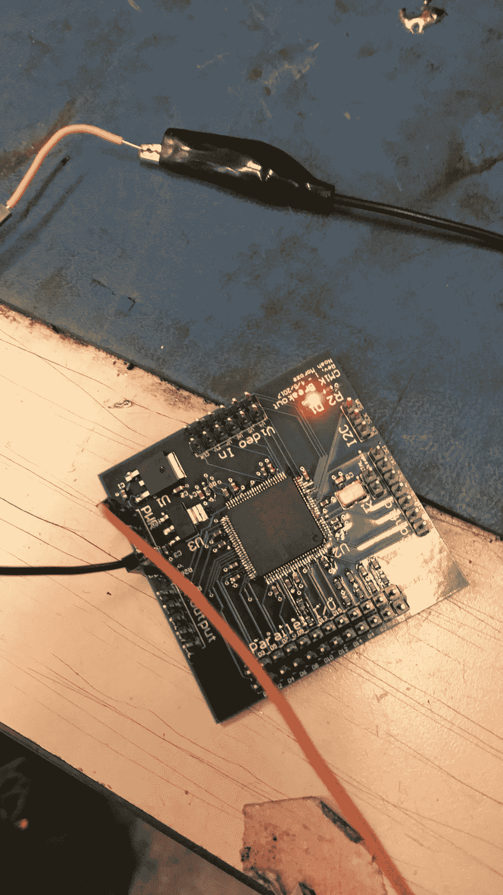
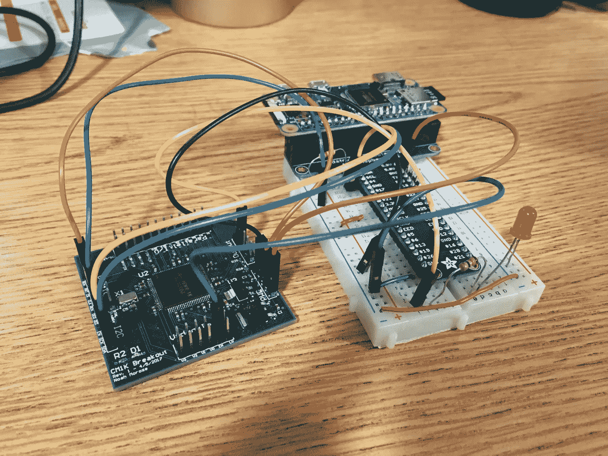
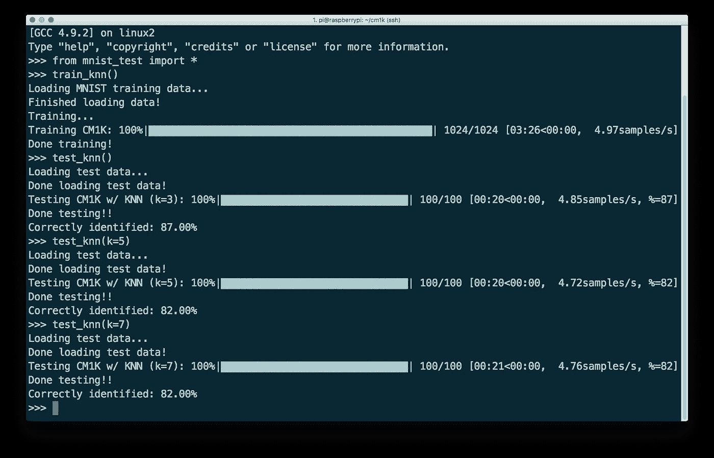

# CM1K 神经网络芯片的实验

> 原文：<https://towardsdatascience.com/experiments-with-the-cm1k-neural-net-chip-32b2d5ca723b?source=collection_archive---------3----------------------->

2017 年 3 月，我获得了来自麻省理工学院沙盒项目的资金，利用 T2 的 CM1K 神经网络芯片 T3 开发了一款产品。CM1K 是一个集成电路，它在硬件中实现了 [RBF](https://en.wikipedia.org/wiki/Radial_basis_function_network) 和 [KNN](https://en.wikipedia.org/wiki/K-nearest_neighbors_algorithm) 分类器，这应该比在软件中实现这些算法提供了更好的性能。我提议用这个芯片作为分线板的基础，可以与流行的业余爱好者电子平台(如 [Raspberry Pi](https://www.raspberrypi.org/) 或 [Arduino](https://www.arduino.cc/) )接口。所有代码和原理图都可以在这个项目的 [Github](https://github.com/nmoroze/cm1k) 页面上找到。

# 先前的工作

在随机搜索谷歌以了解是否存在类似 CM1K 的芯片后，我受到启发开始了这个项目——我想知道是否有人开发出了在硬件中实现机器学习算法的 ASIC。我很快发现了 CM1K，但是项目例子很少。

我确实发现了 [Braincard](https://www.indiegogo.com/projects/braincard-pattern-recognition-for-all#/) ，一个失败的 Indiegogo 整合 CM1K 的分线板活动。这与我打算开发的东西非常相似，声称可以将 CM1K 与 Pi、Arduino 和 Intel Edison 进行接口。尽管失败了，我并没有对我的想法失去信心——brain card 似乎缺乏成功所需的文档和业余爱好者社区中的可见性，这并不一定说 CM1K 本身有什么不好。

Sad reacts only :(

一个有趣的注意事项是，Braincard 活动实际上[隶属于 cogn mem](http://www.general-vision.com/hardware/braincard/)。经过一番挖掘，我发现多家公司似乎都有关联:[认知记忆](http://www.cognimem.com/products/chips-and-modules/CM1K-Chip/index.html)、[通用视觉](http://www.general-vision.com/hardware/cm1k/)和[神经记忆](https://www.crunchbase.com/organization/neuromem#/entity)等等。它们似乎都是由这种芯片技术的发明者 Guy Paillet 联系在一起的。如果你想去兔子洞，看看他的 LinkedIn 简介…无论如何，我最好的猜测是，Braincard 是 General Vision 试图增加业余爱好者市场对 CM1K 的需求。

我发现第三方使用 CM1K 的例子更少。我找到的几个参考资料是这个简单的[分线板](https://www.openhardware.io/view/208/CM1k-Breakout-Board-Neuromorphic-Chip)和这个[研究论文](http://tf.llu.lv/conference/proceedings2016/Papers/N204.pdf)。不幸的是，这两个来源都缺乏任何清晰的文档来证明 CM1K 的实际应用。

很难找到 CM1K 接受测试的例子。随着 Cognimem 宣称“[无限可能](http://www.cognimem.com/_docs/Presentations/PR_CM1K_introduction.pdf)”，我有动力建立一个分线板，并为自己评估 CM1K。

# 开发分线板

我最初计划在春天完成几个版本的分线板。第一个是一个相当简单的分组讨论板，由以下部分组成:

*   CM1K 本身
*   为芯片供电的 3.3v 和 1.2v 稳压器
*   提供时钟信号的 27 MHz 振荡器
*   在需要的地方拉起电阻和滤波帽
*   电源指示灯
*   标题将 IC 上的每一行分开

然后，该板可以连接到我想要的任何平台上，一旦我开发了软件，并能够评估使用芯片的最佳方式，我就可以设计第二块板，它具有所需的额外功能，可以与我选择的平台很好地接口。

由于时间限制，我从未接近完成第二个设计。无论如何，在我运行的实验中，事实证明几乎不需要它:将第一个 rev 板与 I2C 上的 Raspberry Pi 连接起来非常简单。

Schematic!

我开始在[高原](http://www.altium.com/)设计分线板。绘制原理图相当简单，但布局花了我一段时间。我决定试着把所有东西都放进 2 平方英寸的空间里，这给了我太多的发挥空间。我在电路板边缘排列了接头，并将 IC 放在中央。我最初认为我可以把这块板分成两层，但是经过两次尝试后，我不能完全把它布置好。我最大的难点是试图将 1.2v 和 3.3v 线干净利落地分配给 IC 上所有分散的电源引脚。经过三次重新设计尝试，我选定了四层设计，第三层分为 1.2v 和 3.3v 电源层。1.2v 层直接位于 IC 下方，因此需要 1.2v 输入的所有引脚都向后走线，有一个过孔直接通向 1.2v 层。然后，3.3v 电源引脚可以向前走线，过孔向下到平面。由于所有外设都使用 3.3v 电压，因此很容易为电路板的其余部分提供 3.3v 电压。

Routing complete!

电路板设计完成后，我需要将它发送给 fab。我上一次这样做是在几年前，当时我在[奥什公园](https://oshpark.com/)为我的高中机器人团队做了一些东西。在这一点上，我需要的板比批处理服务提供的要快得多，所以我最终选择了 4pcb.com 的 T4，用 T6 的 66 each T7 交易以 66 美元的价格得到了我的两块板。作为一名学生，我可以免除最低订购量，这非常棒。

My breakout board straight from the fab in all its glory.

一旦我的主板和所有组件到达，这是组装的时间。我把它带到 [MITERS](http://miters.mit.edu/) 并开始用热风枪焊接所有东西。每一个组件都非常容易地关闭……除了集成电路，它需要一点工作来做好。我开始与此，并嗡嗡作响的所有突破引脚，以确保它被钉下来的权利。经过多次反复的嗡嗡声和毛细作用，并试图小心翼翼地应用更多的焊料，它似乎没问题。

All populated!

焊接完成后，我把电路板拿到电源前，插上电源。关键时刻平静地过去了:电源灯亮了，主板没有开始冒烟或发热。接下来，我决定第一次尝试使用示波器来检查振荡器的输出。起初，输出似乎真的很糟糕，但在无法找到我的板中的故障后，我意识到我对如何设置示波器没有任何线索。经过一些谷歌搜索和一些校准，我得到了一个输出，至少符合我要去的频率(即使它不是完全干净)。哦，好吧，不管怎样，事情似乎解决得很好。

The moment of truth!

随着这些初始测试的完成，是时候连接分线板并开始编码了！

# 开发软件

我首先将分线板连接到我身边的一个 3.3v Arduino Micro，选择它是因为它是我唯一一个具有 3.3v 逻辑电平的 Arduino。布线很简单:我只要接上两条 I2C 线，必要时在 GND 上绑几个配置引脚，就能让 I2C 正常工作。然后，我编写了一个函数，成功地从 CM1K 的 NCOUNT 寄存器中读取数据。在将其推广到可以读取/写入任何任意寄存器的功能后，我能够验证 CM1K 的硬件似乎按照数据手册中的规定工作。

硬件通过验证后，我和我的一个朋友聊了聊，他建议我试着根据 [MNIST](http://yann.lecun.com/exdb/mnist/) 数据集对芯片进行基准测试。我认为这是一个有价值的目标，并着手使用 CM1K 在 MNIST 上实现 KNN 分类。

我决定我不想担心将 MNIST 训练数据集安装到我的 Arduino 上，所以我拿起了一个 Raspberry Pi Zero W 以及一些外围设备，以使布线更容易。我像对 Arduino 一样连接好它，然后开始工作！

The Raspi Setup in all its glory.

我决定用 Python 编写我的所有代码，使用 smbus 模块通过 I2C 与 CM1K 对话。我首先根据 CM1K 硬件手册中的一些伪代码编写了一个简单的测试脚本。该脚本使用一个测试寄存器 TESTCAT，该寄存器写入与每个单个神经元的类别相同的值。然后，它遍历每个神经元，并检查以确保其存储的类别与写入 TESTCAT 的值相匹配。这个脚本起作用了，所以我决定是时候干脏活了。

第一步是对 MNIST 图像进行降采样。每个图像都是一个很小的 28x28 像素的图像，但是 CM1K 将每个神经元中的数据存储为一个长度为 256 的向量，存储字节值。因此，使用单个字节来表示每个像素的颜色值，我必须将每个图像压缩到 16x16 像素，这样我就可以将一个图像放入每个向量中。这很简单:我使用 [python-mnist](https://pypi.python.org/pypi/python-mnist/) 作为一种简单的方式来获取训练数据，然后使用 [Pillow](https://python-pillow.org/) 和 Numpy 来对图像进行重新采样。除了向下采样到 16x16，我的代码还将每个图像展平为一个长度为 256 的向量，该向量可以馈送到 CM1K。

由于单个 CM1K 只能容纳 1，024 个向量，所以我编写代码从训练集中随机选择 1，024 个图像来实际使用。鉴于完整的训练集总共使用了 60，000 张图像，我担心这会给芯片的性能带来巨大的限制。

训练过程只是将这些图像中的每一个都写入 CM1K。我使用了芯片的保存和恢复模式，这种模式可以让你将一个向量直接写入每个神经元的内存，而无需调整它们的激活功能(当芯片运行在 RBF 模式下时，这是相关的，但不是 KNN)，从而加快了这个过程。

然后，测试过程对 CM1K 运行可配置数量的测试图像。我开始简单地选择最近的邻居(k=1)，但这样得到了可怕的结果(不幸的是，我做的是糟糕的科学，没有记录这些结果)。然而……在最近的邻居之间快速实现多数投票(所以我可以任意 k≥1)后，我的运气变了！事不宜迟——

# 结果

—结果证明，我最终还是能获得相当好的结果！总的来说，我最好的成绩(图中没有)是在 k=5 的情况下，对 100 个样本进行 89%的准确率测试。

Results! Sexy progress bar courtesy of [tqdm](https://github.com/tqdm/tqdm).

这种精确度让我非常高兴。根据 Yann Le-Cun 的网站，这不是最先进的，但却是可靠的 B+(如果你四舍五入的话，是 A-)。然而，让我有些沮丧的是脚本有多慢，特别是考虑到使用这种神经网络硬件的一个大承诺是它会相对较快。然而，它以不到 5 个样本/秒的速度进行训练和测试，我觉得这有点令人失望。

我可以通过将 Pi 上的 I2C 时钟速度更改为 400 kbps(CM1K 的理论极限)来稍微解决这个问题。这给了我稍微好一点的结果，整体提升速度达到每秒 7 个样本。

# 结论

在 CM1K 上运行 KNN，我能够成功地对 MNIST 数据集中随机选择的 100 幅图像进行分类，准确率为 89%，测试和训练速度约为每秒 7 个样本。这看起来并不太糟糕，但一个重要的问题是，这是否真的比在软件中运行 KNN 算法更好。

我最接近回答这个问题的方式是在 GitHub 上找到的一个 [CM1K 模拟器](https://github.com/kebwi/CM1K_emulator)上运行我自己代码的修改版本。考虑到仿真 CM1K 显然不是在 Raspberry Pi 上实现 KNN 算法的最快方式，这个测试并没有真正演示那么多。但是，我很好奇比较性能。

如您所见，与在实际芯片上运行我的代码相比，准确性和速度都受到了影响。从某些方面来看，这有点奇怪，尽管看起来很振奋人心。然而，我对此持保留态度，因为我真的不能指望模拟器代码。

我的直觉是，举例来说，如果用写得很好的 C 代码实现，软件 KNN 会比 CM1K 有更好的性能。也就是说，我也可以用 CM1K 优化很多方法。我相信这是真的，特别是考虑到 CM1K 理论上应该能够在大约 10 微秒内加载一个完整的矢量，这是根据数据手册中给出的时钟速度和周期数计算的。以这个理论上的最大值运行，它应该能够每秒训练 1000 个样本，这意味着在我目前的方法中有很多开销。

优化思路包括:

*   用 C 重写代码，以消除 Python 解释中的开销
*   在 CM1K 上使用并行数据总线，而不是 I2C，考虑到 Raspberry Pi GPIO 的限制，这可能涉及一些硬件重新设计(可能使用移位寄存器)

即使 CM1K 在软件中运行 KNN 的速度比 Pi 运行 KNN 的速度快，接下来出现的问题是，无论如何，是否有必要离线运行机器学习算法。在大多数应用程序中，将这类计算交给服务器似乎更可行。随着越来越多的嵌入式设备连接到互联网(这已经是一种趋势了，它现在有自己的流行语了！)，嵌入式离线模式识别好像会变得越来越没用。然而，这仍然是一件有趣的事情。

我打算暂时搁置这个项目，去做其他事情。然而，对于如何继续前进，我确实有很多想法:

*   将另一个分线板和两个 CM1K 菊花链连接在一起:这将允许我在不牺牲速度的情况下获得更好的性能
*   执行上面描述的优化来提高我当前设置的速度
*   尝试 CM1K 的 RBF 模式(相对于 KNN 模式)
*   为 Pi 编写/找到一个合适的 KNN 实现，以便在 CM1K 上与 KNN 并行比较
*   使用 Arduino 作为主设备，使用 SD 卡模块存储训练数据
*   使用 CM1K 开发一些示例应用程序。在这一点上，我的首要想法是开发一个基于语音命令或脑电波导航的移动机器人

最后一点需要注意的是，General Vision/Cognimem 的技术现已内置于 [Arduino 101 芯片](http://www.general-vision.com/software/curieneurons/)的处理器中。这可能有助于将他们的技术引入主流爱好者市场，尽管我从未发现许多人使用芯片这一功能的例子。

伙计们，现在就到这里吧！对 CM1K 进行实验，并尝试开发一款几乎不为广大业余爱好者所知的芯片，是一件非常有趣的事情。希望这篇博文能给这个神秘的小家伙一点启发！如果您有任何意见或问题，请随时通过[电子邮件](mailto:me@noahmoroze.com)与我联系。