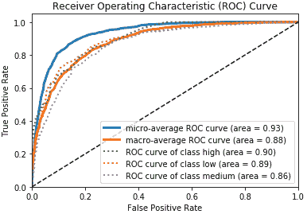
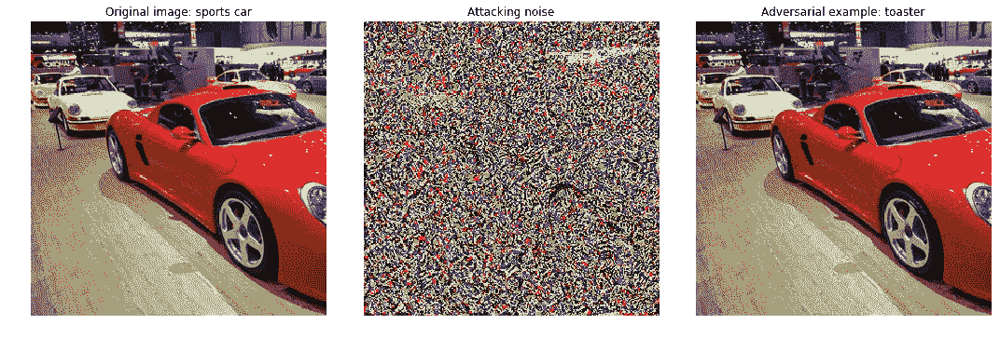
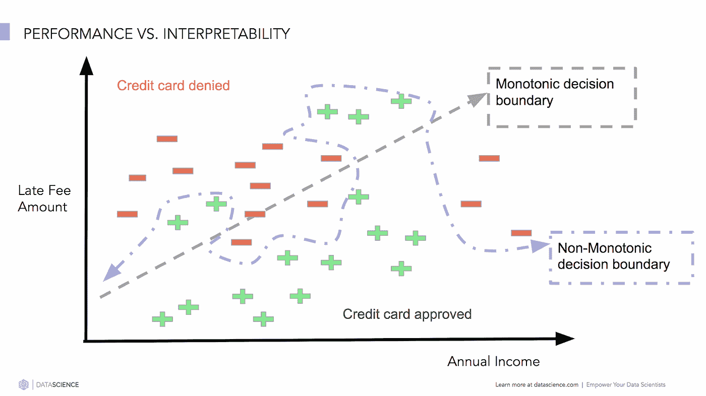
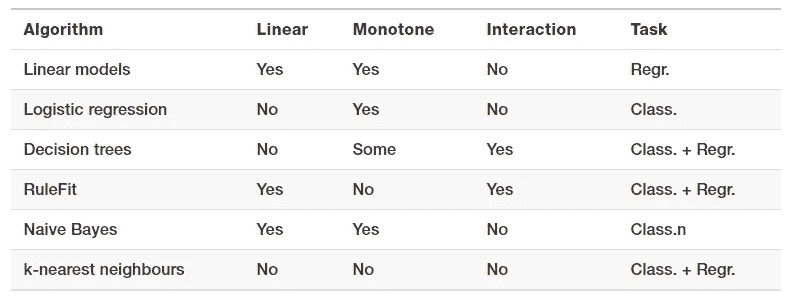
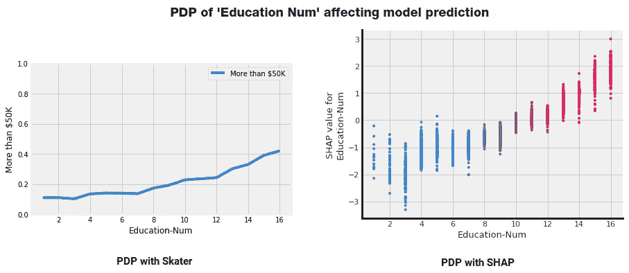
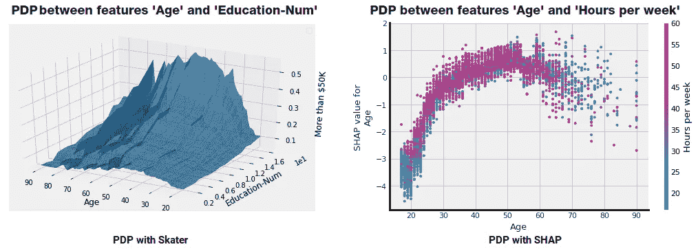
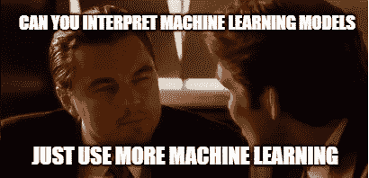
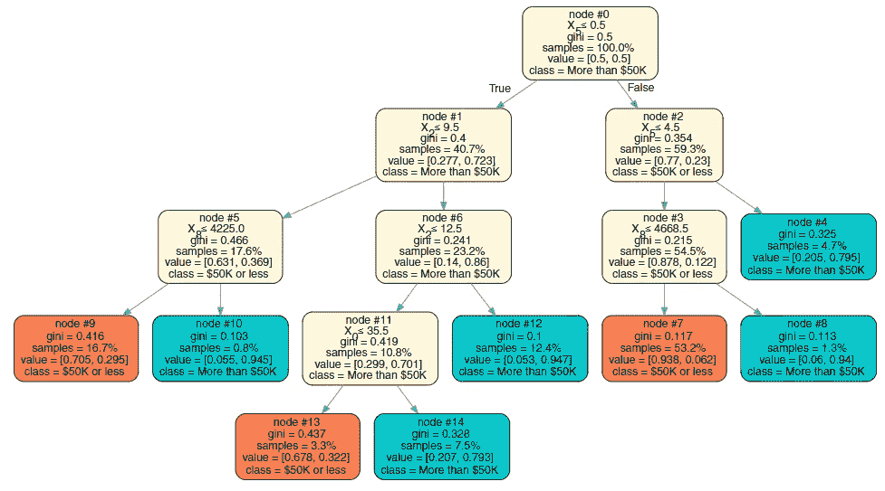
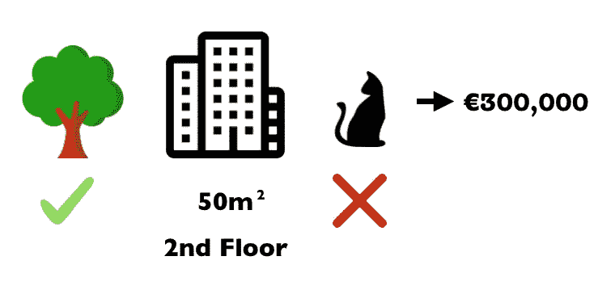
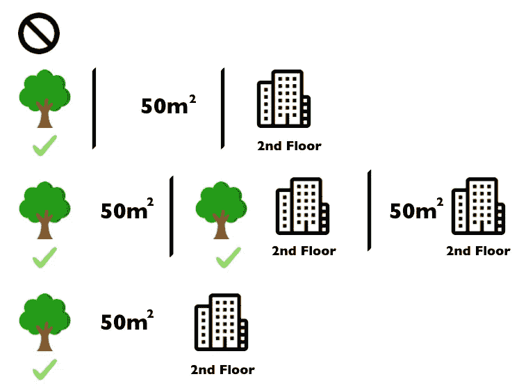

# 模型解释策略

> 原文：<https://towardsdatascience.com/explainable-artificial-intelligence-part-2-model-interpretation-strategies-75d4afa6b739?source=collection_archive---------1----------------------->

## 可解释的人工智能(第二部分)

## 了解模型解释技术、局限性和进步

Source: Pixabay

# 介绍

本文是我针对 ***【可解释的人工智能(XAI)***系列文章的延续。如果你还没有阅读第一篇文章，我肯定会建议你快速浏览一下 [***【第一部分——人类可解释机器学习的重要性】***](/human-interpretable-machine-learning-part-1-the-need-and-importance-of-model-interpretation-2ed758f5f476) ，它涵盖了人类可解释机器学习的内容和原因，以及模型解释的必要性和重要性及其范围和标准。在本文中，我们将从我们停下来的地方开始，进一步扩展到机器学习模型解释方法的标准，并探索基于范围的解释技术。本文的目的是让您很好地理解现有的、传统的模型解释方法，以及它们的局限性和挑战。我们还将讨论经典的模型准确性与模型可解释性之间的权衡，最后看看模型解释的主要策略。

简而言之，我们将在本文中讨论以下几个方面。

*   模型解释的传统技术
*   传统技术的挑战和局限
*   准确性与可解释性的权衡
*   模型解释技术

这应该让我们为第 3 部分中模型解释的详细实践指南做好准备，所以请继续关注！

# 模型解释的传统技术

模型解释的核心是找到更好地理解模型决策政策的方法。这是为了实现公平、问责和透明，这将使人类有足够的信心在现实世界的问题中使用这些模型，这些问题对商业和社会有很大影响。因此，现在有一些已经存在很长时间的技术，可以用来以更好的方式理解和解释模型。这些可以分为以下两大类。

*   **探索性分析和可视化技术**，如*聚类*和*降维*。
*   **模型性能评价指标**如 [*精度、*](https://en.wikipedia.org/wiki/Confusion_matrix) *、* [*ROC 曲线、AUC*](https://en.wikipedia.org/wiki/Receiver_operating_characteristic) (用于分类模型)和[*(R-square)*](https://en.wikipedia.org/wiki/Coefficient_of_determination)*、* [*均方根误差、平均绝对误差*](https://medium.com/human-in-a-machine-world/mae-and-rmse-which-metric-is-better-e60ac3bde13d) (用于回归模型)

让我们简单地更详细地看一下这些技术。

## 探索性分析和可视化

探索性分析的想法并不是全新的。多年来，数据可视化一直是从数据中获取潜在洞察力的最有效工具之一。这些技术中的一些可以帮助我们从我们的数据中识别关键特征和有意义的表示，这些数据可以给出可能影响模型以人类可解释的形式做出决策的指示。

降维技术在这里非常有用，因为我们经常处理非常大的特征空间(维数灾难),降维有助于我们可视化并了解什么可能影响模型做出特定决策。其中一些技术如下。

*   **降维:** [主成分分析](https://en.wikipedia.org/wiki/Principal_component_analysis)，[自组织映射【SOM】，](https://en.wikipedia.org/wiki/Self-organizing_map)，[潜在语义索引](https://nlp.stanford.edu/IR-book/html/htmledition/latent-semantic-indexing-1.html)
*   [**流形学习**](https://en.wikipedia.org/wiki/Nonlinear_dimensionality_reduction) **:** t 分布随机邻居嵌入( [t-SNE](https://distill.pub/2016/misread-tsne/) )
*   **可变自动编码器:**使用[可变自动编码器](https://arxiv.org/pdf/1606.05908.pdf) (VAE)的自动生成方法
*   **聚类:** [层次聚类](https://en.wikipedia.org/wiki/Hierarchical_clustering)

现实世界问题中的一个例子是，通过使用单词嵌入检查它们的语义相似性，并使用 t-SNE 对其进行可视化，来尝试可视化哪些文本特征可能对模型有影响，如下所述。

Visualizing word embeddings using t-SNE (Source: [*Understanding Feature Engineering (Part 4) — Deep Learning Methods for Text Data — Towards Data Science*](/understanding-feature-engineering-part-4-deep-learning-methods-for-text-data-96c44370bbfa))

您还可以使用 t-SNE 来可视化著名的 MNIST 手写数字数据集，如下图所示。

Visualizing MNIST data using t-SNE using sklearn. Image courtesy of Pramit Choudhary and the Datascience.com team.

另一个例子是通过利用 PCA 进行降维来可视化著名的 IRIS 数据集，如下图所示。

[Principal Component Analysis on the IRIS dataset](http://scikit-learn.org/stable/modules/decomposition.html)

除了可视化数据和特征之外，某些更直观、更易理解的模型，如决策树，有助于我们直观地了解做出某个决策的确切方式。下面描述了一个示例树，它帮助我们以人类可理解的方式可视化确切的规则。

Visualizing human-interpretable rules for a decision tree model (Source: [*Practical Machine Learning with Python, Apress 2018*](https://github.com/dipanjanS/practical-machine-learning-with-python))

然而，正如我们所讨论的，我们可能无法为其他模型获得这些规则，这些模型不像基于树的模型那样可解释。此外，巨大的决策树总是变得非常难以想象和解释。

## 模型性能评估指标

[***模型性能评估***](https://www.cs.cornell.edu/courses/cs578/2003fa/performance_measures.pdf) 是任何数据科学生命周期中选择最佳模型的关键步骤。这使我们能够看到我们的模型表现如何，比较不同模型的各种性能指标，并选择最佳模型。这也使我们能够 [***调整和优化模型中的超参数***](https://en.wikipedia.org/wiki/Hyperparameter_optimization) ，以获得对我们正在处理的数据给出最佳性能的模型。典型地，基于我们正在处理的问题的类型，存在某些标准的评估度量。

*   **监督学习—分类:**对于分类问题，我们的主要目标是预测离散的分类响应变量。混淆矩阵在这里非常有用，我们可以从中获得一系列有用的指标，包括准确度、精确度、召回率和 F1 分数，如下例所示。

Classification Model Performance Metrics (Source: [*Practical Machine Learning with Python, Apress 2018*](https://github.com/dipanjanS/practical-machine-learning-with-python))

除了这些指标，我们还可以使用其他一些技术，如 ROC 曲线和 AUC 分数，如下图中葡萄酒质量预测系统所示。

ROC Curve and AUC scores (Source: [*Practical Machine Learning with Python, Apress 2018*](https://github.com/dipanjanS/practical-machine-learning-with-python))

ROC 曲线下的面积是客观评估分类器性能的一种非常流行的技术。在这里，我们通常试图平衡真阳性率(TPR)和假阳性率(FPR)。上图告诉我们，`**‘high’**`级葡萄酒的 AUC 分数是`**0.9**`，这意味着模型给`**‘high’**`(正级)级葡萄酒分配的分数比给`**NOT ‘high’**` (或`**‘low’**`(负级)级葡萄酒分配的分数高的概率是 90%。有时，如果 ROC 曲线交叉，结果可能会产生误导并难以解释(来源: [*测量分类器性能:ROC 曲线下面积的连贯替代方法*](https://link.springer.com/article/10.1007%2Fs10994-009-5119-5) )。

*   **监督学习—回归:**对于回归问题，我们可以使用标准指标，如[决定系数(R 平方)](https://en.wikipedia.org/wiki/Coefficient_of_determination)、[均方根误差(RMSE)](https://medium.com/human-in-a-machine-world/mae-and-rmse-which-metric-is-better-e60ac3bde13d) 和[平均绝对误差(MAE)](https://medium.com/human-in-a-machine-world/mae-and-rmse-which-metric-is-better-e60ac3bde13d) 。
*   **无监督学习—聚类:**对于基于聚类的无监督学习问题，我们可以使用类似于[剪影系数](http://scikit-learn.org/stable/modules/generated/sklearn.metrics.silhouette_score.html)、[同质性、完整性、V-measure](http://scikit-learn.org/stable/modules/clustering.html#homogeneity-completeness-and-v-measure) 和[卡林斯基-哈拉巴兹指数](http://scikit-learn.org/stable/modules/clustering.html#calinski-harabaz-index)的度量。

# 传统技术的局限性和更好模型解释的动机

我们在前面的技术中讨论的技术肯定有助于理解更多关于我们的数据、特征以及哪些模型可能是有效的。然而，在试图辨别模型如何工作的人类可解释的方式方面，它们相当有限。在任何数据科学问题中，我们通常在静态数据集上构建模型，并获得我们的目标函数(优化损失函数)，该函数通常在满足基于模型性能和业务需求的特定标准时部署。通常，我们利用上述探索性分析和评估指标的技术来决定我们数据的整体模型性能。然而，在现实世界中，由于数据特征的可变性、增加的约束和噪声，模型的性能在部署后通常会随着时间的推移而降低并停滞不前。这可能包括环境的变化、功能的变化以及增加的约束。因此，简单地在相同的特征集上重新训练模型是不够的，我们需要不断检查特征在决定模型预测中的重要性，以及它们在新数据点上的工作情况。

例如，[入侵检测系统](https://ir.library.louisville.edu/etd/2790/) (IDS)，一个网络安全应用程序，容易受到规避攻击，攻击者可能会使用对抗性输入来击败安全系统(注意:[对抗性输入](https://arxiv.org/abs/1602.02697)是攻击者故意设计的例子，以欺骗机器学习模型做出错误的预测)。在这种情况下，模型的目标函数可能充当现实世界目标的弱代理。可能需要更好的解释来识别算法中的盲点，以通过修复易于受到敌对攻击的训练数据集来建立安全的模型(有关进一步的阅读，请参见 Moosavi-Dezfooli 等人，2016 年， [*DeepFool*](https://arxiv.org/pdf/1511.04599.pdf) 和 Goodfellow 等人，2015 年， [*解释和利用敌对示例*](https://arxiv.org/abs/1412.6572) )。

Source: [https://medium.com/@jrodthoughts/using-adversarial-attacks-to-make-your-deep-learning-model-look-stupid-24fb872f06fd](https://medium.com/@jrodthoughts/using-adversarial-attacks-to-make-your-deep-learning-model-look-stupid-24fb872f06fd)

此外，由于我们正在处理的数据的性质，模型中经常存在偏差，就像在罕见的预测问题(欺诈或入侵检测)中一样。度量不能帮助我们证明模型预测决策的真实情况。此外，这些传统形式的模型解释对于数据科学家来说可能很容易理解，但由于它们本质上是理论性的，并且通常是数学性的，因此在尝试向(非技术)业务利益相关者解释这些内容以及尝试仅基于这些指标来决定项目的成功标准时，存在很大的差距。仅仅告诉业务部门，*“我有一个准确率为 90%的模型”*还不足以让他们在现实世界中开始信任该模型。我们需要对模型的决策策略进行人类可解释的解释(HII ),这些决策策略可以用适当和直观的输入和输出来解释。这将使有洞察力的信息能够容易地与同行(分析师、经理、数据科学家、数据工程师)共享。使用这种形式的解释，可以根据投入和产出进行解释，可能有助于促进更好的沟通和合作，使企业能够做出更有信心的决定(例如，[金融机构的风险评估/审计风险分析](https://www.journalofaccountancy.com/issues/2006/jul/assessingandrespondingtorisksinafinancialstatementaudit.html))。

重申一下，我们将模型解释(新方法)定义为能够解释预测模型的 ***公平性*** (无偏性/非歧视性) ***责任性*** (可靠的结果)，以及*(能够查询和验证预测决策)——目前是关于监督学习问题。*

# *准确性与可解释性的权衡*

*在模型性能和可解释性之间存在一种典型的权衡，就像我们在机器学习中有标准偏差和方差的权衡一样。在行业中，您经常会听到业务利益相关者倾向于更易于解释的模型，如线性模型(线性\逻辑回归)和树，这些模型直观、易于验证，并易于向非数据科学专家解释。这增加了人们对这些模型的信任，因为它的决策策略更容易理解。然而，如果您与解决行业中真实世界问题的数据科学家交谈，他们会告诉您，由于真实世界数据集固有的高维性和复杂性，他们通常不得不利用机器学习模型，这些模型可能是非线性的，本质上更加复杂，通常无法使用传统方法(集成、神经网络)进行解释。因此，数据科学家花费大量时间试图改善模型性能，但在这个过程中，他们试图在模型性能和可解释性之间取得平衡。*

**

*Model performance vs. interpretability (Source: [https://www.datascience.com)](https://www.datascience.com))*

*上图显示了一个客户贷款批准问题的模型决策边界。我们可以清楚地看到，具有单调决策边界的简单、易于解释的模型在某些场景中可能工作良好，但通常在现实世界的场景和数据集中，我们最终会使用具有非单调决策边界的更复杂、更难以解释的模型。因此，为了加强我们的动机，我们需要模型解释，以便我们能够说明预测模型的**公平性**(无偏性/非歧视性)**责任性**(可靠的结果)和**透明性**(能够查询和验证预测决策)。有兴趣的读者可以查阅文章， [*【迈向机器学习的喷射时代】*](https://www.oreilly.com/ideas/toward-the-jet-age-of-machine-learning) *。*除此之外，我肯定会推荐读者查看我个人最喜欢的一篇文章，我在这个系列中改编了很多内容， [*“用 Skater 解释预测模型:拆箱模型不透明度”*](https://www.oreilly.com/ideas/interpreting-predictive-models-with-skater-unboxing-model-opacity) 其中更详细地谈到了这一点。*

* [## 用 Skater 解释预测模型:打开模型不透明度

### 深入探究作为理论概念的模型解释，以及对滑手的高层次概述。

www.oreilly.com](https://www.oreilly.com/ideas/interpreting-predictive-models-with-skater-unboxing-model-opacity) 

# 模型解释技术

有各种各样的新模型解释技术试图解决传统模型解释技术的局限性和挑战，并试图对抗经典的可解释性与模型性能之间的权衡。在这一节中，我们将看看其中的一些技术和策略。请记住，我们的重点将是涵盖模型不可知的解释技术，因为这些技术将真正帮助我们走向*可解释的人工智能(XAI)* 。

## 使用可解释的模型

开始模型解释的最简单的方法是使用开箱即可解释的模型！这通常包括您的常规参数模型，如线性回归、逻辑回归、基于树的模型、规则拟合，甚至像 k-最近邻和朴素贝叶斯这样的模型！根据主要功能对这些模型进行分类的方法是:

*   线性:通常，如果特征和目标之间的关联是线性建模的，那么我们有一个线性模型。
*   单调性:单调模型确保特性和目标结果之间的关系在特性上(在其值的整个范围内)总是在一个一致的方向上(增加或减少)。
*   交互:您可以随时使用手动特征工程向模型添加交互特征、非线性。有些型号还会自动创建它。

Christoph Molnar 的优秀著作， [*【可解释机器学习】*](https://christophm.github.io/interpretable-ml-book/) 有一个很好的表格总结了以上几个方面。

Source: Interpretable Machine Learning, Christoph Molnar

需要记住的一点是，其中一些模型可能过于简单，因此我们可能需要考虑更好的方法来构建和解释更复杂、性能更好的模型。

## 特征重要性

特征重要性是预测模型依赖特定特征的程度的通用术语。通常，一个特征的重要性是在我们改变了该特征的值之后模型预测误差的增加。像 Skater 这样的框架基于一个信息论标准来计算，在给定一个给定特征的扰动的情况下，测量预测变化的熵。直觉告诉我们，一个模型的决策标准越依赖于一个特征，我们就越会看到预测随着对一个特征的扰动而变化。然而，像 SHAP 这样的框架，使用特征贡献和博弈论的组合来得出 SHAP 值。然后，它通过对整个数据集的 SHAP 值进行平均来计算全局要素重要性。以下是人口普查数据集中溜冰者要素重要性图的标准示例。

看起来`Age`和`Education-Num`是最重要的两个特征，其中`Age`负责模型预测在扰动/置换`Age`特征时平均变化 14.5%。因此，总而言之，模型不可知特性重要性的全局解释背后的概念非常简单。

*   我们通过计算扰动特征后模型预测误差的增加来衡量特征的重要性。
*   如果扰动某个要素的值会增加模型误差，则该要素是“重要的”，因为模型依赖于该要素进行预测。
*   如果扰动某个特征的值使模型误差保持不变，则该特征是“不重要的”，因为模型基本上忽略了该特征的预测。

Breiman (2001) 为*随机森林引入了排列特征重要性度量。基于这一想法， *Fisher、Rudin 和 Dominici (2018)* 提出了特征重要性的模型不可知版本——他们称之为*模型依赖*。*

## 部分相关图

部分相关性描述了某个功能对模型预测的边际影响，使模型中的其他功能保持不变。部分相关的导数描述了特征的影响(类似于回归模型中的特征系数)。部分相关性图(PDP 或 PD 图)显示了某个特性对先前拟合模型的预测结果的边际影响。PDP 可以显示目标和特征之间的关系是线性的、单调的还是更复杂的。部分相关图是一种全局方法:该方法考虑了所有实例，并陈述了某个特征与预测结果的全局关系。下图显示了一些 PDP 示例。

PDP for 1 feature

我们用溜冰者和 SHAP 来说明教育水平对挣更多钱的影响。这是一个单向 PDP，显示了一个特征对模型预测的影响。我们还可以构建双向 PDP，显示两个特征对模型预测的影响。下图显示了一个示例。

PDP for 2 features

在上述 PDP 中，您可以清楚地看到影响模型预测的特性的效果和相互作用。受教育程度更高、每周工作时间更长的显著中年人挣钱更多！

## 全球代理模型

我们已经看到了用特征重要性、依赖图、不太复杂的模型来解释机器学习模型的各种方法。但是有没有一种方法可以建立真正复杂模型的可解释的近似值呢？谢天谢地，我们有全球代理模型，正是为了这个目的！全局代理模型是一种可解释的模型，它被训练成近似黑盒模型的预测，而黑盒模型本质上可以是任何模型，不管其复杂性或训练算法如何，这是模型不可知的！

通常，我们基于被视为黑盒模型的基本模型，近似一个更易解释的代理模型。然后，我们可以通过解释代理模型得出关于黑盒模型的结论。用更多的机器学习来解决机器学习的可解释性！

(可解释的)替代模型的目的是在可解释的同时尽可能接近基础模型的预测。拟合代理模型是一种模型不可知的方法，因为它不需要关于黑盒模型内部工作的信息，只使用输入和预测输出的关系。基本黑盒模型类型和代理模型类型的选择是分离的。基于树的模型不是太简单，而是可解释的，是构建代理模型的好选择。

Skater 介绍了使用`**TreeSurrogates**`作为解释模型的学习决策策略(用于归纳学习任务)的手段的新颖想法，这是受 Mark W. Craven 的工作(称为特雷潘算法)的启发。我们将在本系列的第 3 部分中用例子介绍特雷普恩模型。目前，Christoph Molnar 在他的*一书中出色地讲述了构建代理模型的主要步骤。*

1.  *选择数据集这可以是用于训练黑盒模型的同一数据集，也可以是来自同一分布的新数据集。根据您的应用程序，您甚至可以选择数据的子集或点的网格。*
2.  *对于所选数据集，获取基础黑盒模型的预测。*
3.  *选择一个可解释的替代模型(线性模型、决策树等等)。*
4.  *对数据集及其预测训练可解释的模型。*
5.  *恭喜你！你现在有了一个代理模型。*
6.  *衡量代理模型复制黑盒模型预测的能力。*
7.  *解释/可视化代理模型。*

*当然，这是一个高层次的说明，TREPAN 等算法在内部做得更多，但整体工作流程仍然保持不变。*

**

*Sample illustration of a surrogate tree model*

*上图是从复杂的 XGBoost 黑盒模型近似而来的代理树模型。我们将在第 3 部分从头开始构建它，敬请关注！有趣的是，与 XGBoost 模型的 87%的准确度相比，这个模型具有 83%的总准确度。还不错！*

## *局部可解释的模型不可知解释(LIME)*

*LIME 是由 Riberio Marco、Singh Sameer 和 Guestrin Carlos 设计的一种新算法，用于使用本地可解释替代模型(如线性分类器/回归器)来评估任何基础估计量(模型)的行为。这种形式的综合评估有助于产生局部忠实的解释，但可能不符合全局行为。基本上，石灰解释是基于本地代理模型。这些替代模型是可解释的模型(如线性模型或决策树),是根据原始黑盒模型的预测学习的。但是，LIME 没有试图拟合一个全球代理模型，而是专注于拟合局部代理模型，以解释为什么会做出单一预测。事实上，*也可以作为 GitHub 上的一个 [*开源框架，并且是基于本文*](https://github.com/marcotcr/lime) 中 [*介绍的工作。*](https://arxiv.org/abs/1602.04938)**

**这个想法非常直观。首先，试着忘掉你已经做过的事情！忘记训练数据，忘记你的模型是如何工作的！认为你的模型是一个黑盒模型，里面有一些神奇的事情发生，你可以输入数据点，并得到模型预测的结果。你可以随时探测这个神奇的黑箱，得到输入和输出预测。现在，你的主要目标是理解为什么你作为一个神奇的黑盒子对待的机器学习模型，给出了它产生的结果。LIME 试着为你做这件事！它测试当你把数据集的变化或扰动输入黑盒模型时，黑盒模型的预测会发生什么。通常，LIME 会生成一个由扰动样本和相关黑盒模型预测组成的新数据集。在这个数据集上，LIME 然后训练可解释的模型，该模型通过采样实例与感兴趣实例的接近度来加权。以下是标准的高级工作流程。**

*   **选择您感兴趣的实例，您希望对其黑盒模型的预测进行解释。**
*   **扰动数据集，获得这些新点的黑盒预测。**
*   **根据与感兴趣的实例的接近程度对新样本进行加权。**
*   **将加权的、可解释的(替代)模型拟合到有变化的数据集上。**
*   **通过解释本地模型来解释预测。**

**下面是一个在 Skater 框架中使用 LIME 的示例，它解释了为什么该模型预测一个人将赚超过 50K 美元。**

****

**Explaining predictions with LIME**

**我们将使用人口普查数据集来构建模型，并在下一篇文章中用 LIME 更详细地探索它们。**

## ****沙普利值和沙普利加法解释(SHAP)****

****SHAP(SHapley Additive exPlanations)**是解释任何机器学习模型输出的统一方法。SHAP 将博弈论与局部解释相结合，结合了以前的几种方法，并基于他们所声称的，代表了唯一可能一致且局部精确的附加特征归因方法！(详情请查看 [SHAP 夹纸](http://papers.nips.cc/paper/7062-a-unified-approach-to-interpreting-model-predictions))。SHAP 是一个优秀的模型解释框架，它基于对 Shapley 值的调整和增强，我们将在本节中深入探讨。再次感谢 Christoph Molnar 的 [*惊人的模型解释书*](https://christophm.github.io/interpretable-ml-book/) ，我将无耻地将它改编到本教程中，因为在我看来，这可能是理解这个概念的最佳方式！**

**通常，模型预测可以通过假设每个特征是游戏中的*【玩家】*来解释，其中预测是支出。Shapley 值——一种来自联合博弈论的方法——告诉我们如何在特性之间公平地分配*‘支付’*。让我们举一个说明性的例子。**

****

**假设你训练了一个机器学习模型来预测公寓价格。对于某个公寓，它预测 300，000 €，你需要解释这个预测。公寓*面积*50 平米，位于*二楼*，附近有*公园*和*禁止养猫。*所有公寓的平均预测价格是 31 万€。与平均预测相比，每个特征值对预测的贡献有多大？**

**线性回归模型的答案很简单:每个特征的影响是特征的权重乘以特征值减去所有公寓的平均影响:这只是因为模型的线性。对于更复杂的模型，我们该怎么做？一种选择是我们刚刚讨论过的石灰。另一个不同的解决方案来自合作博弈理论: ***由 Shapley 创造的 Shapley 值*** ，是一种根据玩家对总支出的贡献将*支出*分配给*玩家*的方法。玩家在*联盟*中合作，并从合作中获得一定的*收益*。**

*   ***“游戏”*是数据集的单个实例的预测任务。**
*   ***‘增益’*是该实例的实际预测减去所有实例的平均预测。**
*   ***‘玩家’*是实例的特征值，协同接收增益(=预测某个值)。**

**因此，在我们的公寓示例中，特征值`**‘park-allowed’**`、`**‘cat-forbidden’**`、`**‘area-50m-sq’**`和`**‘floor-2nd’**`共同实现了 300，000€的预测。我们的目标是解释实际预测(300，000€)和平均预测(310，000€)的差异:差异为-10，000€。答案可能是:`**‘park-nearby’**`号贡献了 3 万€；`**‘size-50m-sq’**`贡献了一万€；`**‘floor-2nd’**`贡献了 0€；`**‘cat-forbidden’**`出资 5 万€。捐款加起来是-10，000€:最终预测减去平均预测公寓价格。**

**Shapley 值是一个特征值在所有可能的联合中的平均边际贡献。联盟基本上是用于估计特定特征的 shapley 值的特征的组合。通常情况下，要素越多，它就开始呈指数增长，因此可能需要花费大量时间来计算大数据集或宽数据集的这些值。下图显示了评估`**‘cat-forbidden’**`的 Shapley 值所需的所有特征值组合。**

****

**第一行显示了没有任何特征值的联盟。第二、第三和第四行显示不同的联盟——由`**‘|’**` 分隔——联盟规模逐渐增大。对于这些联盟中的每一个，我们计算有和没有`**‘cat-forbidden’**`特征值的预测公寓价格，并取其差值以获得边际贡献。Shapley 值是边际贡献的(加权)平均值。我们用来自公寓数据集的随机特征值替换不在联盟中的特征的特征值，以从机器学习模型获得预测。当我们对所有特征值重复 Shapley 值时，我们得到特征值之间预测的完整分布(减去平均值)。SHAP 是沙普利值的增强。**

**SHAP (SHapley 附加解释)为每个特征分配一个特定预测的重要性值。其新颖的组成部分包括:识别一类新的加性特征重要性度量，理论结果表明在这一类中有一个唯一的解决方案，具有一组理想的性质。通常，SHAP 值试图将模型(函数)的输出解释为引入条件期望的每个特征的效果的总和。重要的是，对于非线性函数，引入特征的顺序很重要。SHAP 值由所有可能的排序的平均值产生。博弈论的证据表明这是唯一可能的一致方法。下面的图来自 KDD 18 论文， [*一致的个性化特征归属为树系综*](https://arxiv.org/pdf/1802.03888.pdf) 很好地概括了这一点！**

****

**Understanding SHAP value**

**下面是一个使用 SHAP 来解释模型在预测一个人的收入是否大于 5 万美元时的决策的例子**

****

**Explaining model predictions with SHAP**

**看到模型背后的关键驱动因素(特性)做出这样的决定是很有趣的！我们还将在本系列的第 3 部分中用实际操作的例子来介绍这一点。**

# **结论**

**这篇文章将帮助你在通往可解释人工智能(XAI)的道路上迈出更明确的步伐。您现在知道了模型解释的必要性和重要性。第一篇文章中关于偏见和公平的问题。在这里，我们研究了模型解释的传统技术，讨论了它们的挑战和局限性，还介绍了模型可解释性和预测性能之间的经典权衡。最后，我们研究了当前最先进的模型解释技术和策略，包括特征重要性、PDP、全局代理、局部代理和 LIME、shapley 值和 SHAP。就像我之前提到的，让我们努力实现人类可解释的机器学习和 XAI，为每个人揭开机器学习的神秘面纱，并帮助增加对模型决策的信任。*** 

# **下一步是什么？**

**在本系列的第 3 部分中，我们将会看到一个使用我们在本文中学到的所有新技术来构建和解释机器学习模型的综合指南。为此，我们将使用几个最先进的模型解释框架。**

*   **关于使用最新的模型解释框架的实践指南**
*   **使用 ELI5、Skater 和 SHAP 等框架的特点、概念和示例**
*   **探索概念并观察它们的实际应用——特征重要性、部分相关图、替代模型、用石灰的解释和说明、SHAP 值**
*   **基于监督学习示例的机器学习模型解释**

**敬请期待，这肯定会变得更加有趣和令人兴奋！**

**请查看 [***“第一部分——人类可解释机器学习的重要性”***](/human-interpretable-machine-learning-part-1-the-need-and-importance-of-model-interpretation-2ed758f5f476) ，其中涵盖了人类可解释机器学习的内容和原因，以及模型解释的必要性和重要性及其范围和标准(如果您还没有了解的话)!**

**我在我的书中覆盖了很多机器学习模型解释的例子， [***【用 Python 实现实用的机器学习】***](https://github.com/dipanjanS/practical-machine-learning-with-python) 。为了您的利益，代码是开源的！**

**有反馈给我吗？或者有兴趣与我一起从事研究、数据科学、人工智能甚至发表一篇关于[***TDS***](https://towardsdatascience.com/)的文章？可以在[**LinkedIn**](https://www.linkedin.com/in/dipanzan/)**上联系我。****

** [## Dipanjan Sarkar -数据科学家-英特尔公司| LinkedIn

### 查看 Dipanjan Sarkar 在世界最大的职业社区 LinkedIn 上的个人资料。Dipanjan 有 6 份工作列在…

www.linkedin.com](https://www.linkedin.com/in/dipanzan/)**