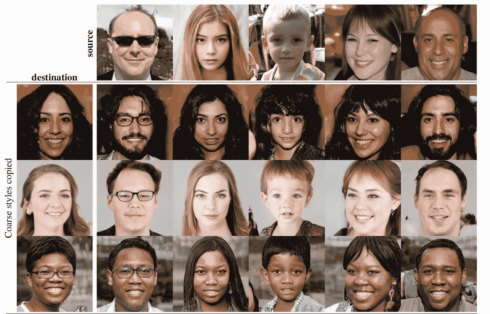
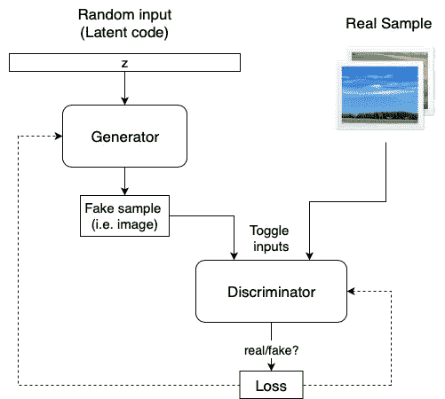
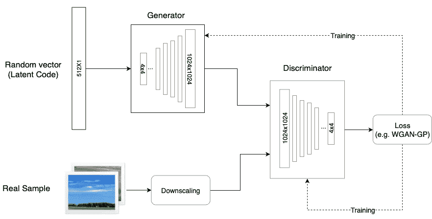
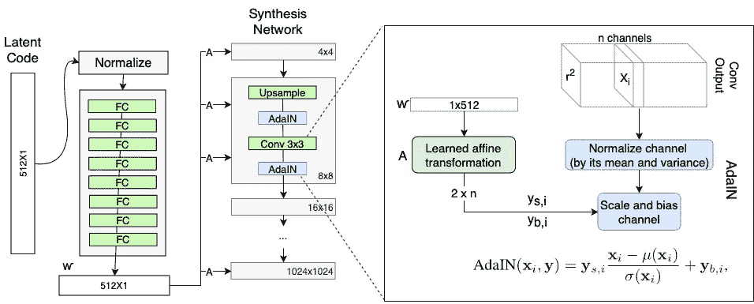
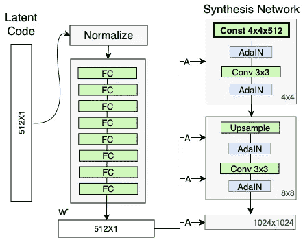
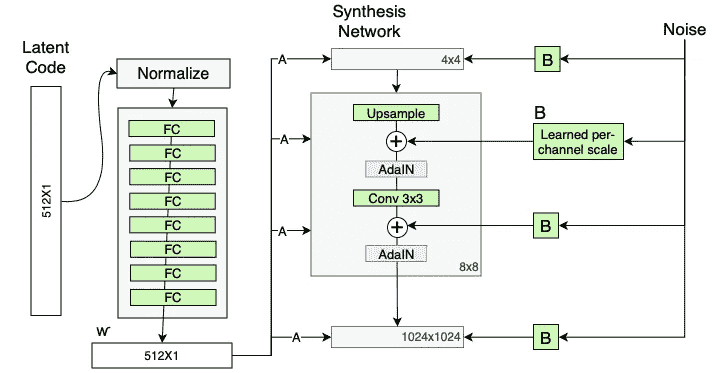

# 解释:一个基于风格的 GANs 生成器架构——生成和调整真实的人造脸

> 原文：<https://towardsdatascience.com/explained-a-style-based-generator-architecture-for-gans-generating-and-tuning-realistic-6cb2be0f431?source=collection_archive---------3----------------------->

## NVIDIA 针对生成式对抗网络的新型架构

生成对抗网络(GAN)是机器学习中一个相对较新的概念，[于 2014 年首次引入](https://arxiv.org/abs/1406.2661)。他们的目标是合成人工样本，如图像，这些样本与真实图像无法区分。GAN 应用程序的一个常见示例是通过从名人人脸数据集学习来生成人工人脸图像。随着时间的推移，GAN 图像变得越来越逼真，但其主要挑战之一是控制其输出，即改变面部图像中的特定特征，如姿势、脸型和发型。

NVIDIA 的一篇新论文，一个为 GANs ( [StyleGAN](https://arxiv.org/abs/1812.04948) )设计的基于风格的生成器架构，提出了一个解决这个挑战的新模型。StyleGAN 逐渐生成人工图像，从非常低的分辨率开始，一直到高分辨率(1024×1024)。通过单独修改每个级别的输入，它控制在该级别中表达的视觉特征，从粗略特征(姿势、脸型)到精细细节(头发颜色)，而不影响其他级别。

这种技术不仅可以更好地理解生成的输出，还可以产生最先进的结果——比以前生成的图像看起来更真实的高分辨率图像。

Source: [StyleGAN](https://arxiv.org/abs/1812.04948)

# 背景

每个 GAN 的基本组件是两个神经网络——一个从头合成新样本的生成器，一个从训练数据和生成器输出中提取样本并预测它们是“真”还是“假”的鉴别器。

发电机输入是随机向量(噪声),因此其初始输出也是噪声。随着时间的推移，当它收到来自鉴别器的反馈时，它学会了合成更“真实”的图像。通过将生成的样本与真实样本进行比较，鉴别器也会随着时间的推移而改进，使生成器更难欺骗它。

GANs overview

直到 2018 年，研究人员一直难以生成高质量的大图像(如 1024×1024)，当时英伟达首次用 [ProGAN](https://arxiv.org/abs/1710.10196) 解决了这一挑战。ProGAN 的关键创新是渐进式训练——它从用非常低分辨率的图像(例如 4×4)训练生成器和鉴别器开始，每次都添加更高分辨率的层。

这种技术首先通过学习甚至在低分辨率图像中出现的基本特征来创建图像的基础，并且随着时间的推移随着分辨率的增加学习越来越多的细节。训练低分辨率图像不仅更容易和更快，它也有助于训练更高的水平，因此，总的训练也更快。

ProGAN overview

ProGAN 可以生成高质量的图像，但与大多数模型一样，它控制所生成图像的特定功能的能力非常有限。换句话说，这些特征是纠缠在一起的，因此试图调整输入，即使是一点点，通常也会同时影响多个特征。一个很好的类比是基因，改变一个基因可能会影响多个特征。

ProGAN progressive training from low to high res layers. Source: (Sarah Wolf’s great [blog post](/progan-how-nvidia-generated-images-of-unprecedented-quality-51c98ec2cbd2) on ProGAN).

# StyleGAN 的工作原理

StyleGAN 论文提供了 ProGAN 图像生成器的升级版本，重点是生成器网络。作者观察到，如果使用得当，ProGAN 渐进层的潜在好处是它们能够控制图像的不同视觉特征。图层(和分辨率)越低，其影响的要素就越粗糙。本文将这些特征分为三种类型:

1.  高达 82 的粗分辨率-影响姿势、一般发型、脸型等
2.  162 到 322 的中等分辨率-影响更精细的面部特征、发型、眼睛睁开/闭上等。
3.  642 到 10242 的精细分辨率-影响配色方案(眼睛、头发和皮肤)和微观特征。

新的发电机包括对 ProGAN 发电机的几个补充:

## 映射网络

映射网络的目标是将输入向量编码成中间向量，中间向量的不同元素控制不同的视觉特征。这是一个重要的过程，因为用输入向量控制视觉特征的能力是有限的，因为它必须遵循训练数据的概率密度。例如，如果黑头发的人的图像在数据集中更常见，则更多的输入值将被映射到该要素。因此，该模型无法将部分输入(向量中的元素)映射到特征，这种现象称为特征纠缠。然而，通过使用另一个神经网络，该模型可以生成不必遵循训练数据分布的向量，并且可以降低特征之间的相关性。映射网络由 8 个完全连接的层组成，其输出ⱳ与输入层的大小相同(512×1)。

The generator with the Mapping Network (in addition to the ProGAN synthesis network)

## 样式模块(AdaIN)

[AdaIN](https://arxiv.org/abs/1703.06868) (自适应实例标准化)模块将映射网络创建的编码信息ⱳ转换为生成的图像。该模块被添加到合成网络的每个分辨率级别，并定义该级别中的特征的视觉表达:

1.  卷积层输出的每个通道首先被归一化，以确保步骤 3 的缩放和移动具有预期的效果。
2.  使用另一个全连接层(标记为 a)将中间矢量ⱳ变换为每个通道的比例和偏差。
3.  比例和偏移向量移动卷积输出的每个通道，从而定义卷积中每个滤波器的重要性。这种调谐将来自ⱳ的信息翻译成视觉表示。

The generator’s Adaptive Instance Normalization (AdaIN)

## 移除传统输入

大多数模型以及其中的 ProGAN 使用随机输入来创建发生器的初始图像(即 4×4 级别的输入)。StyleGAN 团队发现，图像特征是由ⱳ和阿丹控制的，因此初始输入可以被省略，并用常数值代替。虽然这篇论文没有解释为什么它提高了性能，但一个安全的假设是它减少了特征纠缠——网络只使用ⱳ学习更容易，而不依赖于纠缠的输入向量。

The Synthesis Network input is replaced with a constant input

## 随机变化

在人的面部中有许多方面是小的并且可以被看作是随机的，例如雀斑、头发的精确位置、皱纹，这些特征使得图像更加真实并且增加了输出的多样性。将这些小特征插入 GAN 图像的常用方法是向输入向量添加随机噪声。然而，在许多情况下，由于上面描述的特征纠缠现象，很难控制噪声效果，这会导致图像的其他特征受到影响。

StyleGAN 中的噪声添加方式与 AdaIN 机制类似，即在 AdaIN 模块之前的每个通道中添加一个缩放后的噪声，并稍微改变它所操作的分辨率级别特性的视觉表达。

Adding scaled noise to each resolution level of the synthesis network

## 风格混合

StyleGAN 发生器在合成网络的每个级别中使用中间向量，这可能会使网络了解到级别是相关的。为了降低相关性，该模型随机选择两个输入向量，并为它们生成中间向量ⱳ。然后，它用第一个级别训练一些级别，并(在随机点)切换到另一个级别来训练其余的级别。随机开关确保网络不会学习和依赖级别之间的相关性。

虽然它没有提高所有数据集的模型性能，但这个概念有一个非常有趣的副作用-它能够以连贯的方式组合多个图像(如下面的视频所示)。该模型生成两幅图像 A 和 B，然后通过从 A 获取低级特征并从 B 获取其余特征来组合它们。

## W 中的截断技巧

生成模型的挑战之一是处理训练数据中表现不佳的区域。生成器无法学习它们，也无法创建类似的图像(反而会创建难看的图像)。为了避免生成差的图像，StyleGAN 截断中间向量ⱳ，迫使它接近“平均”中间向量。

在训练模型之后，通过选择许多随机输入来产生“平均”ⱳavg；用映射网络生成它们的中间向量；并计算这些向量的平均值。在生成新图像时，不直接使用映射网络输出，而是将ⱳ转换为ⱳ_new=ⱳ_avg+𝞧(ⱳ -ⱳ_avg)，其中𝞧的值定义了图像与“平均”图像的距离(以及输出的多样性)。有趣的是，在仿射变换块之前，通过对每个级别使用不同的𝞧，该模型可以控制每组特征与平均值的距离，如下面的视频所示。

Tweaking the generated image by changing the value of 𝞧 in different levels

## 微调

StyleGAN 在 ProGAN 基础上的其他改进是更新几个网络超参数，如训练持续时间和损失函数，并替换从最近邻到双线性采样的向上/向下缩放。虽然这一步对模型性能很重要，但它没有什么创新性，因此这里不做详细描述(本文的附录 C)。

An overview of StyleGAN

# 结果

该论文展示了两个数据集的最新成果——由名人图像组成的 CelebA-HQ，以及由“普通”人图像组成的更加多样化的新数据集 Flickr-Faces-HQ (FFHQ)。下图显示了模型不同配置的 Frèchet 初始距离( [FID](https://arxiv.org/abs/1706.08500) )得分。

The performance (FID score) of the model in different configurations compared to ProGAN. The lower score the better the model (Source: [StyleGAN](https://arxiv.org/abs/1812.04948))

除了这些结果之外，该论文通过在卧室图像和汽车图像的其他两个数据集上展示其结果，表明该模型不仅仅适用于人脸。

# 特征解开

为了使关于特征分离的讨论更加量化，本文提出了两种新颖的方法来测量特征解缠:

1.  感知路径长度—在两个随机输入之间进行插值时，测量连续图像(其 VGG16 嵌入)之间的差异。剧烈的变化意味着多个特征一起改变，并且它们可能纠缠在一起。
2.  线性可分性-将输入分类为二元类的能力，例如男性和女性。分类越好，特征的可分性越强。

通过比较输入向量 z 和中间向量ⱳ的这些度量，作者表明ⱳ的特征明显更加可分。这些指标还显示了与 1 或 2 层相比，在映射网络中选择 8 层的优势。

# 实施细节

StyleGAN 使用 8 Tesla V100 GPUs 在 CelebA-HQ 和 FFHQ 数据集上训练了一周。它在 TensorFlow 中实现，并将是开源的。

# 结论

StyleGAN 是一种突破性的论文，不仅可以生成高质量和逼真的图像，还可以对生成的图像进行高级控制和理解，使生成可信的假图像变得比以前更加容易。StyleGAN 中介绍的技术，尤其是映射网络和自适应标准化(AdaIN)，将可能成为 GANs 中许多未来创新的基础。

*要了解最新的深度学习研究，请订阅我在* [*LyrnAI*](https://www.lyrn.ai) 上的简讯