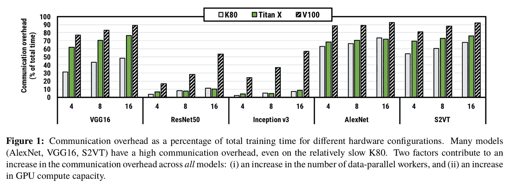
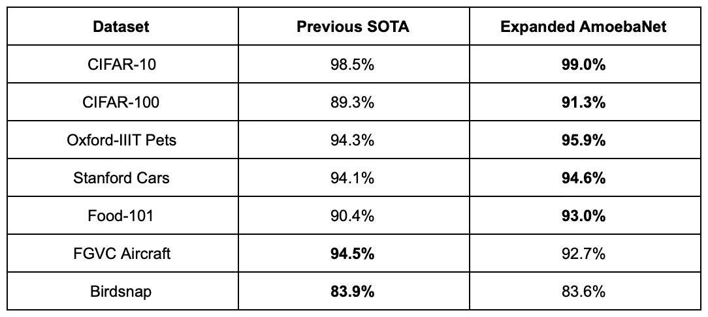

# 解释:GPipe——使用流水线并行技术训练巨型神经网络

> 原文：<https://towardsdatascience.com/explained-gpipe-training-giant-neural-nets-using-pipeline-parallelism-341b63bfc74b?source=collection_archive---------13----------------------->

近年来，机器学习数据集和模型的规模一直在不断增加，允许在广泛的任务中改善结果。与此同时，硬件加速(GPU、TPU)也在改进，但速度明显较慢。模型增长和硬件改进之间的差距增加了并行性的重要性，即在多个硬件设备上训练单个机器学习模型。一些 ML 架构，尤其是小型模型，有助于并行性，可以在硬件设备之间轻松划分，但在大型模型中，同步成本会导致性能下降，从而妨碍它们的使用。

Google Brain 的一篇新论文 [GPipe](https://arxiv.org/pdf/1811.06965.pdf) 提出了一种模型并行性的新技术，允许在多个硬件设备上训练大型模型，性能提高近 1:1(论文显示在 4x 硬件上有 3.5 倍的处理能力)。GPipe 库将是开源的，它自动分析 TensorFlow 神经网络模型的结构，并将训练数据和模型委托给多个硬件设备，同时应用独特的反向传播优化技术。

GPipe 帮助 ML 模型包含更多的参数，从而在训练中获得更好的结果。为了证明该技术的有效性，谷歌团队创建了一个更大版本的 AmoebaNet，即 2017 年 ImageNet 获奖者，以更大的图像(480×480)作为输入，并在 ImageNet，CIFAR-10，CIFAR-100 和其他计算机视觉指标上取得了最先进的(SOTA)结果。

# 背景

机器学习中的并行通常分为两类:

*   模型并行性-当在训练中使用模型并行性时，机器学习模型被划分到 K 个硬件设备上，每个设备持有模型的一部分。一种模拟并行性的简单方法是通过在每个设备上简单地托管 N/K 层(“级”)来将 N 层神经网络分成 K 个设备。更复杂的方法通过分析每一层的计算复杂度来确保每个设备处理相似的计算复杂度。标准模型并行性允许训练更大的神经网络，但是由于设备不断地相互等待，并且在给定时间只有一个设备可以执行计算，因此性能受到很大影响。
*   数据并行性-在数据并行性中，机器学习模型在 K 个硬件设备上复制，一个小批量的训练样本被分成 K 个微批量。每个设备执行微批次的向前和向后传递，并且当它完成该过程时，它与其他设备同步更新的模型权重，然后计算整个微批次的更新权重。在每次小批量计算结束时，K 个模型的重量都是同步的(相同值)。

虽然微批处理允许并行，但在使用模型并行时，每个阶段自然仍需要等待前一阶段的结果，从而导致闲置的“泡沫”，如随附的图像所示。在图中，F0，i-F3，I 是跨越四个阶段的单个微批处理的成员，而 Fi，0-Fi，3 是在单个阶段中执行的四个微批处理计算。

Model + Data Parallelism ([GPipe](https://arxiv.org/pdf/1811.06965.pdf): Huang et al. 2018)

尽管存在气泡问题，但数据并行可能是有效的，但它还会遇到一个额外的问题——通信开销。随着模型的增长和硬件变得更快，在设备之间同步整个模型的要求成为训练过程中的瓶颈，大大降低了训练速度。随附的图像举例说明了在大型神经网络中，通信开销如何占据了大部分训练时间。通信开销的现象鼓励创建非常大的小批量，但是这些对于训练网络来说通常是错误的选择，并且可能在生产中呈现较差的结果。

[PipeDream](https://arxiv.org/pdf/1806.03377.pdf): Fast and Efficient Pipeline Parallel DNN Training

# GPipe 的工作原理

GPipe 同时使用模型和数据并行，这种组合通常被称为“流水线”。它为以前的流水线技术提供了两个关键贡献——自动并行和设备内存优化。

## 自动并行

该软件接收神经网络的结构、小批量和可用于计算的硬件设备的数量作为输入。然后，它会自动将网络层划分为阶段，将小批量划分为微批量，并将它们分布在各个设备上。为了将模型分成 K 个阶段，GPipe 在给定其激活函数和训练数据内容的情况下估计每一层的成本。虽然这篇论文没有详细说明如何在 GPipe 中实现这一点，但一个[常见技术](https://arxiv.org/pdf/1806.03377.pdf)是通过神经网络运行数据样本，测量每一层的计算时间，并相应地进行划分。GPipe 接收每一层的可选成本估计函数作为输入，允许更复杂的技术来改进其内部机制。

## 设备内存优化

当在神经网络中计算反向传递时，需要网络的正向传递激活来执行计算。通常，这意味着对于神经网络中 N 层和 L 层大小的微批次，O(N×L)个激活在正向传递之后被保存在设备存储器中，为反向传递做准备。

GPipe 使用了一种不同的方法，应用了一种有趣的计算-内存权衡——它不是将 NxL 激活保存在内存中，而是只将 N 个激活保存在 stage 的最后一层(stage =层组)。在这种情况下，每次反向过程开始时(从最后一层开始)，都会重新计算正向过程激活并保存在内存中。当单个样本的反向通过结束时，存储器中的激活被丢弃，并为下一个样本的反向通过重新计算。使用这种方法，设备内存一次只保存一组激活，以进行 O(N)次转发为代价获得了宝贵的内存。因为一般的硬件趋势是设备速度比设备内存增长得更快，所以这种权衡通常是有用的。

# GPipe 应用

在论文中，研究人员将 AmoebaNet 从 1.553 亿个参数扩展到 5.57 亿个参数，并插入 480×480 ImageNet 图像作为输入，而不是标准 AmoebaNet 模型使用的降采样 331×331 图像。结果是 ImageNet 前 1 名的准确率(84.3%对 83.5%)和前 5 名的准确率(97.0%对 96.5%)有所提高，标志着一个新的最先进水平。

使用扩展的 AmoebaNet 模型进行迁移学习，研究人员在 CIFAR-10、CIFAR-100、牛津-IIIT Pets、Stanford Cars 和 Food-101 数据集上取得了最先进的(SOTA)结果。该模型在两个数据集(FGVC Aircraft 和 Birdsnap)中取得的结果不如最先进的结果，这可能是因为这些数据集中最先进的模型利用了除 ImageNet 数据之外来自 Google Image Search 的 980 万张预训练图像。

# 实施细节

GPipe 是用 TensorFlow 写的，会开源。该技术并不是 TensorFlow 独有的，也可以在其他平台上实现。

# 结论

作为一个开源库，GPipe 将允许机器学习从业者以相对较低的成本训练大得多的模型。可以肯定的是，结果将是新的大量大型机器学习模型，它们将获得优于现有模型的结果，以及与缩小图像相反的全尺寸图像数据的使用增加。

虽然对每个人都有用，但数据并行性的这一突破自然会为拥有大量计算和数据的大型组织提供特殊优势。

***保持最新机器学习研究的更新，订阅我们的简讯在***[***LyrnAI***](https://www.lyrn.ai)

*特别感谢本文主要作者黄阳平对 GPipe 工作的宝贵见解。*