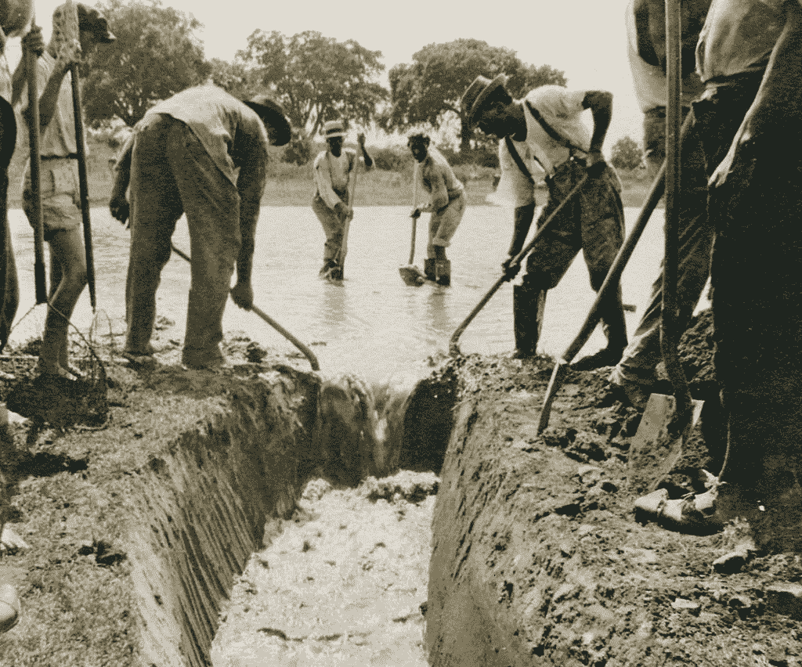
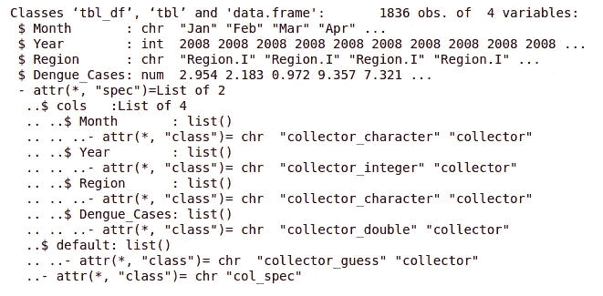
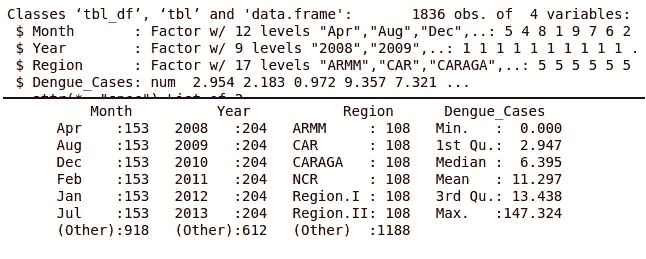
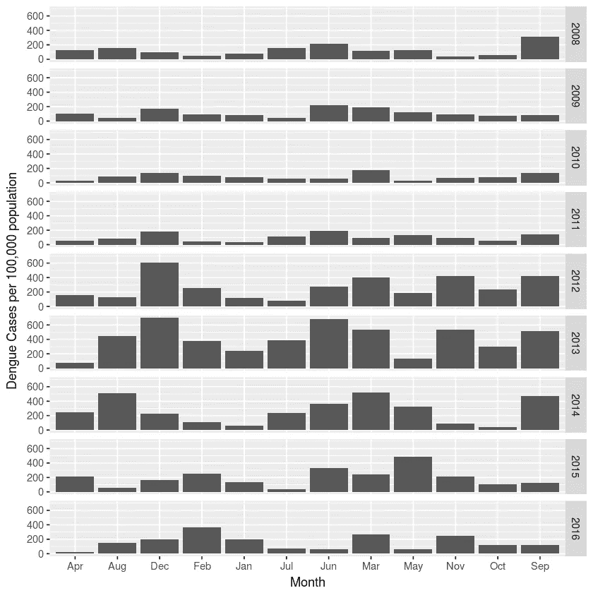
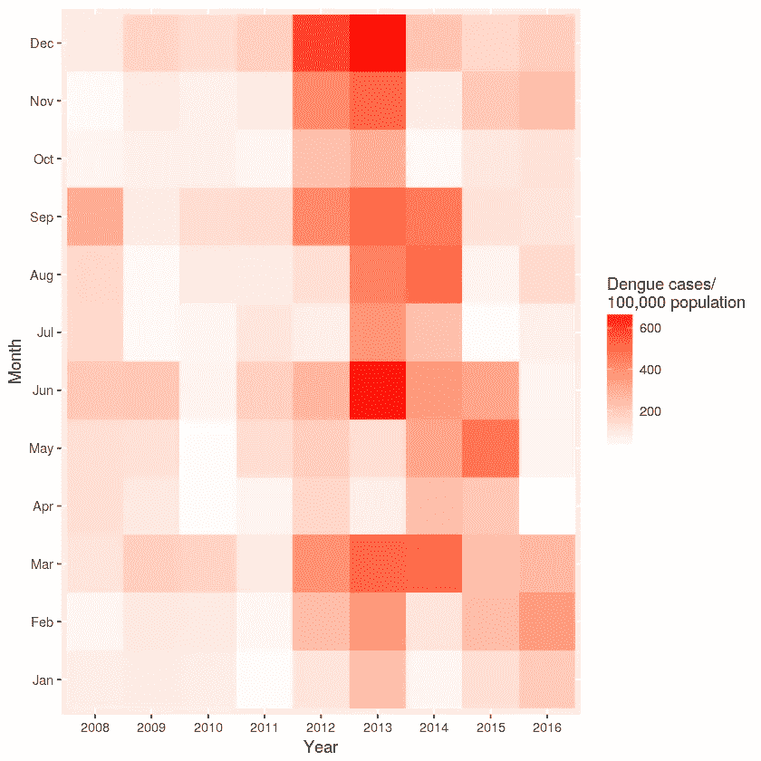
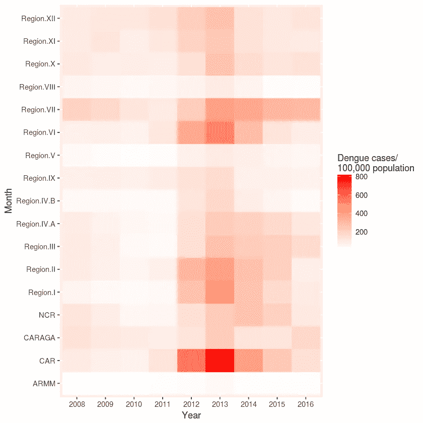
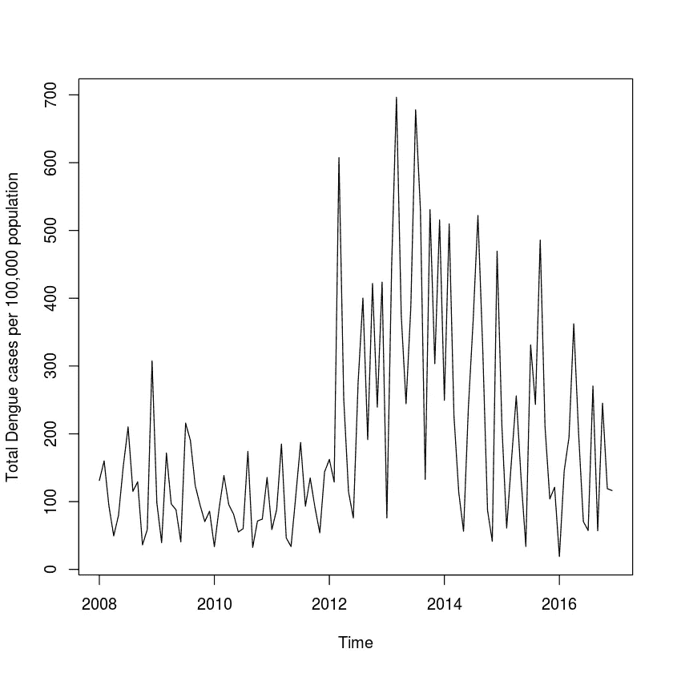
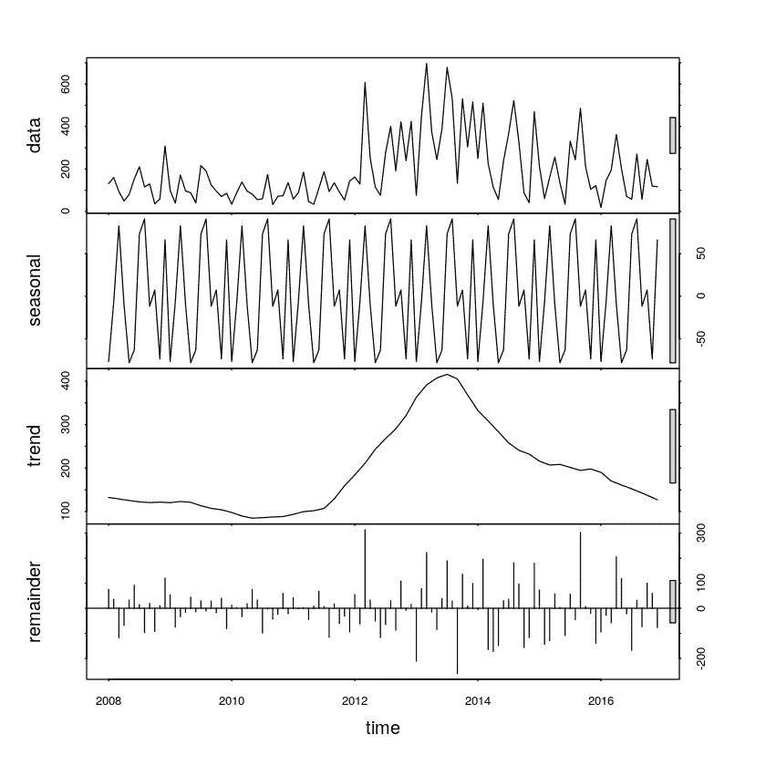
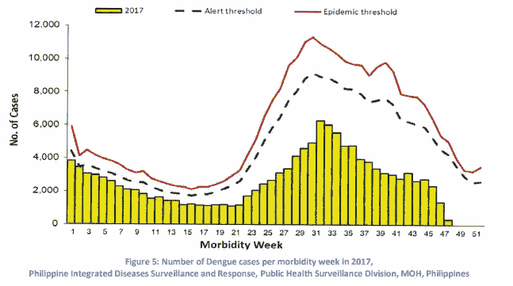

# 通过数据探索传染病:登革热

> 原文：<https://towardsdatascience.com/exploring-infections-through-data-dengue-fever-b35f64842601?source=collection_archive---------12----------------------->



A 1920s photograph of efforts to disperse standing water and thus decrease mosquito populations — Wikipedia ( [**https://tinyurl.com/y8zcj7te**](https://tinyurl.com/y8zcj7te)) Public Health Image Library (PHIL) — This media comes from the [Centers for Disease Control and Prevention](https://en.wikipedia.org/wiki/Centers_for_Disease_Control_and_Prevention)’s [Public Health Image Library](https://phil.cdc.gov/phil/home.asp) (PHIL)

这一年是 1780 年，“胆汁返流热”的病例困扰着费城。国父和医生本杰明·拉什在 1789 年将其描述为“断骨热”，现在人们普遍认为这是我们现在称之为登革热的第一次有记录的爆发。拉什指出，他的患者出现了严重的发烧、头部、背部和四肢疼痛，在某些情况下还出现了出血症状(我们现在称之为登革出血热)。这种疾病通常是自限性的，在某些情况下是致命的，但在几乎所有情况下对受感染的个体来说都是创伤性的；突然出现难以忍受的发热和肌肉疼痛，许多患者还出现呕吐以及躯干、手臂、腿和面部出现明显皮疹。拉什在 18 世纪费城所描述的，尽管是第一个被完整记录在案的案例研究，被认为已经困扰了人类几个世纪。最近的证据表明，它起源于大约 1000 年前，但只是在最近几百年才在人类中确立了地方性传播。

现在对 21 世纪的登革热有了很好的了解。它是由登革热病毒引起的，登革热病毒是*黄病毒*属的一员(使其与其他令人讨厌的病毒如黄热病病毒、西尼罗病毒和日本脑炎病毒密切相关)。感染最常见的是由 T4 伊蚊传播，在一些罕见的病例中是由受感染的献血者输血引起的。

在有充分治疗的地方，死亡率低于 1%，但在没有这种治疗的地方，登革热仍然是一个严重的公共卫生问题，全球每年有数千人死亡。2013 年，全球报告有 6000 万例感染，约 13600 例死亡。不出所料，发展中国家受到的打击最大，这反映了全球伊蚊的分布。其中一个发展中国家是菲律宾，它将是本文感兴趣的主题。

我将通过观察 2008 年至 2016 年间菲律宾的登革热病例来探索用 R 编程语言进行时间序列分析的方法。该数据集可在 [Kaggle](https://www.kaggle.com/grosvenpaul/dengue-cases-in-the-philippines) 上访问，包含菲律宾每个地区每 100，000 人每月记录的登革热病例。我们的目标是观察这一时期登革热病例的趋势，并尝试预测 2016 年以后的趋势。

我假设读者对 R 有所了解。如果没有，我强烈推荐阅读 Garrett Grolemund & Hadley Wickham 的 DataCamp 或 R for Data Science，后者是免费的。

这个项目的所有 R 代码都可以在我的 github 页面上的 Jupyter 笔记本中找到。我个人是 Tidyverse 的忠实粉丝，我广泛使用这个 R 包集合。

## 先看数据

在使用`readr`包中的`read_csv`方法将数据加载到 tibble dataframe 中之后，我使用`str`函数来洞察数据的内部结构:



所以首先映入我眼帘的是，月份和地区存储在字符数据类型下，年份存储为整数。更恰当的做法是将这些变量存储为类别，我可以使用因子函数。

```
data$Month <- factor(data$Month, levels = c("Jan", "Feb", "Mar", "Apr", "May", "Jun", "Jul", "Aug", "Sep", "Oct", "Nov", "Dec"))
data$Region <- factor(data$Region)
data$Year <- factor(data$Year)
```

准备就绪后，我现在可以使用`summary`和`str`函数在继续之前查看数据。



可变月份有 12 个级别，这是有意义的，因为一年有 12 个月。该数据集描述了 9 年，17 个地区中的每一个都有一个类别。整个数据集的登革热病例平均数为 6.395，中位数为 11.297，最大值为 147.324。

现在是时候想象登革热病例如何逐月和逐年变化了。我总是喜欢从简单开始，然后逐步完善，所以我从一个按年份分面的条形图开始。



因此，我可以从上面看到，在 2012/13 年病例急剧增加，然后在 2016 年逐渐下降。以上也暗示了季节的变化。我不太喜欢多面条形图。所以我去寻找灵感，发现了这篇[奇妙的博文](http://www.roymfrancis.com/a-guide-to-elegant-tiled-heatmaps-in-r/)和这篇 [Kaggle kernal](https://www.kaggle.com/grosvenpaul/dengue-cases-visualization-and-modeling) 。

```
data %>%
    group_by(Year, Month) %>%
    summarise(Total_Cases = sum(Dengue_Cases)) %>%
    ggplot(aes(Year,Month,fill=Total_Cases)) + 
    geom_tile() +
    scale_fill_gradient(low = "white", high = "red", name = "Dengue  cases/ \n100,000 population") +
    xlab(label="Year") + 
    ylab(label="Month")
```



```
data %>%
    group_by(Year, Region) %>%
    summarise(Total_Cases = sum(Dengue_Cases)) %>%
    ggplot(aes(Year,Region,fill=Total_Cases)) + 
    geom_tile() +
    scale_fill_gradient(low = "white", high = "red", name = "Dengue cases/ \n100,000 population") +
    xlab(label="Year") + 
    ylab(label="Month")
```



在第一张热图中，我可以通过垂直方向的颜色变化看到季节性模式，然后通过水平方向的变化看到 2012/13 年左右的高峰。

第二张热图显示了每个地区的病例数。它显示了在 2012/13 年爆发期间，中非共和国地区是受影响最严重的地区，其次是第六区、第一区和第七区。

## 时间序列

让我们开始绘制一段时间内登革热病例的数量，并讨论时间序列分析。首先，我将创建一个包含登革热病例总数的数据框架，然后生成一个时间序列对象。

```
total_cases <- data %>%
    group_by(Year, Month) %>%
    summarise(Total_Cases = sum(Dengue_Cases))total_cases_ts <- ts(total_cases$Total_Cases, start=c(2008,1), end=c(2016,12), frequency=12)
```



上面显示了一个时间序列对象，这是一段时间内观察到的登革热病例的向量，其中频率被指定为 12，与公历的月份相对应。您会注意到我是如何指定开始和结束日期的。

一般来说，时间序列的历史模式可以用以下几个分量来描述:季节分量( *St* )、趋势分量( *Tt* )、周期分量、残差或误差( *Et* )。

并非所有的时间序列都由这些组成部分组成，但是当存在这些组成部分时，解构时间序列以独立观察它们可以获得巨大的洞察力，并形成时间序列分析的基础。提取成分的过程被称为**分解。**

## 加法与乘法分解

当分解一个时间序列时，我们要么使用加法模型，要么使用乘法模型。在一个附加模型中，我们假设季节性效应的幅度每年都是相同的。换句话说，比如说，10 月和 12 月之间的登革热病例差异不会逐年改变。

或者，乘法分解假设季节性成分以**比例**变化到序列的趋势，简单地将这些成分相加不足以重建序列。

在这里，我假设季节差异在多年的观察中保持不变，因此将使用一个加法模型。

稍后，我将创建一个 ARIMA 模型(见下文的完整解释)。这些模型可以适用于季节性和非季节性数据。季节性 ARIMA 模型有更多的参数，但是因为我将使用`auto.arima()`函数，它为我们搜索最佳订单参数，所以我不会将数据非季节性化。对于非季节性数据和普通非季节性 ARIMA 模型的完整解释和例子，我将读者[引至此处](https://www.datascience.com/blog/introduction-to-forecasting-with-arima-in-r-learn-data-science-tutorials)。

我使用预测包中的`stl()`函数来生成一个分解(stl 默认使用一个附加模型)。

```
plot(stl(total_cases_ts, s.window = "periodic"))
```



我可以在这里看到 2012/13 年左右登革热病例的高峰，但也可以看到季节性成分和随机噪音的数量(由剩余部分显示)。

## 平稳时间序列和 Dickey-Fuller 检验

为了拟合 ARIMA 模型并预测未来的登革热病例，要求时间序列是平稳的。那么到底什么是平稳时间序列呢？

如果时间序列的均值、方差和自相关结构不随时间变化，则称该时间序列是平稳的。这对 ARIMA 很重要，因为它使用序列之前的滞后(时间段)来模拟其行为，并且模拟具有一致属性的序列涉及较少的不确定性(如果序列的统计属性在未来与过去相同，这使得预测任务变得简单！).

有一种简便的正式统计检验可以告诉我们一个时间序列是否是平稳的，这就是扩展的 Dickey-Fuller (ADF)检验。ADF 程序测试观察值的变化是否可以用滞后值和线性趋势来解释。如果 Y 的变化没有受到滞后值的显著影响，并且存在趋势成分，那么零假设(假设序列是非平稳的)不会被拒绝，并且该时间序列被称为“非平稳的”。

```
adf.test(total_cases_ts, alternative = "stationary")
```


p 值大于 0.05，因此不能拒绝零假设，因此我们说该数据是非平稳的。

## 快速浏览 ACF、PACF 和 ARIMA

登革热病例时间序列是非平稳的。那现在怎么办？我可以用一种叫做差分的技术让一个非平稳的时间序列平稳。趋势或周期是通过从上一个周期中减去一个周期的值来去除的。这背后的概念是，如果原始时间序列在一段时间内没有恒定的属性，那么从一个时期到另一个时期的变化可能会有。

有一些诊断可以帮助确定差异的顺序，或者您可以让`auto.airma()`为您解决这个问题。但是理解 ARIMA 模型的顺序参数是有好处的。但是等一下…ARIMA 到底是什么！？

**ARIMA** 代表“自回归综合移动平均线”。让我们来分析一下。MA 代表“移动平均数”,因此不是采用特定月份或年份的平均登革热病例，而是 1 月、2 月和 3 月的平均登革热病例，然后是 2 月、3 月和 4 月的平均病例，依此类推。

AR 代表“自回归”并代表内部回归，因此来自某个时间序列的数据被用于预测同一时间序列的数据。

“我”只代表“综合”。因此，当你把所有这些放在一起时，ARIMA 模型将根据同一时间序列的移动平均值来预测该时间序列的未来值。ARIMA 模型有时也被称为 Box-Jenkins 方法。

ARIMA 模型由三个序参量指定: *p，*和*q。*我们之前已经遇到过 *d* 。这是差异的程度，并在模型的集成组件中指定( *I(d)* )。 *p* 指定在模型中使用的滞后数，是自动回归分量 *AR(p)的一部分。MA(q)* 是移动平均分量，代表模型的误差，其中 *q* 定义要包含的项数。除了刚刚描述的参数，如果 ARIMA 模型具有季节性结构，还包括另外三个参数， *(P，D，Q)m，*描述了 *m* 周期的季节性成分。

虽然`auto-arima`将为您优化这些参数，但让我们讨论两个图，它们可以帮助您选择 *p，d，*和 *q 的最佳值。*它们是**自相关图(ACF)** 和**偏自相关图(PACF)** 。ACF 图显示了一个序列和它的滞后之间的相关性。该图可以告知要使用的差分顺序以及移动平均分量的顺序。另一方面，PACF 图显示了一个序列和它的滞后之间的相关性，这种相关性不能用以前的滞后来解释，因此有助于确定自回归分量的阶数。

r 生成具有 95%显著性边界的图，其中具有滞后的显著自相关将超过这些边界。我们可以使用 R 中的`acf`和`pacf`函数来生成这些图。

## 我们去做模特吧！

您会注意到下面我将通过`auto.arima`函数直接使用原始数据集。这是因为函数为我执行差分。它通过最小化一组信息标准来确定自回归函数、差分、移动平均函数的最佳参数，以及季节模型的最佳参数(阅读更多信息[此处](https://www.datascience.com/blog/introduction-to-forecasting-with-arima-in-r-learn-data-science-tutorials)和[此处](https://www.rdocumentation.org/packages/forecast/versions/8.4/topics/auto.arima))。

```
dengue_arima <- auto.arima(total_cases_ts)
```


然后，我可以使用定义的模型定义一个`forecast`对象，并指定我希望“预测”未来的月数。让我们试着预测一下 2017/18 年的病例数。

```
dengue_future <- forecast(dengue_arima, 24)
plot(dengue_future, ylab = "Dengue cases per 100,000 population")
```


该模型预测这两年的模式与 2016 年相似，但具有高度的不确定性。那么模型表现如何呢？从世卫组织的数据来看，与 2016 年相比，2017 年的病例数实际下降了 36.9%。



Figures from WHO (**https://tinyurl.com/yblwvssk**). Note that the unit for the y-axis is total number of cases observed, we divide by 100 to get cases per 100,000, showing a dramatic decrease in the peak number of cases in comparison to 2016.

ARIMA 模型成功地捕捉到了季节性趋势，但高估了登革热病例总数。

## 走向

我真的很喜欢这个项目，觉得这是一次很好的学习经历。当我刚开始的时候，我对 ARIMA 模型不是很熟悉，这是我第一次尝试用 R 语言进行时间序列分析。

基于菲律宾登革热病例的主题，我想探索递归神经网络在预测未来病例中的应用，但包括与登革热暴发相关的特征，如天气和迁移数据。我希望将此作为未来文章的主题。

对于这个项目，我要感谢互联网和每天在 medium 上发表的鼓舞人心的作品。下面列出了我用来学习时间序列分析和预测的一些极好的资源，以及关于登革热事实的来源:

*   [https://www.ncbi.nlm.nih.gov/pubmed/27374846](https://www.ncbi.nlm.nih.gov/pubmed/27374846)
*   【https://www.ncbi.nlm.nih.gov/pmc/articles/PMC4948936/ 号
*   【https://www.cdc.gov/dengue/epidemiology/index.html 
*   [https://magazine . jhsph . edu/2010/spring/features/the _ devils _ disease _ 登革热/page_1/index.html](https://magazine.jhsph.edu/2010/spring/features/the_devils_disease_dengue_fever/page_1/index.html)
*   [https://www . r-bloggers . com/is-my-time-series-加法-或-乘法/](https://www.r-bloggers.com/is-my-time-series-additive-or-multiplicative/)
*   [https://www . analyticsvidhya . com/blog/2015/12/complete-tutorial-time-series-modeling/](https://www.analyticsvidhya.com/blog/2015/12/complete-tutorial-time-series-modeling/)
*   [https://www . data science . com/blog/introduction-to-forecasting-with-ARIMA-in-r-learn-data-science-tutorials](https://www.datascience.com/blog/introduction-to-forecasting-with-arima-in-r-learn-data-science-tutorials)
*   Philipp K.Janert 使用开源工具进行数据分析