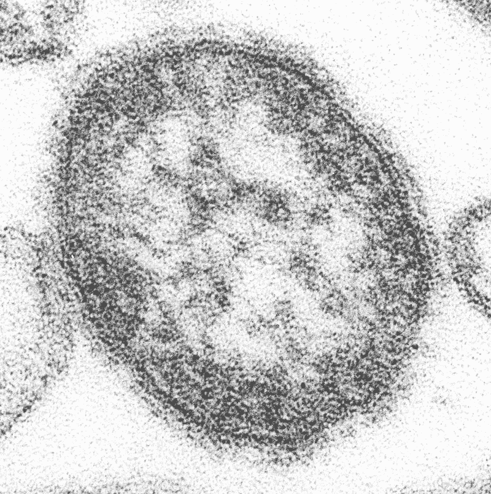
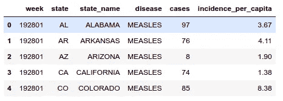
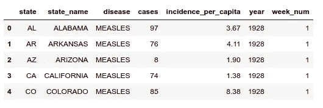
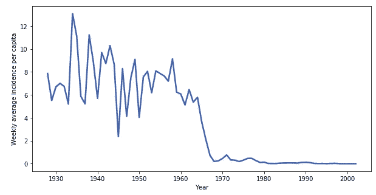
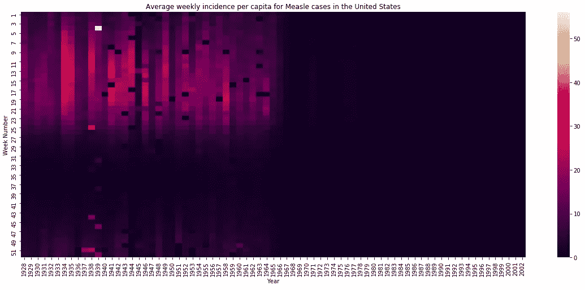
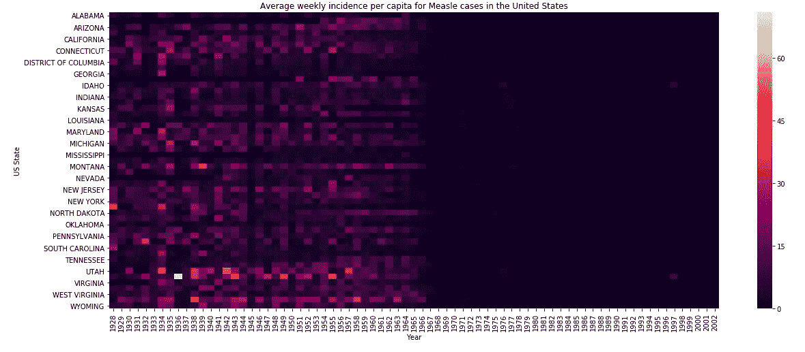

# 通过数据探索传染病:美国麻疹的交互式可视化

> 原文：<https://towardsdatascience.com/exploring-infections-through-data-interactive-visualisation-of-measles-in-the-usa-6ae8d5949538?source=collection_archive---------20----------------------->


在美国，1912 年，麻疹成为全国性的传染病。因此，美国所有的医疗保健提供商和实验室都必须向联邦政府报告确诊病例。今天我将关注从 1928 年到 2002 年在美国收集的麻疹数据。这是从[项目 Tycho](https://www.tycho.pitt.edu/) 获得的，该项目旨在向全球研究人员、数据科学家、学生和公众提供大规模公共卫生数据。这些数据来源于每周国家法定疾病监测系统报告，包括州一级的标准化计数和基于历史人口估计的每 100，000 人的发病率。

这个项目的目的是探索不同的数据可视化方法和 BokehJS 的能力。我被 BokehJS 的结果淹没了，我强烈推荐探索这个包。BokehJS 提供了一个强大的 Python API，允许你以 D3.js 的风格创建交互式绘图。我主要是从他们在[网站上提供的文档和优秀教程中了解 BokehJS 的。](https://bokeh.pydata.org/en/latest/)

我也强烈推荐这些资源:

*   威廉·科尔森(William Koehrsen)关于 BokehJS 创建 BokehJS 仪表板的文章非常精彩，分为三部分:[第 1 部分](/data-visualization-with-bokeh-in-python-part-one-getting-started-a11655a467d4)、[第 2 部分](/data-visualization-with-bokeh-in-python-part-ii-interactions-a4cf994e2512)和[第 3 部分](/data-visualization-with-bokeh-in-python-part-iii-a-complete-dashboard-dc6a86aa6e23)。
*   Eugine Kang 在这里给出了一个很好的基本概述。
*   来自 FreecodeCamp 的 Mandi Cai 在这里对散景和 D3 [做了一个很棒的对比。](https://medium.freecodecamp.org/charting-the-waters-between-bokeh-and-d3-73b3ee517478)
*   Eric Strong 可以帮助你开始在 Heroku 上运行一个散景应用程序。真是救命恩人(一般来说也是一个非常棒的博客！)

对于所有其他查询，Stackoverflow 和 Google 通常就足够了。

这个项目的所有代码可以在我的 Github 这里找到:[https://github.com/burtonbiomedical/measles_map](https://github.com/burtonbiomedical/measles_map)

我的 BokehJS 努力的最终产品在这里展示(这是一个在免费 Heroku dyno 上托管的 Bokeh Python 应用程序。它的性能落后于本地主机，可以从优化中受益。):【https://measles-bokeh.herokuapp.com/ 

## 麻疹是什么？



An electron micrograph of the measles virus. Photo Credit: Cynthia S. Goldsmith Content Providers(s): CDC/ Courtesy of Cynthia S. Goldsmith; William Bellini, Ph.D. — This media comes from the[Centers for Disease Control and Prevention](https://en.wikipedia.org/wiki/Centers_for_Disease_Control_and_Prevention)’s [Public Health Image Library](https://phil.cdc.gov/phil/home.asp) (PHIL), with identification number [**#8429**](https://phil.cdc.gov/phil/details.asp?pid=8429)

苏格兰医生弗朗西斯·霍姆发现麻疹是由血源性传染因子引起的。1758 年，爱丁堡爆发了一场麻疹流行病，霍姆开始试验麻疹疫苗。

麻疹传染性很强，通过感染麻疹病毒的人咳嗽和打喷嚏传播。该病毒有 10 至 12 天的潜伏期，随后症状会持续一周以上。这些症状最初包括高烧、咳嗽、其他类似流感的症状和眼睛发炎。症状期开始后三天内通常会出现明显的红色扁平皮疹，从面部蔓延至身体其他部位。大约有三分之一的病例会出现并发症，其中一些可能会改变生活，甚至是致命的，包括失明、脑炎和肺炎。尽管许多人可以存活并从感染中恢复，但每一千个病例中就有一个会导致急性脑炎，通常会导致永久性脑损伤，在不发达国家，死亡率已经高达 [28%](https://www.ncbi.nlm.nih.gov/pubmed/15106083) 。

尽管弗朗西斯·霍姆的疫苗接种尝试没有成功，但约翰·F·恩德斯和托马斯·C·皮布尔斯博士于 1954 年成功地从 13 岁的戴维·埃德蒙斯顿身上分离出麻疹，后来研制出第一种麻疹疫苗。但自 1968 年以来，莫里斯·希勒曼及其同事开发的改良弱麻疹疫苗为成功接种麻疹疫苗铺平了道路。

## 数据争论

我将在这里给出项目结果的简要总结，但是完整的细节请查看我的 [Jupyter 笔记本](https://github.com/burtonbiomedical/measles_map/blob/master/Exploring%20Measles%20with%20interactive%20plots.ipynb)。

让我们先来看看第谷项目提供的数据:



原始麻疹数据的时间变量有一个令人困惑的列，所以我在 apply 方法中用一个很好的 lambda 函数创建了一个年和周数列。熊猫图书馆对于数据争论来说确实是极好的。



然后，我为自己创建了一个总结函数，我可以在整个项目中使用它来生成汇总信息的数据框架，例如每年的总病例数、每周平均发病率以及每个州和年份组合的每周平均病例数:

```
def summarise(df, group_by):
    #Group data
    grouped = df.groupby(by = group_by)
    #Summarise data as Series then convert back to Dataframe
    cases_sum = pd.DataFrame(grouped["cases"].sum()).reset_index()
    cases_avg = pd.DataFrame(grouped["cases"].mean()).reset_index()
    avg_incidence_year = pd.DataFrame(grouped["incidence_per_capita"].mean()).reset_index()
    #Give columns sensible names
    avg_incidence_year = avg_incidence_year.rename(columns = {"incidence_per_capita": "avg_incidence_per_week"})
    cases_sum = cases_sum.rename(columns = {"cases": "total_cases_per_year"})
    cases_avg = cases_avg.rename(columns = {"cases": "avg_cases_per_week"})
    #Merge dataframes
    cases = pd.merge(cases_avg, cases_sum)
    new_df = pd.merge(avg_incidence_year, cases)
    return new_df
```

然后我得到了我需要的地理坐标(你看我要去哪里……敬请关注地图！)从散景库中下载，如下所示:

```
from bokeh.sampledata.us_states import data as States
```

我将地理信息嵌入到我的熊猫数据框架中，以便在项目后期使用。更多信息请参考我的 [GitHub](https://github.com/burtonbiomedical/measles_map/blob/master/Exploring%20Measles%20with%20interactive%20plots.ipynb) 上的笔记本。

## Seaborn 的静态图

在我进入数据科学世界的旅程中，我非常喜欢使用 Python Seaborn 库。当我刚开始的时候，我经常发现 matplotlib 笨拙而令人沮丧(一些纯粹主义者可能会因此讨厌我)。发现 Seaborn 是一种享受。它与熊猫的集成非常好，最终，作为一名数据科学家，你希望能够专注于你的模型和交流你的发现，而不是与图形包搏斗。

我从一些简单的线条图开始；一段时间内人均周平均发病率的变化和一段时间内病例总数的变化。



我们可以立即看到疫苗接种计划在 60 年代末/70 年代初产生的巨大影响。但是州之间的差异呢？有季节性模式吗？

由于数据的多维属性，这类问题不能通过线图很好地强调。使用热图可以实现更合适的可视化。在 Seaborn 生成热图相对简单。您可以向热图函数传递一个“long”格式的 Pandas 数据帧，其中轴值由索引和列给出，每个单元格的值是您希望在热图的每个给定交叉点绘制的值。用`pivot`方法可以实现“长”格式的 Pandas 数据帧的格式化。您可以指定要用作索引的列、将用于生成新列的列(每个值将指定一个新列)以及每个交叉点的值。这将返回一个“长”格式的数据帧。

通过使用热图，我可以通过在 x 轴上绘制年份，在 y 轴上绘制周数，在每个交叉点上绘制麻疹的严重程度(由人均发病率给出),来展示季节模式；其中较亮的颜色表示较高的发病率。热图非常适合可视化这样的三维数据。然后，我可以通过在 y 轴上绘制州名来对州进行同样的操作。这已经是一种非常有效的可视化方法，证明了保持一致的季节模式，以及 60 年代和 70 年代疫苗接种计划的显著效果。



## 静态的剧情很无聊！让我们开始互动吧！

虽然热图在传达美国麻疹疫苗接种的效果方面非常有效，但我认为在这个项目中探索交互式可视化会很有趣。启发性的统计数据、伟大的模型和有洞察力的趋势都是强有力的工具，但如果没有有效的沟通，这些都是没有意义的。当观众不仅有机会获得数据的广阔视野，而且有机会与它互动，探索它，并提出自己的问题时，这就是数据可视化真正变得神奇的时候。这就是我要利用 BokehJS 力量的地方。

我不会在这里详细介绍 BokehJS 是如何工作的，但是在这个项目的笔记本中，我给出了创建我下面演示的产品的每个步骤的完整解释。我也强烈推荐我之前列出的资源，如果没有我从每个资源中获得的洞察力，我将无法完成这个项目。

BokehJS 的真正力量可以在我认为对学习这个库至关重要的几个关键方面找到:

*   ColumnDataSource 对象:Bokeh 处理数据的核心是 ColumnDataSource 类。基本的 ColumnDataSource 对象是一个字典，其中的键与列名相关，值是这些列的内容。当在多个图中使用同一个 ColumnDataSource 对象时，它允许图之间的链接，这是我充分利用的。
*   检查员:一个非常简单的概念，立即让您创建强大的互动情节。只需几行代码，您就可以将静态二维图转换为交互式显示，使观众能够悬停在每个数据点上，并接触到原始数据集中包含的其他变量。
*   小部件和回调:散景库附带了大量的小部件，您可以使用它们来为您的绘图添加交互功能。我在应用程序中使用滑块并选择小部件。这些方法允许使用回调函数。您可以使用定制的 javascript 来完成这项任务，也可以像我在应用程序中那样使用 Python 函数。

所以，事不宜迟，这里是我的散景涂鸦的结果:

上面的两个视频显示了 Jupyter 笔记本中本地运行的完全交互式的情节。然后我将这些图组合成一个单独的 Python 应用程序，可以在 Heroku 上看到。

我希望这激发了你对 BokehJS 及其功能的好奇心。我已经在 [GitHub](https://github.com/burtonbiomedical/measles_map) 上的项目目录中包含了一个小教程，并试图让主项目笔记本尽可能的丰富。但是，如果您有任何问题，请不要犹豫，在下面留下您的评论。