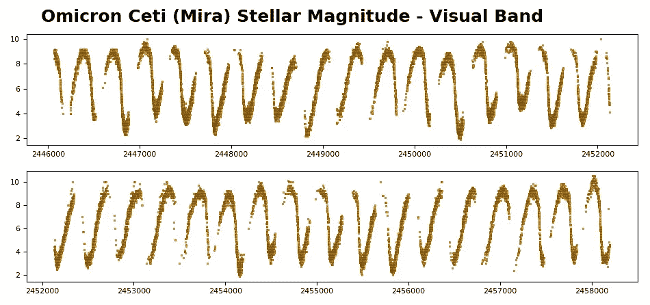
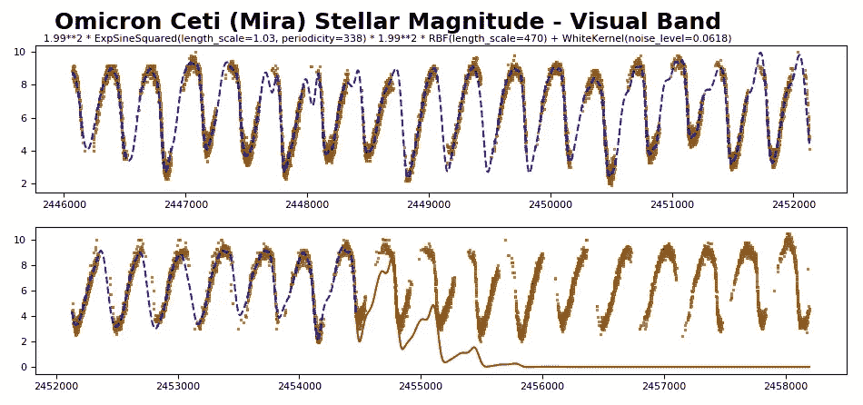
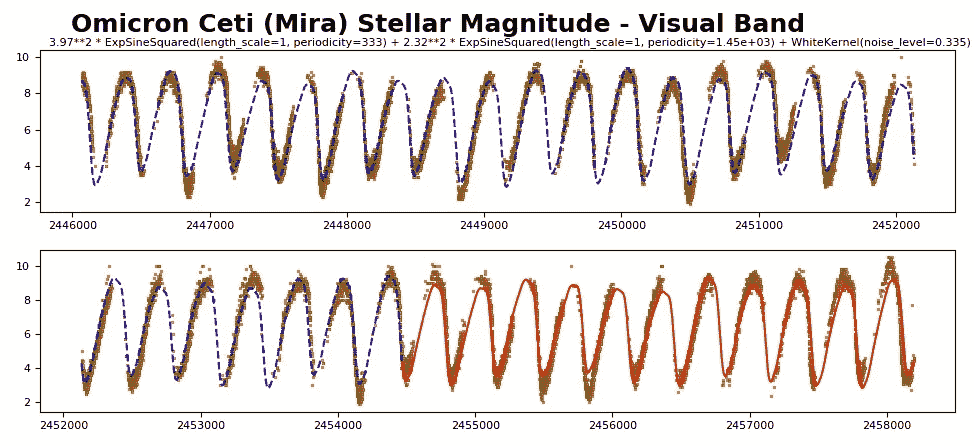

# 用高斯过程回归探索脉动变星

> 原文：<https://towardsdatascience.com/exploring-pulsating-variable-stars-with-gaussian-process-regression-418fab1d3d04?source=collection_archive---------6----------------------->

事实证明，高斯过程对于难以用经典单变量或多变量回归描述的现象建模非常有用。但是，在许多情况下，当处理定型数据域之外的特征值时，它们的预测能力会下降。然而，一个例外是依赖于三角函数的高斯过程协方差函数，例如 sin( *x* )。这些函数以其估计值的周期性为特征，可用于模拟观测数据所涵盖的时间段之外的稳定的周期性现象。

下面，我将逐步演示使用高斯过程回归和 ExpSineSquared 协方差函数来模拟一种脉动变星的光度曲线。在此过程中，我将分享我遇到的主要陷阱和见解，我希望你会发现这是对这一练习的相对直观的解释。

**脉动变星**

恒星的光度会因为各种不同的原因而波动。对于一些人来说，脉动的模式是混乱的，看起来是随机的，就像新星(恒星爆炸)或具有重复出现的太阳黑子的恒星的情况一样。对于其他人来说，比如我将在本次分析中使用的恒星，其模式是一致且稳定的。

长周期变星是由于恒星大小的变化而脉动的红巨星。我在这里要关注的恒星，塞特斯星座中的御夫座(Omicron Ceti)，是长周期变星中最广为人知和研究最多的例子。米拉的光度变化源于恒星温度的变化，导致大小以及可见光范围内外光输出波长的波动。

我将利用 1985 年到 2007 年对米拉的光度观测来预测 2008 年以后的光度曲线。我将使用的数据可从 AAVSO 国际数据库免费获得，该数据库汇集了来自世界各地的恒星观测者的贡献。

**拟合高斯过程回归**

我使用 Scikit Learn 的高斯过程回归(GPR)来促进这一分析。最初的挑战是将数据缩小到可用的大小。GPR 运行时间与(样本大小)成比例，因此随着数据量的增长，GPR 运行时间很快变得不切实际。在我的分析中，我发现从训练数据中随机抽取 1，000 个观察值(总共超过 80，000 个观察值)产生了相对一致的结果，同时将运行时间保持在一分钟左右。

我从 ExpSineSquared 内核和 WhiteNoise 内核开始，以捕捉 Mira 亮度测量中固有的随机波动性。仔细选择先前的内核超参数，以及设置超参数的上限和下限，对于建立良好的拟合至关重要。我重复了这个过程无数次，每次都不太合适，直到我发现了两个不同的参数:

*   **白化上界**:在设置一个噪声水平上界之前，模型反复拟合一个高噪声值的“懒惰”后验核。一旦我定性地评估了训练数据曲线上任何给定点的“真实”噪音的程度，我就将上限设置为 0.5，理由是噪音的量永远不应该超过该量。
*   **expsine squared periodicity**:类似于 WhiteNoise 参数，一旦我为 periodicity 超参数设置了上限和下限，我看到 GPR 拟合有了显著的改进。在这里设置界限很简单，只需查看光变曲线数据的散点图，目测波峰和波谷之间的距离。

以下是采用这两种超参数限制后的拟合结果:

在这张图中，我通过 2008 年至 2018 年的观察扩展了预测结果，在图上以红色显示。将拟合的单核 GPR 与训练窗口之外的数据进行交叉验证是我对预测准确性的主要测试。下图显示了 2008-2018 年实际观测亮度与同期拟合估计值的残差。

我想回答的另一个问题是:多核 GPR 是否比单个 ExpSineSquared (+WhiteNoise)核更适合 Mira 的亮度曲线？答案是肯定的，也是否定的。对于将 GPR *专门拟合到训练数据*，将 ExpSineSquared 内核与任何数量的其他固定内核相结合提供了增强的拟合。然而，除了训练数据之外，添加第二个稳定的非周期内核的边际增益很快变得极小。下面，观察使用 ExpSineSquared 核乘以 RBF 的拟合 GPR。随着与训练数据的距离增加到 RBF 的 lambda 参数以上，RBF 下降到零，GPR 变得无用。

然而，这并不是说单核 GPR 总是优于多核 GPR。如果被建模的现象在一个以上的时间跨度上表现出周期性，则使用多个 ExpSineSquared 核可能是合适的。在这种情况下，每个 ExpSineSquared 核可以拟合到不同的周期性超参数，以实现较高的预测精度。

这是相同的数据，拟合到一个协方差函数，该函数将两个 ExpSineSquared 内核相加(+WhiteNoise)。

尽管 GPR 符合周期参数约为 1，500 天的 ExpSineSquared 内核之一，但该模型的预测能力(如以下残差图所示，以及 1 核和 2 核 GPR 之间的均方根误差比较)并没有实质性提高。

 [## daso telo/Python _ Projects/Omicron _ ceti . py

### 通过在 GitHub 上创建一个帐户来为 Python_Projects 开发做贡献。

github.com](https://github.com/dasotelo/Python_Projects/blob/master/Omicron_Ceti.py)