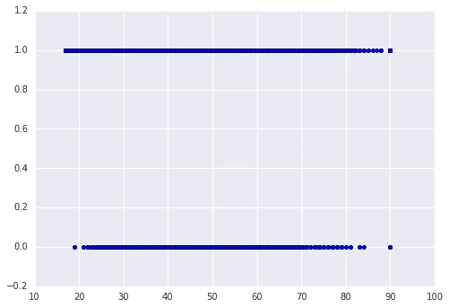
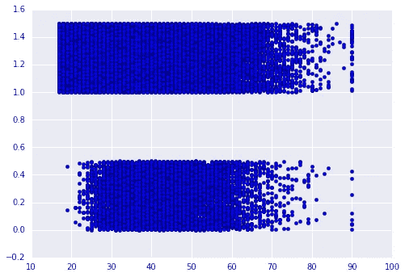
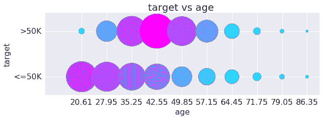
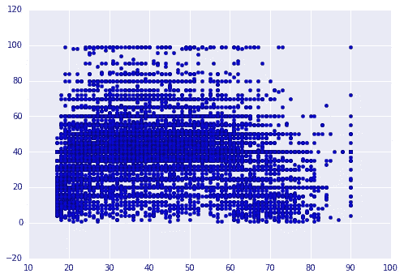
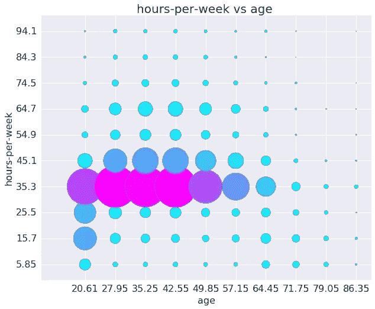
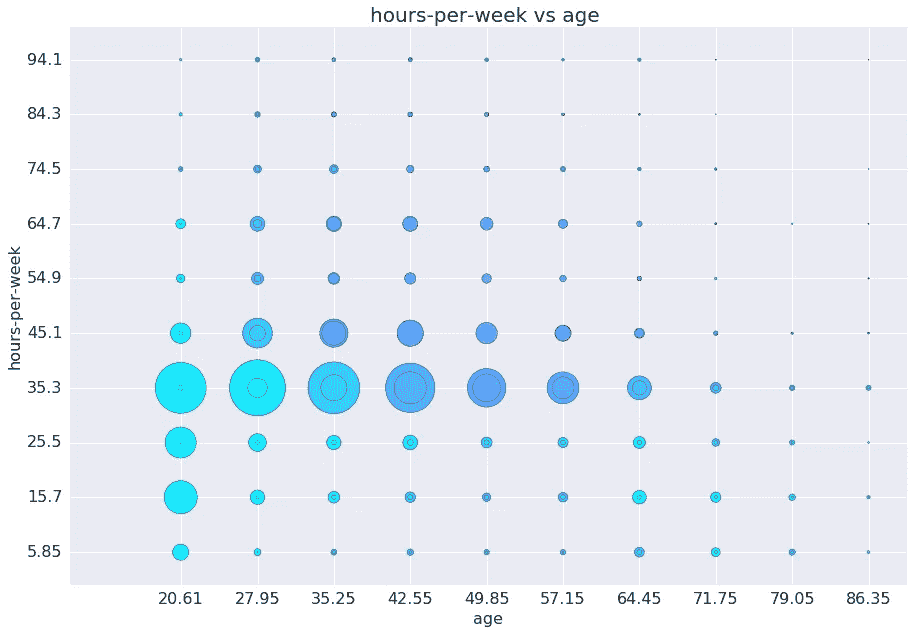
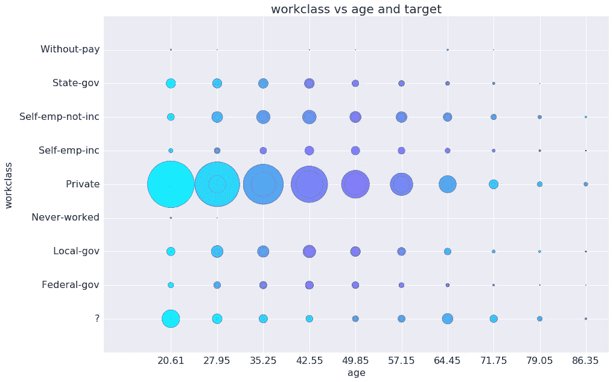
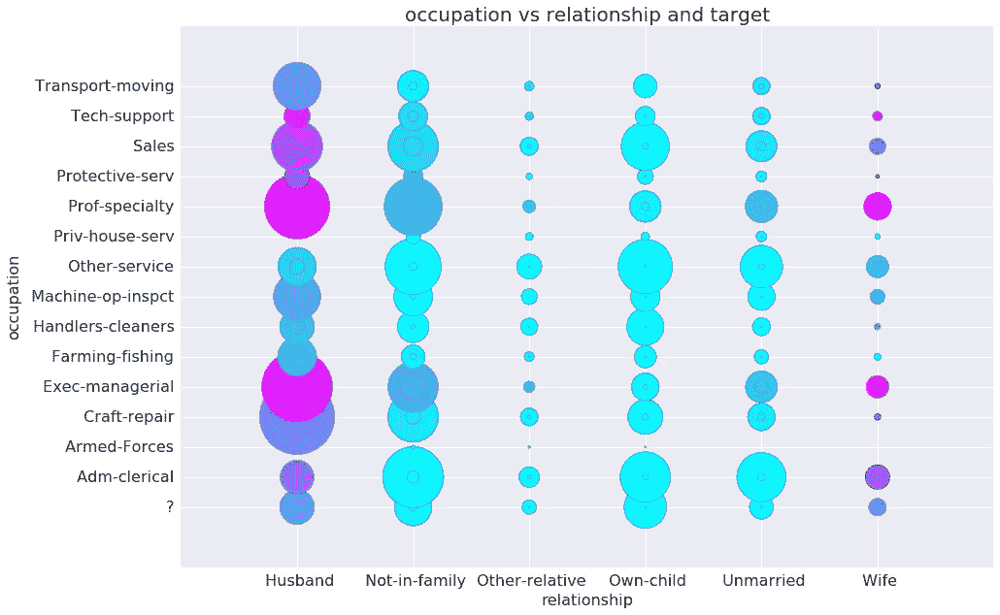

# 使用气泡图探索人口普查收入数据集

> 原文：<https://towardsdatascience.com/exploring-the-census-income-dataset-using-bubble-plot-cfa1b366313b?source=collection_archive---------3----------------------->

数据科学最美妙的事情之一是数据探索和可视化。那就是当数据告诉我们一个故事的时候，我们只需要花一些时间，去探索，去认真倾听。

在探索数据集时，我们会查看数据中不同特征之间以及特征和目标之间的联系。这可以为我们提供许多见解，如我们应该如何制定问题、所需的预处理(缺失值、归一化)、我们应该使用哪种算法来构建模型、我们应该分割数据并为数据集的不同子集构建不同的模型等。

# [人口普查收入](http://archive.ics.uci.edu/ml/datasets/Census+Income)数据集

为了演示这一点，我选择了[人口普查收入](http://archive.ics.uci.edu/ml/datasets/Census+Income)数据集，它有 14 个属性和 48，842 个实例。该数据集的目标是根据人口普查数据预测收入是否超过 5 万美元/年。

数据的特征是:“年龄”、“工作阶级”、“fnlwgt”、“教育”、“教育人数”、“婚姻状况”、“职业”、“关系”、“种族”、“性别”、“T5”、“资本收益”、“资本损失”、“每周小时数”、“本国”。

目标是收入水平:> 50K 或者≤50K。

下面是一个[人口普查收入](http://archive.ics.uci.edu/ml/datasets/Census+Income)数据集的例子:


# **年龄(数值)和收入(类别)之间的联系**

让我们来看看年龄与收入的散点图。

**y _ 轴:** > 50K → 1，≤50K。→0， **x 轴**:年龄

```
from matplotlib import pyplot as plt
plt.scatter(data.age, (data.target==’<=50K’))
```



**Scatter plot — Income vs. age - x_axis**: **age**, **y_axis: income** >50K → 1 , ≤50K. →0

这并没有告诉我们太多，对不对？所有的点都是一个接一个的。我们可以**给每个关卡添加一些随机噪声**来实现更多的散乱点。

`plt.scatter(data.age, (data.target==’<=50K’)+0.5*np.random.rand(len(data)))`



**Scatter plot — Income vs. age —x_axis**: age, **y_axis:** >50K → values above 1 , ≤50K. → values below 0.5

这样更好，但是仍然，当有很多点时，很难理解模式。

现在让我们试试 [**泡泡剧情**](https://github.com/shirmeir/bubble_plot) (泡泡剧情的完整文档和代码可在[https://github.com/shirmeir/bubble_plot](https://github.com/shirmeir/bubble_plot)获得)。

通过以下方式安装软件包:

```
pip install bubble_plot
```

我们需要提供数据帧，x 轴和 y 轴。

```
from bubble_plot.bubble_plot import bubble_plotbubble_plot(data,’age’,’target’, normalization_by_all=False)
```



**bubble plot** — target vs. age — P(y/x)

现在我们可以看到一个实际的模式！

对于数字特征，如年龄，气泡图会创建桶。每个气泡的大小与每个桶中的点数成比例(在这种情况下，还与颜色成比例)。

我们可以看到收入最高的人群大多在 39–45 岁左右(这个水桶的中间是 42.5)。

将参数 normalization_by_all 设置为 False 定义了我们想要绘制 P(y/x)，也就是说，在给定年龄(x)的情况下绘制收入(y)的分布。该图中的每一列都是给定年龄的收入值的独立(1D)直方图。

将参数 normalization_by_all 设置为 True 将绘制年龄(x)和收入(y)的联合分布 P(x，y)，这实际上是一个带有气泡的 2D 直方图。

`bubble_plot(data,’age’,’target’, normalization_by_all=True)`


**bubble plot** - target vs. age — P(x,y)

现在我们得到了收入(y)和年龄(x)的联合分布，P(x，y)。从这里我们可以看到，我们数据中的大多数人都处于较年轻的年龄段(大约 20-30 岁)，一小部分年轻人(大约 20 岁)群体拥有高收入，因为他们的泡沫非常小。在高收入人群中，最大的年龄组是 42 岁左右。

这是分类特征和数字特征的对比图。但是如果我们想要可视化两个数字特征之间的联系呢？

# **绘制两个数字特征之间的联系**

让我们回顾一下每周工作时间与年龄的关系。

`plt.scatter(data.age, data[‘hours-per-week’])`



**Scatter plot — working hours per week vs. age — x_axis**: age, **y_axis:** working hours

同样，由于这个数据集有许多点，从散点图中你无法了解这两个变量之间的联系。

使用气泡图，我们可以得到更清晰的东西。

```
bubble_plot(data,’age’,’hours-per-week’, normalization_by_all=False)
```


**Bubble plot — working hours per week vs. age — P(y|x)**: **x_axis**: age, **y_axis:** working hours, distribution of the working hours given the age group. The bubble are normalized by the x-axis (age) so in each column the bubble size sums up to 100%

我们可以看到，给定一个人的年龄在 20 岁左右，一个人最有可能每周工作 15-20 小时，而如果一个人在 35-45 岁之间，一个人更有可能工作 45-90 小时。)一周小时。

气泡图为两个数字特征(年龄和每周工作时间)创建了存储桶，并且在给定年龄的情况下，气泡大小与每周工作时间的计数频率成比例。

现在我们来看看**联合分布**。

```
bubble_plot(data,’age’,’hours-per-week’, normalization_by_all=True)
```



**Bubble plot — working hours per week vs. age, P(x,y)**: **x_axis**: age, **y_axis:** working hours

现在，气泡的大小与每周小时数和年龄值的频率成正比。我们可以看到，这个数据集中的大多数人年龄在 20-30 岁之间，每周工作 30-45 小时。

# **用气泡图可视化三个维度——年龄、工作时间和收入**

现在我们来看年龄，每周工作小时，结合收入水平。这怎么可能呢？我们能在二维图中显示三维信息吗？

`bubble_plot(df, x=’age’, y=’hours-per-week’, z_boolean=’target’)`



**Bubble plot — working hours per week vs. age —P(x,y): x_axis**: age, **y_axis:** working hours, **color** — proportional to the rate of high income people within each bucket

在这个泡泡图中，我们再次看到了每周小时数与年龄(p(x，y))的联合分布，但这里的**颜色**与这个桶中所有人的高收入人的**比率—**—*(#>50K/(#>50K)+(#≤50K))***—成比例。通过提供 z_boolean 变量，我们使用气泡的颜色向绘图添加了额外的维度。**

颜色越浅，给定布尔特征/目标 z 的比率越高。请参见图像中的色彩映射表。


Cool colormap — Pink would stand for the higher ratios in our case, cyan would stand for the lower ratios

这张图清楚地向我们表明，在每周工作超过 40 小时的 30 岁以上的人群中，高收入更为普遍。

# 工作阶级与**年龄与收入**



**p(x,y): y-axis - workclass, x-axis - age**. **color** is proportional to the **rate of high incomes** within each bucket.

这里，y 轴是工作阶层，x 轴是年龄，颜色与每个区间内的高收入比率成比例。

你可以看到，如果你是 30-60 岁之间的自营职业者，你收入超过 5 万英镑的可能性最大。联邦政府也有更高的税率获得收入超过 50K，但在 40-60 岁之间。州政府在 48-52 岁之间有较高的收入。

# **职业 vs 关系与收入**



**p(x,y): y-axis — occupation, x-axis — relationship**. **color** is proportional to the **rate of high incomes** within each bucket.

专业、行政管理和技术支持的高收入人群比例最高。已婚人士似乎有更高的概率获得高收入。请注意，在经理层中，丈夫的高收入比率比妻子略高(更高)。

# **总结**

虽然散点图和箱线图可以为我们提供数据分布和汇总统计的高级视图，但这有时是不够的，尤其是在数据有许多点并且变量之间的联系不是一个平凡函数的情况下。

使用[气泡图](https://github.com/shirmeir/bubble_plot)来可视化我们的数据可以帮助我们清楚地看到数据集中特征之间的关系，即使是大型数据集，对于分类特征和数字特征也是如此，这可以帮助我们以更合适的方式对数据建模，并为连接和特征找到正确的函数。

# 安装气泡图:

```
pip install bubble_plot
```

# 在 python 上运行 bubble_plot:

```
import pandas as pd  
from bubble_plot.bubble_plot import bubble_plot
from sklearn.datasets import load_boston                            
data = load_boston()                            
df = pd.DataFrame(columns=data['feature_names'], data=data['data'])                            
df['target'] = data['target']                            
bubble_plot(df, x='RM', y='target')
```