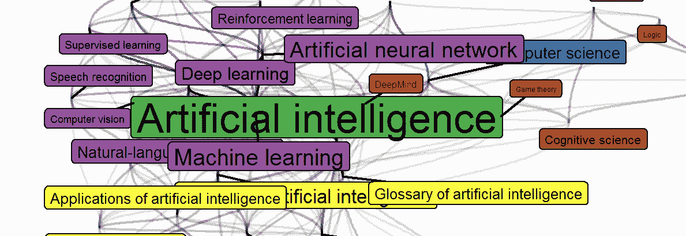
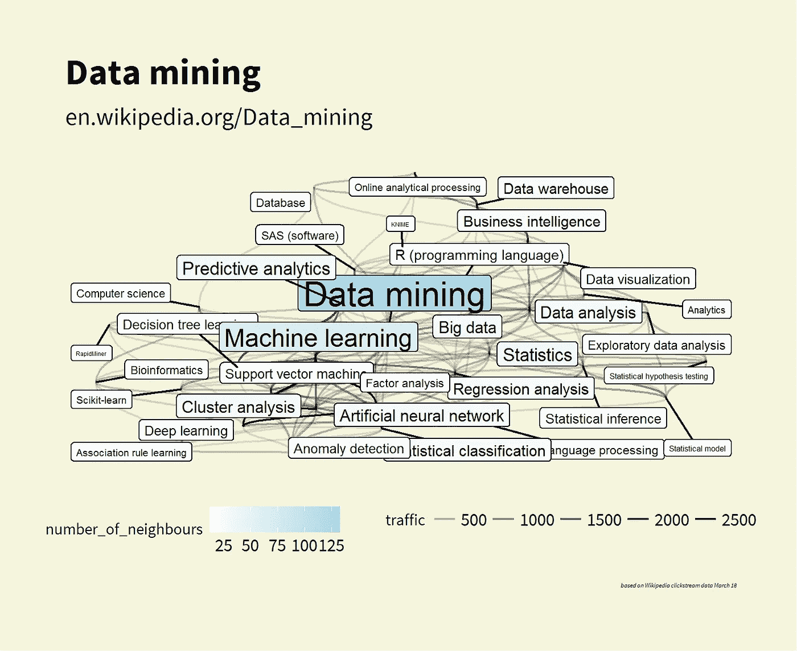
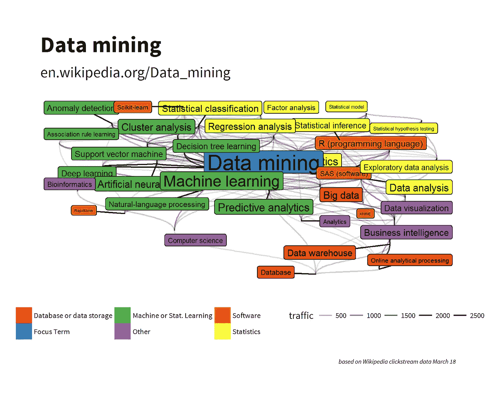
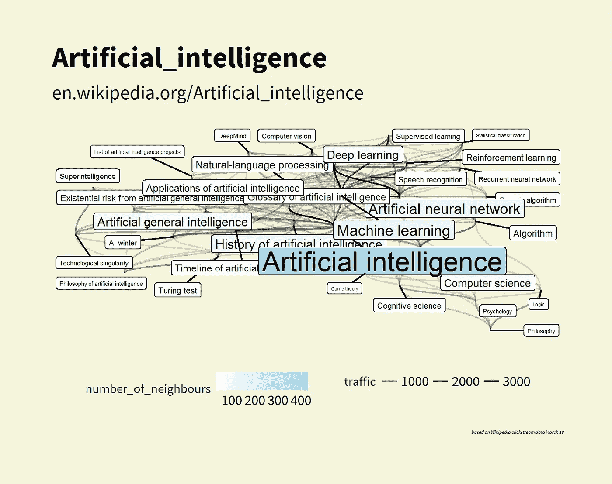
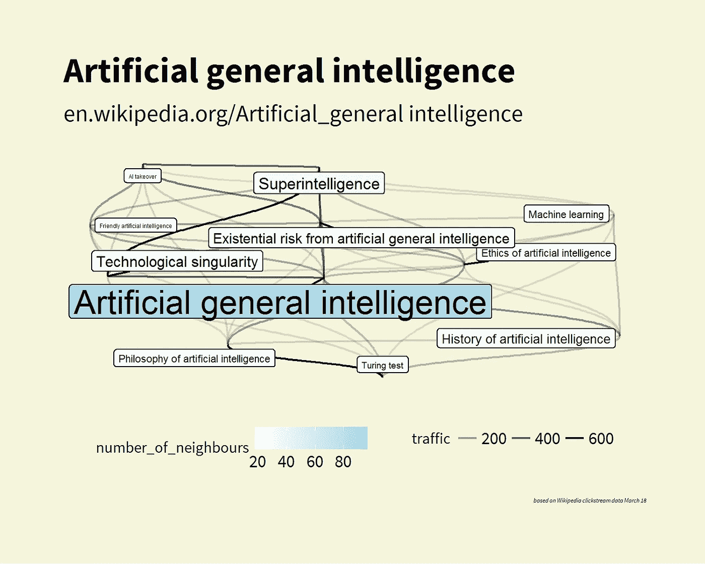

# 用最新的维基百科点击流探索人工智能、数据科学和机器学习的意义

> 原文：<https://towardsdatascience.com/exploring-the-meaning-of-ai-data-science-and-machine-learning-with-the-latest-wikipedia-5fea5f0a2d46?source=collection_archive---------5----------------------->

数据科学、机器学习和人工智能等术语在科技流行语的“万神殿”中找到了一个当之无愧的位置。

我们几乎每天都听到和读到关于他们的报道。事实上，它们经常被互换使用，尽管根据来源的不同会有明显的偏好(你可能已经注意到市场营销和媒体对术语 AI 的某种偏好)。

[https://medium.com/enabled-innovation/artificial-general-intelligence-too-much-or-too-little-too-soon-9c0dd7bd1c2d](https://medium.com/enabled-innovation/artificial-general-intelligence-too-much-or-too-little-too-soon-9c0dd7bd1c2d)

*上图是根据普华永道* *改编的* [*，这是互联网上众多试图解释术语之间关系的维恩图中的一个，但并不十分直观。*](http://usblogs.pwc.com/emerging-technology/a-look-at-machine-learning-infographic/)

我们可以使用数据和分析方法来捕捉这些术语的含义和语义上下文吗？好吧，让我们试一试，试着以毒攻毒。维基百科点击流数据集对此会有很大帮助。

# 维基百科点击流

维基媒体基金会最近决定对几种主要语言的每月点击流进行开源。一个典型的英语点击流包含数百万个不同的维基百科网址，被互联网用户请求数十亿次。

拥有如此全面的资源是一个好消息。它可以对全球最繁忙的网站之一的在线用户行为进行多种复杂类型的分析。事实上，有几篇[发表的学术论文](https://blog.wikimedia.org/2018/01/16/wikipedia-rabbit-hole-clickstream/)从不同的科学角度研究了点击流数据集，尤其是行为角度。

这将是一种使用网络分析的实用方法。不仅是为了回答上面的问题，也是为了激励点击流和网络分析在其他应用和领域的使用。关键词研究、内容开发、网络流量可视化浮现在脑海中，我相信还有很多其他的。

# 数据集

我们将使用 2018 年 3 月的最新可用数据集，其中包含 2330 万对英文引用和目标 URL，占维基百科服务器总页面请求数的 62 亿。

该数据集使得基于用户从一个维基百科页面导航到另一个页面的方式来可视化不同术语之间的关系成为可能，要么通过跟随链接，要么使用内置的搜索功能——有时会成为[维基百科兔子洞](https://blog.wikimedia.org/2018/01/16/wikipedia-rabbit-hole-clickstream/)的受害者。

# 节点、边和邻域

数据集实际上是一个巨大的节点网络(维基百科文章),这些节点根据用户会话期间请求的页面顺序通过边连接到其他节点(相关文章)。

边的大小可以被认为是反映两个节点之间流量的权重因子。使用网络分析的一个好处是其输出可以制成图表。这让我们可以看到所有这些点击和页面转换可能意味着什么的整体视图。

注意:下面的图表已经过配置，可以在移动设备上正常查看。然而，它们最好在大屏幕上观看。

接下来，我们将研究以下术语的点击流图:

*   数据挖掘和数据科学
*   机器学习
*   人工智能和人工通用智能。

# 数据挖掘热身

作为热身，为了解释分析方法，我们将从数据挖掘开始，这是一个过去经常使用的术语。

这个初始图隔离了网络中涉及“数据挖掘”的部分及其相邻节点(文章)。两个节点之间的边是它们之间的流量，节点的颜色和大小反映了它们所连接的邻居的数量。这在某种程度上已经是有用的了。为了更好地理解相关术语，作为第二步，节点被分组到相关类别中，以便更清楚地看到更广泛的关系。

这种做法的缺点(除了我个人对使用标签的偏见之外)是图表可能会有过多的文本和颜色。此外，在某些情况下，例如人工智能，很难将组的数量控制在可管理的水平。在人工智能的情况下，节点不够同质，无法创建有意义的类别。在这两种情况下，节点都是故意不分组放置的。还要注意的是，为了使图形更加清晰，一些节点是不可见的——要么是因为它们的通信量低，要么是因为它们的邻居数量非常少。

# 数据科学

首先要注意的一点是，维基百科中关于数据科学的条目相对有限。在这篇文章中，它是所有其他术语中超链接数量最少的。然而，内容一直在大幅增长。自 2017 年 11 月第一个数据集发布以来，页面上的链接几乎翻了一番。

*   在观察了图表之后，我们可以说，从维基百科的角度来看，数据科学围绕着机器学习(主要)和统计学(其次)以及一点计算机科学(当考虑到节点的长尾时，这变得更加明显)。
*   实际上，我认为大多数人都会同意数据科学比这更广泛。随着文章内容的不断增长，希望很快会有更多的证据。
*   对于机器学习是否应该被视为数据科学的重要组成部分这一常见问题，从维基百科点击流的角度来看，答案显然是肯定的。

(关于数据科学的有趣事实:与它相关的一个页面实际上是维基百科关于[流行语](https://en.wikipedia.org/wiki/Buzzword)的文章，尽管它的[顶点度数](https://en.wikipedia.org/wiki/Degree_(graph_theory))不足以让它进入图表)。

# 数据科学—数据挖掘比较

关于数据挖掘的文章更加全面，因为它已经存在了很长时间。

也就是说，在相关术语的类型之间仍然有相当多的相似性。数据科学图表中的大多数术语也出现在数据挖掘图表中。这可能会给那些认为数据科学是 90 年代和 21 世纪初使用的数据挖掘的更名版本的人提供一些依据。

然而，就目前而言，数据科学缺乏与业务相关术语的强关联，如商业智能、分析，可能还有数据挖掘的 OLAP 等术语，但随着数据科学文章的发展，这些和其他关联可能会出现。

# 机器学习

机器学习似乎是最直接的例子。它在很大程度上与涉及知识发现或预测的不同科学方法的术语有关(被称为机器或统计学习方法)。

*   我们看到以下两种类型的许多节点:经典方法，如统计分类和逻辑回归，以及其他更现代的方法，如支持向量机、随机森林和人工神经网络。
*   机器学习的概念主要与方法、模型和技术相关联。许多人——但不是所有人——的目标是在给定一组观察结果的情况下预测结果。事实上，ML 相关节点的列表可以很容易地转换成一本关于 ML 的书的目录。
*   深度学习或强化学习等几种“x”学习类型的出现也令人印象深刻。这不再仅仅是有监督和无监督的学习。这一发现表明，ML 本身可能正在演变成一个总括术语，以容纳越来越多的学习型家庭。
*   机器学习“需要”统计数据吗？就像之前维基百科的答案是肯定的，因为在许多与最大似然相关的方法中存在统计或统计学习。

# 人工智能

这是迄今为止最广泛、最多样的术语，但也是最难转换成图表的术语。AI 本身与超过 450 个节点相关联，我不得不为邻居的数量设置一个高阈值，这样图形就不会看起来像一个巨大的毛球。节点的多样性仍然很难定义有意义的类别。

*   许多节点具有非常一般的性质:科学(心理学、哲学)或科学领域(逻辑学、博弈论等)的名称，这是多学科人工智能的证据。
*   大多数相关节点本质上是对人工智能某些特定方面的引用，例如人工智能的应用、人工智能术语表、时间轴、历史等。这是我们在之前的术语中没有观察到的。
*   同样，在这里我们第一次看到了一家公司的存在:Deep Mind，这可能是该组织在将人工智能应用到现实世界中所发挥的作用的结果。
*   最后，有两个关于艾伦图灵的节点，他自己的页面和同名测试的页面。令人印象深刻的是，可以追溯到 1950 年的图灵测试经受住了时间的考验，并且仍然与今天的人工智能环境相关。

# 人工通用智能

为了跟上时代精神，最后一张点击流网络图是为人工智能设计的。

图中的节点不够均匀，无法创建多个有意义的群集。然而，在带有“头脑上传”和“智能爆炸”等名称的节点之间，我们可以看到编辑和用户似乎感兴趣的两个主题。

让我们称第一个集群为“邪恶的人工智能”,包括如下页面

*   来自人工一般智能的存在风险
*   人工智能接管
*   全球灾难风险

让我们以“AI for good”集群结束，它包括:

*   友好的人工智能
*   人工智能和哲学
*   人工智能伦理

聚类本身不能明显地定义人工一般智能，但是它们指示了与它们相关联的流行内容。

# 人工神经网络的普遍性

我们研究了这 5 个术语，人工神经网络(ANN)是所有 5 个术语中唯一存在且突出的相关术语。

很难接受这是一个巧合。人工神经网络结合现代计算技术的进步与人工智能领域的最新进展密切相关。在某种程度上，他们帮助人工智能在经历了多年的“人工智能寒冬”后重新崛起。

目前最先进的深度学习模型是基于人工神经网络的。Tensorflow 是 Deep Mind 最著名的开源项目，在 [Github 交互](https://octoverse.github.com/)和 [Stackoverflow 流量](http://%20https//stackoverflow.blog/2017/11/13/cliffs-insanity-dramatic-shifts-technologies-stack-overflow/)方面，它是最受欢迎的人工神经网络应用程序库之一。从各方面考虑，人工神经网络似乎很可能会继续存在，我们将会听到越来越多关于它们的消息(我的预测)。

# 密码

使用 R 语言生成图形的代码可在[github repo](https://github.com/papageorgiou/wiki-cls-blogpost)中找到，其中一些参数和过滤器选项(如边数过滤器、阶数、阶数)可用。

您可以使用[简单的开始脚本](https://github.com/papageorgiou/wiki-cls-blogpost/blob/master/quick-start-script.R)，快速试验您选择的其他概念是如何相互关联的。

# 动机

这篇文章是由一些内容组合而成的，这些内容是我最近接触到的，我强烈推荐这些内容。

*   米哈伊尔·波波夫关于创建网络中立图的博客文章
*   米克·库尼在都柏林数据科学会议小组的[网络分析培训材料](https://github.com/kaybenleroll/dublin_r_workshops/tree/master/ws_network_201803)
*   大卫·罗宾逊的 [blogpost](http://varianceexplained.org/r/ds-ml-ai/) 和 [WinVector 的文章](http://www.win-vector.com/blog/2013/04/data-science-machine-learning-and-statistics-what-is-in-a-name/)从实用的角度解释了 AI、ML、数据科学(和公司)的区别

我还想强调像 [ggplot](http://ggplot2.tidyverse.org/) 和[gg graph](https://github.com/thomasp85/ggraph)这样的开源库在处理网络数据可视化时是多么有用。

# 最终意见

当你现在正在判断你刚刚阅读的内容，并且可能已经有了一些异议，请记住:我们的目标不是定义任何术语，而是通过维基百科编辑和用户行为的角度来看待它们。在我看来，这有点像在玩拼图游戏。

当然，文章反映了作者的偏见，这是一种固有的偏见。然而，积极的一面是，在维基百科的情况下，由于维基的编辑模式和控制过程，我们可以依靠群众的智慧来减轻任何强烈的偏见或极端/错误的观点。举个例子，维基百科关于人工智能的文章有数以千计的[编辑和观察者。](https://xtools.wmflabs.org/articleinfo/en.wikipedia.org/Artificial_intelligence)

总之，对维基百科点击流进行网络分析的一个重要好处是，它可以揭示世界上最大的百科全书的用户和贡献者都认为重要的内容。基于他们书写和点击的方式。

你怎么看，维基百科点击流还有其他值得探索的术语吗？你认为这个数据集还有其他有趣的用途吗？数据科学从业者:有没有一种方法可以使用例如 NLP 来自动对图中的节点进行分组？

亚历克斯·帕帕乔治

# 关于我

*我是营销分析和数据科学方面的独立顾问，帮助转化驱动的数字企业做出明智的营销决策。我在我的* [*博客*](http://alex-papageo.com/blog) *和* [*上，通过 Twitter*](https://twitter.com/alex_papageo) *和*[*LinkedIn*](https://www.linkedin.com/in/alexandrospapageorgiou/)*分享我关于数字、营销和数据分析的故事。*