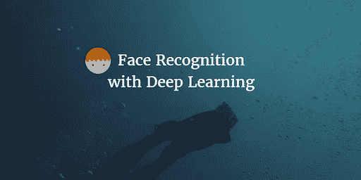
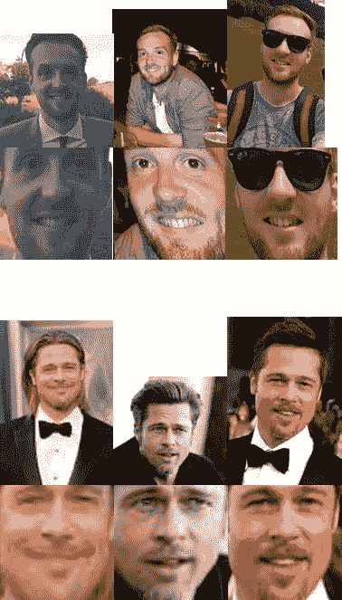

# 我看起来像布拉德·皮特吗？

> 原文：<https://towardsdatascience.com/face-recognition-with-deep-learning-767a1e6f4974?source=collection_archive---------10----------------------->

## 我们来问一个深度学习模型



Face recognition with deep learning

在另一篇文章中，我查看了[数据准备](https://medium.com/@lewisdgavin/facial-image-data-prep-for-a-deep-learning-model-fe547473a68b)来从图像中提取一张脸，并将其对齐，这样不管脸的旋转，面部特征总是对齐在中心。

在这篇文章中，我将准备一些我自己和布拉德·皮特的照片。目标将是在这些图像上训练一个深度学习模型，看看当呈现新图像时，它是否能检测出我们之间的差异。

这有点像第二十二条军规。如果一切顺利的话，模特将会成功地认出我或者布拉德·皮特。另一方面，如果它可以轻松做到这一点，这可能意味着我看起来一点也不像布拉德·皮特！

# 深度学习——它是什么？

机器学习和深度学习是相当超载的术语。他们被认为是不需要太多努力就能轻松解决任何问题的灵丹妙药。然而，事情并不总是这么简单。为了建立一个模型，你需要了解你在找什么，有什么参数，有多少训练数据，它有多可靠等等。

深度学习是一种专注于神经网络的机器学习。那就是编程和建立一个受人脑启发的模型。[亚当·盖特基有一篇很棒的文章](https://medium.com/@ageitgey/machine-learning-is-fun-part-2-a26a10b68df3#.7nppi8lvx)，他会比我更好地解释神经网络。

对于这篇文章，深度学习将用于产生称为嵌入的点(稍后解释)。这些点描述了面部的图像。在我们的例子中，给定两组人的图像，它的目标是确保它产生的点(嵌入)对于同一个人的面部非常相似，但是对于另一个人的面部非常不同。

1.  确保为布拉德·皮特的脸的图像产生的所有点是相似的。
2.  确保为我的脸部图像生成的所有点都是相似的。
3.  确保为布拉德·皮特的图像生成的点与为我的脸的图像生成的点尽可能不同。

这将允许我们训练一个[分类模型](http://www.lewisgavin.co.uk/Machine-Learning-Basics/)来区分两组图像。

# 建立一些训练数据

第一步是获得更多的数据。我不想花太多时间去挖掘和下载图片，所以我最初用 3 张布拉德的图片和 3 张我自己的图片来验证这个概念。

我通过我在[上一篇文章](http://www.lewisgavin.co.uk/ImageDataPrep)中写的`face_skew.py` python 应用程序运行每张图片。这给了我总共 6 个对齐的图像。



我将这些图像存储在一个名为 aligned_faces 的文件夹中，每个图像都有自己的子目录。

`./aligned_faces/me/` `./aligned_faces/bradp/`

# 建筑嵌入

现在我已经准备好了数据，是时候构建嵌入了。

请记住，这些嵌入是由神经网络产生的一组 128 个点。这些点对于相同的人脸是相似的，而对于其他人的人脸是不同的。128 点嵌入过程是从谷歌的一些研究中发展出来的。建立一个深度学习模型来做到这一点非常耗时，并且需要一些强大的显卡。为了克服这一点，我使用了来自 [Openface](https://github.com/cmusatyalab/openface) 的预训练模型。

他们提供了一些帮助代码以及帮助我生成嵌入的模型。你需要确保你已经用 sklearn 和 pandas 库安装了 Python，同时还安装了 [Dlib](https://pypi.python.org/pypi/dlib#downloads) 、 [OpenCV](http://docs.opencv.org/3.2.0/da/df6/tutorial_py_table_of_contents_setup.html) 和 open face(https://github . com/cmusatyalab/open face)。

一旦你安装了所有这些，进入 Openface 的基本目录，然后进入一个名为`batch-recognise`的文件夹。

在这里，我运行以下命令来为我对齐的面构建嵌入。

```
./main.lua -outDir ~/facerecognition/embeddings/ -data ~/facerecognition/aligned_faces/
```

在`outDir`中，这应该产生 2 个文件:`labels.csv`和`reps.csv`。它们分别包含输入图像的图像路径和每个图像的一行 128 个点。

**成功了！我已经用深度学习模型运行了我的图像，并产生了一些输出**

在处理[机器学习应用](http://www.lewisgavin.co.uk/tag/machine%20learning/)时，你可能会注意到一个趋势。大部分工作是在数据准备和将数据转换成机器可读的格式。在我们的例子中，它获取图像数据并将其转换成数字表示。在分类文本数据进行情感分析之前，我们必须做同样的事情。

一旦完成，剩下的就是构建一个简单的分类器来进行“识别”。

# 识别面孔——我看起来像布拉德·皮特吗？

如果您想要更高级的方法来完成这一步，您可以训练自己的分类模型来对嵌入进行分类。然而，在 Openface 目录中，他们友好地提供了一个使用[支持向量机算法](http://www.lewisgavin.co.uk/Machine-Learning-SVM/)的示例 python 分类器。

从 Openface 基本目录，进入名为`demos`的目录。

为了训练分类器，我运行了以下内容:

```
$ python classifier.py train ~/facerecognition/embeddings
```

现在，在您的嵌入文件中，您应该有一个 pickle 文件，其中包含您生成的 SVM。

为了测试它，我简单地获得了两个额外的图像，它们不同于我用来训练模型的图像。一张是我的，另一张是布拉德·皮特的。

我对它们进行了测试，得到了以下结果:

```
$ python classifier.py infer ~/facerecognition/embeddings/classifier.pkl /media/sf_Shared/test_image_me.jpg === /media/sf_Shared/test_image_me.jpg === Predict me with 0.86 confidence. $ python classifier.py infer ~/facerecognition/embeddings/classifier.pkl /media/sf_Shared/test_image_bradp.jpeg === /media/sf_Shared/test_image_bradp.jpeg === Predict bradp with 0.73 confidence.
```

# 包裹

总之，不幸的是，即使只有 3 张图片的训练数据集，**这个模型也能很容易地区分我和布拉德·皮特！**我真的应该看到它的到来。

然而，它似乎只对小样本数据有效。这是一个很好的介绍，让我开始理解深度学习的力量及其工作原理。尽管只是复制粘贴命令，但阅读这个主题的内容是很重要的，至少可以对模型的工作原理有所了解。

在未来，我将试图从头开始建立自己的深度学习模型。