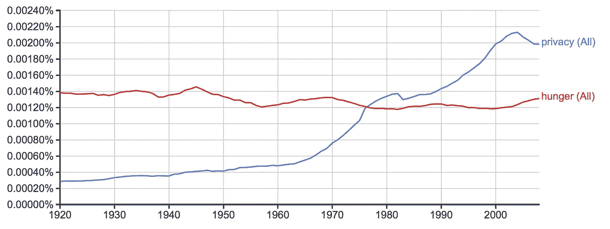

# 脸书，告诉我该怎么做！

> 原文：<https://towardsdatascience.com/facebook-tell-me-what-to-do-168b1e028880?source=collection_archive---------10----------------------->

在围绕侵犯隐私和#deleteFacebook 运动的丑闻中，我发现自己感到兴奋，而不是不安。

Mirror mirror on the wall

我相信真理和意义——只是我还没能识别它们。这就是为什么十几岁的时候，我梦想成为一名物理学家，提出一个描述一切事物的公式。我已经放弃了这个想法。)当围绕大数据的讨论让我从艺术转向 IT 和数据科学时，我对自己的能力产生了怀疑。大数据的承诺是，我们*可以*知道一切，即使我们可能永远也不会理解它。

多年后，我们在这里用数据销售产品，寻找爱人，赢得选举。数据就是力量。而大权力是可怕的。因此，我们努力限制这种权力，声明数据应该受到保护，并将隐私视为一项基本人权。

*(我的祖父母更关心食物和其他东西。)*

Google n-gram

当我们不知道这种力量为谁服务的时候，或者有时我们太了解它的时候，这种力量就特别可怕。如果你不是付费的顾客，那么你可能就是产品。当谈到脸书时，我认为不应该是这样。可以为用户提供真正的价值，从而使个人成为客户——挑战将是设计最好的以用户为中心的数据产品。

作为又一个困惑的千禧一代，我真的需要一些见解。我已经知道我会在霍格沃茨的哪个房间，哪个性别，哪个城市角色和死去的天才，但是我发现这些信息很难应用到现实生活的决定中。你为什么不给我一些更有说服力的证据？是的，我会为此付出代价。(我的意思是，我曾经付钱给一位名叫劳拉的在线占星家，她在自己的网站上使用漫画。有满月折扣或 smth。# no regets)

大数据可以成为更好地了解自我和个人成长的工具。没有人比像脸书这样的大型互联网公司更适合提供这种服务，这些公司已经收集个人数据十多年了。所以不用感谢你的“下载数据”按钮。我宁愿你以对我有利的方式使用我的数据，如果你搞砸了，就去找下一个提供商。