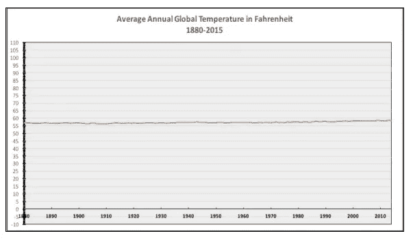
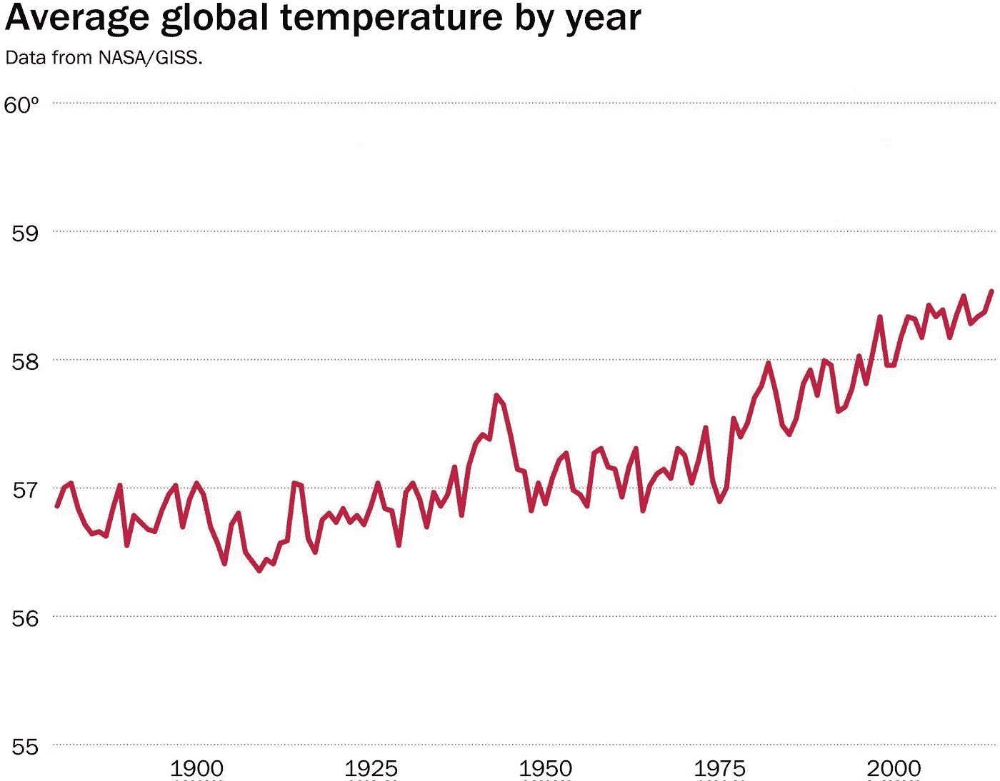

# 假新闻和数据科学家的责任

> 原文：<https://towardsdatascience.com/fake-news-and-the-responsibility-of-data-scientists-b74d176d7bd1?source=collection_archive---------3----------------------->

Photo by [Bank Phrom](https://unsplash.com/@bank_phrom?utm_source=medium&utm_medium=referral) on [Unsplash](https://unsplash.com?utm_source=medium&utm_medium=referral)

> 95%的统计数据都是编造的。

关于事实与真相的讨论最近出现了很多，特别是随着“假新闻”的泛滥和新闻媒体对某些事实(以及非事实)的报道。我们听到到处都是人们提起热点问题并声称*“90%的人同意我的事实！”*和*“我有证据证明 X 发生了——这是事实！”像 snopes.com、politifact.com 和 factcheck.org 这样的网站的存在是为了消除这些“事实”中的政治偏见和解释，但是我们为什么需要这样的东西呢？是因为记者主动编造信息，故意骗观众吗？或者，他们只是简单地调整了一些确凿的事实，使之符合他们偏好的叙述？*

Credit: National Review

在上图中，*国家评论*(通过 Twitter)显示，从 1880 年到大约 2015 年，全球平均气温几乎没有变化。这里要问的重要问题是:

1.  y 轴是怎么回事？为什么有这么大的空间？
2.  如果我们垂直放大会看到什么？在这(极其)广阔的数据视野中，是否隐藏着某些趋势或周期？
3.  全球年平均气温的显著变化是什么？50 度？. 5 度？

Credit: NASA

美国宇航局公布了相同的数据，但垂直轴更紧。当我们放大时，很明显，自 20 世纪初以来，全球平均气温一直呈上升趋势。此图中要问的重要问题是:

1.  1900 年之前发生了什么？毕竟，地球已经存在了一段时间。我们有可能在寻找另一个局部最大值吗？我们应该期待这种循环自然逆转吗？
2.  同样，随着时间的推移，什么会被认为是平均温度的显著上升或下降？

亲爱的读者，我知道你在想什么，我保证不会把一些伪装成假新闻的情绪化/错误的政治宣言扔给你，但重要的是要注意，在更广泛的背景下，你从新闻评论员那里听到的东西并不总是事实，同时也不一定是彻头彻尾的谎言。

它们是事实——或者换句话说，它们是通过报道者的视角呈现给消费者的事实。诚然，在政治背景下，这经常被用来满足党派议程或引导消费者相信一个人而不是另一个人，但这不是我真正想讨论的。

## 事实与真相，在上下文中

我们在党派新闻报道中看到的同样的偏见无处不在——存在于我们依赖某人(或某事)来吸收事实并代表他人解释它们的所有地方。

对于我们关于数据科学的讨论，请允许我将事实和真相分别归结为数据和数据的表示。更深一层来看，数据只是。。。嗯，*数据。*列和行的原始信息*通常*完全不受解释偏差的影响(尽管对于任何实验，数据科学家都应该意识到人类天生倾向于通过糟糕的实验设计来偏差数据，但我们现在不去管研究偏差)。

另一方面，真相是从数据的*解释*中得出的结果。正如生活中人们需要提取原始数据的其他地方一样，作为消费者，我们看到的是对原始事实的有偏见的表示，强调对解释者产生最大影响的东西。换句话说，真相有可能有多种有效版本，所有版本都基于同一组事实。

对此的第一反应是思考“为什么我们不跳过中间人，向消费者提供原始的、不带偏见的事实，而不是一些扭曲的事实？”这是一个公平的观点，但通常消费者要么不知道如何解析原始信息，要么根本不在乎；这非常耗时，需要大量的主题知识和专业技能，并且在现代应用程序的环境中，会严重破坏愉快的用户体验。想象一下，你不得不查询网飞的数据库来决定接下来该看哪部蒸汽吸血鬼动作惊悚僵尸恐怖喜剧(不，谢谢)。

因此，如果向消费者提供原始事实是无效的，并且提供一个更简单、更精炼的事实会受到解释偏差的影响，那么我们还有什么选择呢？这就是数据科学专家的道德和义务所在。

## 数据科学家的责任

在让数据自己说话和提供平台(肥皂盒？)数据的最重要特征对消费者来说是最明显的。在实践中，构成“重要功能”的标准是高度个案化的，基于用户是谁，用户需要完成什么，以及知道用户能够影响什么过程(参见:用户体验研究)。

更简洁地说:**通过数据科学家吸引用户的信息传递来实现对事实的最佳呈现，同时非常小心地确保所呈现的数据不会**。

以下是实现这一点的几种方法:

*   **了解你的用户**:了解他们的需求、技术能力、可用性/交互/体验偏好，以及最终什么样的信息将帮助他们做出最佳决策。数据科学家通常会忽略这一步，直接进入数据，但请记住，回到基础，问一些“愚蠢”的问题，并确保不做不切实际的假设总是没问题的。这很重要。
*   **保持透明**:教育是数据科学家最大的盟友！商业用户变得越来越复杂，通常不再认同“神奇的黑匣子”的概念:他们想知道引擎盖下是什么，是什么在驱动引擎。以我的经验来看，它有助于指导用户(在高层次上)完成你所进行的不同类型的实验，为什么某些模型比其他模型更好，并突出你在数据中发现的有趣信息——它让他们继续投入到探索过程中，并让他们对最终产品有更大的欣赏力。
*   **注意*而不是*提供领先内容(未经消费者同意)**:提供行动号召是没问题的(事实上，这通常是首先进行数据科学的原因)，但重要的是要知道，无论你的分析产生什么样的行动号召，都不是在“欺骗”用户。例如，显示一个带有暗红色指示器的图表可能会让消费者认为他们正在查看的数据是负面的或不受欢迎的；再加上不相称的坐标轴(正如我们从《国家评论》中得到的数据)，你就得到一份相当误导性的分析报告(这个词我在本文中用得很不严谨)。如果你不确定你的可视化、统计等等的含义，那么和你公司的 UX 专家一起工作；根据我的经验，他们在数据科学中的角色被严重低估了。