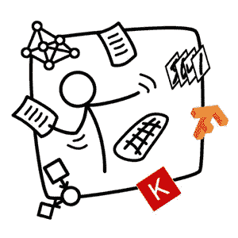

# 神奇的模型和如何训练他们

> 原文：<https://towardsdatascience.com/fantastic-models-and-how-to-train-them-experimenting-with-software-development-pipelines-in-7051b9d930f7?source=collection_archive---------7----------------------->

## 在机器学习项目中试验软件开发管道。

在我多年的软件工程师生涯中，我参与过不同规模和应用领域的软件项目。到目前为止，我很幸运有机会尝试不同的技术堆栈，使我的专业技能始终保持最新，并与当今技术领域不断发展的节奏保持一致。不过，直到最近，我才开始尝试和积累机器学习相关技术的技能，一部分是出于日常工作的需要，一部分是出于个人兴趣(我承认，我算是个极客)。因此，在恢复我的数学理论并学习了一两个主要软件库的基础知识后，我开始尝试复制一些在网上找到的最有趣的例子。

首先，当你开始使用一个全新的技术堆栈时，你可能会很容易记下一些实现 web 教程的随机脚本，或者尝试一些没有特定顺序的变体，只是为了体验一下它的感觉…

不过，我很快意识到，为了能够在更专业的环境中开发我的新技能，我需要以一种更有条理的方式进行。因此，我考虑将这些新技术和工具与我迄今为止通过设计和开发“经典”企业级应用程序所学到的东西相结合，通过将通常的软件开发管道和工具适应于涉及机器学习模型的特定情况。我计划在这里记录我的努力和实验，并把它们作为指南提供给像我一样开始在这个迷人的技术领域前进的人。

首先，我开始从鸟瞰的角度考虑整个软件开发和发布过程。

最佳实践和模式在这个问题上提供了一个有用的视角:举个例子，其中一些实践建议在软件开发和发布生命周期中严格分离构建、发布和运行的三个阶段。**构建**阶段处理用我们最喜欢的编程语言为我们的应用或服务实际编写源代码，处理源代码版本等方面，通常会产生一个二进制*可执行文件*包，称为“构建”。接下来的**发布**(也称为**部署**)阶段采用这个二进制包，并将其与严格依赖于目标部署环境的特定配置数据相结合(开发、测试和质量保证、试运行、生产等)。这种配置数据可以包括外部数据库或其他类似服务(所谓的“后台服务”)的连接和凭证，部署特定的设置，例如部署的规范主机名等。因此，这个阶段产生的东西是可以立即执行的。作为最后一个阶段，**运行**阶段在目标环境中执行应用程序或服务的主进程。

这种严格的阶段分离意味着，例如，禁止在运行时环境中直接改变应用程序代码，但是必须启动新的发布周期来改变源代码，产生新的包，并在目标运行时上将其作为新版本执行。这保证了许多好的属性，比如过程的可追溯性、可再现性等等。

因此，所有这些导致建立分离的(至少在概念上)运行时环境，其中不同的阶段由不同的特定环境支持，每个环境配备有最适合支持与所讨论的阶段相关的特定活动的资源级别、软件基础设施工具。

开发环境将需要一些 IDE(如 Eclipse、Visual Studio 或 PyCharm)和语言运行时，以允许开发人员生成他们的代码，持续集成(CI)环境将包含共享、版本化和管理源代码和编译的组件二进制文件(如 GIT、Maven、Jenkins 等)的工具。)，最后，目标运行时环境应该配备一些可靠的运行时基础设施，允许软件组件的执行，同时管理诸如分布、负载平衡、容错等问题(最近我对 Kubernetes 很感兴趣)。

现在，当考虑机器学习项目时，首先想到的一个方面是构建阶段在概念上变得稍微复杂一些。开发人员不只是编写一个构建然后执行的程序源代码，而是这个第一个源代码是一个构建然后在某个地方执行的程序*以产生另一个“程序”*(即 ML 模型)，最终将在其他地方执行以服务于客户的请求。

明确地说，CI 和 train 环境之间的实际“物理”分离基本上是由从源代码构建应用程序二进制文件的不同任务与训练 ML 模型相比产生的根本不同的需求所强加的。后者应该比前者需要更高的计算能力和资源，可能需要 GPU、TPUs 等等的支持……我意识到，对于有经验的 ML 实践者来说，这一切听起来可能微不足道，但是我承认，一开始我花了一些时间来正确地关注这个问题，导致了一些最初的困惑，我认为模型训练只是最终可执行工件构建过程中的一个进一步阶段。

类似地，训练环境和目标执行环境的需求可能会有很大的不同，其中最终目标甚至可能只是运行训练模型的某个移动设备，作为某个“人工智能驱动的”移动应用程序的一部分。

在接下来的文章中，我打算研究在设置和操作上述难题的任何部分时可能出现的任何问题，主要关注企业级环境中的相关解决方案，其中可能涉及不止一个开发人员的团队，设计大规模模型或(最重要的)使用大数据集，以及运行时性能、高可伸缩性或弹性等考虑因素很重要。就基于机器学习的软件而言，所有这些都是从一个初学者的角度来看的，就像我正在进行的这项探索工作的“日记”一样。与此同时，我的意图不是提供一些关于如何制作东西的深入的逐步指导，而是对可能出现的问题、您面临的选择或可用选项(最佳实践、软件工具、服务等)采取高层次的观点。)这可能有助于找到所需的解决方案。

我希望这是一个能让一些人感兴趣的主题，也希望收到关于如何改进这一系列帖子的好的反馈和有用的建议。

# 参考文献和注释

[1] *参见所谓的“12 因素”方法，这是一套最近非常流行的模式和建议，最初是由 Heroku(众所周知的 PaaS 平台)的工程师设计的。这些旨在为构建可移植、高可伸缩和弹性的应用程序提供指导，特别关注基于 web(软件即服务)或基于云的服务，正如大多数现代软件应用程序所期望的那样。https://12factor.net/*T2