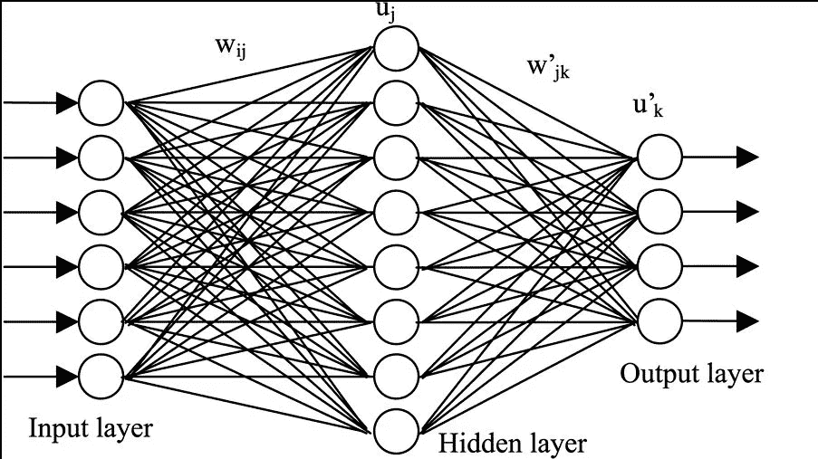

# 你将从 fast.ai (V2)第 1 课中学到什么

> 原文：<https://towardsdatascience.com/fast-ai-v2-lesson1-synopsis-tl-dr-4985bba9eea2?source=collection_archive---------3----------------------->

[fast.ai](http://course.fast.ai/) 是一个学习深度学习(DL)的在线平台。它有 14 节课，分为两部分，每部分 7 节课。第 1 部分主要涵盖与 DL(深度学习)在各个领域的应用相关的主题，以及如何为自己的项目构建这些模型。另一方面，第 2 部分让您深入了解数据科学的当前研究，这推动了前沿技术的发展。版本 2 (v2)是 fast.ai 的 2018 版本。

与其他大多数在线课程不同，fast.ai 采用自上而下的方式教授 DL。这意味着 fast.ai 不是专注于每个算法背后的理论，而是提供如何构建和使用 DL 模型的实践经验。在使用这些模型时，你将在需要时学习必要的主题。

这个博客为那些已经看过第一课视频的人做了一个总结，如果你还没有看过的话，它也是一个帮助你做好准备的来源。我试着把事情分解成小模块，这样每一段都谈论一个特定的主题。

如果你已经熟悉了 DL 和机器学习(ML)的基础，你可以直接跳到**第一课总结。但是如果你是这个领域的新手，那么前几段是为你准备的。作为一名数据科学新手，有一些事情你必须知道。**

最重要的是，**的参数**。参数是模型的全部。人们经常谈论参数或权重(两者都一样)，下面是它们的意思。假设我们有已经分成两类的数据。模型的工作是将每个数据点分类到其各自的箱中。“参数”是那些决定哪个点将进入哪个类的值。

损失函数是你应该知道的下一件重要的事情。损失函数的作用类似于参数的质量检查。如果参数是对每个数据点进行分类的值，那么损失函数给我们关于参数对于给定数据有多好的信息。

所以训练一个模型无非是找到损失最小的正确参数。我们随机选取一组参数，并在每次迭代后更新这些参数，以获得最小损失。**梯度下降**用于决定哪个方向带我们到达最小值。

打个比方，如果你在山顶的车里，目的是往下开，梯度下降就是你的车行驶的方向。说到开车下坡，有一件事是我们在开车下坡时都会做的。或者说，我们必须这样做。那会是什么？大胆猜测一下。明白了吗？是啊！我们使用刹车。没有一个理智的人会在没有摩擦力的帮助下疯狂地开车。(除了刹车失灵)。当使用梯度下降更新参数时，我们应用一种特殊的刹车，通常称为**学习率。**

学习率提供了从随机参数到最新模型的平滑过渡。将学习率设置得太高就像加速汽车下坡。更别说到达山脚，加速度会让你偏离道路。学习率太高，不会收敛到最小损失。损失随着高学习率而增加，并且模型将停止学习。

如果学习率太小，就像过度使用刹车。模型肯定会达到最小值。但这需要很长时间。我们不能无限期地训练一个模型。所以设定正确的学习速度总是非常重要的。

最后，**参数初始化。**我们总是采用一组随机数作为参数，并使用梯度下降进行更新。初始化的经验法则:对称不起作用。我们的大脑都一样。我们对初始化的第一个想法非常简单。“为什么不能用全零？”没有。那不行。

最好的初始化方法是从高斯分布中抽取随机数。这仅仅意味着用随机数乘以 sqrt{2/n}。n 是所有层的参数总数。

话虽如此，让我们进入本博客的主题——fastai 第一课概要。

# 第 1 课总结:

第一课就像是每门课程教材的典型的第一章。
第一章:引言。

是啊！我说的是那一章，通常是你从那本书里读到的最后一章。(我也这么做。击掌！)嗯，fast.ai 的第一课就是那个入门章节。

第一课的要点可以大致分为四类。

1.  **通用深度学习简介**
2.  **每个 fast.ai 视频的内容(前 7 个)**
3.  **设置虚拟机**
4.  **关于代码、构建代码的语言以及其他细节**

# **1。深度学习概述:**

深度学习相对于机器学习算法的优势在于，ML 需要大量的特征工程。ML 也有各种算法可供选择，对于每个数据集，我们应该检查哪一个效果最好。DL 通过使用**深度神经网络(DNN)** (因此得名深度学习)让生活变得更容易

神经网络(NN)看起来像这样。

©[http://www.extremetech.com/wp-content/uploads/2015/07/NeuralNetwork.png](http://www.extremetech.com/wp-content/uploads/2015/07/NeuralNetwork.png)

另一方面，DNN(深度神经网络)看起来像这样。

©[https://qph.ec.quoracdn.net/main-qimg-7c35987ad55173b3b76214b9112830ff](https://qph.ec.quoracdn.net/main-qimg-7c35987ad55173b3b76214b9112830ff)

不要担心它看起来有多复杂。只是欣赏美丽的图案。

深度学习有三重优势。**无限灵活，通用参数拟合，快速&可扩展。**

给定任何数据，神经网络理论上应该能够近似拟合它，只要我们给它 ***足够的参数。*** 这就是所谓的普适逼近定理。但是这在真实的数据集中是失败的，因为我们使用的数据有很多噪音。出于这个原因，我们通过层层叠加来使用深层网络。它非常有效。因此，**灵活性—检查**

DNN(深度神经网络)的目标是将参数尽可能完美地拟合到手头的数据。所以随机寻找最佳参数是行不通的。获得良好参数的更好方法是沿着损耗最小的方向。而**梯度下降**给出这个方向。给定任何问题，(负)梯度下降将指向最小损失。因此，**所有目的参数拟合—检查**

尽管深度神经网络需要相当长的时间来训练，但是预测时间是最小的。GPU 在过去十年中发挥了重要作用，减少了训练或预测所需的时间。

©[https://www.karlrupp.net/2013/06/cpu-gpu-and-mic-hardware-characteristics-over-time/](https://www.karlrupp.net/2013/06/cpu-gpu-and-mic-hardware-characteristics-over-time/)

几乎所有为深度学习研究而构建的语言，如 TensorFlow、Theano、PyTorch 等，都使用这些 GPU。**快速&可扩展—检查**

卷积神经网络(CNN)就是这样一类深度学习算法。在 fast.ai 的前几次讲座中，我们将在 CNN 工作。CNN 致力于一个叫做卷积的概念(很明显！！).卷积是一种数学方法，它整合两个函数，观察当一个函数发生变化时，另一个函数如何变化。

# 2.fast.ai '课程结构:

**第一课——简介**(无聊？我知道。但是继续读。有些事情你可能会感兴趣。)

**第 2 课—不同数据集上的图像分类器。**考虑各种数据集，学习 DL 中不同的技术，对图像进行分类。

**第 3 课——预测分析。**从结构化数据中，我们将尝试预测销售或天气，或者检测帐户和其他酷应用程序中的欺诈行为。

第 4 课—自然语言处理。(NLP)理解给定文本数据中存在的内容。或者对文本属于哪个上下文进行分类。像这样的问题将在第四课中讨论。

**第五课——协同过滤和推荐系统。**这将是一堂非常有趣的课(也是我个人最喜欢的)，我们将讨论如何根据之前的观看列表推荐一部电影或一本书。网飞、Prime Video 或其他类似网站使用推荐系统。

**第 6 课——文本生成。**想一个算法，它能为你的剧本提供莎士比亚风格的对话。在本课中，您将学习如何做到这一点

第 7 课—图像分割。在最后一课中，你将学习如何训练一个模型在给定的图片中找到一只猫或一只狗。fast.ai 的第一部分到此结束。

# 3.设置虚拟机:

我们已经讨论过深度学习如何使用 GPU 来处理复杂的任务。但并不是每个人都有一台笔记本电脑或一台配有良好 GPU 的台式机。而且买一个 GPU 好的系统是很大的投资。为了克服这一点，人们开始使用虚拟机。这些服务器向公众开放，每月收取象征性的费用。

已经设置了 fastai 的一些虚拟机包括:

*   [Crestle](https://www.crestle.com/) :使用方便。可以在 CPU 和 GPU 之间切换，降低整体成本。
*   [Paperspace](https://www.paperspace.com/) :更便宜更快。

除了这两家之外，还有其他虚拟机提供商

*   [谷歌云平台](https://cloud.google.com/):给你 300 美元积分，一年免费订阅。太好了。但是你需要在用完那 300 美元的积分后付款。
*   亚马逊网络服务:有很多变体可供选择。其中一些非常便宜，而且几乎免费。AWS 还有一年免费层。
*   Google Colab:我的最爱。为什么这么问？完全免费。有什么条件？每次你向谷歌申请服务器时，它都会给你一个有限的时间来访问其中的一个。之后连接终止，刷新，访问权授予另一个用户。所以如果你超过了时间限制，那么你必须从头开始。

我可以详细说明如何设置这些虚拟机，但这将使我们偏离主题。在第 1 课中，Jeremy 在前 12 分钟介绍了这一点，您可以轻松设置 Crestle 或 Paperspace，没有任何问题。

如果您在设置任何其他虚拟机时遇到问题，请使用 Google Colab。所有你需要的 Colab 是一个工作的谷歌帐户。打开 Colab 笔记本后，在工具栏中进入*运行时>改变运行时类型>硬件加速器> GPU。*你可以走了。

# 关于代码的其他详细信息:

**法斯泰图书馆。** fastai 是由杰瑞米·霍华德和瑞秋·托马斯创建的开源库。它基于 PyTorch 构建，使用 python 3.6。(当心！一些代码对你来说可能看起来很新，因为它没有运行在 python 3.5 上)要使用这个库，在你的终端中，
*git 克隆*[*https://github.com/fastai/fastai*](https://github.com/fastai/fastai)>*CD fastai*>*conda env 更新。*

**lr _ find()函数**。设置正确的学习速率对于学习正确的参数至关重要。在 fastai 库中，lr_find()函数以非常小的学习速率开始，并且在每次迭代后加倍。经过几千次迭代后，损失开始增加，此时 lr_find()停止，我们可以绘制损失与学习速率的关系。

损失急剧下降的区域是最佳学习率。在这种情况下，它在 1e-2 左右。

fast.ai V2 L1 的总结到此结束。正如我在开头所说的，fastai 的基本概念是在需要的时候学习必要的东西。我尊重他们的想法，所以我对每一个概念都做了大致的介绍，而没有深入到它们的细微差别。一旦你理解了神经网络是如何工作的，我可以用数学给你一个更好的描述。已经在路上了。

如果我错过了什么或者你想知道更多，请在评论中提出。我总是乐于接受积极的批评和讨论。

快乐学习。干杯！

是的。如果你喜欢这个博客，别忘了鼓掌..