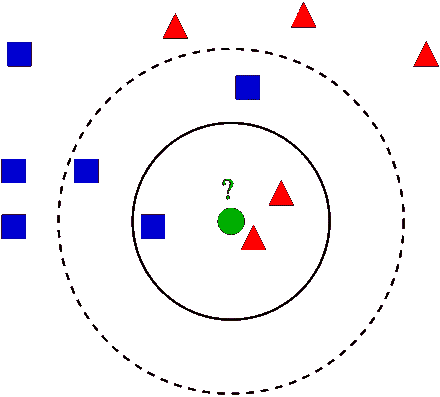
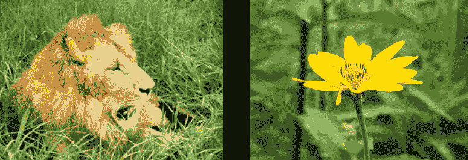
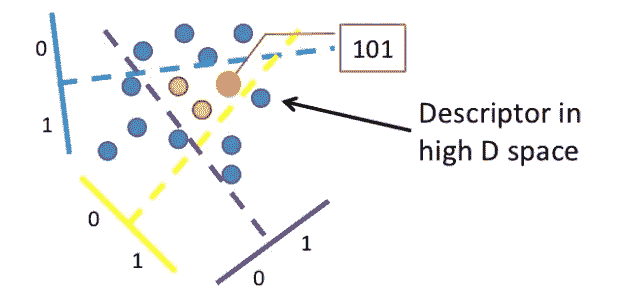
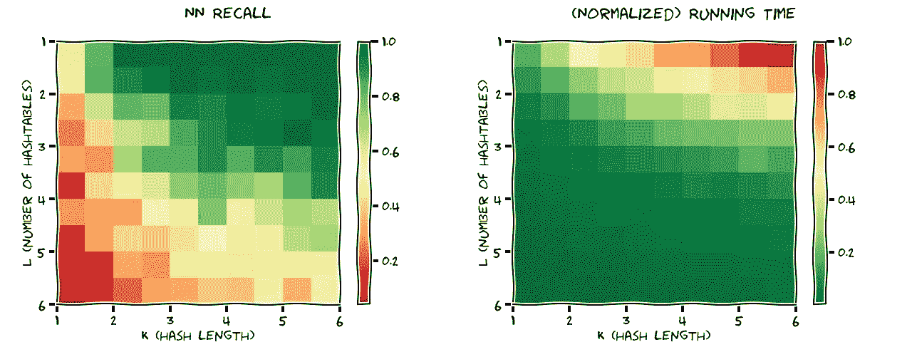

# 使用位置敏感散列的快速近似重复图像搜索

> 原文：<https://towardsdatascience.com/fast-near-duplicate-image-search-using-locality-sensitive-hashing-d4c16058efcb?source=collection_archive---------3----------------------->

## 一个快速的 5 部分教程，讲述深度学习如何与高效的近似最近邻查询相结合，用于在庞大的集合中执行快速语义相似性搜索。

## 第 1 部分:为什么最近邻查询如此重要

如果你在机器学习方面受过一些教育，最近邻居这个名字可能会让你想起 [k-nearest neighbors](https://www.wikiwand.com/en/K-nearest_neighbors_algorithm) 算法。这是一个非常简单的算法，看起来实际上没有“学习”:kNN 规则只是通过训练集中 k 个最近邻中的多数标签对每个未标记的例子进行分类。

k-NN algorithm: with k=3, the green example is labeled as red; with k=5, it is labeled as blue

这似乎是一个非常天真，甚至“愚蠢”的分类规则。是吗？这取决于你用什么作为你的距离度量，也就是:你如何选择来度量例子之间的相似性。是的，天真的选择——在“原始”特征中使用简单的欧几里德距离——通常在实际应用中导致非常差的结果。例如，这里有两个例子(图像),它们的像素值在欧几里德距离上很接近；但是有争议的是，仅仅因为左边的图像是右边图像的邻居，就把它归类为花是疯狂的。

Euclidean distance in pixel space = visual/syntactic/low-level similarity

但是，事实证明，将 kNN 规则与距离度量的适当选择结合起来实际上是非常强大的。“度量学习”领域表明，当在使用 kNN 规则之前应用机器学习来学习度量时，[结果可以显著提高](https://papers.nips.cc/paper/2795-distance-metric-learning-for-large-margin-nearest-neighbor-classification.pdf)。

我们当前的“深度学习时代”的伟大之处在于有大量可用的预训练网络。这些网络解决了某些分类任务(预测图像类别，或单词周围的文本)，但有趣的是，它们在这些任务上的成功并不多，但实际上它们为我们提供了极其有用的副产品:*密集向量表示，简单的欧几里德距离实际上对应于高级的“语义”相似度*。

Euclidean distance in deep embedding space = semantic similarity

关键是，对于许多任务(即通用图像和文本)，我们已经有了一个很好的距离度量，所以现在我们实际上可以使用简单的 kNN 规则。我在过去已经谈过很多次这一点——例如，在以前的一篇文章中，我试图使用这样的搜索来验证这样的说法，即生成模型真的在学习底层分布，而不仅仅是记忆训练集中的例子。

这就给我们留下了实际寻找最近邻居的任务(我称之为 NN 查询)。这个问题——现在几乎是*任何* ML 管道中的一个构建模块——已经得到了很多关注，无论是在 CS 理论文献中，还是从需要高度优化生产环境解决方案的公司那里。这里，社区再次受益，因为这个领域的几个大玩家实际上已经开源了他们的解决方案。这些工具使用精心制作的数据结构和优化的计算(例如在 GPU 上)来有效地实现 NN 查询。我最喜欢的两个是 Facbook 的 [FAISS](https://github.com/facebookresearch/faiss) 和 Spotify 的[asury](https://github.com/spotify/annoy)。这篇文章希望能让你了解这些库“幕后”发生的事情。

当我们谈论最近邻查询时，第一个区别是在**精确**和**近似**解之间。

**精确算法**需要返回数据集中给定查询点的 k 个最近邻。这里，简单的解决方案是简单地将查询元素与数据集中的每个元素进行比较，并选择具有最短距离的 k。该算法取 O(dN)，其中 N 是数据集的大小，d 是实例的维度。乍一看，这似乎很令人满意，但是仔细想想:1)这只是针对一个查询！2)虽然 d 是固定的，但它通常可能非常大，最重要的是 3)在“大数据”范式中，当数据集可能非常大时，数据集大小的线性不再令人满意(即使你是谷歌或脸书！).其他精确查询的方法使用树结构，可以获得更好的平均复杂度，但是它们最坏的情况复杂度仍然接近 n 中的线性复杂度。

**近似算法**留有一定余地。有几个不同的公式，但主要思想是它们只需要返回实例，这些实例到查询点的距离是真正最近邻居的距离的*几乎*(其中‘几乎’是算法的近似因子)。允许近似解打开了*随机化算法*的大门，它可以在*次线性*时间内执行 ANN(近似 NN)查询。

**第 3 部分:位置敏感哈希**

一般来说，实现次线性时间算法的一个常见的基本构件是散列函数。散列函数是将输入映射到固定大小(通常是较低维度)的数据的任何函数。最著名的例子是*校验和*散列，你可能只是从网上下载文件时遇到过。他们背后的想法是生成一个“指纹”——也就是说，一个特定的数据块有希望是唯一的一些数字——可以用来验证数据在从一个地方转移到另一个地方时没有被破坏或篡改。

checksum hash: good for exact duplicate detetction

这些散列函数的设计只有一个目的。这意味着它们实际上对输入数据的微小变化非常敏感；即使一个比特发生了变化，也会完全改变哈希值。虽然这确实是我们对*精确重复检测*所需要的(例如，当两个文件确实相同时进行标记)，但它实际上与我们对*近似重复检测*所需要的正好相反。

这正是位置敏感哈希(LSH)试图解决的问题。顾名思义，LSH 依赖于数据的空间性；特别是在高维度上相似的**数据** **项，会有更大的几率收到相同的 hash 值**。这是目标；有许多算法可以构造具有这种特性的散列函数。我将描述一种方法，这种方法非常简单，并展示了随机投影令人难以置信的惊人力量(另一个例子，参见美丽的[约翰逊-林登斯特劳斯引理](https://www.wikiwand.com/en/Johnson%E2%80%93Lindenstrauss_lemma))。

基本思想是我们使用以下过程生成大小为 k 的散列(或签名):我们生成 k 个随机超平面；项目 x 的哈希值的第 I 个坐标是二进制的:当且仅当 x 在第 I 个超平面之上时，它等于 1。

the hash value of the orange dot is 101, because it: 1) above the purple hyperplane; 2) below the blue hyperplane; 3) above the yellow hyperplane

整个算法只是重复这个过程 L 次:

an LSH algorithm using random projections with parameters k and L

让我们了解一下如何使用 LSH 来执行人工神经网络查询。直觉如下:如果相似的项目具有(很有可能)相似的散列，那么给定一个查询项目，**我们可以用只与具有相似散列的项目进行比较来替换对数据集中所有项目的“原始”比较**(在普通的行话中，我们称之为“落在相同桶中”的项目)。这里我们看到，我们愿意满足于精度的事实正是允许次线性时间的原因。

因为在桶内我们计算精确的比较，所以 FP 概率(即，说一个项目是 NN，而它实际上不是)是零，所以算法总是具有完美的精度；然而，我们将只返回那个桶中的项目，所以如果真正的 NN 最初没有被散列到桶中，我们就没有办法返回它。这意味着在 LSH 的背景下，当我们谈论准确性时，我们实际上是指回忆。

形式上，使用 LSH 的 ANN 查询按如下方式执行:1)找到查询项的“桶”(哈希值)2)与桶中的每个其他项进行比较。

我们来分析一下这个算法的计算复杂度。会很快很容易的，我保证！

阶段 1)费用*丹麦*；阶段 2)成本 *N/2^k* 预期 *(* 因为在数据集中有 n 个点，在我们的分区空间中有 2^k 区域)。由于整个过程重复 l 次，总成本平均为 LDK+LDN/2^k.。当 k 和 l 约为 logN 时，我们得到所需的 O(logN)。

**第 4 部分:LSH 超参数，或精度-时间权衡**

我们已经看到了 LSH 的基本算法。它有两个参数，k(每个哈希的大小)和 L(哈希表的数量)—k，L 值的不同设置对应于不同的 LSH 配置，每个配置都有自己的时间复杂性和准确性。

正式分析这些有点棘手，需要更多的数学知识，但一般来说是这样的:

> 通过仔细设置这些参数，你可以得到一个任意精确的系统(不管你对“近似重复”的定义是什么)，但是其中的一些会以很大的 L 为代价，即很大的计算成本。

一般来说，根据经验解决这种权衡的一个好方法是在一个明确定义的任务上量化它们，你可以用最少的手工劳动来设计。在这种情况下，我使用的是 [Caltech101](http://www.vision.caltech.edu/Image_Datasets/Caltech101/) 数据集(没错，是旧的；是的，在 ImageNet 之前就有图像数据集了！)，带有 101 个简单物体的图像。作为我的 LSH 方案的输入，我使用了 4096 维的特征向量，这些特征向量是通过将每个图像经过预先训练的 VGG 网络而获得的。为了简单起见，我假设来自同一类别的其他图像是特征空间中的真实 NN。

Caltech101

有了“基本事实”，我们可以尝试不同的超参数组合，并测量它们的准确性(召回)和运行时间。绘制结果可以很好地权衡精度和时间:

我们清楚地看到**更好的召回是以更长的运行时间**为代价的。请注意，实际结果取决于任务:一般来说，您认为“接近”的项目越相似(在高维度中)，任务就越容易。高效地找到*远处的*邻居*是一项艰巨的任务，当心！*

***第 5 部分:为一个示例应用程序将所有这些放在一起***

*我想把这个管道拼凑成一个个人项目，更有效地浏览我的个人照片集。旅行归来，我经常会从几个设备上拍下照片，其中许多照片非常相似——我对风景的欣赏通常会给我留下几十张几乎相同的照片。语义相似到救援！以下是一些结果。*

******

*每行代表一个查询；左边是查询图像，右边是散列到同一个桶的图像，它们的实际距离用绿色表示。很酷的东西！*

***总结(TL；**博士)。*

*我们回顾了两个非常有用的想法:*

1.  *位置敏感哈希(LSH)是一个有用的工具，用于执行*近似最近邻*查询，即使对于*非常大的数据集*也能很好地扩展。*
2.  *深度学习的时代为我们提供了免费的图像、文本和音频的“现成”表示，其中相似向量(在简单、欧几里德、距离上)是*语义相似*(图像的 VGG 特征向量，文本的 Word2Vec)。*

*最后，我们看到了这两种想法的结合——即，不在原始数据(图像、文本)上而是在深层表示上应用 LSH——如何用于在庞大的集合中执行**快速相似性搜索**。*