# Keras 为来自 Google 开放图像数据集 V4 的自定义数据实现了更快的 R-CNN(对象检测)

> 原文：<https://towardsdatascience.com/faster-r-cnn-object-detection-implemented-by-keras-for-custom-data-from-googles-open-images-125f62b9141a?source=collection_archive---------0----------------------->

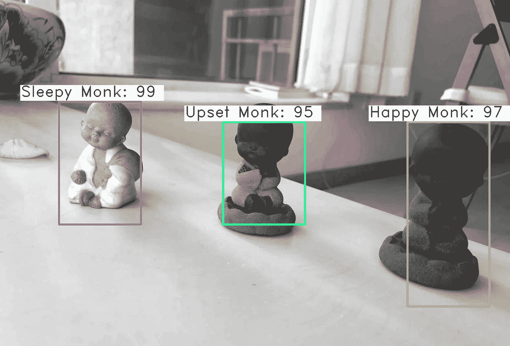

# 介绍

在探索了一段时间 CNN 之后，我决定尝试计算机视觉的另一个重要领域，**物体检测**。这方面有几种流行的方法，包括**更快的 R-CNN、RetinaNet、YOLOv3、SSD 等**。我在这篇文章中尝试了更快的 R-CNN。在这里，我想总结一下我所学到的东西，如果你对这个话题感兴趣，也许会给你一点启发。

我用的较快 R-CNN 的 Keras 版本的原代码是由 [yhenon](https://github.com/yhenon) (资源链接: [GitHub](https://github.com/yhenon/keras-frcnn) 编写的。)他使用了 PASCAL VOC 2007、2012 和 MS COCO 数据集。对我来说，我只是从谷歌的[开放图像数据集 V4](https://storage.googleapis.com/openimages/web/index.html) 中提取了三个类，“人”、“车”和“手机”。我应用了与他不同的配置来适应我的数据集，并删除了无用的代码。顺便说一句，为了在 [Google Colab](https://colab.research.google.com/notebooks/welcome.ipynb) (免费 GPU 计算长达 12 小时)上运行这个，我将所有代码压缩为三段。ipynb 笔记本。抱歉结构混乱。

首先，我假设你知道 CNN 的基本知识和什么是物体检测。这是[原文](https://papers.nips.cc/paper/5638-faster-r-cnn-towards-real-time-object-detection-with-region-proposal-networks.pdf)的链接，名为“**更快的 R-CNN:用区域提议网络实现实时目标检测**”。对于想在更快的 R-CNN 上实现来自 Google 的开放图像数据集 V4 的自定义数据的人，你应该继续阅读下面的内容。

我阅读了许多解释与更快的 R-CNN 相关的主题的文章。他们对此有很好的理解和更好的解释。Btw，如果你已经了解了关于更快 R-CNN 的细节，并且对代码比较好奇，可以跳过下面的部分，直接跳转到代码解释部分。这是我这个项目的 GitHub 链接。

推荐阅读:

[更快的 R-CNN:现代物体探测的兔子洞](https://tryolabs.com/blog/2018/01/18/faster-r-cnn-down-the-rabbit-hole-of-modern-object-detection/)

[用于物体检测的深度学习:综述](/deep-learning-for-object-detection-a-comprehensive-review-73930816d8d9)

[物体检测深度学习算法综述](https://medium.com/comet-app/review-of-deep-learning-algorithms-for-object-detection-c1f3d437b852)

# 更快的 R-CNN(简要说明)

**R-CNN** [(R. Girshick 等人，2014)](http://islab.ulsan.ac.kr/files/announcement/513/rcnn_pami.pdf) 是更快的 R-CNN 的第一步。它使用**搜索选择性** ( [J.R.R. Uijlings 和 al。(2012)](http://www.huppelen.nl/publications/selectiveSearchDraft.pdf) )找出感兴趣的区域并将其传递给 ConvNet。它试图通过将相似的像素和纹理组合到几个矩形框中来找出可能是对象的区域。R-CNN 的论文使用了来自搜索选择的 2000 个建议区域(矩形框)。然后，这 2000 个区域被传递给一个预先训练好的 CNN 模型。最后，输出(特征图)被传递到 SVM 进行分类。计算预测边界框(bbox)和地面真实 bbox 之间的回归。

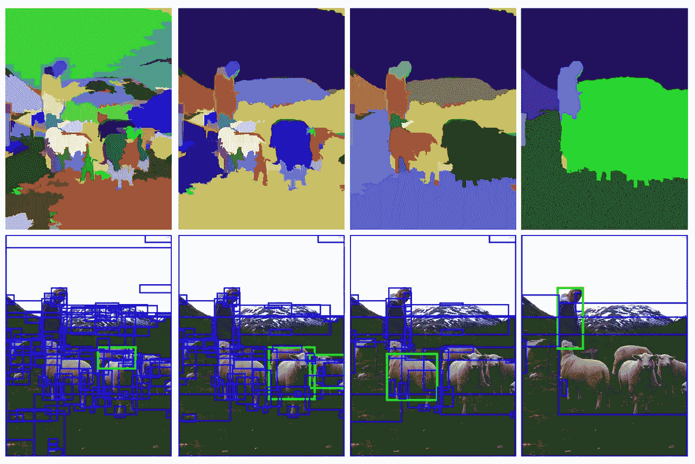

Example of search selective. Source: [J.R.R. Uijlings and al. (2012)](http://www.huppelen.nl/publications/selectiveSearchDraft.pdf)

**快速 R-CNN**([R . Girshick(2015)](https://arxiv.org/pdf/1504.08083.pdf))向前移动一步。它不是将 2000 倍的 CNN 应用于提议的区域，而是只将原始图像传递给预先训练的 CNN 模型一次。基于前一步骤的输出特征图计算搜索选择算法。然后，ROI 池层用于确保标准和预定义的输出大小。这些有效输出作为输入被传递给完全连接的层。最后，使用两个输出向量，通过 softmax 分类器预测观察到的对象，并通过线性回归器调整边界框定位。

**更快的 R-CNN** (简称 frcnn)比快速 R-CNN 更进一步。搜索选择过程被替换为**区域建议网络** (RPN)。顾名思义，RPN 是一个提出区域的网络。例如，在从预先训练的模型(VGG-16)获得输出特征图之后，如果输入图像具有 600x800x3 尺寸，则输出特征图将是 37×50×256 尺寸。

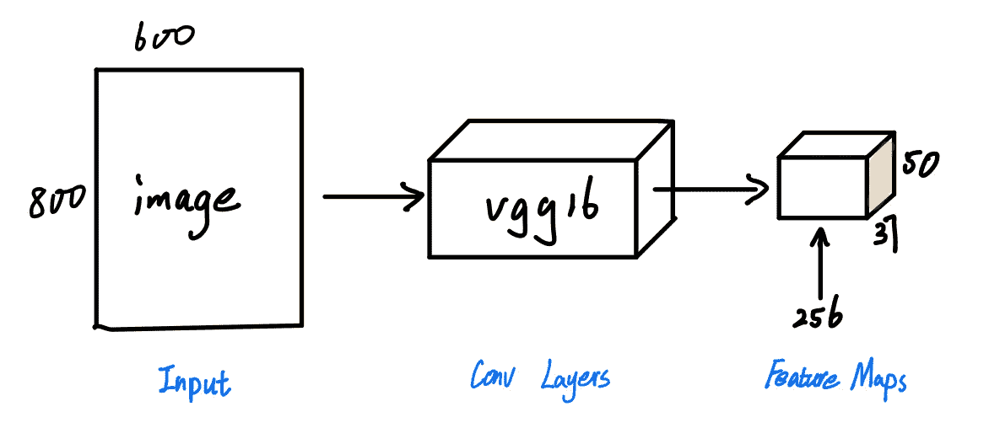

First step of frcnn

37x50 中的每个点都被视为一个锚点。我们需要为每个锚点定义特定的比例和大小(在原始图像中，三个比例为 1:1、1:2、2:1，三个大小为 128、256、512)。

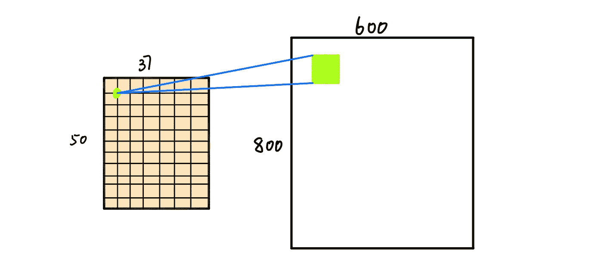

One anchor projected to the original image.

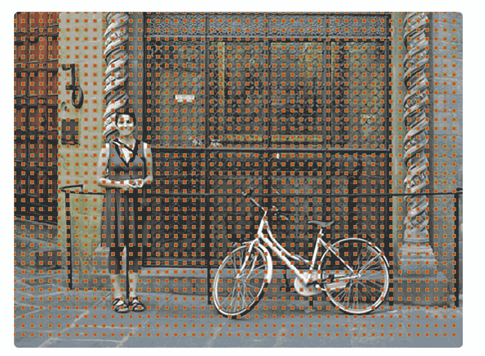

Anchor centers throught the original image. Source: [https://tryolabs.com/blog/2018/01/18/faster-r-cnn-down-the-rabbit-hole-of-modern-object-detection/](https://tryolabs.com/blog/2018/01/18/faster-r-cnn-down-the-rabbit-hole-of-modern-object-detection/)

接下来，RPN 连接到具有 3×3 滤波器、1 个填充、512 个输出通道的 Conv 层。输出连接到两个 1x1 卷积层进行分类和盒子回归(注意这里的分类是确定盒子是不是物体)。

Convolutional implementation of an RPN architecture, where k is the number of anchors. (k=9 in here) Source: [https://tryolabs.com/blog/2018/01/18/faster-r-cnn-down-the-rabbit-hole-of-modern-object-detection/](https://tryolabs.com/blog/2018/01/18/faster-r-cnn-down-the-rabbit-hole-of-modern-object-detection/)

> [*Javier*](https://tryolabs.com/blog/authors/javier-rey/)*:*为了训练，我们把所有的主播，分成两个不同的类别。那些与具有大于 0.5 的并集 (IoU)上的 [**交集的地面实况对象重叠的被认为是“前景”，而那些不与任何地面实况对象重叠或与地面实况对象的 IoU 小于 0.1 的被认为是“背景”。**](https://www.pyimagesearch.com/2016/11/07/intersection-over-union-iou-for-object-detection/)

在这种情况下，每个锚点在原图中都有 3×3 = 9 个对应的盒子，也就是说原图中有 37×50×9 = 16650 个盒子。我们只是从这 16650 个盒子中选择 256 个作为小批量，包含 128 个前景(pos)和 128 个背景(neg)。同时，应用`[non-maximum suppression](https://www.youtube.com/watch?v=A46HZGR5fMw)`来确保所提议的区域没有重叠。

经过以上步骤，RPN 就完成了。然后我们到 frcnn 的第二阶段。与快速 R-CNN 类似，ROI 池用于这些建议区域(ROI)。输出为 7x7x512。然后，我们用一些完全连接的层来展平这一层。最后一步是使用 softmax 函数进行分类和线性回归，以确定盒子的位置。

R-CNN architecture. Source: [https://tryolabs.com/blog/2018/01/18/faster-r-cnn-down-the-rabbit-hole-of-modern-object-detection/](https://tryolabs.com/blog/2018/01/18/faster-r-cnn-down-the-rabbit-hole-of-modern-object-detection/)

# 代码解释

# 第 1 部分:从 Google 的开放图像数据集 v4(边界框)中提取定制类的注释

## 下载并加载三个。csv 文件

在官方[网站](https://storage.googleapis.com/openimages/web/download.html)中，点击下图底部的红色方框`Class Names`即可下载`class-descriptions-boxable.csv`。然后去`Download from Figure Eight`下载另外两个文件。

Screen shot of Open Images website

在八字网站，我下载了如下图的`train-annotaion-bbox.csv`和`train-images-boxable.csv`。

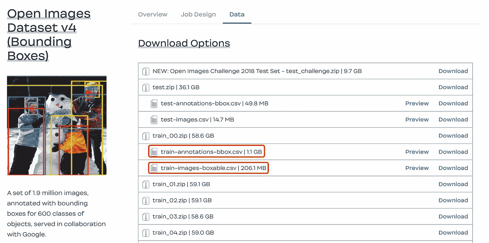

Screen shot of Figure Eight

下载完之后，我们现在来看看这些文件里面都有什么。`train-images-boxable.csv`包含可装箱的图像名称和它们的 URL 链接。`class-descriptions-boxable.csv`包含与它们的 class LabelName 对应的类名。`train-annotations-bbox.csv`有更多信息。`train-annotations-bbox.csv`中的每一行包含一幅图像的一个边界框(简称 bbox)坐标，并且还包含该 bbox 的 LabelName 和当前图像的 ID (ImageID+)。jpg'=Image_name)。`XMin, YMin`是这个 bbox 的左上角，`XMax, YMax`是这个 bbox 的右下角。请注意，这些坐标值是标准化的，如果需要，应该计算实际坐标。

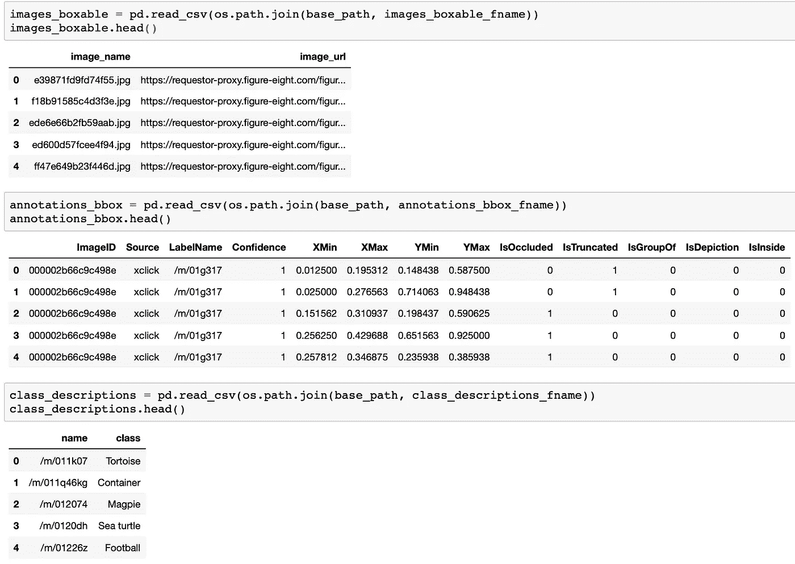

First 5 rows of three .csv file

## 获取整个数据集的子集

包含 600 个类的[开放图像数据集 V4](https://storage.googleapis.com/openimages/web/download.html) 的整个数据集对我来说太大了。所以我提取了 1000 张图片，分别用于“人”、“手机”和“汽车”三个类别。

下载完这 3000 张图片后，我将有用的注释信息保存在一个. txt 文件中。每行的格式如下:file_path，x1，y1，x2，y2，class_name(两个值之间没有空格，只有逗号)其中 file_path 是该图像的绝对文件路径，(x1，y1)和(x2，y2)表示原始图像的左上和右下真实坐标，class_name 是当前边界框的类名。我用 80%的图片进行训练，20%的图片进行测试。训练图像和测试图像的预期数量应该是 3x800 -> 2400 和 3x200 -> 600。但是，可能会有一些重叠的图像同时出现在两个或三个类别中。例如，一幅图像可能是一个人走在街上，街上有几辆车。所以训练图像的 bbox 数是 7236，测试图像的 bbox 数是 1931。

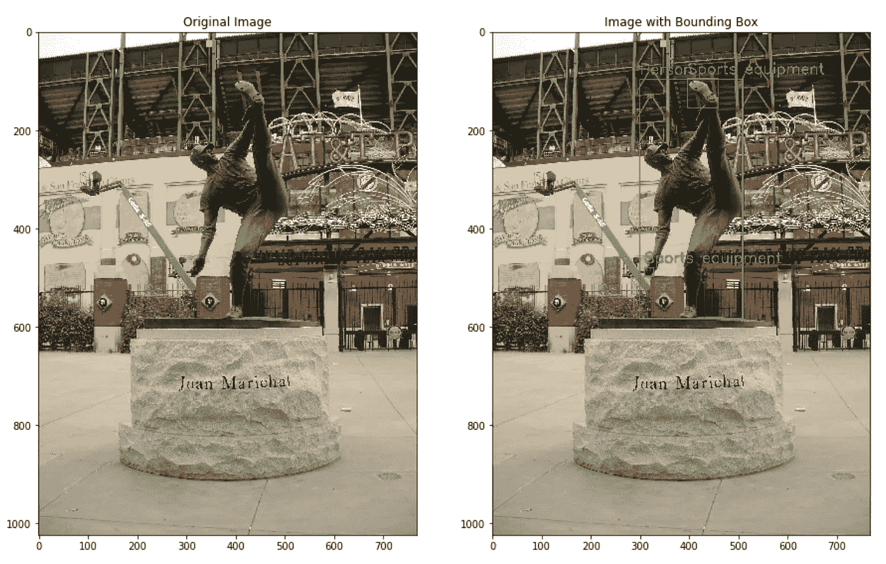

One sample from my extracting data. The left is original image downloaded from given url and the right is drawn by adding bounding boxes parsered from train-annotations-bbox.csv.

# 第 2 部分:更快的 R-CNN 代码

我将解释代码中的一些主要功能。每个函数的完整注释都写在。jpynb 笔记本。请注意，为了更快地训练，我将调整后的图像保持为 300，而不是我在第 1 部分中解释的 600。

## 重建 VGG-16 的结构并加载预训练模型(`nn_base`)

VGG-16 structure. Source: [https://www.quora.com/What-is-the-VGG-neural-network](https://www.quora.com/What-is-the-VGG-neural-network)

## 准备培训数据和培训标签(`get_anchor_gt`)

输入数据来自 annotation.txt 文件，该文件包含一组图像及其边界框信息。我们需要使用 RPN 方法来创建建议的 bboxes。

*   此函数中的参数
    **all _ img _ data**:list(file path，width，height，list(bboxes))
    **C**:config
    **img _ length _ calc _ function**:根据输入图像大小
    **计算最终图层的特征图(基本模型)大小的函数**:“训练”或“测试”；“培训”模式需要加强
*   返回此函数中的值
    **x_img** :调整大小和缩放后的图像数据(最小尺寸= 300 px)
    **Y**:【Y _ rpn _ cls，Y _ rpn _ regr】
    **img _ data _ aug**:增强后的图像数据(增强后的原始图像)
    **debug_img** :显示调试图像
    **num_pos**

## **计算每个图像的 rpn(calc _ rpn)**

如果特征图的形状为 18×25 = 450，锚尺寸为 9，则有 450×9 = 4050 个潜在锚。每个锚的初始状态是“否定的”。然后，如果 IOU > 0.7，我们将锚设为正。如果 IOU > 0.3 且<0.7, it is ambiguous and not included in the objective. One issue is that the RPN has many more negative than positive regions, so we turn off some of the negative regions. We also limit the total number of positive regions and negative regions to 256\. 【 represents if this anchor has an object. 【 represents if this anchor overlaps with the ground-truth bounding box.

For ‘positive’ anchor, 【 =1, 【 =1\.
为‘中性’锚，`y_is_box_valid` =0，`y_rpn_overlap` =0。
对于‘负’锚，`y_is_box_valid` =1，`y_rpn_overlap` =0。

*   此函数中的参数
    **C**:config
    **img _ data**:增强图像数据
    **width** :原始图像宽度(如 600)
    **height** :原始图像高度(如 800)
    **resized _ width**:根据 C.im_size(如 300)

*   **返回此函数中的值
    **y _ rpn _ cls**:list(num _ bbox es，y _ is _ box _ valid+y _ rpn _ overlap)
    **y _ is _ box _ valid**:0 或 1 (0 表示盒子无效，1 表示盒子有效)
    **y_rpn_overlap** : 0 或 1 (0 表示盒子不是对象，1 表示盒子是对象)【T20**

**`y_rpn_cls`的形状是(1，18，25，18)。18x25 是特征图大小。特征图中每个点有 9 个锚点，每个锚点分别有 2 个值`y_is_box_valid`和`y_rpn_overlap`。所以第四个图形 18 来自 9x2。**

**`y_rpn_regr`的形状是(1，18，25，72)。18x25 是特征图大小。特征图中每个点有 9 个锚点，每个锚点有 4 个值，分别为`tx`、`ty`、`tw`和`th`。注意，这 4 个值有自己的`y_is_box_valid`和`y_rpn_overlap`。所以第四个形状 72 来自 9x4x2。**

## **从 RPN (rpn_to_roi)计算感兴趣区域**

*   **此函数中的参数(num _ anchors = 9)
    **rpn _ layer**:rpn 分类的输出层
    shape (1，feature_map.height，feature_map.width，num_anchors)
    如果调整后的图像宽度为 400，regr _ layer**:rpn 回归的输出层
    shape (1，feature_map.height，feature_map . 36)如果调整大小后的图像宽度为 400，C 为 300
    :config
    **use _ regr**:是否在 rpn
    **max_boxes** :非最大抑制的最大 bboxes 数量(NMS)
    **overlap _ thresh**:如果 NMS 的 iou 大于此阈值，则丢弃此框****
*   ****返回此函数中的值
    **结果**:来自非最大抑制的框(shape=(300，4))
    **框**:框的坐标(在特征图上)****

****对于上一步中的 4050 个锚点，我们需要提取`max_boxes`(代码中的 300)个盒子作为感兴趣的区域，并将它们传递给分类器层(frcnn 的第二阶段)。在函数中，我们首先删除超出原始图像的方框。然后，我们使用阈值为 0.7 的非最大抑制。****

****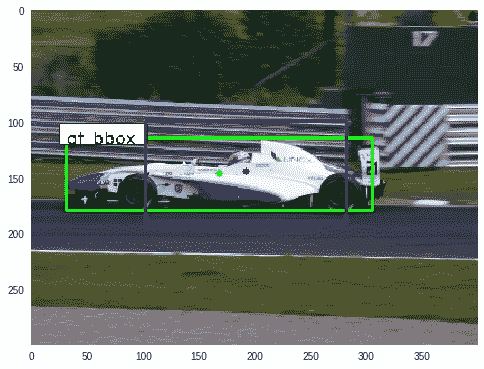****

****The green box is ground-truth bounding box. The purple box is the anchor (label) calculated by RPN layer.****

## ****RoIPooling 层和分类器层(RoiPoolingConv，classifier_layer)****

****RoIPooling 层的功能是将 roi 处理为 max pooling 输出的特定大小。每个输入 roi 被分成一些子单元，我们对每个子单元应用最大池。子单元的数量应该是输出形状的尺寸。****

****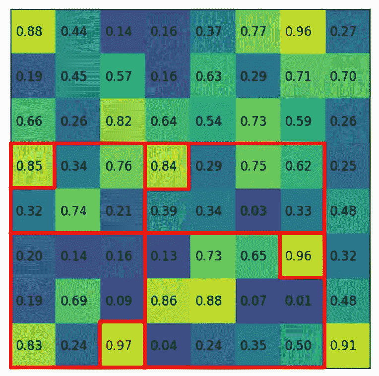********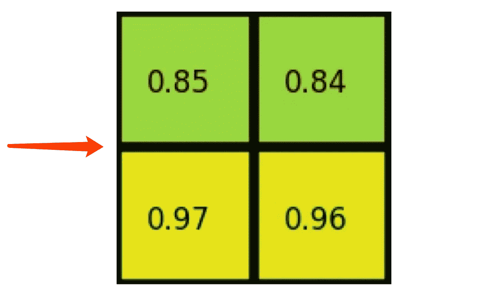****

****If the large red rectangle in the left image is RoI and it’s supposed to perform a RoI Pooling layer with 2x2 output, it would be divided to 4 sub-cells and be applied a max pooling process. The right image is the 2x2 output result. Source: [http://wavelab.uwaterloo.ca/wp-content/uploads/2017/04/Lecture_6.pdf](http://wavelab.uwaterloo.ca/wp-content/uploads/2017/04/Lecture_6.pdf)****

****分类器层是整个模型的最后一层，位于 RoIPooling 层之后。它用于预测每个输入锚点的类名及其边界框的回归。****

*   ****此函数中的参数
    `base_layers` : vgg
    `input_rois` : `(1，num_rois，4)` ROI 列表，带排序(x，y，w，h)
    `num_rois`:一次要处理的 ROI 数量(此处为 4)****
*   ****返回此函数中的值
    list(out_class，out_regr)
    `out_class`:分类器层输出
    `out_regr`:回归层输出****

****首先，将池层扁平化。
然后，接着是两个全连接层和 0.5 的压差。
最后，有两个输出层。
# out_class: softmax 激活函数，用于对对象的类名进行分类
# out _ regr:bboxes 坐标回归的线性激活函数****

## ****资料组****

****同样，我的数据集是从谷歌的开放图像数据集 V4 中提取的。选择了“汽车”、“人”和“移动电话”三个类别。每个类包含大约 1000 张图片。“汽车”、“手机”和“人”的边界框数量分别为 2383、1108 和 3745。****

## ****因素****

*   ****调整后的(im_size)值为 300。****
*   ****主播人数为 9 人。****
*   ****非最大抑制的最大数量是 300。****
*   ****模型中要处理的 RoI 数量是 4(我没有尝试更大的尺寸，这可能会加快计算速度，但需要更多内存)****
*   ****Adam 用于优化，学习率为 1e-5。如果我们应用原始论文的解决方案，可能会有所不同。他们在 PASCAL VOC 数据集上对 60k 小批量使用了 0.001 的学习率，对接下来的 20k 小批量使用了 0.0001 的学习率。****
*   ****对于图像放大，我打开了水平翻转、垂直翻转和 90 度旋转。****

## ****环境****

****谷歌的 Colab 用特斯拉 K80 GPU 加速进行训练。****

## ******培训时间******

****我选择的每个纪元的长度是 1000。注意，这里每个批处理只处理一个图像。我训练的纪元总数是 114。每个纪元在这种环境下花费大约 700 秒，这意味着训练的总时间大约为 22 小时。如果你像我一样使用 Colab 的 GPU，你需要重新连接服务器，并在它自动断开连接时加载权重，以便继续训练，因为它对每次会话都有时间限制。****

## ****结果****

****我们对 RPN 模型和分类器模型都应用了两个损失函数。正如我们之前提到的，RPN 模型有两个输出。一个是用于分类它是否是一个物体，另一个是用于包围盒的坐标回归。从下图中，我们可以看到它在前 20 个纪元学习得非常快。然后，分类器层变得更慢，而回归层仍然继续下降。其原因可能是，在我们训练的早期阶段，对象的精确度已经很高了，但同时，边界框坐标的精确度仍然很低，需要更多的时间来学习。****

********

****Epochs vs. Loss value for RPN model’s classifying output and bboxes regression output****

****相似的学习过程显示在分类器模型中。比较这两个曲线，它们显示出相似的趋势，甚至相似的损失值。我认为这是因为他们预测的值非常相似，只是他们的层结构略有不同。比较两个用于分类的图，我们可以看到预测对象比预测 bbox 的类名更容易。****

****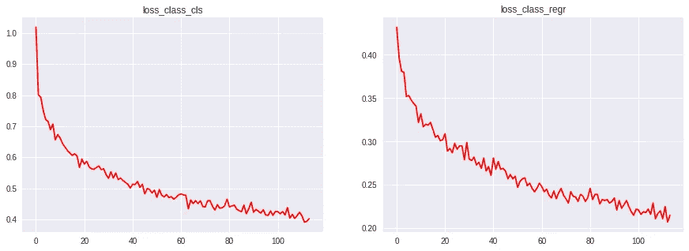****

****Epochs vs. Loss value for Classifier model’s classifying output and bboxes regression output****

********

****Epochs vs. Total loss for two models****

****这个总损失是上述四项损失的总和。它有减少的趋势。然而，mAP(平均精度)并不随着损失的减少而增加。当历元数为 60 时，该图为 0.15。当历元数为 87 时，该图为 0.19。当历元数为 114 时，该图为 0.13。我认为这是因为少量的训练图像导致了模型的过度拟合。****

## ****我们可以调整的其他事情****

1.  ****对于较短的训练过程。我选择 300 作为图片尺寸调整的`im_size`，而不是原码(和原纸)中的 600。所以我选择更小的`anchor_size`【64，128，256】而不是【128，256，512】。****
2.  ****我选择 VGG-16 作为我的基本型号，因为它的结构更简单。然而，像 ResNet-50 这样的模型可能具有更好的结果，因为它在图像分类上具有更好的性能。****
3.  ****模型中有很多阈值。我像原始代码一样使用它们中的大部分。`rpn_max_overlap=0.7`和`rpn_min_overla=0.3`是区分每个锚点的“正面”、“中性”和“负面”的范围。`overlap_thresh=0.7`是非最大抑制的阈值。****

## ****图像测试****

****在笔记本中，我将培训过程和测试过程分成两部分。**运行测试前，请按如下方式重置所有运行时间。ipynb 笔记本。运行测试笔记本时，您可能需要关闭培训笔记本，因为内存使用几乎超出限制。******

********

****Screen shot for ‘Reset all runtimes’****

****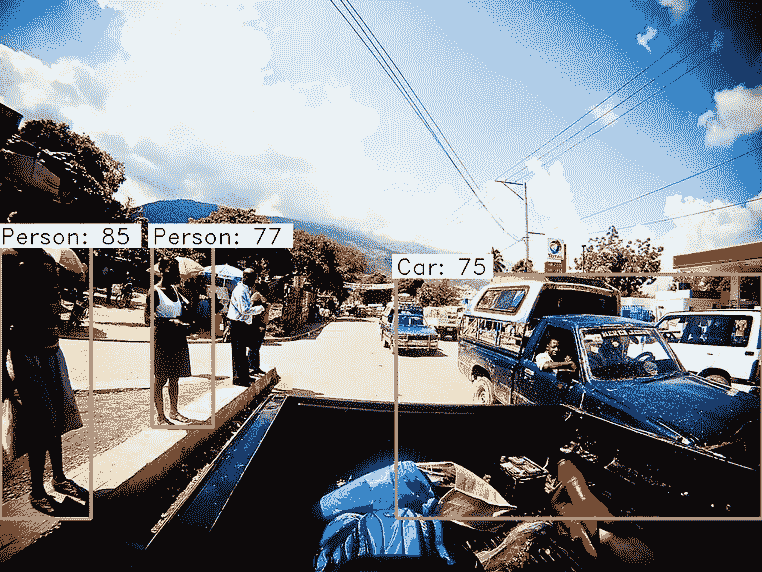********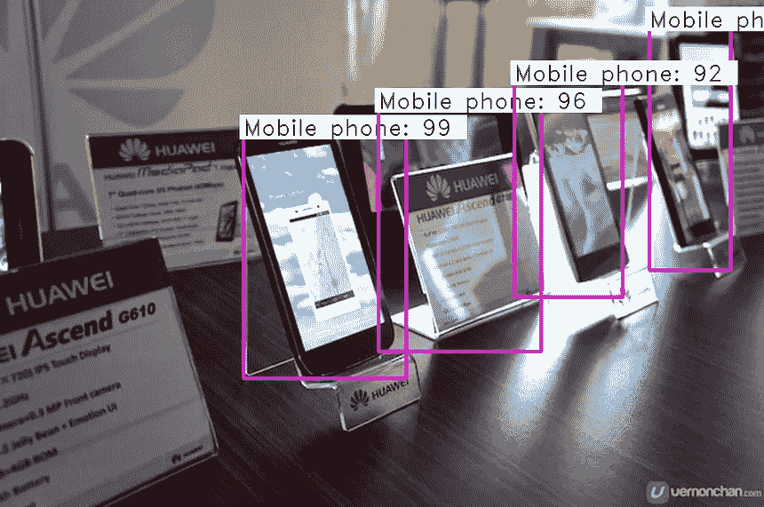********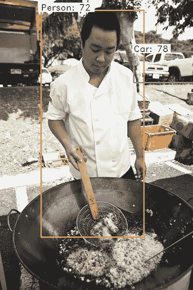********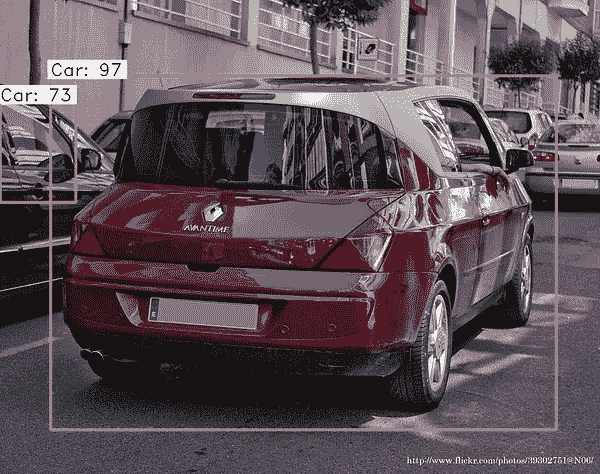********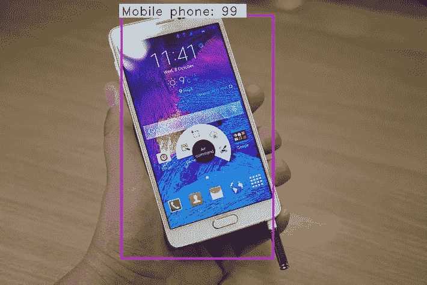************

****Some result for the test data****

## ****终于****

****为了获得乐趣，你可以创建自己的数据集，它不包括在谷歌的开放图像数据集 V4 中，并训练它们。对于我在本文中使用的封面图片，他们是中国制造的三个瓷器僧侣。我只是根据他们的面部表情给他们取了名字(不确定是不是困的那个)。它们不包括在开放图像数据集 V4 中。所以我自己用 [RectLabel](https://rectlabel.com) 来标注。我花了 3 个小时左右的时间，拖了 6 节课 465 张图片(包括'*苹果笔*'、*唇膏*'、*剪刀*'、*瞌睡和尚*'、*不安和尚*、*快乐和尚*)。对于`anchor_scaling_size`，我选择【32，64，128，256】，因为唇膏在图像中通常很小。找到这些方形的小唇膏。我为更强的模型添加了更小的锚尺寸。考虑到 Apple Pen 又长又细，anchor_ratio 可以使用 1:3 和 3:1，甚至 1:4 和 4:1，但我没有尝试过。训练时间不长，表现还不错。我猜是因为背景相对简单，场景平淡。事实上，我发现更难的部分不是注释这个数据集，而是思考如何拍摄它们以使数据集更健壮。****

****好了，这篇文章就到这里。感谢您的观看。这是我这个项目的 GitHub 链接。继续训练你自己的物体探测器。如果您有任何问题，请留下您的评论。很高兴收到你的来信:)****

****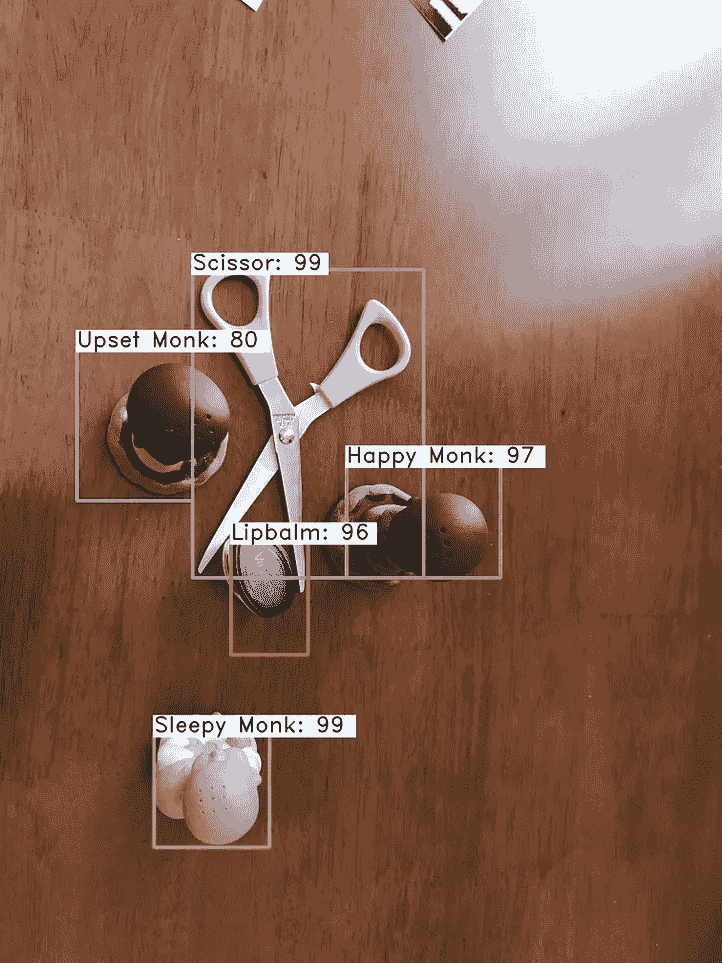************

****Some result for my custom dataset****