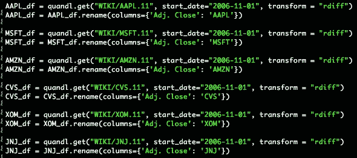
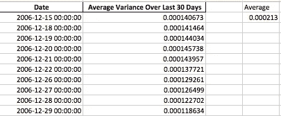

# 股票市场预测中的特征工程:量化市场与基本面

> 原文：<https://towardsdatascience.com/feature-engineering-in-stock-market-prediction-quantifying-market-vs-fundamentals-3895ab9f311f?source=collection_archive---------5----------------------->

开发旨在预测股票是否会产生收益的算法的一个重要部分是确定股票的技术分析和市场分析的价值。即使是经营最好的公司也可能因为熊市而遭受损失，这就是为什么能够量化股票运动对其所属公司相对于整个市场的依赖性是有用的。

简而言之:股票是在自行波动还是在跟随市场波动？

这样做可以告诉我们，不要太看重特定于个股的基本面和技术面分析，而要更看重市场指标，如市场波动性和预期市场表现。那么，我们如何量化市场和基本面之间的紧张关系呢？

“从根本上说”，我们知道，当股市因牛市或熊市而波动时，它们往往会朝着同一个方向波动。这意味着，如果一篮子股票正朝着同一个方向移动，这种移动似乎更有可能与市场有关，而不是个股的投资潜力。因此，我们寻找一种方法来量化这个篮子中股票运动的异同。看起来计算方差是确定这些股票价格运动有多相似的直观方法。

第一步是决定我们的一篮子股票。我们将从标准普尔 500 中挑选 50 只股票。我们收集每日百分比变化数据，以相对于价格对变动进行标准化(即，我们获取价格变动并将其换算为股票价值)。下面是我们对 Quandl 的方法调用的屏幕截图，收集了这个历史百分比变化数据:

我们将做 50 个(每种股票一个)。每次调用都会给我们一个数据框架，显示被引用股票的调整后收盘价的每日百分比变化，我们会将所有这些合并到一个大的数据框架中。然后，我们将找到每一行的方差(每一行代表一天)，这将告诉我们每天股票运动的方差。

鉴于我们正试图预测这些股票在未来 30 天内是否会上涨，我们有必要从更长远的角度来看股票相对于自身还是相对于整个市场的走势。因此，对这些差异值使用 30 天平均值似乎是谨慎的。这意味着分配给每一天的将是 50 只所选股票在过去 30 天内的移动的平均方差。这应该让我们对市场与基本面的紧张关系有一个更长远的看法。下面是我们数据的一个例子:

这表明这两周股票走势的方差低于总体方差，表明股票比总体更趋向于同一个方向。这种分析有助于我们权衡特定股票数据和特定市场数据的效用。

鉴于这种数据可以告诉我们如何查看其他数据，将它作为任何预测股票表现的算法的输入数据可能是有用的。它表征了市场中看涨/看跌条件的强度，可用于告诉投资者(或算法)是优先考虑市场数据还是股票数据。因此，数据科学家应该利用这种或类似的方法来量化这些条件。