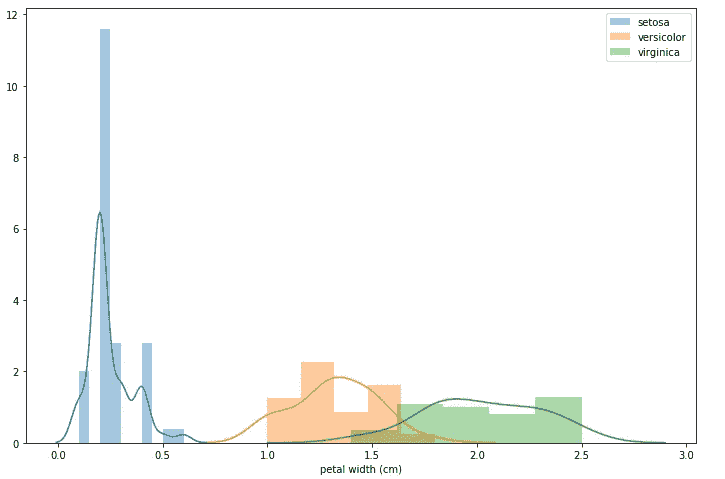

# 特征重要性和前向特征选择

> 原文：<https://towardsdatascience.com/feature-importance-and-forward-feature-selection-752638849962?source=collection_archive---------7----------------------->

## 一种模型不可知的特征选择技术

高维数据的处理非常具有挑战性。“高”意味着数千个维度，试着想象(即使你不能)一个 70k 维的空间。依赖欧几里德距离作为两点之间距离的度量的算法开始失效。这被称为[维度的诅咒](https://en.wikipedia.org/wiki/Curse_of_dimensionality)。K 近邻和线性回归等模型很容易过度拟合高维数据，因此需要仔细调整超参数。因此，降维对于任何预测模型都是非常有利的。然而，人们不能随意丢弃特性，毕竟，数据是[新的石油](https://www.economist.com/leaders/2017/05/06/the-worlds-most-valuable-resource-is-no-longer-oil-but-data)。已经开发了降维技术，其不仅有助于提取用于数据建模的区别特征，而且通过将高维数据转换成低维嵌入，同时保留原始可用信息的一部分，有助于在 2D、3D 或 nD(如果可以可视化的话)空间中可视化高维数据。在 PCA 的情况下，该信息包含在所提取特征的方差中，而 TSNE(T 分布式随机邻域嵌入)基于模型的复杂性，试图保存尽可能多的点的邻域信息。TSNE 是目前可用的最先进的技术。

这篇文章的重点是根据 KPI 选择分类问题中最有鉴别能力的特征子集。出于解释目的，选择分类准确性作为 KPI。我将使用机器学习的“hello world”数据集，你猜对了，非常著名的[虹膜数据集](https://archive.ics.uci.edu/ml/datasets/iris)。

数据集由 150 行和 4 列组成。这是一个平衡的数据集，每个数据集都有 50 个实例。如果我们观察这三个类的花瓣长度和花瓣宽度的分布，我们会发现一些非常有趣的事情。

很明显，这两个是很好的鉴别器，可以将刚毛藻与杂色菊和海滨菊区分开来。我们希望找到准确预测输入花的类别的最重要的特征。

为了解决这个问题，我们将采用一种叫做[正向特征选择](https://en.wikipedia.org/wiki/Feature_selection)的技术。这种功能上的减少提供了以下好处

*   减少培训时间
*   简化和可解释的模型
*   减少过度拟合的机会，即较小的方差
*   减少维数灾难的影响

向前特性选择的代码看起来有点像这样

代码非常简单。首先，我们创建了一个空列表，我们将向其中追加相关的特性。我们首先选择一个特性，并计算交叉验证数据集上每个特性的度量值。提供最佳度量值的特征被选择并附加到特征列表中。重复该过程，这一次使用两个特征，一个从先前的迭代中选择，另一个从已经选择的特征集合中不存在的所有特征集合中选择。为每组 2 个特征计算度量值，并且将提供最佳度量值的特征附加到相关特征的列表中。重复这个过程，直到我们得到所需数量的特征(本例中为 *n* )。因此，我们可以把特征集看作一个超参数。前向功能选择允许我们调整这个超参数以获得最佳性能。

理论讲够了，让我们看看这个算法是否与我们对 iris 数据集的观察一致。回想一下，花瓣的大小是区分海滨锦鸡儿和杂色花的很好的鉴别器。我们按照重要性降序排列这四个特征，下面是选择 f1_score 作为 KPI 时的结果

瞧啊。结果与我们的观察完全一致。正如代码中提到的，这种技术是模型不可知的，可以用于评估任何分类/回归模型的特征重要性。

时间复杂度呢？很明显，这取决于所使用的模型。线性模型比非线性模型花费更少的训练时间。为了简单起见，假设训练一个模型需要线性时间(在行数上是线性的)。这个假设在小 *m* 的情况下是正确的。如果数据集中有 *r* 行，那么运行上述算法所需的时间将是

这简化为

我们可以观察到，尽管这种方法是可靠的，但是运行起来需要相当长的时间。

正向特征选择到此为止。如果你知道更好的技术来提取有价值的特征，请在下面的评论区告诉我。

下次见，再见…