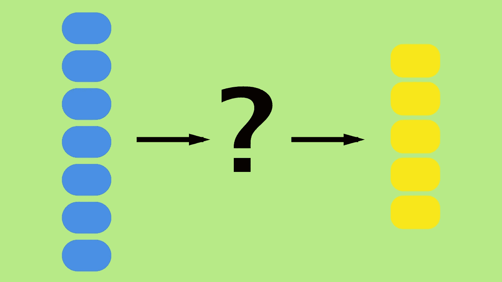
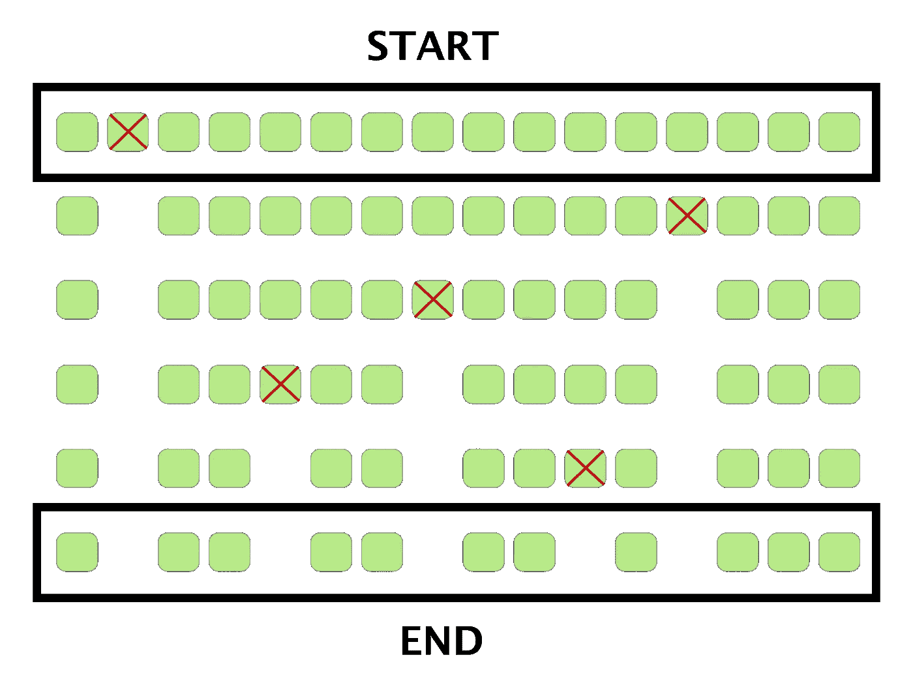

# 变形金刚:隐藏的宝石

> 原文：<https://towardsdatascience.com/feature-transformers-hidden-gems-917bc1237f90?source=collection_archive---------9----------------------->

可以说，进入监督学习模型的特征比模型本身更重要。也就是说，总是很难找到如何设计和预处理特征以使分类器/回归器最大化其性能。

有多种特征转换技术构成了每个数据科学家工具箱的标准部分。编码、输入和缩放是必不可少的。在某些情况下，很明显，某种转换会提高性能。一个很好的例子是在使用任何梯度下降算法之前缩放数字特征。然而，一般来说，为了最大化预测潜力，不存在如何预处理和转换特征的单一最佳方法。那么什么是正确的方法呢？嗯，一个人只需要尝试不同的技术，看看哪种表现最好。

最近，我一直在使用自动化超参数搜索包，即 [auto-sklearn](https://github.com/automl/auto-sklearn) 和 [tpot](https://github.com/EpistasisLab/tpot) 。他们都试图找到最大化样本外性能的管道。他们不仅能够以一种聪明的方式做到这一点(使用贝叶斯优化或遗传算法的元学习),而且还使用法简单得令人尴尬。令人惊讶的是，性能最好的管道通常包括一组类似的变压器，这正是这篇文章的动机。系好安全带，享受旅程。

# 变压器到底是什么？

遵循 scikit-learn API，我们可以将转换器定义为实现了`fit`和`transform`方法的`base.BaseEstimator`的任何子类。自然，在官方文档中有几十个已经实现的转换器被很好地记录[。然而，当使用管道时，它们的真正力量就变得明显了。等等，什么？管道(`pipeline.Pipeline`)是一系列转换器，通常以分类器/回归器结束。它使用户能够在逻辑上连接预处理和任务的机器学习部分，避免从训练到测试集泄露信息，并且(最重要的是)在所有步骤中找到最佳超参数。](http://scikit-learn.org/stable/data_transforms.html)

# 老朋友

在变得过于花哨之前，让我们先列出最常用的变压器:

*   定标器(`StandardScaler`、`MinMaxScaler`、`RobustScaler`、…)
*   单变量选择器(`SelectKBest`、`SelectPercentile`、…)
*   带核主成分分析
*   多项式特征

他们够好吗？当然，它们被一次又一次地证明对各种数据集是有用的，永远不应该被丢弃。然而，没有理由不进一步探索。

好了，现在我们终于准备好看看 3 种不同的技术，它们不像基本技术那样常见。然而，它们有巨大的潜力为最终的评估者产生伟大的特性。

# **随机树嵌入**

决策树/随机森林因能够捕捉复杂的非线性依赖关系而臭名昭著。人们可以利用这一特性来生成被称为随机树嵌入(RTE)的高维特征变换。具体怎么做呢？当用作估计器时，决策树将每个样本分配给唯一的叶节点，并在相同的节点内进行相同的预测。我们可以将注意力转向叶节点本身，并将其作为一种将每个样本编码为一个热点向量的方式，而不是专注于预测。零表示我们的样本没有结束的所有叶节点，而唯一的 1 对应于我们的样本到达的节点。人们可以用同样的方式处理任意数量的树，并堆叠所有隐含的一个热向量。这自然会产生一个稀疏的高维向量。下面是这种想法在 3 棵决策树中的示意图——绿色特征对应于 1，红色特征对应于 0。

RTE 是一种无监督的算法，通过生成完全随机的树来实现上述功能！在`ensemble.RandomTreesEmbedding`下的 scikit-learn 中可以很容易地获得实现。一些更相关的参数是:

*   `n_estimators` —树木数量
*   `max_leaf_nodes` —每棵树的最大叶节点数(实际数量可以更低)

这两个参数允许我们控制变换特征的维度。尺寸最多为`n_estimators` * `max_leaf_nodes`。

# 堆积估计量

集成学习是一组广泛使用的技术，能够将不同的模型组合成一个模型。最常见的技术是装袋和增压。然而，让我们把注意力集中在他们邪恶的孪生兄弟身上。堆叠估计器(SE)的目标是从原始特征创建元特征。首先，选择一个估计器，该估计器使用原始特征作为输入，并输出分类概率(对于分类器)或预测(对于回归器)。将估计器应用于每个样本，我们可以将输出视为附加特征，并通过水平堆叠将它们与原始特征向量相结合。这个过程可以重复，并添加不同的估计器(输入总是原始特征)。自然地，人们甚至可以嵌套这个过程(输入是原始特征以及所有先前估计器的输出)。

下面是一个你可以在头脑中分配的可能的心理图片(或者只是在参考资料中看到一些 www 上提供的更详细的图表)。

由于 Stacking Estimator 不是 scikit-learn 的一部分，所以需要在其他地方寻找( [mlxtend](https://github.com/rasbt/mlxtend) )或者自己创建这个转换器。下面显示了一个最小版本。

# 递归特征消除

在我们有太多特征的情况下，希望有一个纯粹用于特征选择的转换器。这意味着实际的转换包括删除一定数量的要素，而保持其余要素不变。递归特征消除(RFE)正是通过迭代过程做到这一点的。像许多其他变形金刚一样，scikit-learn 在`feature_selection.RFE`下有一个很好的算法实现。

让我们简单描述一下事情是如何进行的。首先，需要指定变换特征的期望维度，然后指定每次迭代期间要丢弃的特征的数量。在一次迭代中，特性选择的逻辑非常简单——拟合一个包含`coef_`或`feature_importances_`的模型，并丢弃最不相关的(最接近零或最低`feature_importances_`的`coef_`)。

实际上，任何线性模型都可以用来获得`coef_`，但最好使用正则化/稀疏模型，如脊形、套索和弹性网。对于`feature_importances_`，基于树的算法是自然的候选。

RFE 有三个重要的超参数:

*   `estimator`:包含`coef_`或`feature_importances_`的估计器
*   `n_features_to_select`:我们想要达到的特征的最终数量/百分比
*   `step`:每次迭代中要删除的特性的数量/百分比

见下面的例子，其中`n_features` = 16，`step` = 1，`n_features_to_select` = 11。

请注意，如果您事先不知道`n_features_to_select`应该是什么，请考虑在`feature_selection.RFECV`下使用该算法的交叉验证版本。

# 结论

这篇文章描述了 3 个现成的变压器背后的基本逻辑。其中两个转换器增加了特征向量的维数——随机树嵌入和堆叠估计器。第三种，递归特征消除，降低了维数。虽然 SE 和 RFE 非常通用，并且可以成功地应用于手头的任何问题，但是 RTE 更具有领域特异性。

自然，还有几十个其他令人惊叹的变形金刚没有被讨论。让我们至少给它们中的一些一个荣誉奖——fa stica、随机厨房水槽、自动编码器、特征聚集和流形学习。

# 参考

## 随机树嵌入

*   [scikit-learn 文档](http://scikit-learn.org/stable/modules/generated/sklearn.ensemble.RandomTreesEmbedding.html)

## 堆积估计量

*   [tpot 实现](https://github.com/EpistasisLab/tpot/blob/master/tpot/builtins/stacking_estimator.py)
*   [mlxtend 示例](https://rasbt.github.io/mlxtend/user_guide/classifier/StackingClassifier/)

## 递归特征消除

*   [scikit-learn 文档](http://scikit-learn.org/stable/modules/generated/sklearn.feature_selection.RFE.html)

*原载于 2018 年 6 月 17 日*[*jank repl . github . io*](https://jankrepl.github.io/off-the-shelf-transformers/)*。*