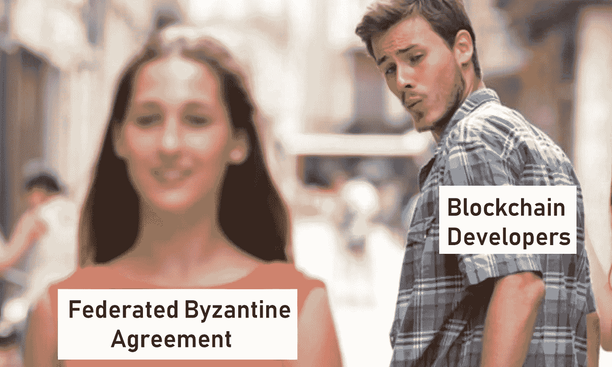

# 联邦拜占庭协议

> 原文：<https://towardsdatascience.com/federated-byzantine-agreement-24ec57bf36e0?source=collection_archive---------3----------------------->

随着区块链技术获得牵引力，开发人员越来越多地调整和试验[共识机制](https://hackernoon.com/what-is-proof-of-stake-8e0433018256)。

达成共识的最传统方式是通过拜占庭协议(区块链技术中的一个基本概念)。区块链上的节点通过对给定问题的解决方案达成共识来验证数据块。当某个最小数量的节点(称为法定人数)同意所给出的解决方案是正确的时，就达成了拜占庭协议，从而验证了一个块并允许其包含在区块链上。

**联邦拜占庭协议**

涟漪区块链首创了联邦拜占庭协议(FBA)共识机制。恒星区块链进一步完善了这种方法，采用了第一个可证明安全的 FBA 协议。在 FBA 系统中，每个节点不必提前知道和验证，成员是开放的，控制是分散的。节点可以选择信任谁。系统范围的法定人数是由单个节点做出的决定形成的。

**法定切片**

法定人数是系统内达成一致所需的节点数量。FBA 改用“仲裁片”。仲裁片是仲裁的子集，它可以说服另一个特定节点同意。

一个节点可以依赖于许多切片，并且节点的选择可以依赖于外部标准。例如，“节点 X”可以说，“为了达成共识，我们必须让我们选择的五家银行中的三家的节点参与进来”。五个存储体中的三个现在可以确定节点 X 是否同意。增加另一层复杂性节点 X 可能是另一个节点的仲裁片的一部分。

如果将一个节点编程为依赖于一个法定切片，用户必须相信该法定切片是足够可信的，如果它同意某件事，该节点肯定会同意。

A Quorum slice.

**法定交集**

信任是在节点的配置文件中建立的。由于节点可能具有不同的配置文件，因此网络中的片和定额可以动态形成。好的法定人数共享节点，导致法定人数重叠。这种重叠被称为“法定交集”。当法定人数不相交时，系统以‘不相交的法定人数’结束。不相交的法定人数是不可取的，因为他们中的每一个都可以独立地同时就矛盾的事务达成一致，从而破坏了整体共识。

Quorum Intersections.

**阻塞与发散状态**

区块链应该又快又安全。如果节点在达成协议的过程中被“阻塞”,区块链就会变慢。当区块链上的节点呈现不同于其他节点的值时，系统是“发散的”。发散的系统比阻塞的系统更危险:阻塞的系统只是速度慢，但是发散的系统开始显示矛盾的数据。

3 Disjoint Quorums.

**FBA 的优势**

开放成员和分散控制

没有看门人或中央机构—单个节点可以决定信任谁来获取信息

选择每个节点信任谁的能力分散了网络

节点可以有多个切片

进入门槛低(任何人都可以加入)

面对故障时保持稳健(一个节点可以关闭，而系统的其余部分将保持完整)

可以对节点进行编程，使其信任仲裁片或外部源，具体取决于其随时间推移的性能

单个节点的选择可以基于外部标准(例如，属于汽车金融公司的节点可能需要来自可信的银行节点、可信的信贷机构以及与机动车辆部门相关联的节点的确认，以接受有效的交易)

**结论**

FBA 分类帐可以是最新的和准确的，而不要求其所有节点一致。相反，每个节点的选择会产生一个法定人数。

法定切片可以说服单个节点达成一致，而法定切片可以说服整个系统达成一致。如果某个节点发现某个特定的仲裁片完全可信，它可以同意接受该仲裁片同意的任何内容。

传统拜占庭协议系统和 FBA 系统的区别在于，在后者中，每个节点选择自己的法定切片。

—

[沙安雷](http://www.shaanray.com/)

关注媒体上的 Lansaar Research ，了解最新的新兴技术和新的商业模式。